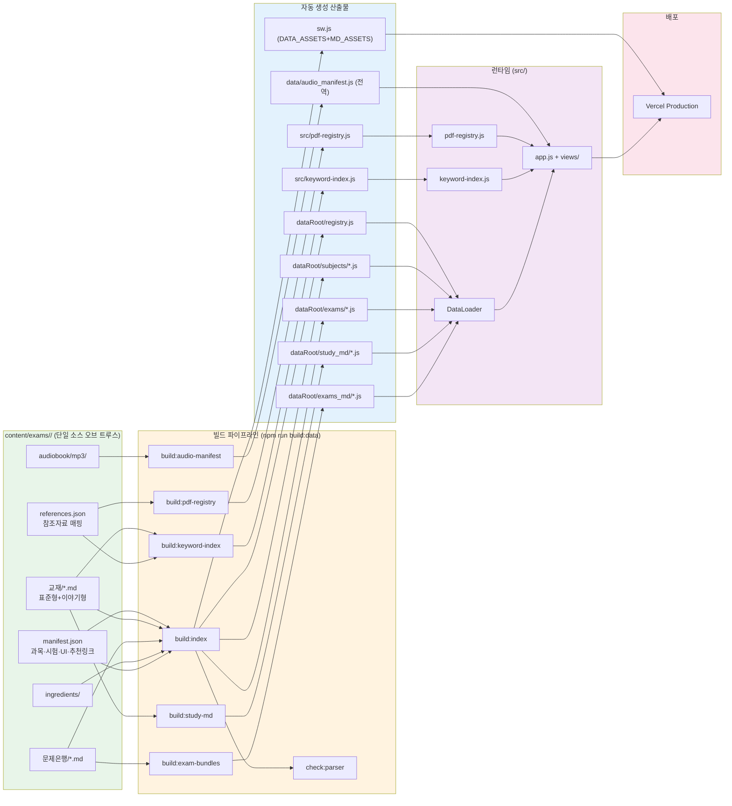
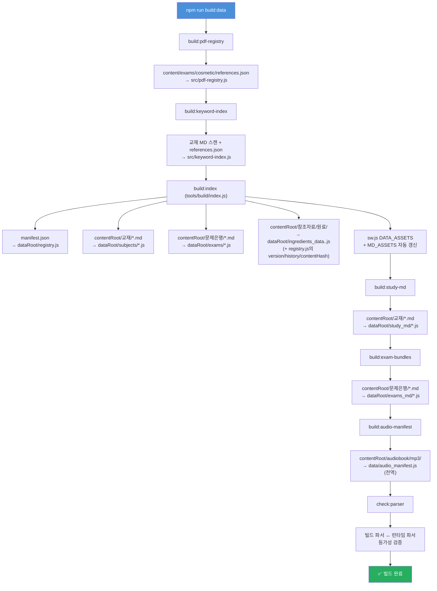
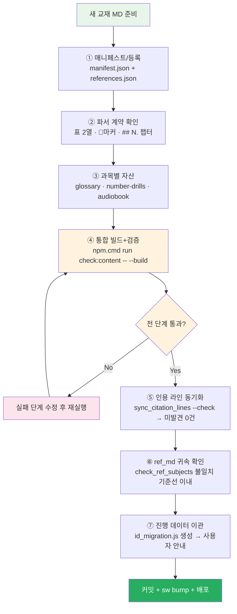
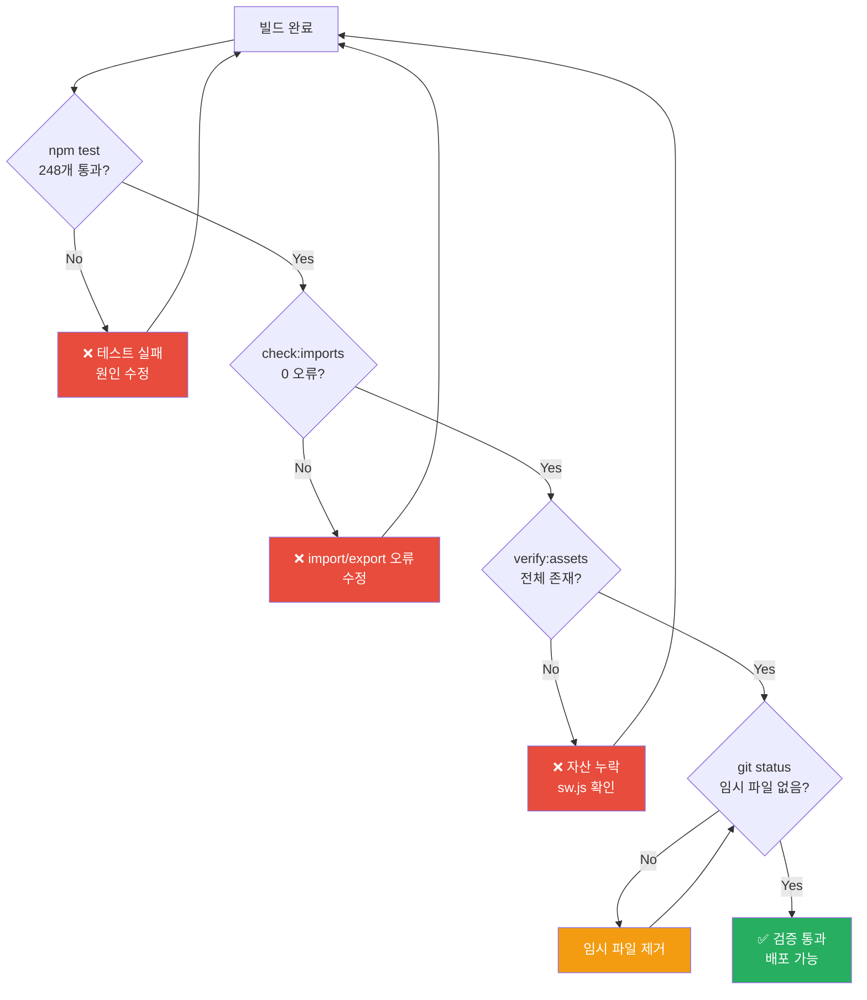

# Content 변경 작업 절차 가이드

> content/exams/<id>/ 폴더의 교재, 문제은행, 참조자료, 오디오북, 원료 데이터가 변경될 때 따라야 할 표준 작업 절차.

## 개요

이 프로젝트는 `content/exams/<id>/` 폴더의 Markdown/JSON 파일이 **단일 소스 오브 트루스(SSOT)** 역할을 합니다. 소스 코드(`src/`)를 직접 수정하지 않고, content 파일과 매니페스트만 편집하면 빌드 파이프라인이 나머지를 자동 처리합니다.

> **멀티시험 대칭 구조 (2026-09-21~)**: 모든 시험이 `content/exams/<id>/`·`data/exams/<id>/` 루트를 갖습니다 — 기본 시험(cosmetic)도 `content/exams/cosmetic/`·`data/exams/cosmetic/`에 있으며 예외가 없습니다. 이 문서의 `content/`·`data/` 경로 표기는 **각 시험의 `contentRoot`/`dataRoot`를 의미**합니다 (예: `content/exams/cosmetic/manifest.json` = `content/exams/cosmetic/manifest.json`). `content/`·`data/` 루트 자체에는 전역 파일만 있습니다: `exams.json`/`exams.js`(시험 목록), `audio_manifest.js`(시험 id 키 분리), `docs_md/`(앱 공용 문서). `build:data`는 `content/exams.json`의 모든 시험을 순회 빌드하므로 절차는 동일합니다. 새 시험 추가는 `AGENTS.md`의 "멀티시험 구조" 섹션을 참조하세요.



---

## 1. 변경 유형별 수정 파일

| 변경 유형 | 수정할 파일 | 비고 |
|----------|------------|------|
| **교재 내용 수정** | `content/exams/cosmetic/교재/{과목}/*.md` | 표준형/이야기형 모두 수정 |
| **문제은행 수정** | `content/exams/cosmetic/문제은행/과목N_단일정답형.md` | 문제 추가/삭제/수정 |
| **과목 추가/삭제** | `content/exams/cosmetic/manifest.json` | `subjects` 배열 수정 |
| **시험 추가/삭제** | `content/exams/cosmetic/manifest.json` | `exams` 배열 수정 |
| **참조자료 추가/삭제** | `content/exams/cosmetic/references.json` | 참조자료 매핑 수정 |
| **오디오북 추가** | `content/exams/cosmetic/audiobook/mp3/{과목}/` | MP3 파일 배치 |
| **통합 모의고사 문제 수 변경** | `content/exams/cosmetic/manifest.json` | `integratedExam.questionsPerSubject` 수정 |
| **UI 텍스트 변경** | `content/exams/cosmetic/manifest.json` | `uiText` 객체 수정 |
| **추천 링크 변경** | `content/exams/cosmetic/manifest.json` | `resources` 객체 수정 |
| **원료 데이터 변경** | `content/exams/cosmetic/참조자료/원료/` | 원료 MD 수정 (`approved`/`restricted`/`banned`/`colorants`) + `db_version.json` 버전 범프 (아래 §원료 DB 버전 절차) |

---

## 2. 표준 빌드 절차

### 2.1 전체 빌드 (권장)

content 변경 후 아래 한 줄로 전체 파이프라인 실행:

```powershell
npm.cmd run build:data
```

이 명령은 다음 파이프라인을 순차 실행합니다:



### 2.2 부분 빌드 (특정 과목만)

```powershell
npm.cmd run build:data:law           # 1과목만
npm.cmd run build:data:manufacturing # 2과목만
npm.cmd run build:data:safety        # 3과목만
npm.cmd run build:data:understanding # 4과목만
```

### 2.3 개별 스크립트 실행

```powershell
npm.cmd run build:pdf-registry       # 참조자료 레지스트리만
npm.cmd run build:keyword-index      # 키워드 인덱스만
npm.cmd run build:study-md           # 폴백 번들만
npm.cmd run build:exam-bundles       # 시험 폴백 번들만
npm.cmd run build:audio-manifest     # 오디오 매니페스트만
```

---

## 3. 변경 유형별 상세 절차

### 3.1 교재 내용 수정

1. `content/exams/cosmetic/교재/{과목}/{파일명}.md` 편집 (표준형, 이야기형 모두)
2. `npm.cmd run build:data` 실행
3. **인용 라인 동기화** (교재 라인 변경 시):
   ```powershell
   node tools/sync_citation_lines.js --check   # 변경사항 확인만
   node tools/sync_citation_lines.js            # 실제 동기화 실행
   ```
   - 문제은행의 인용 링크(`[label: L####](<path#L####>)`) 라인 번호를 교재 변경에 맞춰 자동 갱신
   - 인용문(`>` 블록) 지문으로 인용 라인 ±3 검증 → 불일치 시 타겟 파일에서 재탐색(정확 포함 → 쉥글 → 키프레이즈)
   - 범위초과 링크도 인용문 지문으로 재탐색 (skip하지 않음)
   - 키프레이즈만 일치하는 낮은 신뢰도 매칭은 자동 갱신하지 않음
   - 미발견 항목은 수동 확인 필요 (exit code 1)
4. `npm.cmd test` 통과 확인
5. 커밋 + 배포

### 3.1-1 과목 교재 전체 교체 체크리스트

과목의 교재를 통째로 다른 문서로 교체할 때는 단순 수정보다 의존성이 넓습니다.
아래 7개 계층을 순서대로 확인하세요.



**1. 매니페스트/등록**
- [ ] `content/exams/cosmetic/manifest.json` — `subjects[].dir`·`file`/`storyFile` 경로가 새 교재를 가리키는지, `exams[].subject`·`integratedExam.questionsPerSubject` 키 정합
- [ ] `content/exams/cosmetic/references.json` — `subjectDirMap`·`refDirs`·`referenceFiles` 과목 귀속

**2. 콘텐츠 파서 계약 (새 교재가 지켜야 할 형식)**
- [ ] 카드 추출용 표 `| 용어 | 설명 |` 2열 구조, `- **용어**: 설명` 리스트
- [ ] 퀴즈 마커 `🔖기출`/`📌중요`/`★필수` + `**볼드**` 빈칸 대상
- [ ] 챕터 헤딩 `## 📚 Chapter NN.` 또는 `## N.` (question_chapters 경계)
- [ ] 참조 링크 `../참조자료/ref_md/과목N/...` 형식 (상세: `docs/dev/TEXTBOOK_AUTHORING_GUIDE.md`)

**3. 과목별 자산 (번호·키 기준 하드코딩 지점)**
- [ ] `content/exams/cosmetic/교재/glossary/subject{N}.json` — 큐레이션 용어집 (과목 order 번호 기준)
- [ ] `content/exams/cosmetic/number-drills/{과목키}.json`
- [ ] `content/exams/cosmetic/audiobook/mp3/{과목키}/` — 교재 교체 시 TTS 재생성(`generate_all_mp3.py`)
- [ ] `tools/check_ref_subjects.js`는 manifest의 `dir`↔`order`에서 과목 매핑을 자동 파생 — 별도 상수 없음

**4. 빌드 재생성**

```powershell
npm.cmd run check:content -- --build   # build:data + 전 계층 검증을 한 번에 실행
```

`--build` 없이 실행하면 검증만 수행합니다. 단계별 실패는 리포트에 모아 출력됩니다.

**5. 인용 라인번호 (가장 깨지기 쉬운 지점)**
- [ ] 문제은행의 `(<교재파일.md#L1234>)` 인용은 라인 번호에 하드 의존 — 교재 교체로 라인이 밀리면 인용 전수 재검증
- [ ] `node tools/sync_citation_lines.js --check` 결과 미발견 0건 확인
- [ ] `tools/citation_fingerprints.json` 지문 재생성 필요 시 `--fingerprint`

**6. 참조자료(ref_md) 귀속**
- [ ] `node tools/check_ref_subjects.js` — 불일치 건수가 교체 전 기준선보다 늘었는지 확인
- [ ] `node tools/check_reflayout.js` — 폴더/레지스트리 정합성
- [ ] 문서→과목 귀속 규칙은 `content/exams/cosmetic/references.json`의 `docSubjectRules`가 진실 (폴더 이동보다 규칙이 우선인 평탄 잔존 문서용)

**7. 사용자 진행 데이터 (localStorage)**
- [ ] 카드/퀴즈 ID는 `stableId(subjectKey, chapterKey, type, term)` — 교재가 바뀌면 term 해시가 달라집니다
- [ ] `npm.cmd run build:id-migration`이 이전 스냅샷(`{dataRoot}/card_terms_snapshot.json`)과 비교해 term이 유일하게 일치하는 구ID→신ID 이관 맵(`{dataRoot}/id_migration.js`)을 생성합니다 — 같은 용어가 남아 있으면 진도가 자동 이관됩니다
- [ ] 스냅샷 파일은 커밋 대상입니다 — 배포된 직전 빌드의 ID 집합을 보존해야 이관이 동작합니다
- [ ] term이 바뀌거나 삭제된 카드의 진도는 이관 불가 → `cleanOrphansForSubject`가 정리(삭제). 과목 통째 교체 시 잔량을 사용자에게 안내하세요

### 3.2 과목 추가

1. `content/exams/cosmetic/교재/{새과목키}/` 디렉토리 생성, MD 파일 배치
2. `content/exams/cosmetic/manifest.json`의 `subjects` 배열에 항목 추가:
   ```json
   {
     "key": "newsubject",
     "order": 5,
     "name": "새 과목명",
     "shortName": "약칭",
     "dir": "교재/newsubject",
     "chapters": [
       { "key": "full", "title": "...", "file": "5과목_..._표준형.md", "storyFile": "5과목_..._이야기형.md" }
     ]
   }
   ```
3. `content/exams/cosmetic/references.json`의 `subjectDirMap`에 매핑 추가:
   ```json
   "newsubject": "과목5"
   ```
4. `content/exams/cosmetic/references.json`의 `referenceFiles`에 과목별 참조자료 추가
5. `content/exams/cosmetic/references.json`의 `refDirs`에 `과목5` 배열 추가
6. `content/exams/cosmetic/문제은행/과목5_단일정답형.md` 생성 후 `manifest.json`의 `exams`에 추가
7. `npm.cmd run build:data` 실행
8. 검증 + 커밋 + 배포

### 3.3 참조자료 추가

1. `content/exams/cosmetic/참조자료/ref_md/과목N/{파일명}/{파일명}.md` 배치 (PDF→MD 변환본 — 과목 폴더가 문항 생성 귀속의 진실)
2. `content/exams/cosmetic/references.json` 수정:
   - `refDirs.{해당폴더}` 배열에 파일명 추가
   - `referenceFiles.{과목}` 또는 `referenceCommon`에 항목 추가
   - 출처 매칭이 필요하면 `sourceRefMap`에 정규식 매핑 추가
   - 본문 자동 링크가 필요하면 `keywordRefMap`에 패턴 추가
3. `npm.cmd run build:data` 실행
4. 검증 + 커밋 + 배포

### 3.3-1 PDF → MD 재변환 절차 (ref_md 갱신)

참조자료 PDF를 추가·교체하거나 변환 규칙을 수정했을 때의 표준 절차:

```powershell
# 1) 스테이징 변환 (ref_md_v2에 출력, ref_md는 건드리지 않음)
python tools/convert_ref_pdfs_v2.py            # 전체
python tools/convert_ref_pdfs_v2.py 화장품법     # 파일명 부분 일치만

# 2) 골든 비교 — 현행 ref_md 대비 내용 누락 감사 (누락 있으면 종료코드 1)
python tools/convert_ref_pdfs_v2.py --verify
```

- `--verify`는 현행 문서의 비잡행 라인(워터마크·쪽번호 제외)이 신규 문서에
  존재하는지 **멀티셋(등장 횟수) 기준**으로 검사한다. 줄 병합·분할은
  정규화 부분문자열 매칭으로 흡수한다.
- **ref_md는 의도적으로 시각적 줄 그대로 변환한다**(`segment=False`,
  `tools/convert_ref_pdfs_v2.py` 주석). `#L####` 인용이 라인 번호에
  의존하므로 고정폭 wrap의 문장 중간 절단("…말\n한다.")이 그대로 남는다.
  표시 단에서는 `parseMarkdown`의 `joinWraps` 옵션이 연속줄을 병합한다
  (`exam-viewer`/`html-viewer`가 ref_md 경로에서 자동 적용 — 소스 라인
  번호는 유지되며 인용은 병합 단락 시작으로 도착).
- 누락 0이면 `ref_md_v2/{doc}/{doc}.md`와 `images/`를 `ref_md/과목N/`의
  동명 디렉터리에 복사해 승격한다(`index.html` 보존). 문서 과목은
  `tools/build/ref-statements.js`의 `DOC_SUBJECT_RULES`로 확인.
- 승격 후 라인 번호가 밀리므로 반드시 `npm.cmd run sync:citations` →
  `node tools/sync_citation_lines.js --check`(미발견 0 확인) →
  `npm.cmd run build:data` → `node tools/build_combo_drills.js` 순서로
  후속 재생성을 실행한다.

### 3.4 오디오북 추가

1. `content/exams/cosmetic/audiobook/mp3/{과목키}/` 디렉토리에 MP3 파일 배치
2. `npm.cmd run build:audio-manifest` 실행 (또는 `npm.cmd run build:data`)
3. 검증 + 커밋 + 배포

> **주의**: MP3 파일은 Vercel 배포 시 용량 초과(302MB)로 인해 함께 배포할 수 없음.
> `data/audio_manifest.js`의 `AUDIO_BASE_URL`을 외부 CDN으로 설정 필요.

### 3.5 통합 모의고사 문제 수 변경

1. `content/exams/cosmetic/manifest.json`의 `integratedExam.questionsPerSubject` 수정:
   ```json
   "integratedExam": {
     "questionsPerSubject": {
       "law": 10,
       "manufacturing": 25,
       "safety": 25,
       "understanding": 40
     }
   }
   ```
2. `npm.cmd run build:data` 실행
3. 검증 + 커밋 + 배포

### 3.6 원료 데이터 변경 + DB 버전 절차

원료 파일 위치: `content/exams/cosmetic/참조자료/원료/`

| 파일 | 용도 |
|------|------|
| `approved_ingredients.md` | 배합가능원료(별표2) + 마스터 스키마·공통 안내 헤더 |
| `restricted_ingredients.md` | 사용제한 원료 (한도·조건) |
| `banned_ingredients.md` | 사용금지 원료 (별표1) |
| `colorants_ingredients.md` | 색소 DB — 별도 고시(「화장품의 색소 종류와 기준 및 시험방법」) 소관, **사전·규정검증 파싱 대상 아님** (참조 문서) |
| `db_version.json` | 원료 DB 버전 메타 — `version`·`updatedAt`·`notice`·`history` |

**통일 테이블 스키마:** `approved`/`restricted`/`banned` 세 파일의 모든 원료 데이터 표는 동일한 11컬럼을 사용한다 — `원료명 | 영문명 | 카테고리 | 베이스 | 특성 및 설명 | 일반 함량 범위 | 최대 함량 | 증상 효과 | 시험 출제 빈도 | 고득점 TIP | 비고`. 값이 없는 컬럼은 `-`로 채우고, 헤더명 변경·컬럼 생략 금지. 원료 데이터가 아닌 표(통계·감사용)는 첫 컬럼 헤더에 `원료명`/`성분명`을 쓰지 않는다(파서가 원료로 인식해 실제 데이터를 덮어쓰는 것 방지).

**절차:**

1. 원료 MD 정정
2. `db_version.json` 갱신 — 현재 버전 객체를 `history` 배열 **앞쪽**에 넣고, 최상위 `version`/`updatedAt`/`notice`를 새 값으로:
   ```json
   {
     "version": "2026.10.1",
     "updatedAt": "2026-10-15",
     "notice": "새 개정 내역",
     "history": [
       { "version": "2026.09.1", "updatedAt": "2026-09-21", "notice": "이전 개정 내역" }
     ]
   }
   ```
   버전 규칙: `연도.월.차수` (예: `2026.09.1` = 2026년 9월 첫 개정분)
3. `npm.cmd run build:data` → `registry.js`의 `ingredients`에 `version`·`history`·`contentHash`·`stats.count`가 병합됨
4. 검증 + 커밋 + 배포

**동작**: `contentHash`가 실제 데이터 내용의 해시라, 배포 후 접속한 기존 사용자에게 `원료 DB 갱신` 모달이 1회 표시되고(이전 개정 최근 3건 포함), 성분 사전 버전 배지 탭으로 전체 이력을 조회할 수 있다. MD 비고·헤더 주석처럼 데이터 행이 아닌 변경은 contentHash가 그대로라 알림이 발화하지 않는다.

---

## 4. 검증 체크리스트

> **통합 명령**: `npm.cmd run check:content`은 아래 전 항목(+귀속·레이아웃·드릴·카드 감사)을 한 번에 실행합니다.

빌드 후 반드시 확인:

```powershell
# 1. 유닛 테스트 (248개)
npm.cmd test

# 2. import/export 검증
npm.cmd run check:imports

# 3. 셸 자산 존재 확인
npm.cmd run verify:assets

# 4. 파서 등가성 (build:data에 포함되지만 단독 실행 시)
npm.cmd run check:parser

# 5. 임시 파일 제거 확인
git status
```



---

## 5. 배포 절차

### 5.1 Service Worker 버전 bump

애플리케이션 코드/콘텐츠 변경 시 `sw.js`의 `CACHE_VERSION`을 bump:

```powershell
npm.cmd run stamp:sw   # 커밋 해시로 자동 스탬프
```

또는 수동 편집:
```js
const CACHE_VERSION = 'v{번호}-{날짜}-{설명}';
```

### 5.2 Vercel 배포

```powershell
git add -A
git commit -m "content: 변경 내용 요약"
git push origin main
npx.cmd vercel --prod --yes --scope skygold
```

### 5.3 배포 확인

- https://personalized-skincare-study.vercel.app 접속
- HTTP 200 확인
- 변경된 콘텐츠 정상 표시 확인


---

## 6. 주의사항

### 6.1 직접 수정 금지 파일 (빌드 자동 생성)

아래 파일들은 빌드 시 자동 생성되므로 **직접 수정 금지**:

| 파일 | 생성 스크립트 | 소스 |
|------|-------------|------|
| `src/pdf-registry.js` | `tools/build/build-pdf-registry.js` | `{contentRoot}/references.json` |
| `src/keyword-index.js` | `tools/build/build_keyword_index.js` | `{contentRoot}/교재/*.md` + `{contentRoot}/references.json` |
| `data/exams.js` | `tools/build_exams_list.js` | `content/exams.json` (전역 시험 목록) |
| `data/audio_manifest.js` | `tools/build/build-audio-manifest.js` | `{contentRoot}/audiobook/mp3/` (전 시험 순회, 시험 id 키 분리) |
| `{dataRoot}/registry.js` | `tools/build/index.js` | `{contentRoot}/manifest.json` |
| `{dataRoot}/subjects/*.js` | `tools/build/index.js` | `{contentRoot}/교재/*.md` |
| `{dataRoot}/exams/*.js` | `tools/build/index.js` | `{contentRoot}/문제은행/*.md` |
| `{dataRoot}/study_md/*.js` | `tools/build_study_md_bundle.js` | `{contentRoot}/교재/*.md` |
| `{dataRoot}/exams_md/*.js` | `tools/build_exam_bundles.js` | `{contentRoot}/문제은행/*.md` (manifest `exams` 등록분만) |
| `{dataRoot}/docs_md/*.js` | `tools/build_doc_bundles.js` | `{contentRoot}/학습안내서.md` 등 (앱 공용 `data/docs_md/`는 `docs/user/` 소스) |
| `{dataRoot}/drills/ox_subject*.js` | `tools/build_ox_drills.js` | `{dataRoot}/exams/*.js` (객관식) |
| `{dataRoot}/drills/combo_subject*.js` | `tools/build_combo_drills.js` | `{dataRoot}/exams/*.js` (객관식+단답형) |
| `{contentRoot}/문제은행/과목N_복수정답형.md` | `tools/build_combo_drills.js` | `{dataRoot}/exams/*.js` (검토용 산출물) |
| `{dataRoot}/id_migration.js` + `{dataRoot}/card_terms_snapshot.json` | `tools/build_id_migration.js` | 이전 스냅샷 ↔ 현재 파싱 비교 |
| `sw.js` (DATA_ASSETS, MD_ASSETS) | `tools/build/index.js` | `{contentRoot}/manifest.json` |

> ※ `{dataRoot}/drills/`는 `{dataRoot}/exams/`의 2차 파생물입니다 — 문제은행 변경 시 `build:data` 후 `npm run build:drills`로 재생성해야 최신 문항이 반영됩니다.

### 6.2 PowerShell 환경

- `npm` → `npm.cmd`, `npx` → `npx.cmd` 사용
- `&&` 연산자 사용 불가 → `;` 사용

### 6.3 Vercel 용량 제한

- MP3 파일(302MB)은 Vercel 배포 불가
- `data/audio_manifest.js`의 `AUDIO_BASE_URL`을 외부 CDN으로 설정
- GitHub Releases, Cloudflare R2, AWS S3 등 활용

---

## 7. 빠른 참조: 변경 시 수정 파일 매트릭스

```
교재 내용 수정        → content/exams/cosmetic/교재/*.md
교재 전체 교체        → §3.1-1 체크리스트 (7계층) + npm.cmd run check:content -- --build
문제은행 수정         → content/exams/cosmetic/문제은행/*.md (+ npm run build:drills 로 드릴 번들 재생성)
복수정답형 파일럿 추가     → {dataRoot}/drills/combo_pilot.js 직접 편집 + npm run check:combo 검증
과목 추가/삭제        → content/exams/cosmetic/manifest.json + content/exams/cosmetic/references.json + content/exams/cosmetic/교재/ + content/exams/cosmetic/문제은행/
시험 추가/삭제         → content/exams/cosmetic/manifest.json + content/exams/cosmetic/문제은행/
참조자료 추가/삭제     → content/exams/cosmetic/references.json + content/exams/cosmetic/참조자료/ref_md/과목N/ (+ 해당 과목 폴더의 PDF)
오디오북 추가         → content/exams/cosmetic/audiobook/mp3/
통합 모의고사 설정     → content/exams/cosmetic/manifest.json (integratedExam)
UI 텍스트             → content/exams/cosmetic/manifest.json (uiText)
추천 링크             → content/exams/cosmetic/manifest.json (resources)
원료 데이터           → content/exams/cosmetic/참조자료/원료/ (approved/restricted/banned/colorants_ingredients.md + db_version.json)

공통: npm.cmd run build:data → 검증 → 커밋 → 배포
```
