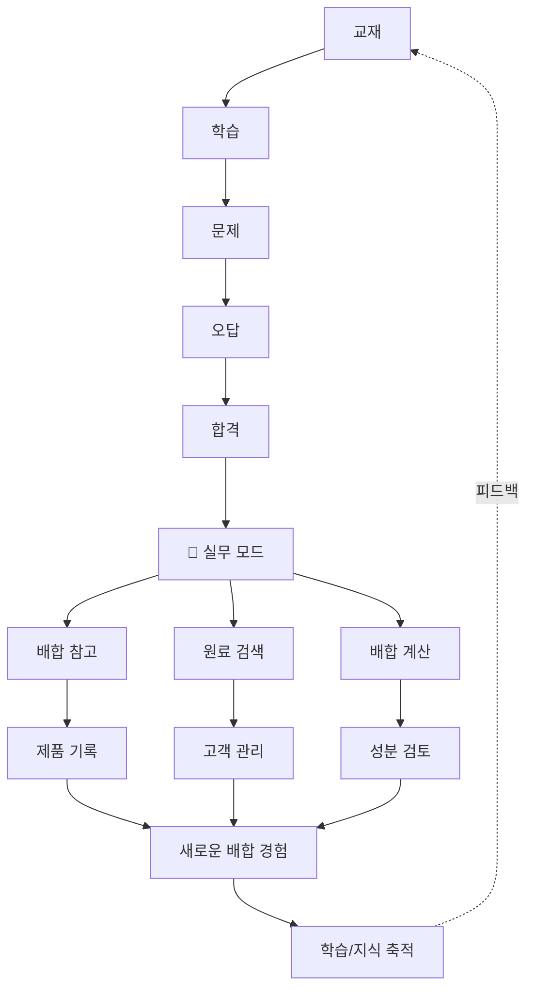
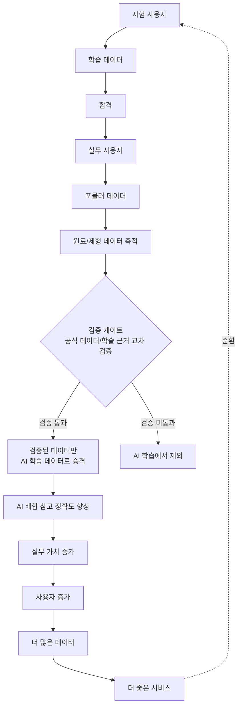
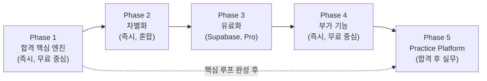

# 💡 추천 기능 제안 (Feature Proposals) — PASS MASTER 핵심 제품 전략

> **작성일**: 2026-09-11
> **개정일**: 2026-09-11 — 합격 핵심 루프 중심 재구성, Free/Pro 균형 조정, PASS MASTER 브랜드 전략 반영, Phase 5 Practice Platform 연동
> **목적**: 단순 기능 목록이 아닌, **"합격시키고, 합격 후에도 계속 쓰게 만드는 플랫폼"** 의 핵심 제품 전략 문서
> **관련 문서**: [SPEC.md](SPEC.md), [SUBSCRIPTION_ROADMAP.md](SUBSCRIPTION_ROADMAP.md), [READER_FEEDBACK_DESIGN.md](READER_FEEDBACK_DESIGN.md), [PASS_TO_PRACTICE_STRATEGY.md](PASS_TO_PRACTICE_STRATEGY.md)

---

## 📑 목차

1. [제품 철학: PASS MASTER](#1-제품-철학-pass-master)
2. [합격 핵심 루프 (Pass Core Loop)](#2-합격-핵심-루프-pass-core-loop)
3. [Free vs Pro 설계 원칙](#3-free-vs-pro-설계-원칙)
4. [Phase 1 — 합격 핵심 엔진](#4-phase-1--합격-핵심-엔진)
5. [Phase 2 — 차별화](#5-phase-2--차별화)
6. [Phase 3 — 유료화](#6-phase-3--유료화)
7. [Phase 4 — 부가 기능](#7-phase-4--부가-기능)
8. [Phase 5 — Practice Platform (실무)](#8-phase-5--practice-platform-실무)
9. [전체 기능 카탈로그](#9-전체-기능-카탈로그)
10. [구현 순서 요약](#10-구현-순서-요약)

---

## 1. 제품 철학: PASS MASTER

### 1.1 핵심 정의

> **Cosmetic Pass Master는 교재를 읽는 플랫폼이 아니다.**
> **사용자를 합격 상태까지 자동으로 끌어가는 플랫폼이다.**

모든 기능은 이 한 줄에 기여하는지 여부로 우선순위를 결정한다.

### 1.2 브랜드 확장 구조

```
                    PASS MASTER
                         │
              AI 자격증 학습 플랫폼
                         │
          ┌──────────────┴──────────────┐
          │                             │
 COSMETIC PASS MASTER          SAFETY PASS MASTER
          │                             │
 맞춤형화장품 조제관리사             산업안전기사 (향후)
          │
          ├── AI 학습 경로 추천
          ├── AI 오답 분석
          ├── AI 플래시카드
          └── AI 합격 예측
```

### 1.3 핵심 경쟁력 (4대 AI 엔진)

| 엔진 | 역할 | 차별화 포인트 |
|------|------|-------------|
| **AI 학습 경로** | 개인 과외 선생님처럼 "왜 지금 이것을 공부해야 하는지" 설명 | 단순 추천이 아닌 **이유 기반 추천** |
| **AI 오답 분석** | 오답 원인 진단 → 재학습 콘텐츠 자동 연결 | 단순 문제은행이 아닌 **원인-처방 연결** |
| **AI 플래시카드** | 교재에서 핵심 개념 자동 추출 + 간격 반복 | 콘텐츠 자동 생성 + SM-2 망각 곡선 |
| **AI 합격 예측** | 학습 데이터 기반 합격 가능성 진단 | 초기에는 3단계(위험/주의/합격권), 데이터 축적 후 확률화 |

---

## 2. 합격 핵심 루프 (Pass Core Loop)

모든 기능은 아래 루프의 어느 단계에 기여하는지로 평가한다:

```
교재 읽기
  ↓
핵심 개념 추출
  ↓
플래시카드 암기
  ↓
문제 풀이 (퀴즈 + 모의고사)
  ↓
오답 분석 (원인 진단)
  ↓
취약 개념 발견
  ↓
AI 학습 경로 추천 (왜 이것을 공부해야 하는지)
  ↓
반복 복습 (SM-2 간격 반복)
  ↓
모의고사 (실전 시뮬레이션)
  ↓
합격 예측 (위험/주의/합격권)
  ↓
시험 직전 집중 학습
  ↓
합격
```

**핵심 원칙**: 루프의 각 단계를 이어주는 "파이프라인"이 가장 중요하다.
개별 기능의 화려함보다 **단계 간 연결성**이 합격률을 높인다.

---

## 3. Free vs Pro 설계 원칙

### 3.1 설계 철학

> **무료 사용자가 "맛보기 서비스"라고 느끼게 해서는 안 된다.**
> **무료 사용자도 합격 경험을 충분히 체험할 수 있어야 한다.**
> **Pro는 "개인화 + 장기 관리"로 전환 이유를 명확히 한다.**

### 3.2 Free / Pro 분담

| FREE — 합격은 가능하지만 답답한 지점 | PRO — 개인화 + 장기 관리 |
|---|---|
| 교재 1과목만 읽기 | 전 과목 교재 읽기 |
| 기본 플래시카드 (1과목만) | 전 과목 플래시카드 |
| 기본 퀴즈 (일일 10문 제한) | 무제한 퀴즈 |
| 기본 오답 노트 | 심층 오답 분석 (원인→재학습 연결) |
| 기본 통계 (정답률만) | AI 맞춤 학습 경로 (이유 기반 추천) |
| SM-2 간격 반복 (기본) | SM-2 + AI 추천 통합 |
| 학습 목표 / D-Day 카운트 | 합격 예측 (위험/주의/합격권) |
| 통합 검색 (Command Palette) | 개인 요약 노트 자동 생성 |
| 기본 대시보드 | 클라우드 동기화 (멀티 디바이스) |
| | 학습 코칭 리포트 (주간/월간) |
| | 프리미엄 오디오북 (5분 요약 등) |
| | 고급 학습 모드 (스펠, 매칭, 속도) |
| | 기출 출제 패턴 분석 |

> **리뷰 피드백 반영**: "1일 1회 AI 추천"은 대부분의 수험생에게 충분할 수 있어 전환 동기가 약합니다.
> AI 추천 자체를 Pass Pro로 이동시키고, Free는 기본 통계만 제공합니다.
> Free의 한도는 "합격은 되지만 답답한" 지점에 설정합니다.

### 3.3 전환 트리거

```
무료 사용자가 느끼는 Pro 전환 동기:

1. "다른 과목도 공부하고 싶은데 1과목만 되네"
2. "오답이 많은데 왜 틀렸는지 분석이 없네"
3. "오늘 뭘 공부해야 할지 모르겠어, AI 추천이 있으면 좋겠어"
4. "다른 기기에서도 이어서 공부하고 싶어"
5. "합격 가능성이 얼마나 되는지 알고 싶어"
6. "시험 직전 요약 노트가 있으면 좋겠어"
```

---

## 4. Phase 1 — 합격 핵심 엔진

> **목표**: 합격 핵심 루프를 완성하고, 루프 단계 간 연결 파이프라인을 구축한다.
> **시점**: A (현재 Zero-Backend에서 구현 가능)
> **Free/Pro**: 대부분 Free (AI 추천은 1일 1회 Free, 무제한 Pro)

### 4.1 AI 맞춤 학습 경로 추천 ⭐⭐⭐⭐⭐

| 항목 | 내용 |
|------|------|
| **루프 단계** | 취약 개념 발견 → AI 학습 경로 추천 → 반복 복습 |
| **목표** | 개인 과외 선생님처럼 "왜 지금 이것을 공부해야 하는지" 설명 |
| **시점** | A |
| **Free** | 없음 (기본 통계만) |
| **Pro** | AI 맞춤 학습 경로 (무제한 + 상세 경로) |

**추천 로직**:

```
[학습 데이터 분석]
├── SM-2 복습 대기 카드 (과목별) — 망각 직전 긴급
├── 정답률 최저 과목 (3문 이상) — 약점 집중
├── 헷갈린 카드 최다 과목 — 오답 집중
├── 미학습 챕터 (암기율 0%) — 신규 학습
└── 최근 모의고사 과락 과목 — 과락 방어

[우선순위]
1순위: 오늘 복습 대기 카드 (망각 직전)
2순위: 과락 과목 보완
3순위: 정답률 최저 과목
4순위: 미학습 챕터

[추천 카드 렌더링 — 이유 포함]
```

**Wireframe**:

```
┌─────────────────────────────────────────────┐
│  🎯 오늘의 합격 전략                          │
│                                              │
│  1. ⚠️ 1과목 법령 오답 8문제                  │
│     최근 정답률 54% — 약점 집중 필요          │
│     [지금 풀기]                              │
│                                              │
│  2. 🔄 2과목 복습 카드 15장                   │
│     SM-2 복습 예정 — 망각 직전                │
│     [복습 시작]                              │
│                                              │
│  3. 📖 4과목 핵심 개념 10분                   │
│     학습률 0% — 아직 시작 안 함               │
│     [학습 시작]                              │
│                                              │
│  Pass Pro에서 무제한 AI 추천 제공            │
└─────────────────────────────────────────────┘
```

### 4.2 오답 분석 → 재학습 연결 ⭐⭐⭐⭐⭐

| 항목 | 내용 |
|------|------|
| **루프 단계** | 오답 분석 → 취약 개념 발견 → AI 학습 경로 |
| **목표** | 오답 원인 진단 후 관련 교재/카드/유사문제로 자동 연결 |
| **시점** | A |
| **Free** | 기본 오답 원인 분류 (3종) |
| **Pro** | 심층 분석 + 재학습 자동 연결 |

**오답 원인 분류**:

| 원인 | 설명 | 재학습 연결 |
|------|------|------------|
| **암기 부족** | 단순히 외우지 못함 | 관련 플래시카드 5장 재학습 |
| **개념 오해** | 원리를 잘못 이해 | 관련 교재 섹션 재읽기 + 유사문제 3개 |
| **계산 실수** | 공식 적용 오류/수치 오기 | 계산 훈련소 유사 문제 5문 |

**Wireframe**:

```
┌─────────────────────────────────────────────┐
│  🔍 오답 분석 리포트                         │
│                                              │
│  최근 7일 오답: 23문                          │
│                                              │
│  원인 분포:                                   │
│  ■■■■■■■■ 암기 부족 12문 (52%)               │
│  ■■■■■ 개념 오해 8문 (35%)                   │
│  ■■ 계산 실수 3문 (13%)                      │
│                                              │
│  📋 추천 처방:                                │
│  ┌──────────────────────────────────────┐   │
│  │ ⚠️ 개념 오해 — 2과목 3챕터 배합 한도  │   │
│  │                                      │   │
│  │ 1. 📖 교재 2.3절 다시 읽기           │   │
│  │ 2. 🃏 관련 카드 5장 재학습           │   │
│  │ 3. ❓ 유사문제 3개 풀기              │   │
│  │ 4. ✅ 재시험 (오답 3문 재출제)       │   │
│  │                                      │   │
│  │ [처방 시작]                          │   │
│  └──────────────────────────────────────┘   │
└─────────────────────────────────────────────┘
```

**오답 → 재학습 파이프라인**:

```
오답 발생
  ↓
원인 분석 (암기 부족 / 개념 오해 / 계산 실수)
  ↓
관련 콘텐츠 자동 매칭
  ├── 교재: 오답과 관련된 섹션 (L### 인용 기반)
  ├── 카드: 오답 키워드와 매칭되는 플래시카드
  └── 문제: 오답과 유사한 유형의 문제 (같은 챕터/같은 태그)
  ↓
재학습 세션 구성
  ↓
재시험 (오답 문제 재출제)
  ↓
해결 여부 확인 → 미해결 시 1단계 반복
```

### 4.3 SM-2 간격 반복 (기존 강화) ⭐⭐⭐⭐

| 항목 | 내용 |
|------|------|
| **루프 단계** | 반복 복습 |
| **목표** | 기존 SM-2 알고리즘을 AI 학습 경로와 통합 |
| **시점** | A (이미 구현됨, 연결 강화만 필요) |
| **Free/Pro** | 무료 |

**강화 사항**:
- AI 추천 로직에 SM-2 복습 대기 카드를 최우선순위로 통합
- 복습 대기 카드 수를 대시보드에 더 눈에 띄게 표시
- "망각 직전" 경고 (복습 예정일 1일 경과 시 빨간 배지)

### 4.4 학습 목표 / D-Day ⭐⭐⭐⭐

| 항목 | 내용 |
|------|------|
| **루프 단계** | 시험 직전 집중 학습 |
| **목표** | 시험 목표일 설정, 일일/주간 학습 목표 추적 |
| **시점** | A |
| **Free/Pro** | 무료: 기본 목표 / Pro: 적응형 자동 조정 |

**Wireframe**:

```
┌─────────────────────────────────────────────┐
│  🎯 학습 목표                                │
│                                              │
│  시험일: 2026년 10월 25일 (D-44)             │
│                                              │
│  오늘 목표          진행률                    │
│  카드 30장          ████████░░ 24/30 (80%)  │
│  퀴즈 10문           ██████░░░░ 6/10  (60%)  │
│  학습 2시간          █████░░░░░ 1h12m/2h     │
│                                              │
│  주간 목표                                    │
│  모의고사 3회       ██░░░░░░░░ 1/3          │
│  총 학습 14시간     ████░░░░░░ 5h30m/14h    │
│                                              │
│  [목표 수정]                                  │
└─────────────────────────────────────────────┘
```

### 4.5 통합 검색 (Command Palette) ⭐⭐⭐⭐

| 항목 | 내용 |
|------|------|
| **루프 단계** | 핵심 개념 추출 → 교재/카드/문제 연결 |
| **목표** | `Ctrl+K` / 모바일 길게 누르기로 전체 기능/콘텐츠 통합 검색 |
| **검색 대상** | 교재 섹션, 카드 용어, 퀴즈, 참조자료, 성분, 뷰 전환 |
| **시점** | A |
| **Free/Pro** | 무료 |

**의의**: 맞춤형화장품조제관리사는 법령·원료·품질관리·피부/모발 등
서로 연결되는 정보가 많아 검색과 교차 참조가 강력한 UX가 된다.

```
┌─────────────────────────────────────────────┐
│  🔍 무엇을 찾으시겠어요?                     │
│  ┌──────────────────────────────────────┐   │
│  │ 보존제                              │   │
│  └──────────────────────────────────────┘   │
│                                              │
│  📖 교재      2과목 3챕터 배합 한도           │
│  🃏 카드      보존제 (paraben)                │
│  ❓ 퀴즈      보존제 한도 0.04% (빈칸)        │
│  📋 참조자료  별표 2 사용 제한 원료           │
│  🧪 성분      Methylparaben                  │
│  📊 이동      대시보드                       │
└─────────────────────────────────────────────┘
```

### 4.6 기본 대시보드 (기존 강화) ⭐⭐⭐

| 항목 | 내용 |
|------|------|
| **루프 단계** | 전 루프 가시화 |
| **목표** | 기존 대시보드에 AI 추천 + 학습 목표 + D-Day 통합 |
| **시점** | A (기존 `dashboard.js` 확장) |
| **Free/Pro** | 무료 |

---

## 5. Phase 2 — 차별화

> **목표**: 합격 핵심 루프가 작동한 후, 데이터를 활용한 차별화 기능으로 경쟁력 강화
> **시점**: A (Zero-Backend 가능) / C (Supabase 필요 부분 혼재)
> **Free/Pro**: 혼합

### 5.1 과목별 지식 맵 ⭐⭐⭐

| 항목 | 내용 |
|------|------|
| **루프 단계** | 취약 개념 발견 |
| **기능** | 과목의 지식 구조를 노드-엣지 그래프로 시각화, 학습 상태 오버레이 |
| **표시** | 외운 카드(초록), 헷갈린 카드(빨강), 미학습(회색) |
| **시점** | A (Mermaid 또는 자체 SVG) |
| **Free/Pro** | 무료 |

```
┌─────────────────────────────────────────────┐
│  🧠 1과목 지식 맵                             │
│                                              │
│         [화장품법 제1조] ── [목적]            │
│         (초록)          (초록)                │
│              │                                │
│         [제5조 등록]   [제13조 표시]          │
│         (빨강)          (초록)                │
│              │               │                │
│         [등록 기준]    [표시 기준]            │
│         (회색)          (초록)                │
│                                              │
│  ● 외움  ● 헷갈림  ● 미학습                  │
│  학습률: 65% (45/50 카드)                    │
└─────────────────────────────────────────────┘
```

### 5.2 요약 노트 자동 생성 ⭐⭐⭐⭐

| 항목 | 내용 |
|------|------|
| **루프 단계** | 시험 직전 집중 학습 |
| **기능** | 학습 진도(외운 카드, 오답, 교재 하이라이트) 기반 개인화 요약 노트 |
| **형식** | PDF / Markdown 내보내기 |
| **시점** | A |
| **Free/Pro** | **Pro 전용** |

### 5.3 기출 출제 패턴 분석 ⭐⭐⭐

| 항목 | 내용 |
|------|------|
| **루프 단계** | 문제 풀이 → 오답 분석 |
| **기능** | 기출문제를 연도/회차별로 분류, 출제 빈도·패턴 시각화 |
| **시점** | A (문제은행 데이터에 연도 메타데이터 추가) |
| **Free/Pro** | **Pro 전용** |

### 5.4 학습 코칭 리포트 ⭐⭐⭐⭐

| 항목 | 내용 |
|------|------|
| **루프 단계** | 합격 예측 → 시험 직전 집중 학습 |
| **기능** | 주간/월간 학습 코칭 리포트 (학습량, 진도, 약점, 개선 제안, 합격 예측) |
| **시점** | A (기본) / C (이메일 발송) |
| **Free/Pro** | **Pro 전용** |

### 5.5 합격 예측 (3단계) ⭐⭐⭐⭐

| 항목 | 내용 |
|------|------|
| **루프 단계** | 합격 예측 |
| **기능** | 학습 데이터 기반 합격 가능성 진단 |
| **초기 표시** | 🔴 위험 / 🟡 주의 / 🟢 합격권 (3단계) |
| **데이터 축적 후** | 통계 모델 기반 확률값 (72% 등)으로 발전 |
| **시점** | A (3단계) / C (확률 모델) |
| **Free/Pro** | **Pro 전용** |

> **주의**: 초기에 "72% 합격"처럼 지나치게 정밀한 숫자를 제시하면 신뢰성이 떨어진다.
> 데이터가 충분히 쌓인 후 실제 통계 모델로 확률값으로 발전시킨다.

### 5.6 용어집 통합 검색 및 교차 참조 ⭐⭐⭐

| 항목 | 내용 |
|------|------|
| **루프 단계** | 핵심 개념 추출 |
| **기능** | 4과목 전체 용어집 통합 검색, 과목 간 동일/유사 용어 교차 참조 |
| **예시** | "보존제" 검색 → 1과목(법령 정의), 2과목(원료 한도), 3과목(안전 기준) 동시 표시 |
| **시점** | A (기존 `GLOSSARY_INDEX` 확장) |
| **Free/Pro** | 무료 |

---

## 6. Phase 3 — 유료화

> **목표**: Supabase 연동 후 클라우드 기반 Pro 기능 구현
> **시점**: C (Supabase 필요)
> **Free/Pro**: **Pro 전용**

### 6.1 클라우드 동기화 ⭐⭐⭐⭐⭐

| 항목 | 내용 |
|------|------|
| **루프 단계** | 전 루프 (기기 간 연속성) |
| **기능** | 기기 간 학습 진도 동기화 |
| **시점** | C (SUBSCRIPTION_ROADMAP §7 연동) |

### 6.2 멀티 디바이스 이어하기 ⭐⭐⭐⭐

| 항목 | 내용 |
|------|------|
| **기능** | PC에서 학습하던 내용을 모바일에서 이어서 학습 |
| **동기화 대상** | 교재 읽기 위치, 오디오 위치, 카드 진도, 모의고사 진행 상태 |

### 6.3 프리미엄 오디오북 ⭐⭐⭐

| 항목 | 내용 |
|------|------|
| **기능** | 5분 핵심 요약 오디오, 과목별 요약 오디오, 시험 직전 30분 요약 |
| **시점** | A (콘텐츠 제작 필요) |

### 6.4 고급 학습 모드 ⭐⭐⭐

| 모드 | 설명 |
|------|------|
| **스펠 모드** | 초성만 보여주고 정답 입력 |
| **객관식 모드** | 카드 용어를 4지선다로 출제 |
| **매칭 모드** | 용어-정의 쌍 매칭 게임 |
| **속도 모드** | 제한 시간 내 최대 카드 학습 (게임화) |

### 6.5 카드 학습 모드 확장 (타이핑 모드) ⭐⭐⭐

| 항목 | 내용 |
|------|------|
| **기능** | 카드 용어를 직접 타이핑하여 능동 회상 강화 |
| **시점** | A |
| **Free/Pro** | 무료 (타이핑) / Pro (스펠, 매칭, 속도 등 고급 모드) |

---

## 7. Phase 4 — 부가 기능

> **목표**: 핵심 루프 완성 후 사용자 경험 다양화
> **시점**: A
> **Free/Pro**: 대부분 무료

### 7.1 학습 타임라인 ⭐⭐

| 항목 | 내용 |
|------|------|
| **기능** | 학습 활동을 시간순으로 시각화 |
| **우선순위 낮춤 사유** | 합격 자체에 미치는 영향 낮음 |
| **Free/Pro** | 무료: 7일 / Pro: 전체 |

### 7.2 학습 달력 ⭐⭐

| 항목 | 내용 |
|------|------|
| **기능** | 월간 달력에 학습 활동 기록 (GitHub contribution graph 스타일) |
| **우선순위 낮춤 사유** | 게임화에는 좋으나 초기 핵심 기능 아님 |
| **Free/Pro** | 무료 |

### 7.3 교재 북마크 및 메모 ⭐⭐⭐

| 항목 | 내용 |
|------|------|
| **기능** | 교재 리더에서 문단/섹션 북마크 및 개인 메모 |
| **시점** | A (북마크) / C (동기화) |
| **Free/Pro** | 무료: 북마크 / Pro: 메모 + 동기화 |

### 7.4 학습 알림 및 리마인더 ⭐⭐⭐

| 항목 | 내용 |
|------|------|
| **기능** | SM-2 복습 알림, 일일 챌린지 미수행 알림, 시험일 접근 알림 |
| **시점** | A (Notification API) |
| **Free/Pro** | 무료: 기본 / Pro: 스마트 알림 |

### 7.5 접근성 기능 ⭐⭐

| 기능 | 설명 |
|------|------|
| 스크린 리더 최적화 | ARIA 라벨, 랜드마크 개선 |
| 글꼴 크기 조절 | 작게/보통/크게/매우 큼 (CSS 변수) |
| 색맹 친화 모드 | 색상 외 패턴으로 구분 |
| 키보드 전용 탐색 | 마우스 없이 모든 기능 탐색 |
| 맞춤 테마 | 고대비, 세피아, 시험장 모드 |

> **우선순위 낮춤 사유**: 필요한 기능이지만 MVP 핵심 경쟁력은 아님.
> 단, 접근성은 법적 요구사항일 수 있으므로 최소한의 스크린 리더/키보드 지원은 Phase 1부터 유지.

### 7.6 기술 인프라 ⭐⭐

| 기능 | 설명 | 시점 |
|------|------|------|
| 콘텐츠 버전 관리 | 교재/문제은행 변경 이력 추적, 법령 개정 알림 | A |
| 오프라인 동기화 큐 | 오프라인 학습 활동 큐 → 온라인 복귀 시 동기화 | C |
| 성능 모니터링 | Web Vitals 대시보드화 | A |
| A/B 테스트 | UI/UX 변경 사항 A/B 테스트 | C |

### 7.7 콘텐츠 확장 ⭐⭐⭐

| 기능 | 설명 | 시점 |
|------|------|------|
| 과목별 핵심 정리 카드 | 시험 직전 1페이지 요약 (Cheat Sheet) | A |
| 실전 사례 콘텐츠 | 조제 실수, 원료 배합 실패, 법령 위반 사례 | A |
| 기출문제 연도별 분석 | 연도/회차별 출제 빈도, 패턴 시각화 | A |

---

## 8. Phase 5 — Practice Platform (실무)

> **목표**: 합격 후 이탈하는 일반 자격증 플랫폼과 달리, 맞춤형화장품조제관리사의 특성을 활용하여 **합격 후에도 계속 머무는 실무 플랫폼** 으로 확장
> **시점**: A (기존 데이터 재사용) / C (Supabase 연동)
> **상세 문서**: [PASS_TO_PRACTICE_STRATEGY.md](PASS_TO_PRACTICE_STRATEGY.md)

> **용어 주의**: 본 섹션에서 "처방" 대신 "배합"/"포뮬러"/"레시피"를 사용합니다.
> 의료법·약사법상 "처방" 용어 사용 리스크를 사전에 회피하기 위함입니다. (상세: PASS_TO_PRACTICE_STRATEGY.md §0)

### 8.1 핵심 전략: Pass Loop → Practice Loop



> **합격은 이탈 이벤트가 아니라 플랫폼의 다음 단계로 진입하는 이벤트다.**
> **단, 실무 모드는 합격 여부와 무관하게 누구나 사용할 수 있다.**

### 8.2 Phase 5 기능 목록

| 기능 | 설명 | 시점 | Free/Pro |
|------|------|------|----------|
| 🧴 원료/성분 실무 DB | 원료 상세 페이지 (기본정보, 제형별 적합도, 배합 참고, 궁합, 배합 활용, 관련 규정) | A | Free: 기본 / Pro: 전체 |
| 🧪 AI 배합 참고 | 고객 요구 → 원료 제안(배합량 미포함) → 사용자 배합량 입력 → 시스템 검증 | C **+ 법률 검토 후** | Practice Pro |
| ⚖️ 배합량 계산기 | 실무용 배합량 계산 (기존 `trainer-calc.js` 재사용) | A | Free |
| 📋 포뮬러 작성·저장 | 포뮬러 작성, 저장, 검색 | A / C | Free: 5개 / Pro: 무제한 |
| 🔄 포뮬러 버전 관리 | 포뮬러 수정 이력, 버전 비교 | A | Practice Pro |
| 📚 내 포뮬러 라이브러리 | 포뮬러 목록, 검색, 태그, 즐겨찾기 | A / C | Free: 5개 / Pro: 무제한 |
| 🔔 법령·고시 업데이트 | 법령 개정 알림, 포뮬러 영향 분석 | A / C | Practice Pro |
| 👤 고객별 조제 기록 | 고객 정보, 피부 타입, 조제 이력 | A / C | Practice Pro |
| 🧠 배합 지식 검색 | 원료, 법령, 포뮬러 통합 검색 (Command Palette 확장) | A | Free |
| 👥 조제관리사 커뮤니티 | 배합 사례, 조제 경험 공유 | C | Practice Pro |

> **AI 배합 참고 주의**: AI는 원료를 "제안"만 하고, 배합량 숫자를 "생성"하지 않습니다.
> 배합량은 사용자가 직접 입력하고, 시스템이 공식 고시 데이터로 "검증"만 합니다.
> 생성 책임과 검증 책임은 법적으로 무게가 다릅니다. (상세: PASS_TO_PRACTICE_STRATEGY.md §3.1)

### 8.3 기존 인프라 재사용

| 기존 모듈 (시험) | Phase 5 확장 (실무) | 재사용 방식 |
|----------------|---------------------|------------|
| `src/views/dictionary.js` | 원료 실무 DB | 확장 |
| `src/trainer-calc.js` | 실무 배합량 계산기 | 재사용 |
| `src/views/trainer.js` | 원료 안전성 실무 참고 | 데이터 재사용 |
| `src/html-viewer.js` | 법령 원문 실무 참고 | 재사용 |
| `src/keyword-index.js` | 원료 ↔ 법령 교차 참조 | `GLOSSARY_INDEX` 확장 |
| `content/참조자료/원료/` | 실무 원료 DB | 데이터 재사용 |
| `content/참조자료/ref_md/` | 법령 개정 감지 | 데이터 재사용 |

### 8.4 구독 모델: 2단계 LTV

| 단계 | 대상 | 가격 | 핵심 가치 |
|------|------|------|----------|
| Free | 수험생 (체험) | ₩0 | 1과목 학습, 일일 10문제 |
| Pass Pro | 수험생 (전체) | ₩9,900/월 | 전 과목, AI 추천, 합격 예측 |
| Practice Pro | 실무 종사자 | ₩14,900/월 | 원료 DB, 배합 참고, 포뮬러 관리 |
| Practice Pro 전환 혜택 | 기존 Pass Pro → Practice | ₩9,900/월 | 동일 가격으로 전환 |

### 8.5 데이터 Flywheel (검증 게이트 포함)



> 이 구조가 만들어지면 **단순 자격증 문제은행과 완전히 다른 사업**이 됩니다.
> 단, 검증되지 않은 크라우드 데이터는 AI 학습에서 제외합니다. (상세: PASS_TO_PRACTICE_STRATEGY.md §10.2)

---

## 9. 전체 기능 카탈로그

### 9.1 합격 핵심 루프 매핑

| 기능 | 루프 단계 | Phase | Free/Pro | 핵심 여부 |
|------|----------|-------|----------|----------|
| AI 맞춤 학습 경로 | 취약 개념 → 추천 → 복습 | 1 | Pro | **핵심** |
| 오답 분석 → 재학습 연결 | 오답 분석 → 취약 개념 | 1 | Free(기본) / Pro(심층) | **핵심** |
| SM-2 간격 반복 | 반복 복습 | 1 | Free | **핵심** |
| 학습 목표 / D-Day | 시험 직전 집중 | 1 | Free | **핵심** |
| 통합 검색 (Command Palette) | 개념 추출 → 연결 | 1 | Free | **핵심** |
| 기본 대시보드 | 전 루프 | 1 | Free | **핵심** |
| 지식 맵 | 취약 개념 발견 | 2 | Free | 차별화 |
| 요약 노트 자동 생성 | 시험 직전 집중 | 2 | Pro | 차별화 |
| 기출 출제 패턴 분석 | 문제 풀이 → 분석 | 2 | Pro | 차별화 |
| 학습 코칭 리포트 | 합격 예측 → 집중 | 2 | Pro | 차별화 |
| 합격 예측 (3단계) | 합격 예측 | 2 | Pro | 차별화 |
| 용어집 통합 검색 | 개념 추출 | 2 | Free | 차별화 |
| 클라우드 동기화 | 전 루프 | 3 | Pro | 유료화 |
| 멀티 디바이스 이어하기 | 전 루프 | 3 | Pro | 유료화 |
| 프리미엄 오디오북 | 교재 읽기 | 3 | Pro | 유료화 |
| 고급 학습 모드 | 플래시카드 | 3 | Pro | 유료화 |
| 학습 타임라인 | (루프 외) | 4 | Free | 부가 |
| 학습 달력 | (루프 외) | 4 | Free | 부가 |
| 교재 북마크 | 교재 읽기 | 4 | Free / Pro | 부가 |
| 학습 알림 | (루프 외) | 4 | Free / Pro | 부가 |
| 접근성 기능 | (루프 외) | 4 | Free | 부가 |
| 콘텐츠 확장 | 교재 읽기 | 4 | Free / Pro | 부가 |
| 🧴 원료/성분 실무 DB | (실무) | 5 | Free / Pro | **실무 핵심** |
| 🧪 AI 배합 참고 | (실무) | 5 | Practice Pro | **실무 핵심** |
| ⚖️ 배합량 계산기 | (실무) | 5 | Free | **실무 핵심** |
| 📋 포뮬러 작성·저장 | (실무) | 5 | Free / Pro | **실무 핵심** |
| 🔄 포뮬러 버전 관리 | (실무) | 5 | Practice Pro | 실무 |
| 📚 내 포뮬러 라이브러리 | (실무) | 5 | Free / Pro | 실무 |
| 🔔 법령·고시 업데이트 | (실무) | 5 | Practice Pro | 실무 |
| 👤 고객별 조제 기록 | (실무) | 5 | Practice Pro | 실무 |
| 🧠 배합 지식 검색 | (실무) | 5 | Free | 실무 |
| 👥 조제관리사 커뮤니티 | (실무) | 5 | Practice Pro | 실무 |

### 9.2 기능 수 비교

| Phase | 기능 수 | 핵심 | 차별화 | 유료화 | 부가 | 실무 |
|-------|--------|------|--------|--------|------|------|
| Phase 1 | 6 | 6 | — | — | — | — |
| Phase 2 | 6 | — | 6 | — | — | — |
| Phase 3 | 5 | — | — | 5 | — | — |
| Phase 4 | 7 | — | — | — | 7 | — |
| Phase 5 | 10 | — | — | — | — | 10 |
| **총계** | **34** | **6** | **6** | **5** | **7** | **10** |

> 기존 24개(시험 Phase 1~4) + 신규 10개(실무 Phase 5) = 총 34개.

---

## 10. 구현 순서 요약



```
Phase 1 — 합격 핵심 엔진 (즉시, 무료 중심)
├── AI 맞춤 학습 경로 추천 ⭐⭐⭐⭐⭐
├── 오답 분석 → 재학습 연결 ⭐⭐⭐⭐⭐
├── SM-2 간격 반복 (기존 강화) ⭐⭐⭐⭐
├── 학습 목표 / D-Day ⭐⭐⭐⭐
├── 통합 검색 (Command Palette) ⭐⭐⭐⭐
└── 기본 대시보드 (기존 강화) ⭐⭐⭐

Phase 2 — 차별화 (즉시, 혼합)
├── 과목별 지식 맵
├── 요약 노트 자동 생성 (Pro)
├── 기출 출제 패턴 분석 (Pro)
├── 학습 코칭 리포트 (Pro)
├── 합격 예측 3단계 (Pro)
└── 용어집 통합 검색

Phase 3 — 유료화 (Supabase, Pro)
├── 클라우드 동기화
├── 멀티 디바이스 이어하기
├── 프리미엄 오디오북
├── 고급 학습 모드
└── 카드 타이핑 모드 (Free) / 고급 모드 (Pro)

Phase 4 — 부가 기능 (즉시, 무료 중심)
├── 학습 타임라인
├── 학습 달력
├── 교재 북마크 / 메모
├── 학습 알림 / 리마인더
├── 접근성 기능
├── 기술 인프라
└── 콘텐츠 확장 (핵심 정리 카드, 실전 사례)

Phase 5 — Practice Platform (합격 후 실무, 상세: PASS_TO_PRACTICE_STRATEGY.md)
├── 🧴 원료/성분 실무 DB (기존 데이터 재사용)
├── ⚖️ 배합량 계산기 (기존 trainer-calc.js 재사용)
├── 📋 포뮬러 작성·저장 (localStorage)
├── 🧪 AI 배합 참고 (Supabase, Practice Pro, 법률 검토 후)
├── 🔄 포뮬러 버전 관리 (Practice Pro)
├── 📚 내 포뮬러 라이브러리 (Practice Pro)
├── 🔔 법령·고시 업데이트 알림 (Practice Pro)
├── 👤 고객별 조제 기록 (Practice Pro)
├── 🧠 배합 지식 검색 (Command Palette 확장)
└── 👥 조제관리사 커뮤니티 (READER_FEEDBACK_DESIGN 연동)
```

### 핵심 원칙

1. **기능을 더 추가하기 전에 핵심 루프를 완성한다**
2. **개별 기능의 화려함보다 단계 간 연결성이 합격률을 높인다**
3. **무료 사용자가 합격 경험을 충분히 체험하게 한다**
4. **Pro는 "개인화 + 장기 관리"로 전환 이유를 명확히 한다**
5. **합격 예측은 초기 3단계(위험/주의/합격권)로 시작, 데이터 축적 후 확률화**
6. **AI 추천은 "무엇을"이 아닌 "왜"를 보여준다**
7. **합격은 이탈 이벤트가 아닌 다음 단계(실무)로 진입하는 이벤트다**
8. **시험용 데이터와 실무용 데이터는 하나의 지식 그래프로 통합한다**
9. **AI는 원료를 제안만 하고, 배합량 숫자를 생성하지 않는다** (생성·검증 분리)
10. **검증되지 않은 크라우드 데이터는 AI 학습에서 제외한다** (검증 게이트)
11. **"처방" 대신 "배합"/"포뮬러" 용어를 사용한다** (법적 리스크 회피)

---

## 📎 관련 문서

- [SPEC.md](SPEC.md) — 기존 요구사양 명세서 (16개 영역)
- [SUBSCRIPTION_ROADMAP.md](SUBSCRIPTION_ROADMAP.md) — 구독 서비스 전환 로드맵
- [READER_FEEDBACK_DESIGN.md](READER_FEEDBACK_DESIGN.md) — 독자 피드백 공유 기능 설계
- [PASS_CORE_LOOP_REVIEW.md](PASS_CORE_LOOP_REVIEW.md) — 합격 핵심 루프 코드 반영도 리뷰
- [PASS_TO_PRACTICE_STRATEGY.md](PASS_TO_PRACTICE_STRATEGY.md) — Pass → Practice 전략 (Phase 5 상세)
- [ARCHITECTURE.md](ARCHITECTURE.md) — 시스템 아키텍처
- [CHANGES.md](CHANGES.md) — 변경 이력
