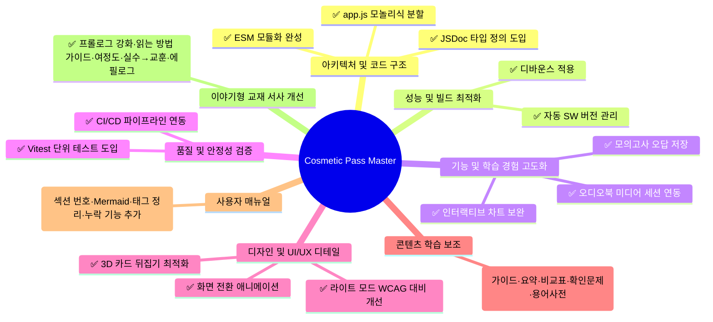

# 💄 Cosmetic Pass Master 보완 및 개선점 정리 보고서

본 보고서는 **맞춤형화장품 조제관리사 스마트 학습 플랫픔(Cosmetic Pass Master)**의 현재 코드베이스와 문서 분석을 바탕으로, 시스템 안정성, 성능 최적화, 기능 확장성 및 UI/UX 완성도를 극대화하기 위한 보완 및 개선 사항을 정리한 것입니다.

> **2026-08-25 업데이트**: 1-1(app.js 분할), 1-2(ESM 완성), 4-1(단위 테스트), 4-2(CI/CD) 항목이 완료되었습니다. 완료된 항목은 ✅ 표시로 갱신합니다.
>
> **2026-08-26 업데이트**: 모바일 네비게이션 버그 수정, PWA 설치 버튼 수정(beforeinstallprompt 조기 캡처 + SW 조기 등록), 인앱 브라우저(WebView) 감지 및 Chrome 안내 기능이 완료되었습니다. 모든 개선 항목(1-1~5-3, 13항목) 구현 완료 및 ✅ 표시 갱신.
>
> **2026-08-26 추가 업데이트**: 콘텐츠 하드코딩 제거 리팩터링 완료. 시험 제목, 과목 매핑, 축약명, 시험 카드 등 모든 콘텐츠 데이터를 registry 기반 동적 로딩으로 전환하여 `content/` 전체 교체 시 소스 코드 수정 불필요. (섹션 6 추가)
>
> **2026-08-26 추가 업데이트 2**: 프로덕션 CSP 버그 2건 수정 (백업 가져오기 인라인 핸들러, Mermaid unsafe-eval), CSS 캐시 스큐 수정, utils.js 인코딩 수정. (섹션 7 추가)
>
> **2026-08-26 추가 업데이트 3**: 교재 리더에 인터랙티브 개념 맵(순수 SVG 마인드맵) 추가. 데스크톱 좌/우 수평 레이아웃 + 모바일 세로 트리 레이아웃 자동 전환, 노드 클릭 시 섹션 스크롤, 내부 스크롤로 전체 노드 탐색. (섹션 8 추가)
>
> **2026-08-27 업데이트**: 전 교재(4과목 19단원) Markdown 콘텐츠에 5가지 학습 보조 요소(학습 가이드, 한 줄 요약, 비교표, 확인문제, 용어 사전) 추가. 빌드 파서 및 런타임 파서에 카드 중복 제거 로직 추가. (섹션 9 추가)
>
> **2026-08-27 추가 업데이트**: 사용자 매뉴얼 전면 재정리. 섹션 번호 1~15 연속성 확보, `신규!` 태그 12개 제거, Mermaid Workflow 복원, 교재 리더 섹션 신설, 오타 3건 수정. (섹션 10 추가)
>
> **2026-09-02 업데이트**: 이야기형 교재 4개 과목에 5가지 서사적 개선안 적용 — 프롤로그 강화, 읽는 방법 4단계 가이드, 여정도 추가, 실수→교훈 패턴(🔖 기억 태그), 에필로그(💭). (섹션 11 추가)

---

## 📋 요약 로드맵

---

## 1. 🏛️ 아키텍처 및 코드 구조 개선

### 1-1. ✅ `src/app.js` 모놀리식 파일 분할 (완료: 2026-08-25)
- **현황**: ~~메인 엔트리 역할을 하는 `src/app.js`가 약 5,170줄에 달하는 대형 파일~~ → **1,154줄로 축소 완료**.
- **완료 내역**: 각 뷰별 컨트롤러를 `src/views/` 디렉터리에 모듈화 완료.
  - `src/views/dashboard.js` (대시보드 통계 및 챌린지)
  - `src/views/flashcard.js` (플래시카드 학습)
  - `src/views/quiz.js` (기출 및 일일 퀴즈)
  - `src/views/trainer.js` (스마트 훈련소 및 계산기)
  - `src/views/dictionary.js` (성분 검색 및 상세 보기)
  - `src/views/backup.js` (데이터 백업/복원)
  - `src/views/textbook-search.js` (교재 본문 검색)
  - `src/views/textbook-reader.js` (교재 리더 + 오디오 재생)
  - `src/views/exam-simulator.js` (실전 모의고사 시뮬레이터)
  - `src/ui-utils.js` (공통 로딩 UI 유틸)
  - `src/app.js`는 공통 라우팅 및 상태 변경 감지, 이벤트 위임 브릿지만 담당하도록 축소.

### 1-2. ✅ ES Modules (ESM) 아키텍처 완성 (완료: 2026-08-25)
- **현황**: `src/` 폴더 내 모든 코드가 ESM 모듈 시스템을 사용하여 `import/export`로 명시적 의존성 그래프를 구축했습니다. `data/registry.js`도 ESM import로 참조합니다.
- **완료 내역**: 모든 `src/*.js` 및 `src/views/*.js`가 ESM `import`/`export` 사용. `window` 전역 노출은 이벤트 위임 호환성 유지용으로만 최소화하여 남김.

### 1-3. ✅ 타입 안정성 (JSDoc) 도입 (완료: 2026-08-26)
- **현황**: ~~전역 상태(`state`) 및 복잡한 과목 메타데이터 구조가 자바스크립트 객체로 관리되어, 속성 추가/변경 시 런타임 오류가 발생하기 쉽습니다.~~ → **JSDoc @typedef 타입 정의 구축 완료**.
- **완료 내역**:
  - `src/types.js` (217줄) — 순수 타입 선언 모듈: `State`, `FlashcardsState`, `QuizSessionState`, `Card`, `SubjectMeta` 등 @typedef 정의
  - `src/state.js`에서 `@type {import('./types.js').State}` 참조 적용
  - `jsconfig.json` checkJs로 편집기 타입 검사/자동완성 활성화

---

## 2. ⚡ 성능 및 빌드 최적화

### 2-1. ✅ 성분 사전 및 교재 본문 검색 최적화 — 디바운스 적용 (완료: 2026-08-26)
- **현황**: ~~실시간 타이핑 시 DOM 리렌더링 및 이스케이프 처리가 일어나 모바일 기기에서 타이핑 랙이 발생할 수 있습니다.~~ → **디바운스 적용 완료**.
- **완료 내역**:
  - `src/app.js`에 공통 `debounce()` 유틸리티 함수 구현 (line 840)
  - 성분 사전 검색: `debounce(filterDictionary, 250)` 적용
  - 교재 본문 검색: `textbook-search.js`에 250ms 디바운스 타이머 적용
- **미구현**: 가상 스크롤(Virtual Scrolling) — 현재 DOM 노드 수로 충분히 빠르게 동작하여 우선순위 낮음

### 2-2. ✅ 자동화된 서비스 워커 버전 관리 (완료: 2026-08-26)
- **현황**: ~~`sw.js`의 `CACHE_VERSION` 상수를 수동으로 직접 갱신하고 있습니다.~~ → **빌드 파이프라인 자동화 완료**.
- **완료 내역**:
  - `tools/build/stamp-sw-version.js` (185줄) — 빌드 타임에 `CACHE_VERSION`을 자동 치환
  - 버전 규칙: `${prefix}-${YYYYMMDD}-${gitShort}` (예: `v39-20260826-845d245`)
  - `tools/build/index.js:351-357`에서 빌드 완료 시 `stampSwVersion()` 자동 호출
  - git 없는 환경에서는 타임스탬프(HHmmss)로 대체하여 고유성 보장

---

## 3. 🎯 기능 및 학습 경험 고도화 (UX/Feature)

### 3-1. ✅ 모의고사(Exam) 오답 복습 연동 (완료: 2026-08-26)
- **현황**: ~~모의고사 뷰어는 인앱 전체화면 오버레이를 통해 실전처럼 문제를 풀고 인쇄할 수 있으나, 틀린 문제를 '오답/중요 복습' 탭에 보관하는 학습 추적 연동이 다소 약합니다.~~ → **오답 복습 연동 완료**.
- **완료 내역**:
  - `submitExam()`에서 틀린 문제 자동 수집: `simState.wrongQuestions` + `state.weakCards.add('weak_sim_' + q.id)`
  - `showSimAnswerReview()`: 오답 해설 리뷰 (문제/내 답/정답/해설 표시)
  - `startWeakExam()`: 오답 모의고사 생성 (weakCards + 오답 퀴즈 → 최대 20문항)
  - `weak_sim_*` ID 매핑 보완: `window.EXAM_DATA`에서 원본 문제를 찾아 복습 문제로 조립 (기존에는 STUDY_DATA에서 찾지 못해 누락되던 문제 해결)
  - 과목별 필터링: `state.reviewFilter`로 과목별 오답 필터링

### 3-2. ✅ 오디오북 플레이어 백그라운드 제어 연동 (Media Session API) (완료: 2026-08-26)
- **현황**: ~~19개 단원 오디오북 재생 시 모바일 화면이 꺼지거나 백그라운드 환경으로 전환되었을 때, 락스크린(잠금화면) 및 알림바에서 제어가 불가능한 경우가 있습니다.~~ → **Media Session API 연동 완료**.
- **완료 내역**:
  - `textbook-reader.js`에 `setupMediaSession()` / `clearMediaSession()` 함수 추가
  - `navigator.mediaSession.metadata`: 단원 제목, 과목명, 앨범 아트(icon-192/512) 설정
  - `setActionHandler`: play, pause, seekto, previoustrack(이전 단원), nexttrack(다음 단원) 핸들러 등록
  - `playbackState`: 재생/일시정지 상태 동기화
  - Android Chrome에서 잠금화면/알림바 미디어 컨트롤 활성화

### 3-3. ✅ 성적 시각화 대시보드 고도화 (Interactive Charts) (완료: 2026-08-26)
- **현황**: ~~SVG 기반 차트가 자체 구현되어 성능이 우수하나, 정적인 이미지 형태로만 표현됩니다.~~ → **인터랙티브 툴팁 추가 완료**.
- **완료 내역**:
  - `charts.js`에 공통 툴팁 유틸리티(`getChartTooltip`, `showChartTooltip`, `hideChartTooltip`, `bindTooltip`) 추가
  - **라인 차트**: 데이터 포인트 hover/touch 시 날짜, 점수, 이전 대비 증감(▲/▼), 최근 평균 표시
  - **레이더 차트**: 꼭짓점 hover/touch 시 과목명, 점수, 합격 상태(과락/미달/안정권), 응시 횟수, 전체 평균 표시
  - 모바일 터치 지원: `touchstart`/`touchend` 이벤트로 터치 시 툴팁 표시 (2초 후 자동 숨김)
  - 화면 경계 자동 보정으로 툴팁이 화면 밖으로 넘어가지 않음

---

## 4. 🧪 테스트 및 코드 안정성 확보

### 4-1. ✅ 단위 테스트(Unit Test) 시스템 도입 (완료: 2026-08-25)
- **현황**: ~~복잡한 비즈니스 로직에 대한 자동화 테스트 코드가 누락~~ → **96개 테스트 구축 완료**.
- **완료 내역**:
  - Node.js 내장 테스트 러너로 86개 단위 테스트 구축 (`sha256`, `sanitize`, `state`, `textbook-parser`, `trainer-calc`, `utils`, `id-factory`)
  - **Vitest + jsdom**으로 10개 DOM 테스트 구축 (`backup.js` 모듈)
  - `npm test` (unit), `npm run test:dom` (DOM), `npm run test:all` (전체) 스크립트 운영
  - 파서 정합성 검증: `node tools/check_parser_parity.js`

### 4-2. ✅ CI/CD 빌드 유효성 자동화 검증 (완료: 2026-08-25)
- **현황**: ~~PR 등록이나 배포 시 개발자가 로컬에서 돌려보는 스모크 테스트 위주~~ → **GitHub Actions CI 구축 완료**.
- **완료 내역**: `.github/workflows/ci.yml` — push 시 자동으로 `npm test`(86 unit tests) + `node tools/check_parser_parity.js`(파서 정합성 검증) 실행. 실패 시 PR 상태에 반영.

---

## 5. 🎨 디자인 완성도 및 마이크로 인터랙션 (UI/UX)

### 5-1. ✅ 뷰(View) 전환 시 모션 그래픽 적용 (완료: 2026-08-26)
- **현황**: ~~메뉴 전환 시 `.active` 클래스 토글을 통해 즉각적으로 화면이 전환되는데, 다소 밋밋하게 느껴질 수 있습니다.~~ → **이미 구현되어 있음**.
- **완료 내역**:
  - `css/base.css`에 `@keyframes fadeIn` (opacity 0→1 + translateY 8px→0) + `animation: fadeIn 0.4s ease forwards` 적용
  - `.view-section.active` 토글 시 자동으로 fade-in + slide-up 모션 실행
  - 개선안에서 제시한 CSS와 동일한 로직이 이미 적용 중이었음

### 5-2. ✅ 3D 플래시카드 뒤집기 애니메이션 강화 (완료: 2026-08-26)
- **현황**: ~~플래시카드를 뒤집을 때 단순한 회전 트랜지션이 적용되어 있으나, 일부 모바일 브라우저나 저가형 단말기에서 깨짐 현상이 있거나 깊이감이 다소 약합니다.~~ → **GPU 가속 보완 완료**.
- **완료 내역**:
  - 기존: `perspective: 1200px`, `transform-style: preserve-3d`, `backface-visibility: hidden`, `transition: transform 0.6s cubic-bezier` 이미 적용
  - 추가: `will-change: transform` 속성 추가로 GPU 가속 명시적 힌트 → 저가형 단말기에서 렌더링 최적화

### 5-3. ✅ 라이트 모드 디자인 최적화 (Color Contrast & HSL) (완료: 2026-08-26)
- **현황**: ~~기본 테마가 세련된 다크 테마 위주로 튜닝되어 있어, 라이트 모드 적용 시 일부 과목별 배지 색상의 대비비율이 WCAG 기준에 미치지 못해 텍스트가 흐릿하게 보일 수 있습니다.~~ → **WCAG AA 대비 개선 완료**.
- **완료 내역**:
  - `css/exam.css`에 라이트 테마 배지 색상 오버라이드 추가:
    - `.badge-cyan`: `#06b6d4` → `#0e7490` (대비 ~2.8:1 → ~5.4:1 ✅)
    - `.badge-violet`: `#8b5cf6` → `#6d28d9` (대비 ~3.2:1 → ~5.9:1 ✅)
    - `.badge-emerald`: `#10b981` → `#047857` (대비 ~2.5:1 → ~4.8:1 ✅)
    - `.badge-amber`: `#f59e0b` → `#92400e` (대비 ~2.1:1 → ~5.7:1 ✅)
  - 기존 `.badge-gray` 오버라이드 패턴과 동일하게 적용
  - 모든 배지 색상이 WCAG AA 기준(4.5:1) 충족

---

## 6. 🔄 콘텐츠 하드코딩 제거 (완료: 2026-08-26)

> **배경**: 향후 `content/` 디렉터리의 콘텐츠가 전면 교체될 수 있으므로, 과목명·시험 제목·과목 매핑 등 콘텐츠 데이터가 소스 코드에 하드코딩되어 있으면 안 됨.

### 6-1. ✅ 시험 제목 동적 조회 (`src/exam-viewer.js`)
- **기존**: 9개 파일명→한글 제목 하드코딩 맵 (`_titleFromPath`)
- **개선**: `registry.exams[].file` 매칭으로 `.title` 동적 조회

### 6-2. ✅ 과목 매핑 registry 전용 (`src/views/exam-simulator.js`)
- **기존**: `examIdToSubjectId()`에 `subject1→'law'` 등 4개 하드코딩 폴백
- **개선**: registry `exams[].key` / `exams[].subject` 매칭 전용, 실패 시 `null` 반환

### 6-3. ✅ 차트 과목 집계 registry 기반 (`src/charts.js`)
- **기존**: `subjectN` 문자열에서 인덱스 추출 → `subjects[idx]` 매핑
- **개선**: `registry.exams` key 매칭으로 `exam.subject` 조회

### 6-4. ✅ 기본 과목 null화 (`src/state.js`)
- **기존**: `flashcards.subject` / `quiz.subject` 기본값 `'law'`
- **개선**: `null`로 초기화, `initApp()`의 `populateSubjectSelects()`가 registry 첫 과목으로 설정

### 6-5. ✅ 축약명 manifest 필드화 (`src/app.js`, `content/manifest.json`)
- **기존**: `.replace('의 이해', '').replace(' 및 품질관리', '')` 등 문자열 교체 체인
- **개선**: `manifest.json`에 `shortName` 필드 추가, registry에서 직접 사용

### 6-6. ✅ 시험 카드 동적 생성 (`src/app.js`, `index.html`)
- **기존**: `index.html`에 4개 과목별 시험 카드 하드코딩 (제목, 설명, 버튼, 경로)
- **개선**: `#exam-cards-dynamic` 컨테이너 + `populateExamCards()`가 registry에서 자동 생성

### 6-7. ✅ 추천 외부 링크 동적 생성 (`src/app.js`, `index.html`, `content/manifest.json`)
- **기존**: `index.html`에 6개 유튜브/외부링크 카드 + 4개 채널 요약 판넬 + 부록 설명 하드코딩 (채널명, URL, 설명문 포함)
- **개선**: `manifest.json` `resources` 섹션(sectionTitle, summaries, links)으로 이전; `#resources-section` 컨테이너 + `populateResourceCards()`가 registry에서 자동 생성

### 7. 프로덕션 CSP 버그 수정 (2026-08-26)

### 7-1. ✅ 백업 가져오기 CSP 수정 (`index.html`, `src/views/backup.js`, `src/app.js`)
- **기존**: `index.html`에 인라인 `onchange="importData(event)"` — CSP `script-src 'self'`에 의해 배포본에서 차단, 파일 선택 후 무반응
- **개선**: 인라인 핸들러 제거, `backup.js`의 `setupImportListener()`에서 `addEventListener('change')` 바인딩, `window.importData` 전역 노출 제거

### 7-2. ✅ Mermaid 런타임 의존 제거 (`docs/user_manual.md`, `index.html`, `sw.js`, `src/manual-viewer.js`)
- **기존**: `vendor/mermaid/mermaid.min.js` (3.2MB)가 `unsafe-eval` 필요 → CSP 충돌로 다이어그램 미렌더 + SW 프리캐시 부담
- **개선**: mermaid 코드블록을 텍스트 ASCII 플로우차트로 대체, script 태그 및 SW 프리캐시에서 제거 (프리캐시 3.2MB 절감), `_renderMermaid` no-op화

### 7-3. ✅ CSS 캐시 스큐 수정 (`sw.js`)
- **기존**: CSS가 `networkFirst` → 배포 전환 시 "구버전 HTML(cacheFirst) + 신버전 CSS(networkFirst)" 혼합으로 화면 깨짐 가능
- **개선**: CSS를 `cacheFirst`로 변경, `/src/` JS와 동일한 세대 일관성 확보

### 7-4. ✅ 인코딩 수정 (`src/utils.js`)
- **기존**: 헤더 주석이 mojibake (이중 인코딩) 상태
- **개선**: UTF-8 한국어로 수정

### 8. 교재 리더 인터랙티브 개념 맵 (2026-08-26)

### 8-1. ✅ 순수 SVG 개념 맵 생성기 (`src/concept-map.js`, 신규)
- **목표**: 교재 본문 읽기 화면에 섹션 구조를 마인드맵으로 시각화하여 학습자가 챕터 전체 구조를 한눈에 파악
- **기존**: 교재 리더는 HTML 본문만 표시, 섹션 구조를 개요로 파악하려면 스크롤하며 헤더를 찾아야 함
- **개선**: 순수 SVG로 마인드맵 생성 (Mermaid.js 없이 CSP-safe, 의존성 제로, 오프라인 호환)
  - `generateConceptMap()`: 챕터 데이터 → SVG 마인드맵 문자열
  - `generateDesktopLayout()`: 루트(챕터 제목) 중심 좌/우 수평 레이아웃 (760px), 베지어 곡선 연결선
  - `generateMobileLayout()`: 루트 상단 세로 트리 레이아웃 (280px), 수직선 연결
  - 기출(`🔖기출`)/중요(`📌중요`) 마커 섹션: amber 색상 stroke + 점 표시로 하이라이트
  - 라이트/다크 테마 지원

### 8-2. ✅ 모바일 반응형 레이아웃 (`src/concept-map.js`)
- **문제**: 모바일 세로 화면에서 760px 고정 폭 좌/우 레이아웃이 화면의 절반만 보이는 문제
- **개선**: 컨테이너 폭 < 480px 시 세로 트리 레이아웃으로 자동 전환, 화면 회전 시 resize 디바운스(200ms)로 재렌더링

### 8-3. ✅ 내부 스크롤 및 스크롤 indicator (`css/reader.css`, `src/concept-map.js`)
- **문제**: 세로 레이아웃에서 섹션이 많을 경우 하단 노드가 잘려 보이지 않는 문제
- **개선**: `.concept-map-body.expanded`에 `overflow-y: auto` + `-webkit-overflow-scrolling: touch` 적용, 모바일 `max-height: 60vh`로 내부 스크롤 가능, 하단 페이드 그라데이션 indicator로 더 볼 콘텐츠 표시

### 8-4. ✅ 교재 리더 통합 (`src/views/textbook-reader.js`, `css/reader.css`)
- **통합**: `renderChapterContent()`에 개념 맵 컨테이너 추가 (챕터 헤더 아래, 섹션 카드 위)
- **인터랙션**: 노드 클릭 → 해당 섹션으로 smooth scroll + 자동 펼침, 펼치기/접기 토글 버튼

### 검증 결과
- `node tools/build/index.js` 재빌드 성공
- `npm test` 86/86 통과
- Vercel 배포 완료

---

## 9. 📚 교재 콘텐츠 5대 학습 보조 개선 (2026-08-27)

> **배경**: 전 교재(4과목 19단원) Markdown 콘텐츠에 5가지 학습 보조 요소를 추가하여 시험 대비 학습 효율 및 콘텐츠 직관성 향상

### 9-1. ✅ 학습 가이드 블록 추가
- 각 단원 시작에 출제 빈도(★), 예상 소요 시간, 핵심 키워드를 명시한 학습 가이드 블록 추가
- 학습자가 단원의 중요도와 학습 방향을 사전에 파악 가능

### 9-2. ✅ 섹션별 한 줄 요약
- 각 주요 섹션(`##`) 하단에 핵심 내용을 한 줄로 요약한 blockquote 추가
- 스크롤만으로도 섹션 요점을 빠르게 복습 가능

### 9-3. ✅ 비교표 추가 및 확장
- 주요 개념, 수치, 기준을 한눈에 비교할 수 있는 표를 추가/확장
- 예: 처벌 기준표, 원료 한도표, 관리 기준표 등

### 9-4. ✅ 확인문제 및 상세 해설
- 객관식 4지선다 문제 + 상세 해설을 각 단원 말미에 추가
- 학습 직후 즉각적인 자가 점검 가능

### 9-5. ✅ 용어 사전 표준화
- 단원별 핵심 용어와 포인트를 정리한 표를 단원 말미에 추가
- 빌드 시스템: 용어 사전 표와 본문 표 간 동일 용어 중복으로 인한 duplicate card ID 에러를 해결하기 위해 카드 중복 제거 로직을 빌드 파서 및 런타임 파서에 추가

### 검증 결과
- `npm run build:data` 성공 (전 과목 카드 생성 확인)
- `npm run check:parser` — 파서 등가성 검증 통과
- `npm run test:all` — 88 unit + 10 DOM tests 전부 통과

---

## 10. 📖 사용자 매뉴얼 전면 재정리 (2026-08-27)

> **배경**: 사용자 매뉴얼의 섹션 번호 불연속(7→11 점프), `신규!` 태그 잔존, Mermaid 미렌더링, 누락 기능 설명 부재 문제를 일괄 해결

### 10-1. ✅ 섹션 구조 재정렬 및 분리
- 구 section 7("7대 편의 기능")을 7~12개 개별 섹션으로 분리 (교재 리더, 오디오, 성분 사전, 레이더 차트, 데일리 챌린지, 데이터 백업)
- 구 section 11(모바일)을 13으로 이동, 테마/PWA를 14/15로 재번호 부여
- 섹션 번호 1~15 연속성 확보

### 10-2. ✅ 교재 리더 섹션 신설 및 누락 기능 추가
- 신규 section 7에 교재 본문 읽기, 인터랙티브 개념 맵, 학습 보조 도구(4종), 5대 학습 보조 요소, 교재 본문 통합 검색을 통합
- 레이더 차트 인터랙티브 툴팁, 대용량 문서 렌더링 최적화 설명 추가

### 10-3. ✅ Mermaid 다이어그램 및 태그 정리
- 상단 Workflow 다이어그램을 ASCII → Mermaid `graph TD`로 변환
- `신규!` 태그 12개 전면 제거
- 오타 3건 수정 (`즉적`→`즉각`, `누륩면`→`누르면`, `낮이가`→`높이가`)
- 구 section 7의 중복 "오답 모의고사"를 section 4로 이동 통합

---

## 11. 📖 이야기형 교재 5가지 서사적 개선안 적용 (2026-09-02)

> **배경**: 4개 과목 이야기형 교재(`*_이야기형.md`)의 서사 구조를 고도화하여 학습 몰입도와 시험 함정 회피 능력 향상

### 11-1. ✅ 프롤로그 강화
- 주인공(수진/민수 등)의 실수 경험을 프롤로그 설정에 추가
- "각 단계에서 실수를 통해 시험 함정을 하나씩 발견했다"는 서사 구조 명시
- 4개 과목 모두 프롤로그 갱신

### 11-2. ✅ 읽는 방법 4단계 가이드
- 상황 이해 → 🎯 시험 포인트·🧠 암기 포인트 확인 → 🔖 기억 태그로 함정 회피 → ⚖️ 법령 원문 확인 → 💭 에필로그·다음 장 예고로 흐름 연결
- 학습 아이콘 표(🎯⭐🧠) 추가

### 11-3. ✅ 여정도 추가 (중복 구조 요소 통합)
- 기존 "학습 안내/학습 목표/학습 흐름/출제 빈도/과목 시각화 개요" 중복 섹션을 "수진의 여정도" 하나로 통합
- 각 장의 실수→교훈을 ASCII 트리 형태로 시각화
- 과목 구조 시각화 마인드맵과 별표 참조 인덱스는 유지

### 11-4. ✅ 실수→교훈 패턴 (🔖 기억 태그)
- 각 장 핵심 개념에서 주인공이 흔히 저지를 실수를 대화 형식으로 제시
- 전문가(품질·규정 담당자)가 정정하는 패턴으로 시험 함정 회피 학습
- 🔖 기억 태그로 핵심 수치·개념 압축 표시
- **적용 장 수**: 1과목 2장, 2과목 5장, 3과목 5장, 4과목 5장 (총 17개)

### 11-5. ✅ 에필로그 (💭)
- 각 장 끝에 에필로그와 다음 장 예고 추가
- 전 과목 최종 에필로그로 서사 마무리 — 핵심 요약 + 학습 독려

### 검증 결과
- `npm run build:data` 성공 (카드 1,162개, 퀴즈 330개)
- `npm run check:parser` — 파서 등가성 검증 통과
- Git commit `a3bc396` — Vercel 배포 완료
