# 🧴 Pass → Practice 전략: Formula OS — 합격 후 실무 플랫폼 전환

> **작성일**: 2026-09-11
> **개정일**: 2026-09-12 — 종합 리뷰 반영: Formula OS 핵심 격상, AI 배합 참고 한 단계 뒤로, verified 세분화, MVP 축소(Phase 5-A), 고객 개인정보 최소화, 법적 한도 ≠ 안전성 UI 분리, ingredient_practice 관계형 분리, 법령 알림 Actionable Alert 강화, Pass Pro vs Practice Pro 분리, Practice 타깃 확장, Knowledge Flywheel
> **목적**: 합격 후 이탈하는 일반 자격증 플랫폼과 달리, 맞춤형화장품조제관리사의 특성을 활용하여 **합격 후에도 계속 머무는 실무 플랫폼** 으로 확장하는 전략
> **관련 문서**: [FEATURE_PROPOSALS.md](FEATURE_PROPOSALS.md), [SUBSCRIPTION_ROADMAP.md](SUBSCRIPTION_ROADMAP.md), [READER_FEEDBACK_DESIGN.md](READER_FEEDBACK_DESIGN.md)

---

## 📑 목차

1. [핵심 전략: Formula OS — Pass Loop → Practice Loop](#1-핵심-전략-formula-os--pass-loop--practice-loop)
2. [조제관리사 실무 DB](#2-조제관리사-실무-db)
3. [AI 배합 참고 (Formula OS 구성 요소)](#3-ai-배합-참고-formula-os-구성-요소)
4. [시험용 데이터 ↔ 실무용 데이터 통합](#4-시험용-데이터--실무용-데이터-통합)
5. [실무 모드 진입 UX](#5-실무-모드-진입-ux)
6. [포뮬러 라이브러리](#6-포뮬러-라이브러리)
7. [법령·고시 업데이트 알림](#7-법령고시-업데이트-알림)
8. [구독 모델 재설계: 2단계 LTV](#8-구독-모델-재설계-2단계-ltv)
9. [합격자 커뮤니티](#9-합격자-커뮤니티)
10. [데이터 Flywheel](#10-데이터-flywheel)
11. [Phase 5 — Practice Platform](#11-phase-5--practice-platform)
12. [기술 아키텍처 영향](#12-기술-아키텍처-영향)
13. [리스크 및 완화책](#13-리스크-및-완화책)

---

## 0. 용어 정의 (중요)

본 문서에서 "처방"이라는 의료·약사법적 뉘앙스를 갖는 용어를 사용하지 않고, 화장품 조제 실무에 맞는 용어로 통일합니다.

| 본 문서 용어 | 의미 | 사용하지 않는 용어 | 비고 |
|-------------|------|-------------------|------|
| **배합** | 원료를 섞어 화장품을 만드는 행위 | 처방 | 의료 행위가 아님을 명확히 |
| **포뮬러 (Formula)** | 원료 조합 + 배합량이 기록된 결과물 | 처방전 | 화장품업계 표준 용어 |
| **레시피** | 포뮬러의 비공식적 표현 | 처방전 | 커뮤니티에서 사용 |
| **배합 참고** | AI가 원료 조합을 제안하는 기능 | AI 처방 참고 | 생성이 아닌 참고 |
| **배합량** | 각 원료의 사용량 (%) | 투여량 | 화장품 원료 배합 비율 |
| **조제** | 화장품을 직접 만드는 행위 | 조제 (동일) | 조제관리사의 핵심 업무 |

> **주의**: UI, DB 스키마, 코드 식별자에서도 "prescription" 대신 "formula"를 사용합니다.
> 이는 의료법·약사법상 "처방" 용어 사용으로 인한 법적 리스크를 사전에 회피하기 위함입니다.

---

## 1. 핵심 전략: Formula OS — Pass Loop → Practice Loop

### 1.0 제품 정의: Formula OS

> **Cosmetic Pass Master의 진짜 경쟁력은 AI가 아닙니다.**
> **수험생을 조제 실무자로 전환시키고, 그 사람이 사용하는 포뮬러·원료·규정·업무 데이터를 계속 축적하게 만드는 구조입니다.**

```
Cosmetic Pass Master
        │
        ├── PASS (시험)
        │    └─ 자격증 합격을 빠르게
        │
        └── PRACTICE (실무) = Formula OS
             ├─ 원료 DB
             ├─ 배합 계산
             ├─ 포뮬러 작성·저장
             ├─ 포뮬러 버전 관리
             ├─ 규정 검증·영향 분석
             ├─ 고객별 기록
             └─ AI 배합 참고 (가장 나중, 법률 검토 후)
```

> **리뷰 피드백 반영**: AI 배합 참고를 Killer Feature에서 한 단계 뒤로 조정했습니다.
> AI는 경쟁사가 쉽게 따라 할 수 있지만, 사용자가 1~2년간 축적한 포뮬러 + 고객 이력 + 수정 이력 + 원료 경험 데이터는 쉽게 복제할 수 없습니다.
> **Formula OS가 제품의 핵심이며, AI는 그 안의 보조 구성 요소**입니다.
> 장기적으로 "조제관리사를 위한 Formula OS" 포지션까지 갈 수 있습니다.

### 1.1 문제 인식

일반 자격증 플랫폼은 합격하면 구독자가 이탈합니다:

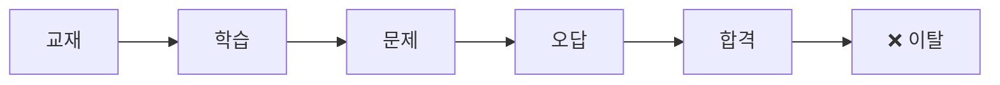

그러나 **맞춤형화장품조제관리사는 자격 취득 후에도 지식이 계속 필요한 분야**입니다. 배합 설계, 원료 검색, 배합량 계산, 법령 준수 등 실무에서 시험 지식이 그대로 활용됩니다.

### 1.2 전략 방향

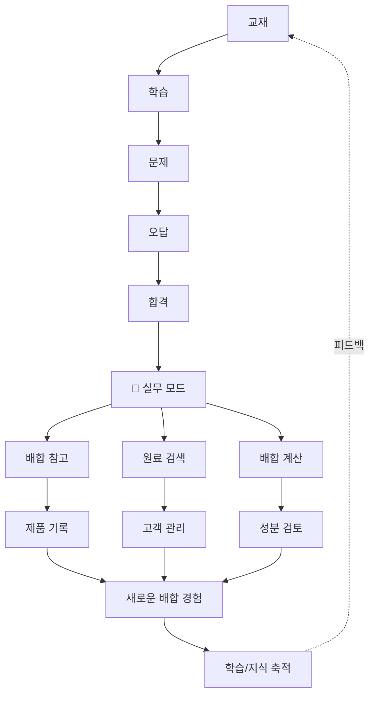

### 1.3 제품 정의 확장

| 기존 정의 | 확장 정의 |
|----------|----------|
| "사용자를 합격 상태까지 자동으로 끌어가는 플랫폼" | **"합격시키고, 합격 후에도 계속 쓰게 만드는 플랫폼"** |

### 1.4 핵심 원칙

> **합격은 이탈 이벤트가 아니라 플랫폼의 다음 단계로 진입하는 이벤트다.**
> **단, 실무 모드는 합격 여부와 무관하게 누구나 사용할 수 있다.** (§5 참조)

---

## 2. 조제관리사 실무 DB

### 2.1 개요

시험이 끝난 뒤 사용자가 가장 자주 찾는 것은 "이 원료를 어떻게 활용하지?"입니다. 시험 공부에 사용했던 지식 DB를 그대로 실무 DB로 전환합니다.

### 2.2 원료 상세 페이지 구성

원료 하나를 검색하면 다음 정보를 통합 제공합니다:

```
히알루론산

[기본 정보]
INCI Name: Sodium Hyaluronate
원료 유형: 보습제
기능: 수분 보유, 피부 장벽 강화

[제형별 적합도]
토너      ★★★★★
세럼      ★★★★★
크림      ★★★★☆

[배합 참고]
권장 범위: 0.1% ~ 2.0%
제형별 사용량:
  - 토너: 0.1% ~ 0.5%
  - 세럼: 0.5% ~ 2.0%
  - 크림: 0.1% ~ 1.0%
주의사항: 고농도 시 점도 급증

[궁합]
◎ 잘 맞는 성분: 글리세린, 나이아신아마이드, 판테놀
△ 주의 성분: 고농도 비타민 C (pH 충돌)

[배합 활용]
보습 배합: 히알루론산 + 글리세린 + 세라마이드
장벽 배합: 히알루론산 + 세라마이드 + 판테놀
민감성 배합: 저농도 히알루론산 + 알란토인

[관련 규정]
별표 2 사용 제한 원료: 해당 없음
별표 4 표시 기준: 해당 없음
식약처 고시: 화장품 원료 등 고시 (제2024-xx호)
```

> **주의**: 위 수치는 예시이며, 실제 권장 범위는 제형·다른 원료·pH에 따라 달라집니다.
> 실무 DB의 수치 데이터는 식약처 공식 고시 및 학술 근거에만 기반해야 합니다.

### 2.3 데이터 소스 매핑

| 실무 DB 섹션 | 기존 시험 데이터 소스 | 추가 필요 데이터 | 데이터 신뢰성 |
|-------------|---------------------|-----------------|-------------|
| 기본 정보 | `content/참조자료/원료/*.md` | INCI Name, 기능 분류 | 공식 데이터 |
| 제형별 적합도 | (신규) | 제형별 권장 사용량 | 학술 근거 필요 |
| 배합 참고 | 교재 내 수치 데이터 | 제형별 상세 사용량 | 공식 고시 우선 |
| 궁합 | (신규) | 원료 간 상호작용 정보 | 학술 근거 필요 |
| 배합 활용 | (신규) | 제형별 배합 패턴 | 크라우드소싱 (검증 필요) |
| 관련 규정 | `content/참조자료/ref_md/` | (기존 데이터 재사용) | 공식 데이터 |

### 2.4 기존 데이터 재사용

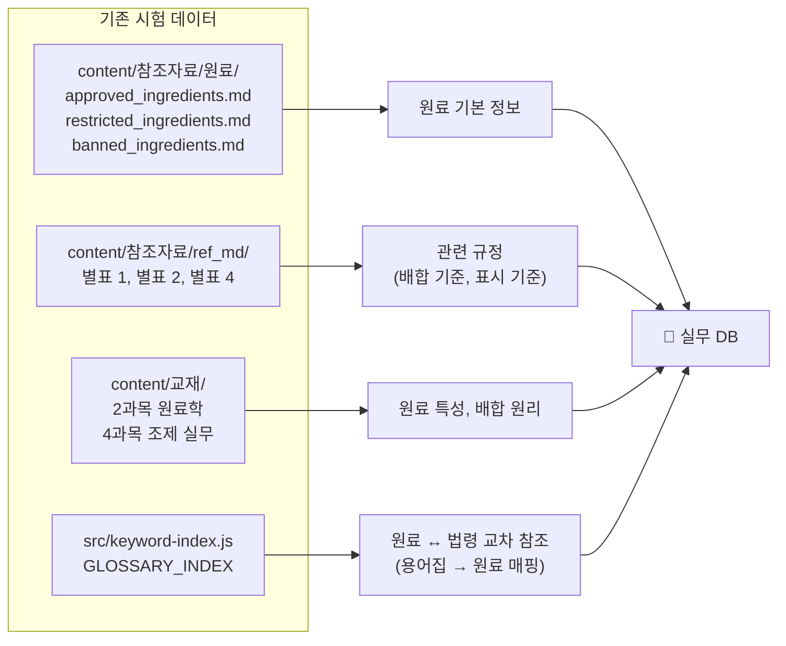

### 2.5 데이터 신뢰성 등급

실무 DB의 데이터는 출처에 따라 신뢰성 등급을 표시합니다:

| 등급 | 출처 | 표시 | 예시 |
|------|------|------|------|
| **A (공식)** | 식약처 고시, 법령 원문 | ✅ 공식 | 별표 2 사용 한도 |
| **B (학술)** | 학술 논문, 교과서 | 📚 학술 | 원료 궁합, 제형별 적합도 |
| **C (커뮤니티)** | 사용자 제보 (검증 대기) | 👥 커뮤니티 | 배합 패턴, 실무 팁 |
| **D (미검증)** | 사용자 제보 (검증 전) | ⚠️ 미검증 | 개인 경험, 특정 케이스 |

> **원칙**: 배합량 수치 데이터는 A등급(공식)만 표시합니다.
> B등급 이하의 수치는 "참고"로만 표시하고, 단정적 표현을 피합니다.

### 2.6 신뢰성 등급 ↔ source ↔ verified 교차 매핑

> **리뷰 피드백 반영**: `verified` 불리언 하나로 모든 검증을 표현하기에는 부족합니다.
> 식약처 고시 사용한도 확인과 논문 원료 궁합 확인은 전혀 다른 검증입니다.
> 장기적으로 `regulation_verified` / `scientific_verified` / `editor_verified` / `community_evidence`로 분리합니다.

세 분류 체계(신뢰성 등급 / `source` enum / 검증 축)의 대응 관계:

| 신뢰성 등급 | `source` 값 | `regulation_verified` | `scientific_verified` | `editor_verified` | `community_evidence` | AI 학습 | 비고 |
|------------|------------|----------------------|----------------------|-------------------|---------------------|---------|------|
| **A (공식)** | `official` | ✅ 자동 | — | — | — | ✅ 포함 | 식약처 고시·법령 일치 시 자동 |
| **B (학술)** | `community` | — | ✅ (관리자) | ✅ (관리자) | — | ✅ 포함 | 학술 논문 근거 확인 후 승격 |
| **C (커뮤니티)** | `community` | — | — | ❌ | N건 | ❌ 제외 | 3명+ 동일 보고 → 관리자 검토 대기 큐 |
| **D (미검증)** | `community`/`ai` | — | — | ❌ | — | ❌ 제외 | 개인 경험, AI 생성 |

> **UI 표시 예시** (단일 `verified` 대신 다축 표시):
> ```
> 규정 검증      ✅
> 학술 검증      ✅
> 관리자 검토    ❌
> 커뮤니티 경험  12건
> ```

> **구현 가이드**:
> - `source = 'official'` → `regulation_verified = true` (자동)
> - `source = 'community'` + 학술 근거 → 관리자 검토 후 `scientific_verified = true`
> - `source = 'community'` + 3명 이상 동일 보고 → 관리자 검토 대기 큐 신호 (여전히 `editor_verified = false`)
> - `source = 'ai'` → 모든 검증 춸 false (AI 생성 데이터는 검증 대상)
> - AI 학습 데이터 필터: `WHERE regulation_verified = true OR scientific_verified = true`

---

## 3. AI 배합 참고 (Formula OS 구성 요소)

### 3.1 핵심 설계 원칙: 생성 vs 검증 분리

> **AI는 원료를 "제안"만 하고, 배합량 숫자를 "생성"하지 않습니다.**
> **배합량은 사용자가 직접 입력하고, 시스템은 공식 고시 데이터로 "검증"만 합니다.**

이 분리의 이유:

| 구분 | 생성 (AI) | 검증 (시스템) |
|------|----------|-------------|
| **역할** | 원료 조합 제안 | 배합량 한도 준수 확인 |
| **데이터 소스** | 학습 데이터, 크라우드소싱 | 식약처 공식 고시, 법령 |
| **법적 책임** | 참고용 (면책 가능) | 공식 데이터 기반 (객관적) |
| **오류 시 영향** | "나쁜 제안" → 사용자가 거름 | "한도 초과" → 시스템이 차단 |

> **핵심 통찰**: 생성 책임과 검증 책임은 법적으로 무게가 다릅니다.
> AI가 "히알루론산 0.5%를 넣으세요"라고 생성하면, 그 숫자의 책임이 AI에게 있습니다.
> AI가 "히알루론산을 고려해보세요"라고 제안하고, 사용자가 0.5%를 입력하면,
> 시스템이 "0.5%는 한도(2.0%) 내입니다"라고 검증하면, 책임은 사용자에게 있고
> 시스템은 객관적 사실만 확인합니다.

### 3.2 포지셔닝

> **"AI 배합"이 아닌 "AI 배합 참고"** — 최종 배합 결정은 항상 조제관리사가 내립니다.

AI는 참고·보조 역할에 머물고, 법적 책임은 조제관리사에게 있습니다.

### 3.3 배합 참고 워크플로우 (생성 vs 검증 분리)

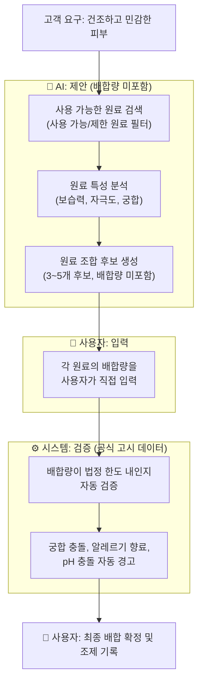

### 3.4 Wireframe

```
┌─────────────────────────────────────────────┐
│  🧪 AI 배합 참고                              │
│                                              │
│  고객 요구: [건조하고 민감한 피부      ]     │
│                                              │
│  [원료 조합 후보 생성]                       │
│                                              │
│  ┌──────────────────────────────────────┐   │
│  │ 조합 후보 1: 보습 중심 세럼          │   │
│  │                                      │   │
│  │ AI 제안 원료 (배합량 미포함):        │   │
│  │ • 히알루론산  ── 보습               │   │
│  │ • 글리세린    ── 보습               │   │
│  │ • 판테놀      ── 진정               │   │
│  │ • 알란토인    ── 진정               │   │
│  │                                      │   │
│  │ 배합량 입력 (사용자 직접 입력):      │   │
│  │ 히알루론산 [    ] %  한도: 2.0%     │   │
│  │ 글리세린   [    ] %  한도: 10.0%    │   │
│  │ 판테놀     [    ] %  한도: 1.0%     │   │
│  │ 알란토인   [    ] %  한도: 0.1%     │   │
│  │                                      │   │
│  │ [배합량 검증]                        │   │
│  │                                      │   │
│  │ ⚠️ 주의사항 (시스템 자동 감지):     │   │
│  │ • 히알루론산 + 고농도 비타민 C 주의  │   │
│  │ • 알란토인 0.1% 초과 시 주의        │   │
│  │                                      │   │
│  │ ✅ 규정 확인: 현행 기준상 배합 한도  │   │
│  │    초과 없음                          │   │
│  │ ⚠️ 안전성 판단: 시스템에서 보증하지  │   │
│  │    않음                               │   │
│  │ 👤 최종 판단: 조제 담당자             │   │
│  │                                      │   │
│  │ [이 배합 채택] [수정] [다른 후보]   │   │
│  └──────────────────────────────────────┘   │
│                                              │
│  ⚠️ 본 결과는 참고용입니다.                  │
│  AI는 원료를 제안할 뿐, 배합량을 생성하지    │
│  않습니다. 배합량은 사용자가 직접 입력하고,  │
│  시스템이 공식 고시 데이터로 검증합니다.     │
│  최종 배합은 조제관리사의 판단에 따릅니다.  │
└─────────────────────────────────────────────┘
```

### 3.5 안전 설계 원칙

| 원칙 | 설명 | 구현 방식 |
|------|------|----------|
| **생성·검증 분리** | AI는 원료 제안만, 배합량은 사용자 입력 | AI 출력에 수치 미포함, 입력 필드 분리 |
| **참고용 명시** | 모든 결과에 "참고용" 안내문 표시 | UI 하단 고정 안내문 |
| **최종 결정권** | 조제관리사가 최종 배합을 결정하고 기록 | 사용자 확인 버튼 필수 |
| **법적 한도 검증** | 모든 원료 배합량이 법정 한도 내인지 자동 검증 | 공식 고시 데이터 기반 |
| **규정 ≠ 안전성 명시** | "한도 내" ≠ "안전함" — UI에서 분리 표시 | 규정 확인 ✅ / 안전성 ⚠️ / 최종 판단 👤 |
| **금지 원료 필터** | 사용 금지 원료는 조합 후보에서 원천 제외 | `banned_ingredients.md` 연동 |
| **알레르기 표시** | 알레르기 유발 향료 25종 자동 감지 및 경고 | 별표 4 향료 목록 연동 |
| **제한 원료 경고** | 별표 2 제한 원료 사용 시 직접 배합 불가 안내 | `restricted_ingredients.md` 연동 |
| **수치 출처 표시** | 모든 수치 데이터의 출처(공식/학술/커뮤니티) 표시 | §2.5 신뢰성 등급 연동 |

---

## 4. 시험용 데이터 ↔ 실무용 데이터 통합

### 4.1 하나의 지식 그래프

시험 콘텐츠와 실무 콘텐츠가 별개의 제품이 아닌, 하나의 지식 그래프가 시험과 실무를 모두 지원합니다.

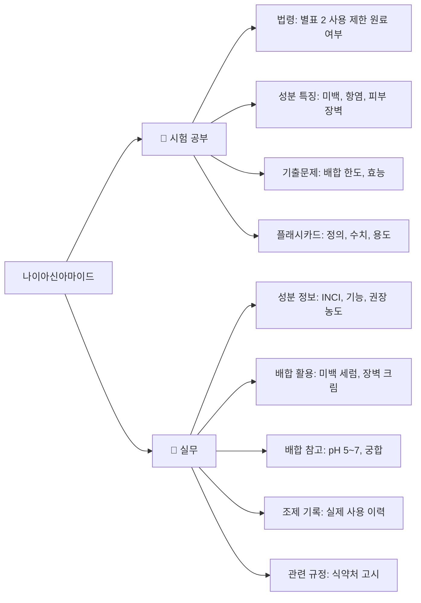

### 4.2 데이터 통합 구조

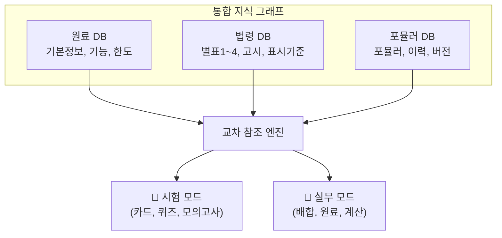

### 4.3 기존 인프라 재사용

| 기존 모듈 | 시험 모드 역할 | 실무 모드 역할 |
|----------|--------------|---------------|
| `src/keyword-index.js` | 교재 ↔ 참조자료 매핑 | 원료 ↔ 법령 매핑 |
| `src/pdf-registry.js` | 참조자료 중앙 설정 | 법령 원문 참조 |
| `src/html-viewer.js` | 참조자료 뷰어 | 법령 원문 뷰어 |
| `content/참조자료/원료/` | 시험용 원료 목록 | 실무용 원료 DB |
| `content/참조자료/ref_md/` | 시험용 법령 원문 | 실무용 법령 참조 |
| `src/views/dictionary.js` | 성분 검색 (시험용) | 성분 검색 (실무용) |
| `src/views/trainer.js` | 배합 계산 연습 | 배합 계산 (실무) |
| `src/trainer-calc.js` | 계산 문제 생성 | 실무 배합량 계산 |

---

## 5. 실무 모드 진입 UX

### 5.1 핵심 설계 원칙: 합격 여부 불문, 누구나 실무 모드 사용 가능

> **실무 모드는 합격자 전용이 아닙니다.** 합격 여부와 무관하게 누구나 실무 모드를 켤 수 있습니다.
> **합격자 ≠ 실무자, 실무자 ≠ 반드시 합격자** — Practice 타깃은 합격자가 아닌 조제 실무자 전반입니다.

이유:

- 시스템이 사용자의 실제 합격 여부를 알 수 없습니다 (큐넷 외부 데이터).
- 합격자 자가 보고에 의존하면, 미합격자도 실무 모드를 쓸 수 있습니다.
- 차라리 "실무 모드는 누구나 켤 수 있다"로 가는 것이 솔직하고 진입장벽을 낮춥니다.
- 수험생도 실무 모드를 미리 체험해보면 Practice Pro 전환 동기가 됩니다.

**Practice 타깃 사용자**:

| 타깃 | 설명 |
|------|------|
| ① 맞춤형화장품조제관리사 | 자격 취득 후 실무 종사자 |
| ② 맞춤형화장품 관련 종사자 | 조제·제조·판매 실무자 (합격 여부 불문) |
| ③ 화장품 제조/판매 실무자 | 원료·배합·규정 실무 담당자 |
| ④ 조제를 배우는 사람 | 수험생, 예비 조제관리사 |

### 5.2 실무 모드 진입 화면

```
┌─────────────────────────────────────────────┐
│                                              │
│  🧴 실무 모드                                │
│                                              │
│  시험에서 학습한 지식을 실무에서             │
│  그대로 활용할 수 있습니다.                  │
│                                              │
│  ┌──────────────────────────────────┐       │
│  │  📖 시험 모드 → 🧴 실무 모드     │       │
│  │                                  │       │
│  │  시험 모드:                     │       │
│  │  • 학습, 기출, 플래시카드        │       │
│  │  • 모의고사, 합격 예측           │       │
│  │                                  │       │
│  │  실무 모드:                     │       │
│  │  • 원료 DB, 배합 참고            │       │
│  │  • 배합 계산, 성분 검색          │       │
│  │  • 고객별 조제 기록              │       │
│  │  • 포뮬러 이력, 법규 업데이트    │       │
│  │                                  │       │
│  │  [실무 모드 시작]                │       │
│  └──────────────────────────────────┘       │
│                                              │
│  시험 모드는 언제든 다시 전환 가능합니다.    │
│  실무 모드는 합격 여부와 무관하게            │
│  누구나 사용할 수 있습니다.                  │
└─────────────────────────────────────────────┘
```

### 5.3 합격 축하 화면 (선택적)

사용자가 합격을 자가 보고하면 축하 화면을 표시하고 실무 모드를 안내합니다.
단, 이것이 실무 모드 진입의 유일한 경로가 아닙니다.

```
┌─────────────────────────────────────────────┐
│  🎉 축하합니다!                               │
│  맞춤형화장품조제관리사 합격을 축하합니다!    │
│                                              │
│  (합격은 자가 보고 기반이며,                  │
│   실무 모드는 합격 여부와 무관하게             │
│   누구나 사용할 수 있습니다.)                 │
│                                              │
│  [실무 모드 살펴보기]  [나중에]              │
└─────────────────────────────────────────────┘
```

### 5.4 모드 전환 구조

```
┌─────────────────────────────────────────────┐
│  📖 시험 모드          ←→  🧴 실무 모드     │
│                                              │
│  사이드바 메뉴:                               │
│  ├── 📊 대시보드                              │
│  ├── 📖 교재                                  │
│  ├── 🃏 플래시카드                            │
│  ├── ❓ 퀴즈                                  │
│  ├── 📝 모의고사                              │
│  ├── 🏋️ 훈련소                                │
│  ├── 💬 독자 피드백                            │
│  │                                            │
│  ├── ─── 실무 모드 ───                        │
│  ├── 🧴 원료 DB                               │
│  ├── 🧪 AI 배합 참고                          │
│  ├── ⚖️ 배합 계산기                           │
│  ├── 📋 내 포뮬러                              │
│  ├── 👤 고객 관리                              │
│  ├── 🔔 법규 업데이트                          │
│  └── 🗨️ 커뮤니티                              │
└─────────────────────────────────────────────┘
```

### 5.5 모드 전환 조건

| 전환 | 조건 | 트리거 |
|------|------|--------|
| 시험 → 실무 | 누구나 가능 | 사이드바 "실무 모드" 클릭 |
| 실무 → 시험 | 언제든 가능 | 사이드바 모드 토글 |
| 동시 사용 | 가능 | 두 모드 메뉴가 모두 표시 |

> **주의**: 실무 모드를 강제하지 않습니다. 시험 모드를 유지하거나 두 모드를 동시에 사용할 수 있습니다.

---

## 6. 포뮬러 라이브러리

### 6.1 개요

사용자가 직접 만든 배합(포뮬러)을 저장, 버전 관리, 검색할 수 있는 개인 포뮬러 관리 시스템입니다.

### 6.2 포뮬러 구조

```
내 포뮬러

① 보습 세럼 A
   ├─ 원료 7종 (히알루론산, 글리세린, ...)
   ├─ 총량 100mL
   ├─ 조제일: 2026-08-15
   ├─ 고객 반응: "보습력 좋음"
   └─ 버전: v3 (최종)

② 민감 피부 크림 B
   ├─ 원료 6종 (세라마이드, 판테놀, ...)
   ├─ 총량 50g
   ├─ 조제일: 2026-09-01
   └─ 버전: v1

③ 두피 토닉 C
   ├─ 원료 8종 (살리실산, ...)
   ├─ 총량 100mL
   ├─ 만족도: 4.5/5
   └─ 버전: v2
```

### 6.3 버전 관리

```
보습 세럼
  v1 (초안)
   ↓
  v2 — 히알루론산 농도 변경 (0.3% → 0.5%)
   ↓
  v3 — 점도 조정 (카보폴 추가)
   ↓
  v4 (현재) — 최종 배합
```

### 6.4 데이터 모델

```json
{
  "id": "formula_001",
  "name": "보습 세럼 A",
  "version": 3,
  "parentVersion": 2,
  "status": "final",
  "ingredients": [
    {
      "name": "히알루론산",
      "inci": "Sodium Hyaluronate",
      "concentration": 0.5,
      "unit": "%",
      "limit": 2.0,
      "limitSource": "식약처 고시 별표 2",
      "withinLimit": true
    }
  ],
  "totalVolume": 100,
  "totalUnit": "mL",
  "customer": {
    "id": "cust_001",
    "skinType": "건성",
    "concerns": ["건조", "민감"]
  },
  "notes": "보습력 좋음",
  "rating": 4.5,
  "createdAt": "2026-08-15",
  "updatedAt": "2026-09-01"
}
```

### 6.5 구독 유지 효과 (Lock-in Effect)

> 한번 쌓인 포뮬러 데이터는 다른 서비스로 옮기기 귀찮아지므로 **구독 유지율을 높이는 효과**가 있습니다.

| 데이터 | 축적 기간 | 이탈 비용 |
|--------|----------|----------|
| 포뮬러 이력 | 수개월~수년 | 포뮬러 재입력 공수 |
| 고객별 조제 기록 | 지속적 | 고객 이력 유실 |
| 버전 관리 이력 | 지속적 | 개선 이력 유실 |
| 원료 궁합 메모 | 지속적 | 경험 지식 유실 |

---

## 7. 법령·고시 업데이트 알림

### 7.1 개요

화장품 관련 법령·고시가 개정되면 실무 종사자에게 즉시 알립니다. 시험이 끝난 사용자도 계속 들어오게 만드는 이유가 됩니다.

### 7.2 알림 구조 (Actionable Alert)

> **리뷰 피드백 반영**: 법령 업데이트 알림은 단순 Notification이 아닌 **Actionable Alert**입니다.
> "새로운 AI 기능을 사용할 수 있습니다"보다 **"당신이 만든 포뮬러 3개가 이번 규정 변경의 영향을 받을 수 있습니다"**가 훨씬 강한 방문 이유입니다.
> 이 기능은 Practice Pro의 핵심 유료 가치입니다.

```
┌─────────────────────────────────────────────┐
│  🔔 규정 변경 — 내 포뮬러 3개 영향           │
│                                              │
│  2026년 9월 10일 새로운 고시가 반영되었습니다.│
│                                              │
│  변경 내용:                                   │
│  • 사용 제한 원료 변경 (별표 2)              │
│  • 표시 기준 변경 (별표 4)                   │
│  • 배합 기준 변경                             │
│                                              │
│  ⚠️ 내 포뮬러 영향:                          │
│  ① 세럼 A — 원료 X 한도 초과                 │
│  ② 크림 B — 표시 기준 변경                   │
│  ③ 토닉 C — 사용 제한 원료 추가              │
│                                              │
│  [영향 확인 및 수정]                         │
│  [전체 변경사항 보기]                        │
└─────────────────────────────────────────────┘
```

### 7.3 포뮬러 영향 분석

법령 개정 시 사용자의 기존 포뮬러에 영향이 있는지 자동 분석:

```
법령 개정: 별표 2 원료 X 한도 변경 (0.5% → 0.3%)
  ↓
사용자 포뮬러 스캔
  ↓
포뮬러 "보습 세럼 A" — 원료 X 0.4% 사용
  ↓
⚠️ "보습 세럼 A"가 새로운 한도를 초과합니다.
  → 원료 X 농도를 0.3% 이하로 조정 필요
  → [포뮬러 수정하기]
```

### 7.4 데이터 소스

| 소스 | 기존 활용 | 실무 확장 |
|------|----------|----------|
| `content/참조자료/ref_md/` | 시험용 법령 원문 | 개정 감지용 원본 |
| `src/pdf-registry.js` | 참조자료 중앙 설정 | 버전 추적 |
| `docs/dev/CHANGES.md` | 개발 변경 이력 | 콘텐츠 버전 관리 |

---

## 8. 구독 모델 재설계: 2단계 LTV

### 8.1 기존 모델의 한계

```
기존: 시험 합격까지 월 구독 → 합격 후 이탈
```

이탈률이 높고 LTV(Lifetime Value)가 낮습니다.

### 8.2 2단계 LTV 모델

```
시험 구독자 → 합격 → 실무 Pro 구독자 (장기 유지)
```

| 단계 | 사용자 상태 | 제공 가치 | 구독 |
|------|------------|----------|------|
| 시험 전 | 수험생 | 교재, 카드, 문제, AI 학습 | ₩9,900/월 |
| 시험 직전 | 수험생 | 모의고사, 합격 예측, 요약 | ₩9,900/월 |
| 합격 직후 | 신규 합격자 | 실무 모드 자동 활성화 | 무료 체험 1개월 |
| 실무 | 조제관리사 | 원료 DB, 배합 참고, 계산 | ₩14,900/월 |
| 지속 | 실무 종사자 | 포뮬러 관리, 법규 업데이트 | ₩14,900/월 |
| 장기 | 경력 조제관리사 | 포뮬러 라이브러리, 커뮤니티 | ₩14,900/월 |

### 8.3 가격 전략

> **리뷰 피드백 반영**: Pass Pro와 Practice Pro는 "기능을 더 많이 제공하는 버전"이 아니라 **목적이 다른 서비스**입니다.

| 플랜 | 가격 | 대상 | 핵심 목적 | 핵심 가치 |
|------|------|------|----------|----------|
| Free | ₩0 | 수험생 (체험) | 전 과목 학습 루프 경험 | 깊이 제한 (분량/AI/심층분석) |
| Pass Pro | ₩9,900/월 | 수험생 (전체) | **합격을 빠르게** | 시간 절약 (전 과목, AI 추천, 합격 예측) |
| Practice Pro | ₩14,900/월 | 실무 종사자 | **업무 시간을 줄이게** | 업무시간 절약 (원료 DB, 포뮬러, 규정 영향 분석) |
| Practice Pro + 전환 혜택 | ₩9,900/월 | 기존 Pass Pro → Practice 전환 | 동일 가격으로 전환 | 동일 가격 유지 |

**Pass Pro vs Practice Pro 기능 분담**:

| 기능 | Pass Pro | Practice Pro |
|------|----------|--------------|
| 교재 | ◎ | ○ |
| 문제 | ◎ | △ |
| AI 학습 경로 | ◎ | - |
| 원료 DB | ○ | ◎ |
| 계산기 | ○ | ◎ |
| 포뮬러 | △ | ◎ |
| 규정 영향 분석 | - | ◎ |
| 고객 기록 | - | ◎ |
| 버전 관리 | - | ◎ |

### 8.4 Pass Pro 존재 이유 재검토

> **핵심 질문**: "무료로도 합격은 되는데, Pass Pro(₩9,900)의 존재 이유가 무엇인가?"

Pass Pro의 존재 이유는 **시간 단축**과 **합격 확률 상승**에 있습니다:

| Free | Pass Pro | 차이 |
|------|----------|------|
| 1과목만 학습 | 전 4과목 학습 | 과목 커버리지 |
| 일일 10문제 | 무제한 문제 | 학습량 |
| AI 추천 없음 | AI 맞춤 학습 경로 | 합격까지 시간 단축 |
| 합격 예측 없음 | 합격 예측 (위험/주의/합격권) | 합격 확률 가시화 |
| 오답 분석 기본 | 오답 → 재학습 연결 | 약점 보완 속도 |
| SM-2 간격 반복 | SM-2 + AI 추천 통합 | 복습 효율 |

> **재검토 결론**: SM-2 간격 반복 자체는 Free에 유지하되, **SM-2 + AI 추천 통합**은 Pass Pro로 둡니다.
> Free의 SM-2는 "복습 카드가 있어요"만 알려주고, Pass Pro는 "오늘 복습 + 약점 + 신규 학습을 이 순서로 하세요"를 알려줍니다.

### 8.5 Free 한도 조정 (전환 동기 강화)

| 기능 | 기존 Free | 조정 Free | 이유 |
|------|----------|----------|------|
| 교재 읽기 | 1과목만 | 1과목만 | 유지 |
| 플래시카드 | 전 과목 | 1과목만 | Pass Pro 전환 동기 |
| 퀴즈 | 일일 10문제 | 일일 10문제 | 유지 |
| AI 학습 추천 | 1일 1회 | **없음** | "맛보기"도 주면 만족할 위험 |
| SM-2 간격 반복 | 전체 | 전체 (기본) | 유지 (핵심 학습 기능) |
| 합격 예측 | 없음 | 없음 | Pass Pro 전환 동기 |
| 오답 분석 | 기본 | 기본 | 유지 |

> **조정 원칙**: Free는 "합격이 가능은 하지만 답답한" 지점.
> "1일 1회 AI 추천"은 대부분의 수험생에게 충분할 수 있어 전환 동기가 약합니다.
> AI 추천 자체를 Pass Pro로 이동시키고, Free는 기본 통계만 제공합니다.

### 8.6 전환 유도

```
합격자 축하 화면 (선택적)
  ↓
"실무 모드 1개월 무료 체험" 제안
  ↓
체험 기간 중 포뮬러 3개 이상 작성 시
  ↓
"이미 3개의 포뮬러를 만드셨네요.
   Practice Pro로 계속 관리하세요."
  ↓
자연스러운 유료 전환
```

---

## 9. 합격자 커뮤니티

### 9.1 개요

합격자끼리 배합 사례, 조제 경험, 원료 사용 경험을 공유하는 커뮤니티입니다. READER_FEEDBACK_DESIGN.md의 Phase 3~4 커뮤니케이션 창과 연결됩니다.

### 9.2 공유 내용

| 유형 | 예시 |
|------|------|
| 배합 사례 | "건성 피부 보습 세럼 배합 공유" |
| 조제 경험 | "이 제형에서 점도가 너무 높아졌습니다" |
| 원료 사용 경험 | "히알루론산 2% 사용 시 점도 변화" |
| 제형 문제 | "유화 불안정 해결 방법" |
| 현장 질문 | "이 원료 조합 안전한가요?" |

### 9.3 커뮤니티 → 지식 축적 (검증 게이트 포함)

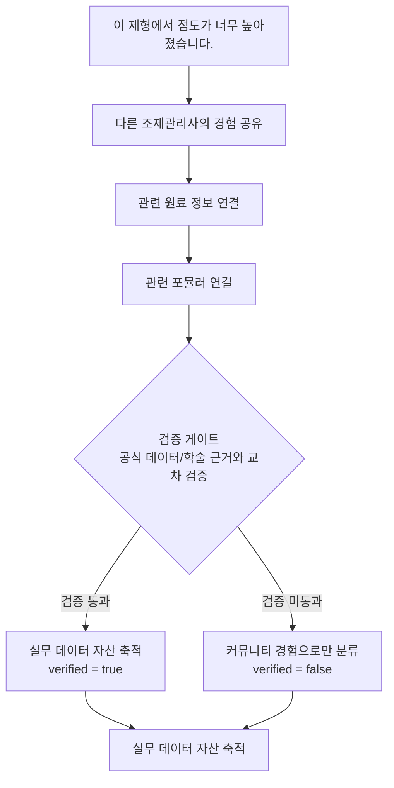

> 시간이 지나면서 Cosmetic Pass Master만의 **실무 데이터 자산**이 됩니다.
> 단, 검증되지 않은 크라우드 데이터는 "참고"로만 분류하고, AI 학습 데이터에서 제외합니다. (§10 참조)

### 9.4 READER_FEEDBACK_DESIGN.md와의 연결

| READER_FEEDBACK_DESIGN | 본 전략 |
|----------------------|---------|
| Phase 3: 댓글·좋아요·질문 | 합격자 커뮤니티의 기반 |
| Phase 4: 커뮤니케이션 창 | 배합 사례 공유, 현장 질문 |
| `qa_threads` | 조제 관련 질문·답변 |
| `study_journals` | 조제 일기 (실무 버전) |

---

## 10. 데이터 Flywheel

### 10.1 구조 (검증 게이트 포함)

> **리뷰 피드백 반영**: 초기에는 AI 학습 Flywheel보다 **Knowledge Flywheel**로 시작합니다.
> 초기에는 AI 학습 데이터가 충분하지 않을 가능성이 높으므로,
> 검증된 데이터 → 검색/추천 품질 향상 → 실무 효율 증가 → 사용자 증가로 시작하고,
> 데이터가 충분히 쌓인 후 AI 모델/RAG 개선을 추가합니다.

**Phase 1: Knowledge Flywheel (초기 MVP)**

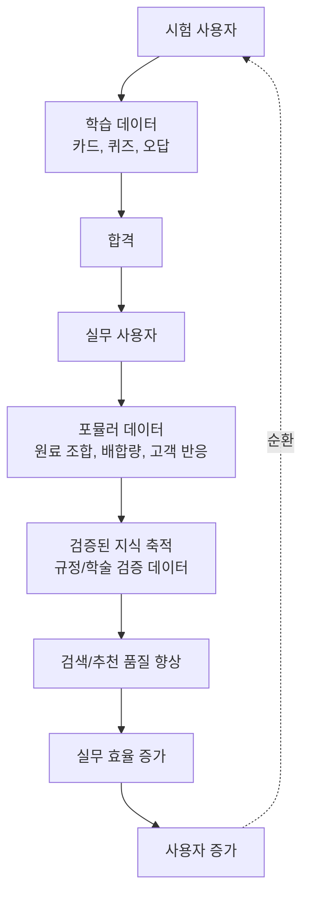

**Phase 2: AI Flywheel (데이터 축적 후)**

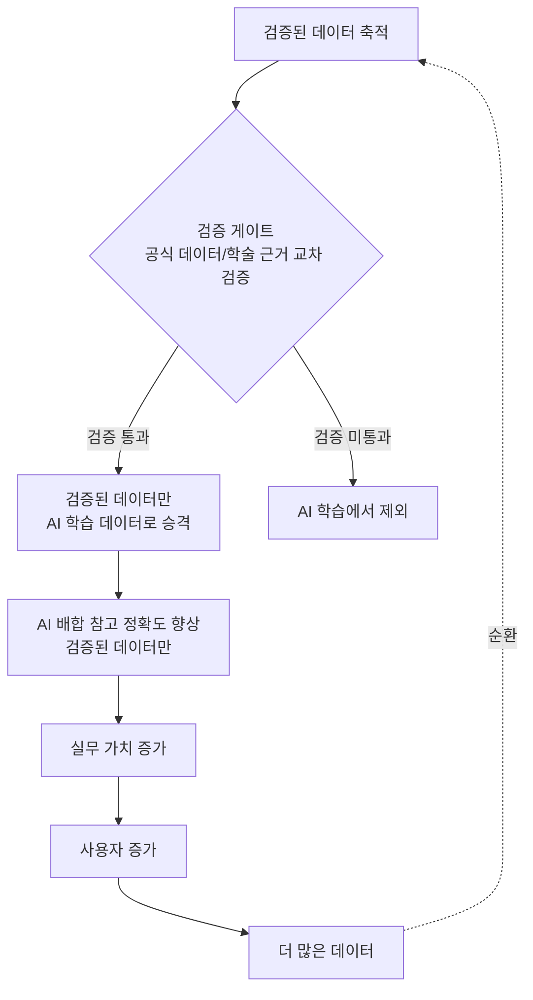

### 10.2 검증 게이트 상세

> **핵심 문제**: 사용자가 만든 포뮬러는 "성공한 배합"이라는 검증이 없습니다.
> 검증 안 된 크라우드 데이터로 AI를 개선하면, 검증 안 된 데이터가 "정확도"로 둔갑합니다.

**해결책**: 모든 크라우드 데이터는 검증 게이트를 통과해야 AI 학습 데이터로 승격됩니다.

| 데이터 유형 | 검증 기준 | 검증 주체 | verified 플래그 |
|-------------|----------|----------|----------------|
| 원료 기본 정보 | 식약처 공식 고시와 일치 | 시스템 (자동) | 자동 true |
| 배합량 한도 | 법령 원문과 일치 | 시스템 (자동) | 자동 true |
| 원료 궁합 | 학술 논문 근거 존재 | 관리자 (수동) | 수동 true/false |
| 배합 패턴 | 3명 이상 동일 패턴 보고 | 관리자 (검토 대기 큐) | **false (신호만)** |
| 개인 경험 | (검증 불가) | — | 항상 false |
| 고객 반응 | (주관적) | — | 항상 false |

> **원칙**: `verified = false`인 데이터는 UI에 "커뮤니티 경험"으로만 표시하고,
> AI 학습 데이터에서 **제외**합니다.
>
> **리뷰 피드백 반영**: "3명 이상 동일 보고 → 자동 verified=true"는 제거했습니다.
> "다수가 그렇게 한다"는 안전성의 근거가 아닙니다 — 3명이 똑같이 틀릴 수 있고,
> 초기 사용자 수가 적을 때 담합·자기강화가 발생할 수 있습니다.
> 자동 승격 경로는 **공식 고시 일치**와 **법령 원문 일치** 두 가지로만 제한합니다.
> "3명 이상 동일 보고"는 관리자 검토 대기 큐에 올리는 **신호**로만 사용합니다.

### 10.3 `ingredient_practice` 테이블 다축 검증 운영

```sql
-- 다축 검증 플래그 운영 규칙 (verified 단일 불리언 → 4축 분리):
-- 1. source = 'official' → regulation_verified = true (자동)
-- 2. source = 'community' → 모든 검증 춸 false (기본값)
-- 3. source = 'community' + 학술 근거 → 관리자 검토 후 scientific_verified = true
-- 4. source = 'community' + 3명+ 동일 보고 → 관리자 검토 대기 큐 신호 (editor_verified = false)
-- 5. source = 'ai' → 모든 검증 춸 false (AI 생성 데이터는 검증 대상)

-- 검증 기준 (자동 승격은 공식/법령 일치 두 가지로만 제한):
-- 1. 공식 고시/법령과 일치 → regulation_verified = true (자동)
-- 2. 학술 논문 근거 존재 → 관리자 검토 후 scientific_verified = true
-- 3. 3명 이상 동일 보고 → 관리자 검토 대기 큐 신호 (editor_verified = false)
-- 4. 개인 경험/주관적 평가 → 모든 검증 춸 false (영구)

-- AI 학습 데이터 필터 (다축):
-- SELECT * FROM ingredient_practice
-- WHERE regulation_verified = true OR scientific_verified = true;
```

### 10.4 Flywheel 단계별 지표

| 단계 | 지표 | 측정 방법 |
|------|------|----------|
| 시험 사용자 증가 | DAU, 등록자 수 | 분석 도구 |
| 학습 데이터 축적 | 카드 암기율, 오답 패턴 | 기존 state.js |
| 합격률 | 합격자 수 / 응시자 수 | 사용자 자가 보고 |
| 실무 전환율 | 실무 모드 진입률 | 모드 전환 이벤트 |
| 포뮬러 데이터 축적 | 포뮬러 수, 원료 조합 다양성 | 포뮬러 라이브러리 |
| 검증 통과율 | verified = true 비율 | ingredient_practice 테이블 |
| AI 정확도 | 배합 참고 채택률, 수정률 | 배합 참고 분석 (검증된 데이터만) |
| 실무 가치 | 월간 활성 사용자, 구독 유지율 | 구독 상태 |
| 사용자 증가 | 추천 수, 신규 가입 | 분석 도구 |

### 10.5 사업적 의의

> 이 구조가 만들어지면 **단순 자격증 문제은행과 완전히 다른 사업**이 됩니다.

| 일반 자격증 플랫폼 | 본 전략 |
|-----------------|---------|
| 합격 후 이탈 | 합격 후 실무 전환 |
| 단일 수익 (시험 구독) | 2단계 수익 (시험 + 실무) |
| 데이터 축적 없음 | 포뮬러 데이터 자산 축적 |
| 네트워크 효과 없음 | 커뮤니티 + Flywheel |
| 경쟁사 전환 용이 | 포뮬러 Lock-in으로 전환 비용 증가 |

---

## 11. Phase 5 — Practice Platform

### 11.1 위치

FEATURE_PROPOSALS.md의 Phase 1~4 위에 **Phase 5**를 추가합니다.

```
Phase 1 — 합격 핵심 엔진 (시험)
Phase 2 — 차별화 (시험)
Phase 3 — 유료화 (시험 + 실무 기반)
Phase 4 — 부가 기능 (시험)
Phase 5 — Practice Platform (실무)  ← 신규
```

### 11.2 Phase 5 기능 목록

| 기능 | 설명 | 시점 | Free/Pro |
|------|------|------|----------|
| 🧴 원료/성분 실무 DB | 원료 상세 페이지 (기본정보, 제형별 적합도, 배합 참고, 궁합, 배합 활용, 관련 규정) | A (콘텐츠 작성) | Free: 기본정보 / Pro: 전체 |
| 🧪 AI 배합 참고 | 고객 요구 → 원료 제안 → 사용자 배합량 입력 → 시스템 검증 | C (Supabase) **+ 법률 검토 후** | Practice Pro |
| ⚖️ 배합량 계산기 | 실무용 배합량 계산 (기존 trainer-calc.js 재사용) | A | Free |
| 📋 포뮬러 작성·저장 | 포뮬러 작성, 저장, 검색 | A (localStorage) / C (동기화) | Free: 5개 / Pro: 무제한 |
| 🔄 포뮬러 버전 관리 | 포뮬러 수정 이력, 버전 비교 | A | Practice Pro |
| 📚 내 포뮬러 라이브러리 | 포뮬러 목록, 검색, 태그, 즐겨찾기 | A / C | Free: 5개 / Pro: 무제한 |
| 🔔 법령·고시 업데이트 | 법령 개정 알림, 포뮬러 영향 분석 | A (감지) / C (푸시) | Practice Pro |
| 👤 고객별 조제 기록 | 고객 정보, 피부 타입, 조제 이력 | A (localStorage) / C (동기화) | Practice Pro |
| 🧠 배합 지식 검색 | 원료, 법령, 포뮬러 통합 검색 (Command Palette 확장) | A | Free |
| 👥 조제관리사 커뮤니티 | 배합 사례, 조제 경험 공유 (READER_FEEDBACK_DESIGN Phase 3~4 연동) | C (Supabase) | Practice Pro |

### 11.3 기존 기능과의 관계

| 기존 기능 (시험) | Phase 5 확장 (실무) | 재사용 모듈 |
|----------------|---------------------|------------|
| 성분 검색 사전 (`dictionary.js`) | 원료 실무 DB | `dictionary.js` 확장 |
| 배합 계산 연습 (`trainer-calc.js`) | 실무 배합량 계산기 | `trainer-calc.js` 재사용 |
| 원료 안전성 챌린지 (`trainer.js`) | 원료 안전성 실무 참고 | 원료 데이터 재사용 |
| 참조자료 뷰어 (`html-viewer.js`) | 법령 원문 실무 참고 | `html-viewer.js` 재사용 |
| 교재 리더 (`textbook-reader.js`) | 배합 관련 지식 검색 | 검색 인덱스 재사용 |
| 키워드 인덱스 (`keyword-index.js`) | 원료 ↔ 법령 교차 참조 | `GLOSSARY_INDEX` 확장 |
| 독자 피드백 (`READER_FEEDBACK_DESIGN`) | 합격자 커뮤니티 | Phase 3~4 연동 |

### 11.4 구현 우선순위 (리뷰 피드백 반영 — MVP 극소화)

> **리뷰 피드백 반영**: Phase 5를 전부 개발하지 말고 **극도로 줄인 Phase 5-A**를 먼저 출시합니다.
> 가장 중요한 지표: **"사용자가 한 달 후에도 다시 포뮬러를 만들러 오는가?"**
> 이 검증 없이 5-B/C/D를 개발하면 매몰 비용 위험이 큽니다.

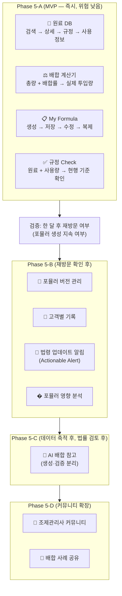

| Phase | 기능 | 시점 | 검증 게이트 |
|-------|------|------|------------|
| **5-A** | 원료 DB + 계산기 + My Formula + 규정 Check | 즉시 | 한 달 후 재방문 여부 |
| **5-B** | 버전 관리 + 고객 기록 + 법령 알림 + 영향 분석 | 5-A 검증 후 | — |
| **5-C** | AI 배합 참고 | 데이터 축적 후 + 법률 검토 후 | 법률 검토 완료 |
| **5-D** | 커뮤니티 + 배합 사례 공유 | 5-C 안정화 후 | DAU 50+ |

> **핵심 원칙**: AI 생성은 가장 나중에, 가장 조심스럽게.
> 5-A(원료 DB + 배합량 계산기 + 포뮬러 저장 + 규정 Check)를 먼저 내서
> 실무 사용자가 실제로 머무는지부터 검증합니다.

---

## 12. 기술 아키텍처 영향

### 12.1 현재 아키텍처에서의 변경점

| 영역 | 현재 | Phase 5 확장 | 시점 |
|------|------|-------------|------|
| 데이터 저장 | localStorage only | localStorage + Supabase (포뮬러, 고객) | C |
| 인증 | 없음 | Supabase Auth (실무 모드는 계정 필요) | C |
| 콘텐츠 | 시험용 MD/번들 | 시험용 + 실무용 (원료 DB 확장) | A |
| 검색 | 교재 검색 | 교재 + 원료 + 포뮬러 통합 검색 | A |
| Service Worker | 시험 콘텐츠 캐시 | 실무 콘텐츠도 캐시 | A |
| CSP | `script-src 'self'` | Supabase SDK `connect-src` 추가 | C |

### 12.2 데이터 모델 (Supabase)

```sql
-- 포뮬러 (처방이 아닌 배합 결과물)
CREATE TABLE formulas (
    id UUID PRIMARY KEY DEFAULT gen_random_uuid(),
    user_id UUID REFERENCES auth.users(id),
    name TEXT NOT NULL,
    version INT DEFAULT 1,
    parent_version INT,
    status TEXT DEFAULT 'draft' CHECK (status IN ('draft', 'final', 'archived')),
    -- ingredients의 limit/limitSource는 "작성 당시 한도 스냅샷" (아래 설계 원칙 참조)
    ingredients JSONB NOT NULL, -- [{ name, inci, concentration, unit, limit, limitSource, withinLimit }]
    total_volume NUMERIC,
    total_unit TEXT,
    customer_id UUID,
    notes TEXT,
    rating NUMERIC CHECK (rating >= 0 AND rating <= 5),
    created_at TIMESTAMPTZ DEFAULT NOW(),
    updated_at TIMESTAMPTZ DEFAULT NOW()
);

-- 고객 (개인정보 최소수집 — 리뷰 피드백 반영)
-- 초기 MVP에서는 name 대신 customer_code 사용.
-- 실제 이름/연락처가 필요한 단계가 오면 별도 개인정보 영역으로 분리.
CREATE TABLE customers (
    id UUID PRIMARY KEY DEFAULT gen_random_uuid(),
    user_id UUID REFERENCES auth.users(id),
    customer_code TEXT NOT NULL, -- "CUST-001", "CUST-002" (name 대신)
    skin_type TEXT,
    concerns TEXT[],
    notes TEXT,
    -- 개인정보 분리 영역 (필요 시 별도 테이블로 이관):
    -- real_name TEXT,  -- 초기 MVP에서는 수집하지 않음
    -- contact TEXT,    -- 초기 MVP에서는 수집하지 않음
    created_at TIMESTAMPTZ DEFAULT NOW()
);

-- 원료 실무 정보 (관계형 분리 — 리뷰 피드백 반영)
-- 단일 TEXT/TEXT[] 대신 제형별 사용량, 궁합, 규정을 관계형 테이블로 분리.
CREATE TABLE ingredients (
    id UUID PRIMARY KEY DEFAULT gen_random_uuid(),
    name TEXT NOT NULL,
    inci_name TEXT,
    type TEXT, -- 보습제, 방부제, 등
    function TEXT,
    source TEXT, -- 'official' | 'community' | 'ai'
    regulation_verified BOOLEAN DEFAULT FALSE,
    scientific_verified BOOLEAN DEFAULT FALSE,
    editor_verified BOOLEAN DEFAULT FALSE,
    community_evidence_count INT DEFAULT 0,
    verified_by TEXT,
    verified_at TIMESTAMPTZ,
    verification_basis TEXT,
    created_at TIMESTAMPTZ DEFAULT NOW()
);

-- 제형별 사용량 (히알루론산: 토너 0.1~0.5, 세럼 0.5~2.0, 크림 0.1~1.0)
CREATE TABLE ingredient_usage (
    id UUID PRIMARY KEY DEFAULT gen_random_uuid(),
    ingredient_id UUID REFERENCES ingredients(id) ON DELETE CASCADE,
    form_type TEXT NOT NULL, -- toner, serum, cream, etc.
    min_range NUMERIC,
    max_range NUMERIC,
    unit TEXT DEFAULT '%',
    source TEXT,
    scientific_verified BOOLEAN DEFAULT FALSE
);

-- 원료 궁합 (관계형)
CREATE TABLE ingredient_compatibility (
    id UUID PRIMARY KEY DEFAULT gen_random_uuid(),
    ingredient_id_a UUID REFERENCES ingredients(id) ON DELETE CASCADE,
    ingredient_id_b UUID REFERENCES ingredients(id) ON DELETE CASCADE,
    compatibility TEXT CHECK (compatibility IN ('good', 'caution', 'avoid')),
    note TEXT,
    source TEXT,
    scientific_verified BOOLEAN DEFAULT FALSE
);

-- 규정 한도 (별도 진실 원천 — §12.4 limit 스냅샷과 연동)
CREATE TABLE regulation_limits (
    id UUID PRIMARY KEY DEFAULT gen_random_uuid(),
    ingredient_id UUID REFERENCES ingredients(id) ON DELETE CASCADE,
    regulation_name TEXT NOT NULL, -- "별표 2", "식약처 고시 제2024-xx호"
    current_limit NUMERIC,
    unit TEXT DEFAULT '%',
    effective_date DATE,
    source TEXT DEFAULT 'official',
    regulation_verified BOOLEAN DEFAULT TRUE
);

-- 법령 업데이트 이력
CREATE TABLE regulation_updates (
    id UUID PRIMARY KEY DEFAULT gen_random_uuid(),
    title TEXT NOT NULL,
    description TEXT,
    affected_ingredients TEXT[],
    affected_formulas JSONB, -- 영향받는 포뮬러 ID 목록
    effective_date DATE,
    created_at TIMESTAMPTZ DEFAULT NOW()
);
```

### 12.3 RLS 정책

| 테이블 | 조회 | 작성 | 수정/삭제 |
|--------|------|------|-----------|
| `formulas` | 본인만 | 본인만 | 본인만 |
| `customers` | 본인만 | 본인만 | 본인만 |
| `ingredients` | 전체 (인증 사용자) | Practice Pro | 관리자 + 작성자 |
| `ingredient_usage` | 전체 (인증 사용자) | Practice Pro | 관리자 + 작성자 |
| `ingredient_compatibility` | 전체 (인증 사용자) | Practice Pro | 관리자 + 작성자 |
| `regulation_limits` | 전체 (인증 사용자) | 관리자만 | 관리자만 |
| `regulation_updates` | 전체 (인증 사용자) | 관리자만 | 관리자만 |

### 12.4 `formulas.ingredients` limit 스냅샷 설계 원칙

> **리뷰 피드백 반영**: `ingredients` JSONB에 `limit`, `limitSource`, `withinLimit`를 저장하면
> 법령 개정 시 한도가 바뀌어도 저장된 포뮬러는 옛날 한도를 들고 있습니다.
> 이는 §7.3 "법령 개정 시 기존 포뮬러 영향 분석"과 충돌합니다.

**설계 원칙**:

1. **`limit`은 "작성 당시 한도 스냅샷"** — 포뮬러 작성 시점의 공식 고시 한도를 기록
2. **진실 원천(source of truth)은 현행 고시 테이블** — `ingredient_practice` 또는 별도 `regulation_limits` 테이블
3. **영향 분석은 항상 현행 고시와 재대조** — §7.3의 영향 분석은 스냅샷이 아닌 현행 한도로 재계산
4. **UI 표시**: 포뮬러 조회 시 "작성 당시 한도: 2.0%" + "현행 한도: 1.5%" 두 값을 모두 표시

```sql
-- 영향 분석 쿼리 예시 (스냅샷이 아닌 현행 한도로 재대조):
-- SELECT f.id, f.name, i.name, i.concentration,
--        i.limit AS snapshot_limit,        -- 작성 당시 한도
--        r.current_limit AS current_limit,  -- 현행 고시 한도
--        (i.concentration > r.current_limit) AS exceeds_current
-- FROM formulas f, jsonb_array_elements(f.ingredients) AS i,
--      regulation_limits r
-- WHERE r.ingredient_name = i->>'name'
--   AND (i->>'concentration')::numeric > r.current_limit;
```

---

## 13. 리스크 및 완화책

### 13.1 리스크 매트릭스

| 리스크 | 심각도 | 영향 | 완화책 |
|--------|--------|------|--------|
| **AI 배합 참고 법적/안전 리스크** | 🔴🔴🔴 | AI 생성 배합 → 피부 문제 → 법적 책임 | **생성·검증 분리**: AI는 원료 제안만, 배합량은 사용자 입력, 시스템은 공식 고시로 검증만. **법률 검토 필수** (화장품법·약사법 전문 변호사, 사업 개시 전) |
| **검증 안 된 크라우드 데이터로 AI 학습** | 🔴🔴 | 검증 안 된 데이터가 "정확도"로 둔갑 | **검증 게이트**: verified = true인 데이터만 AI 학습 데이터로 사용. verified 기준 명확화 (§10.2) |
| **"처방" 용어 법적 리스크** | 🔴🔴 | 의료법·약사법상 "처방" 용어 사용 | **용어 전면 교체**: "배합"/"포뮬러"/"레시피"로 통일. DB 스키마도 `formulas` 테이블 사용 |
| **Free 한도가 너무 넓어 전환 동기 약함** | 🟡🟡 | "무료로도 합격되는데 돈 낼 이유가?" | **Free 한도 조정**: AI 추천을 Pass Pro로 이동, 플래시카드 1과목만. "답답하지만 합격은 가능" 지점 설정 |
| **실무 데이터 부족** | 🟡 | 초기 원료 DB 빈약 | 기존 시험 데이터 재사용 + 점진적 크라우드소싱 (검증 게이트 포함) |
| **합격자 실무 전환율 저조** | 🟡 | LTV 증가 미달 | 1개월 무료 체험, 기존 가격 유지 혜택, 실무 모드 진입장벽 낮춤 (합격 여부 불문) |
| **법령 업데이트 지연** | 🟡 | 실무 신뢰성 저하 | 정기적 법령 모니터링, 커뮤니티 제보 활용 |
| **커뮤니티 품질 관리** | 🟡 | 스팸, 잘못된 정보 | 관리자 승인 워크플로우, 신고 시스템, 검증 게이트 |
| **Supabase 비용 증가** | 🟢 | 운영비 증가 | 포뮬러 데이터 압축, 비활성 사용자 아카이브 |

### 13.2 법률 검토 체크리스트 (사업 개시 전 필수)

> **AI 배합 참고 기능은 법률 검토 완료 전까지 착수하지 않습니다.**

| 검토 항목 | 검토 내용 | 검토 주체 |
|----------|----------|----------|
| 화장품법 | AI 배합 참고의 법적 위치, 책임 소재 | 화장품법 전문 변호사 |
| 약사법 | "배합/포뮬러" 용어가 약사법·화장품법상 안전한지 확인, 의료 행위 해당 여부 | 약사법 전문 변호사 |
| 제품책임법 | AI 제안 원료로 인한 피부 문제 시 책임 | 제품책임법 전문 변호사 |
| 개인정보보호법 | 고객 정보(피부 타입, concerns) 수집·저장 | 개인정보보호 전문 변호사 |
| 전자상거래법 | 구독 모델, 무료 체험, 자동 결제 | 전자상거래법 전문 변호사 |

### 13.3 구현 순서 (리뷰 피드백 반영 — MVP 극소화)

> §11.4의 Phase 5-A/B/C/D 구현 우선순위를 참조하세요.

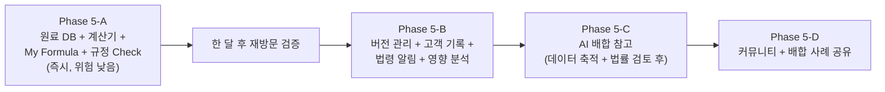

> **핵심 원칙**: AI 생성은 가장 나중에, 가장 조심스럽게.
> Phase 5-A(원료 DB + 배합량 계산기 + 포뮬러 저장 + 규정 Check)를 먼저 내서
> 실무 사용자가 실제로 머무는지부터 검증합니다.
> **"사용자가 한 달 후에도 다시 포뮬러를 만들러 오는가?"**가 1차 검증 기준입니다.

---

## 📎 관련 문서

- [FEATURE_PROPOSALS.md](FEATURE_PROPOSALS.md) — 추천 기능 제안 (Phase 1~4, 본 문서가 Phase 5에 해당)
- [PASS_CORE_LOOP_REVIEW.md](PASS_CORE_LOOP_REVIEW.md) — 합격 핵심 루프 코드 반영도 리뷰
- [SUBSCRIPTION_ROADMAP.md](SUBSCRIPTION_ROADMAP.md) — 구독 서비스 전환 로드맵 (본 전략이 2단계 LTV 모델로 확장)
- [READER_FEEDBACK_DESIGN.md](READER_FEEDBACK_DESIGN.md) — 독자 피드백 공유 기능 설계 (Phase 3~4 커뮤니티 연동)
- [SPEC.md](SPEC.md) — 기존 요구사양 명세서
- [ARCHITECTURE.md](ARCHITECTURE.md) — 시스템 아키텍처
