# 🧠 Cosmetic Pass Master — 프로젝트 마인드맵

> **최종 업데이트**: 2026-08-26
> **목적**: 프로젝트 전체 구조를 마인드맵 다이어그램으로 시각화하여 한눈에 파악

---

## 📋 마인드맵 (Mermaid Flowchart)

> VS Code Markdown Preview (`Ctrl+Shift+V`) 및 GitHub에서 렌더링됩니다.
> `mindmap` 타입은 VS Code Preview에서 불안정하여 `graph LR` 플로우차트로 대체했습니다.

```mermaid
graph LR
  ROOT["🧠 Cosmetic Pass Master"]

  %% 설계 철학
  ROOT --> P1["설계 철학"]
  P1 --> P1A["Zero-Backend<br/>서버리스 · localStorage"]
  P1 --> P1B["Vanilla First<br/>프레임워크 제로"]
  P1 --> P1C["Offline PWA<br/>SW 캐싱 · 설치 가능"]
  P1 --> P1D["Mobile-First<br/>사이드바/하단탭"]

  %% 아키텍처 계층
  ROOT --> P2["아키텍처 계층"]
  P2 --> P2A["Presentation<br/>index.html · CSS 7개"]
  P2 --> P2B["Application<br/>app.js · charts · state"]
  P2 --> P2C["Views<br/>dashboard · quiz · trainer"]
  P2 --> P2D["Data<br/>registry · content/*.md"]
  P2 --> P2E["Persistence<br/>localStorage · CacheStorage"]

  %% 콘텐츠
  ROOT --> P3["콘텐츠 구조"]
  P3 --> P3A["4과목 1,178카드<br/>law · manufacturing<br/>safety · understanding"]
  P3 --> P3B["9시험 897문제<br/>subject1~4 파트별"]
  P3 --> P3C["성분사전 1,357개"]
  P3 --> P3D["오디오북 45챕터"]
  P3 --> P3E["추천 리소스"]

  %% 빌드
  ROOT --> P4["빌드 파이프라인"]
  P4 --> P4A["tools/build/index.js<br/>매니페스트 → registry.js"]
  P4 --> P4B["plugins<br/>textbook · exams · ingredients"]
  P4 --> P4C["검증<br/>parser_parity · shell_assets"]

  %% PWA
  ROOT --> P5["PWA & SW"]
  P5 --> P5A["캐시 8단계<br/>Nav CF · 데이터 CF<br/>src JS CF · CSS CF"]
  P5 --> P5B["프리캐시<br/>Shell · 폰트 · FA"]
  P5 --> P5C["버전 자동 치환<br/>git short hash"]

  %% 보안
  ROOT --> P6["보안"]
  P6 --> P6A["CSP<br/>script-src self"]
  P6 --> P6B["XSS 방어<br/>sanitize · escapeHTML"]
  P6 --> P6C["인라인 핸들러 제거<br/>addEventListener"]

  %% 테스트
  ROOT --> P7["테스트"]
  P7 --> P7A["Unit 86개<br/>node --test"]
  P7 --> P7B["DOM<br/>vitest + jsdom"]
  P7 --> P7C["CI/CD<br/>GitHub Actions → Vercel"]

  %% 주요 기능
  ROOT --> P8["주요 기능"]
  P8 --> P8A["학습 도구<br/>플래시카드 · 퀴즈<br/>데일리 챌린지 · 오답"]
  P8 --> P8B["모의고사<br/>OMR · 통합 · 복습"]
  P8 --> P8C["스마트 훈련<br/>계산 4타입"]
  P8 --> P8D["교재<br/>검색 · 리더 · 오디오북"]
  P8 --> P8E["부가<br/>성분사전 · 뽀모도로<br/>백업 · 테마 · 매뉴얼"]

  %% 스타일
  classDef root fill:#58a6ff,stroke:#1f6feb,color:#fff,font-weight:bold
  classDef branch fill:#161b22,stroke:#30363d,color:#c9d1d9
  classDef leaf fill:#0d1117,stroke:#30363d,color:#8b949e,font-size:12px
  class ROOT root
  class P1,P2,P3,P4,P5,P6,P7,P8 branch
  class P1A,P1B,P1C,P1D,P2A,P2B,P2C,P2D,P2E,P3A,P3B,P3C,P3D,P3E,P4A,P4B,P4C,P5A,P5B,P5C,P6A,P6B,P6C,P7A,P7B,P7C,P8A,P8B,P8C,P8D,P8E leaf
```



---

## 📋 텍스트 트리 (Mermaid 미지원 환경용)

```
Cosmetic Pass Master
├── 🎯 설계 철학
│   ├── Zero-Backend (서버리스)
│   │   ├── localStorage 기반 진행상황
│   │   └── Vercel 무료 정적 호스팅
│   ├── Vanilla First (프레임워크 제로)
│   │   ├── 순수 HTML/CSS/JS
│   │   └── 외부 런타임 라이브러리 최소화
│   ├── Offline-Capable PWA
│   │   ├── Service Worker 캐싱
│   │   └── 홈화면 설치 가능
│   └── Mobile-First 반응형
│       ├── 데스크톱 사이드바 / 모바일 하단탭
│       └── safe-area + 동적 뷰포트
│
├── 🏗️ 아키텍처 계층
│   ├── Presentation Layer
│   │   ├── index.html (SPA App Shell)
│   │   ├── style.css + css/ (6개 분할)
│   │   └── manifest.webmanifest
│   ├── Application Layer (src/)
│   │   ├── app.js — 메인 오케스트레이터 (1,384줄)
│   │   ├── charts.js — SVG 차트 (인터랙티브 툴팁)
│   │   ├── state.js — 전역 상태 + localStorage 영속성
│   │   ├── data-loader.js — 온디맨드 데이터 로더
│   │   ├── textbook-parser.js — 교재 MD 런타임 파서
│   │   ├── markdown-parser.js — 공통 MD → HTML 변환
│   │   ├── exam-viewer.js — 문제집 뷰어
│   │   ├── manual-viewer.js — 매뉴얼 뷰어
│   │   ├── sanitize.js — XSS 방어
│   │   ├── sha256.js — 안정 ID 생성
│   │   ├── trainer-calc.js — 계산 문제 생성기
│   │   ├── scratchpad.js — Canvas 손글씨
│   │   ├── types.js — JSDoc 타입 선언
│   │   ├── utils.js — 한글 초성 추출 등
│   │   ├── ui-utils.js — 로딩 UI
│   │   ├── theme-init.js — 테마 초기화
│   │   ├── pwa-install-capture.js — PWA 설치
│   │   └── app-fallback.js — ESM 로드 실패 복구
│   ├── Views Layer (src/views/)
│   │   ├── dashboard.js — 대시보드 + 통계
│   │   ├── flashcard.js — 플래시카드
│   │   ├── quiz.js — 퀴즈 + 데일리 챌린지
│   │   ├── trainer.js — 스마트 훈련소
│   │   ├── exam-simulator.js — 모의고사 OMR
│   │   ├── dictionary.js — 성분 사전
│   │   ├── textbook-search.js — 교재 검색
│   │   ├── textbook-reader.js — 교재 리더 (Media Session)
│   │   ├── backup.js — 데이터 백업/복원
│   │   └── navigation.js — 뷰 전환 유틸
│   ├── Data Layer
│   │   ├── data/registry.js — 빌드 생성 메타 번들
│   │   ├── content/*.md — SSOT 원본 (과목/시험/성분/추천)
│   │   ├── data/exams/*.hash.js — 시험 문항 번들 (9개)
│   │   ├── data/ingredients_data.*.js — 성분 사전 (1,357개)
│   │   ├── data/study_md/ — file:// 폴백 번들
│   │   ├── data/id_migration.js — 레거시 ID 매핑
│   │   └── data/audio_manifest.js — 오디오 메타
│   └── Persistence Layer
│       ├── localStorage — 학습 진행·설정
│       └── Cache Storage — SW 캐시
│
├── 📚 콘텐츠 구조
│   ├── 4과목 (1,178 카드 + 11 퀴즈)
│   │   ├── 화장품법의 이해 (law) — 131카드
│   │   ├── 화장품 제조 및 품질관리 (manufacturing) — 487카드
│   │   ├── 유통화장품 안전관리 (safety) — 195카드
│   │   └── 맞춤형화장품의 이해 (understanding) — 365카드
│   ├── 9시험 (897문제)
│   │   ├── subject1 (100문제)
│   │   ├── subject2_p1/p2/p3 (298문제)
│   │   ├── subject3_p1/p2 (200문제)
│   │   └── subject4_p1/p2/p3 (299문제)
│   ├── 성분 사전 — 1,357개 원료
│   ├── 오디오북 — 45개 챕터 MP3 (외부 CDN)
│   └── 추천 리소스 — 유튜브 채널 + 공식 링크
│
├── 🔧 빌드 파이프라인
│   ├── tools/build/index.js — 메인 빌드
│   ├── tools/build/plugins/
│   │   ├── textbook.plugin.js
│   │   ├── exams.plugin.js
│   │   └── ingredients.plugin.js
│   ├── tools/build/stamp-sw-version.js — SW 버전 자동 치환
│   ├── tools/build/manifest-loader.js
│   ├── tools/build/id-factory.js — 안정 ID 생성
│   ├── tools/build/schema.js — 매니페스트 검증
│   ├── tools/check_parser_parity.js — 빌드/런타임 파서 일치 검증
│   └── tools/verify-shell-assets.js — SW 자산 검증
│
├── 📡 PWA & Service Worker
│   ├── 캐시 전략 (8단계 분기)
│   │   ├── 1. Navigation (HTML) → Cache First
│   │   ├── 2. 데이터 번들 → Cache First
│   │   ├── 3. 외부 CDN → Stale-While-Revalidate
│   │   ├── 4. MP3 오디오 → 네트워크 바이패스
│   │   ├── 5. /src/*.js → Cache First
│   │   ├── 6. CSS → Cache First
│   │   ├── 7. 그 외 JS → Network First
│   │   └── 8. App Shell (아이콘/이미지) → SWR
│   ├── 프리캐시 자산
│   │   ├── App Shell (HTML/CSS/JS)
│   │   ├── 웹폰트 자체 호스팅 (Noto Sans KR + Outfit)
│   │   └── FontAwesome 자체 호스팅
│   └── 캐시 버전 — 빌드타임 자동 치환 (git short hash)
│
├── 🔒 보안
│   ├── CSP (Content Security Policy)
│   │   ├── script-src 'self'
│   │   ├── style-src 'self' 'unsafe-inline'
│   │   ├── object-src 'none'
│   │   └── frame-ancestors 'none'
│   ├── XSS 방어
│   │   ├── sanitize.js (escapeHTML)
│   │   └── markdown-parser (자동 HTML 이스케이프)
│   └── 인라인 핸들러 제거
│       ├── onchange → addEventListener (CSP fix)
│       └── data-click 속성 기반 이벤트 위임
│
├── 🧪 테스트
│   ├── Unit Tests (86개) — node --test
│   │   ├── stableId (7), shortHash (7)
│   │   ├── escapeHTML (5), safeTextWithBreaks (3)
│   │   ├── sha256hex (7)
│   │   ├── loadProgress (6), saveProgress (3)
│   │   ├── cleanOrphans (4)
│   │   ├── parseMarkdownFile (10), parseTextbookContent (5)
│   │   ├── buildSubjectData (6), buildCalcQuestion (7)
│   │   └── getChosung (7)
│   ├── DOM Tests — vitest + jsdom
│   └── CI/CD — GitHub Actions → Vercel
│
└── ✨ 주요 기능
    ├── 학습 도구
    │   ├── 플래시카드 암기 (외움/헷갈림)
    │   ├── 빈칸 채우기 기출 퀴즈
    │   ├── 데일리 챌린지 (4문제/일일)
    │   └── 오답 노트 자동 수집
    ├── 모의고사
    │   ├── OMR 시뮬레이터
    │   ├── 과목별 / 통합 모의고사
    │   ├── 오답 복습 연동
    │   └── 성적 차트 (레이더/꺾은선)
    ├── 스마트 훈련소
    │   ├── 계산 문제 (4타입)
    │   ├── 한도 내 최대 추가량
    │   ├── 배합량 계산
    │   └── 희석 농도 계산
    ├── 교재
    │   ├── 교재 검색 (초성/키워드)
    │   ├── 교재 리더 (MD → HTML)
    │   ├── 오디오북 재생 (Media Session API)
    │   └── 핵심 단권화 요약집
    └── 부가 기능
        ├── 성분 사전 (1,357개)
        ├── 뽀모도로 타이머
        ├── 학습 통계 차트 (SVG)
        ├── 데이터 백업/복원 (JSON)
        ├── 라이트/다크 테마
        └── 사용자 매뉴얼
```

---

## 📎 관련 문서

- [`ARCHITECTURE.md`](ARCHITECTURE.md) — 상세 아키텍처 설계 문서
- [`CHANGES.md`](CHANGES.md) — 변경 이력 (Changelog)
- [`IMPROVEMENTS_REPORT.md`](IMPROVEMENTS_REPORT.md) — 개선점 분석 및 구현 보고서
- [`README.md`](../../README.md) — 프로젝트 소개 및 시작 가이드
