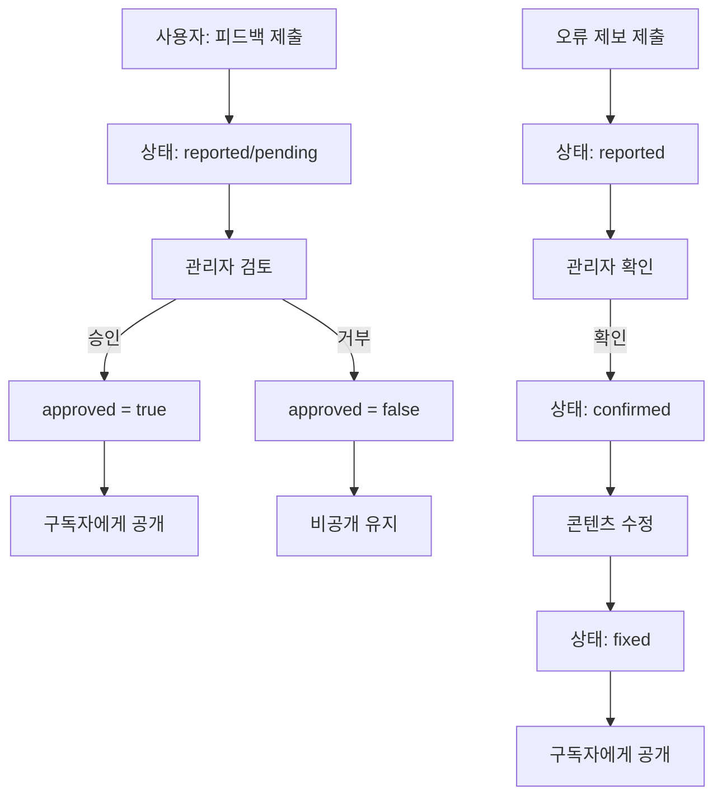
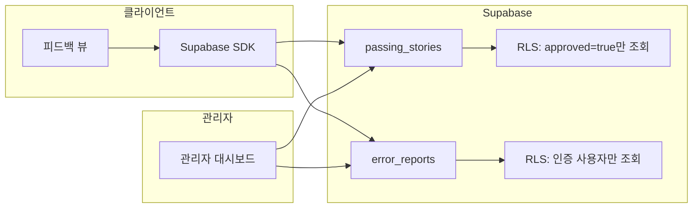
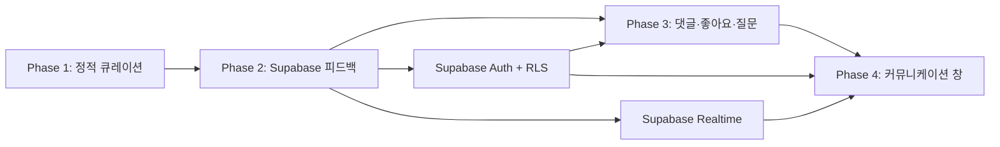

# 💬 독자 피드백 공유 기능 설계 제안

> **작성일**: 2026-09-11
> **목적**: 사용중인 고객(학습자)의 피드백을 큐레이션하여 구독중인 독자(Pro)에게 공유하는 기능 설계
> **관련 문서**: [SUBSCRIPTION_ROADMAP.md](SUBSCRIPTION_ROADMAP.md), [ARCHITECTURE.md](ARCHITECTURE.md)

---

## 📋 목차

1. [개요](#1-개요)
2. [데이터 모델](#2-데이터-모델)
3. [Phase 1 구현 (정적 큐레이션)](#3-phase-1-구현-정적-큐레이션)
4. [Phase 2 구현 (Supabase 연동)](#4-phase-2-구현-supabase-연동)
5. [기존 아키텍처와의 정합성](#5-기존-아키텍처와의-정합성)
6. [마이그레이션 경로 (Phase 1 → 2)](#6-마이그레이션-경로-phase-1--2)
7. [검증 체크리스트](#7-검증-체크리스트)
8. [리스크 및 완화책](#8-리스크-및-완화책)
9. [향후 확장 후보](#9-향후-확장-후보)
10. [구독자 커뮤니케이션 창 (향후 확장 방향)](#10-구독자-커뮤니케이션-창-향후-확장-방향)

---

## 1. 개요

### 1.1 목표

```
사용중인 고객(학습자) ──피드백 제출──▶ 큐레이션 ──공유──▶ 구독중인 독자(Pro)
```

- **합격 수기 · 학습 팁**: 시험 합격자의 학습 방법, 공부 시간, 요령을 Pro 구독자에게 공개
- **콘텐츠 오류 제보**: 교재/문제은행의 오탈자, 내용 오류 제보를 큐레이션 후 구독자에게 공개

> **향후 비전**: Phase 1~2의 단방향 피드백 공유를 기반으로,
> Phase 3~4에서 구독자 간 실시간 정보소통 창(커뮤니티)으로 확장 예정 (§10 참고).

### 1.2 두 단계 구현 전략

| 항목 | Phase 1 (현재) | Phase 2 (구독 전환 후) |
|------|----------------|----------------------|
| 수집 | Markdown 파일 수동 관리 | 앱 내 제출 폼 → Supabase 저장 |
| 큐레이션 | 개발자가 직접 Markdown 편집 | 관리자 대시보드 승인/거부 |
| 저장 | `content/피드백/*.md` | Supabase `passing_stories`, `error_reports` 테이블 |
| 표시 | 정적 렌더링 | 실시간 fetch + 캐시 |
| 접근 | 전체 공개 | Pro 구독자 전체, 무료는 미리보기 3건 |
| 백엔드 | 불필요 (Zero-Backend 유지) | Supabase (Auth + RLS) |

### 1.3 표시 위치

- **전용 페이지**: 사이드바에 "독자 피드백" 메뉴 추가, 독립 뷰(`feedback-view`) 생성
- 탭으로 "합격 수기" / "오류 제보" 전환

---

## 2. 데이터 모델

### 2.1 합격 수기 (`passing_stories`)

```json
{
  "id": "ps_001",
  "author": "익명",
  "examYear": 2026,
  "examMonth": 8,
  "score": 82,
  "studyPeriod": "3개월",
  "subject": "law",
  "summary": "1과목 법령은 암기보다 흐름 이해가 중요합니다...",
  "tips": ["매일 30분 카드 학습", "모의고사 2회차부터 효과"],
  "approved": true,
  "submittedAt": "2026-08-15"
}
```

| 필드 | 타입 | 설명 |
|------|------|------|
| `id` | string | 고유 식별자 (`ps_001` 형식) |
| `author` | string | 작성자명 (기본 "익명") |
| `examYear` | int | 시험 연도 |
| `examMonth` | int | 시험 회차 (월) |
| `score` | int | 취득 점수 |
| `studyPeriod` | string | 학습 기간 (예: "3개월") |
| `subject` | string | 과목 키 (`law`, `manufacturing`, `safety`, `understanding`) |
| `summary` | string | 합격 수기 본문 |
| `tips` | string[] | 학습 팁 목록 |
| `approved` | boolean | 큐레이션 승인 여부 |
| `submittedAt` | string | 제출 일자 (ISO 8601) |

### 2.2 콘텐츠 오류 제보 (`error_reports`)

```json
{
  "id": "err_001",
  "subject": "manufacturing",
  "chapter": "ch02",
  "location": "2.1절 용어 정의",
  "errorType": "typo",
  "description": "'보습'이 '보습'으로 중복 표기",
  "correction": "'보습' 한 번으로 수정",
  "status": "fixed",
  "submittedAt": "2026-09-01"
}
```

| 필드 | 타입 | 설명 |
|------|------|------|
| `id` | string | 고유 식별자 (`err_001` 형식) |
| `subject` | string | 과목 키 |
| `chapter` | string | 챕터 식별자 (`ch01`, `ch02`, ...) |
| `location` | string | 오류 위치 (절/단락/문제 번호) |
| `errorType` | string | 오류 유형 (`typo`, `content`, `reference`) |
| `description` | string | 오류 설명 |
| `correction` | string | 수정 내용 |
| `status` | string | 처리 상태 (`reported`, `confirmed`, `fixed`) |
| `submittedAt` | string | 제출 일자 (ISO 8601) |

### 2.3 오류 유형 분류

| `errorType` | 설명 | 예시 |
|-------------|------|------|
| `typo` | 오탈자 | "보습" 중복, 띄어쓰기 오류 |
| `content` | 내용 오류 | 법령 조문 번호 불일치, 설명 오류 |
| `reference` | 참조 링크 오류 | 깨진 링크, 잘못된 교차 참조 |

---

## 3. Phase 1 구현 (정적 큐레이션)

### 3.1 파일 구조

```
content/피드백/
  합격수기.md          # 큐레이션된 합격 수기
  오류제보.md          # 확인된 오류 제보 목록
```

### 3.2 합격수기.md 예시

```markdown
---
id: ps_001
author: 익명
examYear: 2026
examMonth: 8
score: 82
studyPeriod: 3개월
subject: law
approved: true
submittedAt: 2026-08-15
---

## 1과목 82점 합격 수기

1과목 법령은 암기보다 법률의 흐름을 이해하는 것이 중요합니다.
각 조문이 왜 만들어졌는지 맥락을 파악하면 암기가 자연스럽게 됩니다.

### 학습 팁
- 매일 30분 카드 학습을 꾸준히
- 모의고사는 2회차부터 효과가 나타남
- 법령 원문을 한 번씩 직접 읽어보기
```

### 3.3 오류제보.md 예시

```markdown
---
id: err_001
subject: manufacturing
chapter: ch02
location: 2.1절 용어 정의
errorType: typo
description: "'보습'이 '보습'으로 중복 표기"
correction: "'보습' 한 번으로 수정"
status: fixed
submittedAt: 2026-09-01
---

## 2과목 2챕터 오탈자

2.1절 용어 정의에서 '보습'이 중복 표기되어 있습니다.
```

### 3.4 프론트엔드 구성

| 파일 | 역할 |
|------|------|
| `src/views/feedback.js` | 피드백 뷰 컨트롤러 (탭 전환, 렌더링) |
| `index.html` | 사이드바 메뉴 + `<section id="feedback-view">` 추가 |
| `css/feedback.css` | 피드백 페이지 전용 스타일 |

### 3.5 사이드바 메뉴 추가

```html
<!-- index.html 사이드바에 추가 -->
<button class="nav-item" data-target="feedback-view">
    <i class="fa-solid fa-comments"></i> 독자 피드백
</button>
```

### 3.6 뷰 구조 (Wireframe)

```
┌─────────────────────────────────────────────┐
│  💬 독자 피드백                                │
│  ┌─────────────┐ ┌─────────────┐             │
│  │ 합격 수기   │ │ 오류 제보    │ (탭)       │
│  └─────────────┘ └─────────────┘             │
│                                              │
│  [탭 1: 합격 수기 목록]                       │
│  ┌──────────────────────────────────────┐   │
│  │ 🏆 익명 · 2026년 8회 · 82점            │   │
│  │ 학습기간: 3개월 · 1과목                │   │
│  │ "1과목 법령은 암기보다 흐름..."        │   │
│  │ 💡 매일 30분 카드 학습                 │   │
│  └──────────────────────────────────────┘   │
│  ┌──────────────────────────────────────┐   │
│  │ 🏆 ...                                │   │
│  └──────────────────────────────────────┘   │
│                                              │
│  [탭 2: 오류 제보 목록]                       │
│  ┌──────────────────────────────────────┐   │
│  │ ✅ [수정됨] 2과목 2챕터                │   │
│  │ 오탈자: '보습' 중복 표기              │   │
│  └──────────────────────────────────────┘   │
└─────────────────────────────────────────────┘
```

### 3.7 데이터 로드

기존 `DataLoader` 패턴 재사용:

```javascript
// src/views/feedback.js
import { esc } from '../sanitize.js';
import { switchView } from './navigation.js';

let _feedbackData = null;

export async function renderFeedback() {
    const container = document.getElementById('feedback-list');
    if (!container) return;

    if (!_feedbackData) {
        _feedbackData = await _loadFeedbackData();
    }

    _renderPassingStories(_feedbackData.stories);
    _renderErrorReports(_feedbackData.errors);
}

async function _loadFeedbackData() {
    // Phase 1: 빌드 생성 번들에서 로드
    // Phase 2: Supabase fetch로 교체
    const res = await fetch('/data/feedback.js');
    // ...
}
```

### 3.8 빌드 파이프라인

빌드 스크립트에 `content/피드백/*.md`를 추가하여 `data/feedback.js` 번들 생성:

```
content/피드백/*.md → tools/build/ → data/feedback.js
```

- frontmatter 파싱 → JSON 객체 변환
- 본문 Markdown → HTML 변환
- `data/feedback.js`에 번들화

### 3.9 Service Worker 캐시

`sw.js`의 `DATA_CACHE`에 `content/피드백/*.md` 및 `data/feedback.js` 추가:

```javascript
// sw.js DATA_CACHE 패턴에 추가
'/data/feedback.js',
```

---

## 4. Phase 2 구현 (Supabase 연동)

### 4.1 Supabase 스키마

```sql
-- 합격 수기
CREATE TABLE passing_stories (
    id UUID PRIMARY KEY DEFAULT gen_random_uuid(),
    user_id UUID REFERENCES auth.users(id),
    author TEXT DEFAULT '익명',
    exam_year INT,
    exam_month INT,
    score INT,
    study_period TEXT,
    subject TEXT,
    summary TEXT NOT NULL,
    tips JSONB DEFAULT '[]',
    approved BOOLEAN DEFAULT FALSE,
    submitted_at TIMESTAMPTZ DEFAULT NOW()
);

-- 오류 제보
CREATE TABLE error_reports (
    id UUID PRIMARY KEY DEFAULT gen_random_uuid(),
    user_id UUID REFERENCES auth.users(id),
    subject TEXT NOT NULL,
    chapter TEXT,
    location TEXT,
    error_type TEXT CHECK (error_type IN ('typo', 'content', 'reference')),
    description TEXT NOT NULL,
    correction TEXT,
    status TEXT DEFAULT 'reported'
        CHECK (status IN ('reported', 'confirmed', 'fixed')),
    submitted_at TIMESTAMPTZ DEFAULT NOW()
);
```

### 4.2 RLS (Row Level Security) 정책

```sql
-- 합격 수기: 승인된 항목은 모든 인증 사용자가 조회 가능
CREATE POLICY "passing_stories_select_approved"
    ON passing_stories FOR SELECT
    USING (approved = true);

-- 합격 수기: 인증 사용자는 자신의 제출만 조회
CREATE POLICY "passing_stories_select_own"
    ON passing_stories FOR SELECT
    USING (auth.uid() = user_id);

-- 합격 수기: 인증 사용자는 자신의 항목만 삽입
CREATE POLICY "passing_stories_insert_own"
    ON passing_stories FOR INSERT
    WITH CHECK (auth.uid() = user_id);

-- 오류 제보: 모든 인증 사용자가 조회 가능
CREATE POLICY "error_reports_select_authenticated"
    ON error_reports FOR SELECT
    USING (auth.uid() IS NOT NULL);

-- 오류 제보: 인증 사용자는 자신의 제출만 삽입
CREATE POLICY "error_reports_insert_own"
    ON error_reports FOR INSERT
    WITH CHECK (auth.uid() = user_id);

-- 관리자: 모든 항목 조회 및 상태/승인 변경
CREATE POLICY "admin_all_access"
    ON passing_stories FOR ALL
    USING (
        EXISTS (
            SELECT 1 FROM profiles
            WHERE profiles.id = auth.uid()
            AND profiles.role = 'admin'
        )
    );

CREATE POLICY "admin_all_access_errors"
    ON error_reports FOR ALL
    USING (
        EXISTS (
            SELECT 1 FROM profiles
            WHERE profiles.id = auth.uid()
            AND profiles.role = 'admin'
        )
    );
```

### 4.3 제출 폼 (Wireframe)

```
┌─────────────────────────────────────────────┐
│  ✍️ 합격 수기 작성                            │
│                                              │
│  시험 연도: [2026] 월: [8]                   │
│  점수: [82]  학습기간: [3개월]               │
│  과목: [1과목 ▼]                             │
│  작성자명: [익명]                            │
│  ┌──────────────────────────────────────┐   │
│  │ 학습 방법 및 수기를 입력하세요...     │   │
│  └──────────────────────────────────────┘   │
│  학습 팁 (+ 추가)                            │
│  ┌──────────────────────────────────────┐   │
│  │ 매일 30분 카드 학습                  │   │
│  └──────────────────────────────────────┘   │
│  [제출]                                      │
└─────────────────────────────────────────────┘
```

```
┌─────────────────────────────────────────────┐
│  🐛 오류 제보                                │
│                                              │
│  과목: [2과목 ▼]                             │
│  챕터: [2챕터 ▼]                             │
│  위치: [2.1절 용어 정의]                     │
│  오류 유형: [오탈자 ▼]                       │
│  ┌──────────────────────────────────────┐   │
│  │ 오류 내용을 설명해 주세요...          │   │
│  └──────────────────────────────────────┘   │
│  ┌──────────────────────────────────────┐   │
│  │ 수정 제안 (선택)                      │   │
│  └──────────────────────────────────────┘   │
│  [제출]                                      │
└─────────────────────────────────────────────┘
```

### 4.4 접근 제어

| 사용자 유형 | 합격 수기 | 오류 제보 | 제출 권한 |
|------------|----------|----------|----------|
| 무료 (미로그인) | 미리보기 3건 | 미리보기 3건 | ❌ |
| Pro 구독자 | 전체 열람 | 전체 열람 | ✅ |
| 관리자 | 전체 + 승인/거부 | 전체 + 상태 변경 | ✅ |

> **게이팅 주의**: SUBSCRIPTION_ROADMAP §5.1에 따라 클라이언트 게이팅은 UX일 뿐이다.
> 실제 접근 통제는 Supabase RLS 정책으로 서버에서만 적용한다.

### 4.5 큐레이션 워크플로우

```
[사용자 제출]
    │
    ▼
[reported / pending 상태]
    │
    ▼
[관리자 검토]
    ├── 승인 → approved=true (구독자에게 공개)
    │         (오류 제보: status → confirmed → fixed)
    │
    └── 거부 → approved=false (비공개 유지)
```



### 4.6 데이터 흐름 (Phase 2)



### 4.7 CSP 변경 (SUBSCRIPTION_ROADMAP §4 연동)

Phase 2에서 Supabase SDK 로드를 위해 `vercel.json` CSP 헤더에 추가:

```json
{
  "connect-src": ["https://<project>.supabase.co"]
}
```

> `script-src` 완화는 SDK 자체 호스팅 시 불필요 (SUBSCRIPTION_ROADMAP §4.3 참고)

---

## 5. 기존 아키텍처와의 정합성

| 규칙 | 준수 방안 |
|------|----------|
| Vanilla ES Modules | `src/views/feedback.js` ESM 모듈 |
| `data-click` 이벤트 위임 | 탭 전환, 제출 버튼 모두 `data-click` 사용 |
| CSP `script-src 'self'` | Phase 1: 영향 없음. Phase 2: `connect-src`만 추가, 인라인 스크립트 없음 |
| Service Worker 캐시 | `content/피드백/*.md` 및 `data/feedback.js`를 DATA_CACHE에 추가 |
| `is-hidden` 클래스 | 탭 전환 시 `classList.add/remove('is-hidden')` |
| `showToast()` | 제출 성공/실패 알림 (alert/confirm 금지 규칙 준수) |
| `saveProgress` seam | Phase 2에서 피드백 제출 시 기존 seam 패턴 재사용 |
| `ALLOWED_KEYS` | Phase 2 마이그레이션 시 기존 화이트리스트 재사용 |
| 헤딩 위계 | `<h2>` (뷰 제목) → `<h3>` (탭) → `<h4>` (카드) |
| `aria-live` | 제출 피드백 영역에 `role="status" aria-live="polite"` |

---

## 6. 마이그레이션 경로 (Phase 1 → 2)

```
Phase 1: content/피드백/*.md (수동 큐레이션)
    │
    │  마이그레이션 스크립트
    │  (Markdown frontmatter → JSON → Supabase 일괄 삽입)
    ▼
Phase 2: Supabase 실시간 (자동 큐레이션)
```

### 6.1 마이그레이션 스크립트

```javascript
// tools/migrate-feedback.js (임시)
import { createClient } from '@supabase/supabase-js';

const supabase = createClient(SUPABASE_URL, SUPABASE_SERVICE_KEY);

// content/피드백/합격수기.md 파싱 → Supabase passing_stories에 일괄 삽입
// content/피드백/오류제보.md 파싱 → Supabase error_reports에 일괄 삽입
```

### 6.2 전환 시나리오

1. Phase 1에서 축적된 Markdown 파일을 Supabase에 일괄 import
2. `feedback.js`의 `_loadFeedbackData()`를 Supabase fetch로 교체
3. 기존 정적 번들(`data/feedback.js`)은 폴백용으로 유지 (오프라인 시)
4. 제출 폼 UI 활성화 (Phase 1에서는 숨김, Phase 2에서는 노출)

---

## 7. 검증 체크리스트

### 7.1 Phase 1 검증

- [ ] `node --check src/views/feedback.js` — 문법 검증
- [ ] `npm.cmd run build:data` — 피드백 번들 생성 확인
- [ ] `npm.cmd test` — 유닛 테스트 통과
- [ ] `npm.cmd run check:parser` — 파서 등가성 검증
- [ ] `npm.cmd run verify:assets` — 자산 존재 확인
- [ ] `npm.cmd run test:dom` — DOM 테스트 통과
- [ ] `sw.js` `CACHE_VERSION` bump
- [ ] 사이드바 메뉴 클릭 시 `feedback-view` 표시
- [ ] 탭 전환 정상 동작
- [ ] 빌드 후 `data/feedback.js` 존재

### 7.2 Phase 2 검증

- [ ] Supabase 테이블 생성 및 RLS 정책 적용
- [ ] 제출 폼 → Supabase 저장 확인
- [ ] RLS: 미인증 사용자는 approved=true만 조회
- [ ] RLS: 인증 사용자는 전체 조회 + 자신의 제출만 삽입
- [ ] 관리자 승인/거부 워크플로우 동작
- [ ] 무료 사용자 미리보기 3건 제한
- [ ] Pro 사용자 전체 열람
- [ ] 오프라인 시 기존 정적 번들 폴백
- [ ] CSP 위반 리포트 없음

---

## 8. 리스크 및 완화책

| 리스크 | 영향 | 완화책 |
|--------|------|--------|
| Phase 1 수동 큐레이션 병목 | 피드백 반영 지연 | 정기적 큐레이션 주기 설정 (주 1회) |
| 피드백 품질 편차 | 구독자 가치 저하 | 관리자 승인 워크플로우로 필터링 |
| 개인정보 노출 | 법적 리스크 | 작성자명 기본 "익명", 개인정보 수집 최소화 |
| 오프라인 접근 불가 (Phase 2) | 오프라인 강점 약화 | 정적 번들 폴백 유지, 24시간 유예 |
| Supabase 비용 | 운영비 증가 | 무료 티어 내 사용, approved 항목만 캐싱 |
| 오류 제보 악용 | 콘텐츠 훼손 | 관리자 승인 후 공개, RLS로 서버 검증 |

---

## 9. 향후 확장 후보

| 기능 | 설명 | 단계 |
|------|------|------|
| 챕터 난이도 평가 | 사용자가 각 챕터에 별점 + 코멘트 | Phase 2 |
| 오답 패턴 통계 | 전체 사용자 오답률 높은 문제 익명 집계 | Phase 2 |
| 좋아요 / 유용해요 | 구독자가 피드백에 "유용해요" 투표 | Phase 2 |
| 댓글 스레드 | 합격 수기에 댓글/질문 가능 | Phase 3 |
| 이메일 구독 | 새 합격 수기 알림 이메일 | Phase 3 |
| 교재 내 인라인 표시 | 교재 리더의 각 챕터에 관련 피드백 인라인 | Phase 3 |

---

## 10. 구독자 커뮤니케이션 창 (향후 확장 방향)

> **목표**: 피드백 공유에서 나아가 구독자 간 실시간 정보소통 창(Communication Hub)으로 확장.
> 단방향 큐레이션 → 양방향 커뮤니티로 진화.

### 10.1 확장 로드맵

```
Phase 1 (현재)     Phase 2 (구독 전환)        Phase 3 (커뮤니티)           Phase 4 (소통 창)
정적 큐레이션  →  Supabase 실시간 피드백  →  댓글·좋아요·질문  →  구독자 간 실시간 소통
단방향            단방향 + 제출             양방향 (비동기)             양방향 (준실시간)
```

### 10.2 커뮤니케이션 창 기능 구성

| 기능 | 설명 | 소통 형태 |
|------|------|-----------|
| 스터디 그룹 | 과목별·목표 시험회차별 그룹 가입 및 공동 학습 | 다대다 |
| 질문·답변 | 구독자가 학습 중 궁금한 점을 질문, 다른 구독자가 답변 | 1대다 |
| 합격 수기 댓글 | 합격 수기에 댓글·추가 질문·감사 표시 | 1대다 |
| 학습 일기 공유 | 구독자가 학습 일기를 작성, 다른 구독자가 응원/조언 | 1대다 |
| 과목별 토론 | 쟁점이 되는 법령 해석, 문제 풀이법 토론 스레드 | 다대다 |
| 실시간 알림 | 새 질문·답변·댓글 알림 (이메일 + 인앱) | 푸시 |

### 10.3 데이터 모델 (예정)

```sql
-- 스터디 그룹
CREATE TABLE study_groups (
    id UUID PRIMARY KEY DEFAULT gen_random_uuid(),
    name TEXT NOT NULL,
    subject TEXT,
    target_exam_year INT,
    target_exam_month INT,
    description TEXT,
    created_by UUID REFERENCES auth.users(id),
    created_at TIMESTAMPTZ DEFAULT NOW()
);

-- 그룹 멤버
CREATE TABLE study_group_members (
    group_id UUID REFERENCES study_groups(id) ON DELETE CASCADE,
    user_id UUID REFERENCES auth.users(id),
    role TEXT DEFAULT 'member' CHECK (role IN ('member', 'admin')),
    joined_at TIMESTAMPTZ DEFAULT NOW(),
    PRIMARY KEY (group_id, user_id)
);

-- 질문·답변
CREATE TABLE qa_threads (
    id UUID PRIMARY KEY DEFAULT gen_random_uuid(),
    author_id UUID REFERENCES auth.users(id),
    subject TEXT,
    chapter TEXT,
    title TEXT NOT NULL,
    body TEXT NOT NULL,
    tags TEXT[] DEFAULT '{}',
    solved BOOLEAN DEFAULT FALSE,
    view_count INT DEFAULT 0,
    created_at TIMESTAMPTZ DEFAULT NOW()
);

CREATE TABLE qa_replies (
    id UUID PRIMARY KEY DEFAULT gen_random_uuid(),
    thread_id UUID REFERENCES qa_threads(id) ON DELETE CASCADE,
    author_id UUID REFERENCES auth.users(id),
    body TEXT NOT NULL,
    is_accepted BOOLEAN DEFAULT FALSE,
    created_at TIMESTAMPTZ DEFAULT NOW()
);

-- 학습 일기
CREATE TABLE study_journals (
    id UUID PRIMARY KEY DEFAULT gen_random_uuid(),
    author_id UUID REFERENCES auth.users(id),
    subject TEXT,
    content TEXT NOT NULL,
    study_minutes INT,
    cards_reviewed INT,
    quizzes_solved INT,
    created_at TIMESTAMPTZ DEFAULT NOW()
);

-- 알림
CREATE TABLE notifications (
    id UUID PRIMARY KEY DEFAULT gen_random_uuid(),
    user_id UUID REFERENCES auth.users(id),
    type TEXT CHECK (type IN ('reply', 'comment', 'mention', 'group')),
    payload JSONB,
    read BOOLEAN DEFAULT FALSE,
    created_at TIMESTAMPTZ DEFAULT NOW()
);
```

### 10.4 RLS 정책 방향

| 테이블 | 조회 | 작성 | 수정/삭제 |
|--------|------|------|-----------|
| `study_groups` | Pro 구독자 전체 | Pro 구독자 | 작성자 + 관리자 |
| `study_group_members` | 그룹 멤버 | Pro 구독자 (가입) | 본인 (탈퇴) + 관리자 |
| `qa_threads` | Pro 구독자 전체 | Pro 구독자 | 작성자 + 관리자 |
| `qa_replies` | Pro 구독자 전체 | Pro 구독자 | 작성자 + 관리자 |
| `study_journals` | Pro 구독자 전체 | Pro 구독자 | 작성자 + 관리자 |
| `notifications` | 본인만 | 시스템 (트리거) | 본인 (읽음 처리) |

### 10.5 UI 구성 (예정)

```
사이드바
├── 📊 대시보드
├── 📖 교재
├── 🃏 플래시카드
├── ...
├── 💬 독자 피드백          ← Phase 1~2 (현재 설계)
│   ├── 합격 수기
│   └── 오류 제보
└── 🗨️ 커뮤니티            ← Phase 3~4 (향후 확장)
    ├── 스터디 그룹
    ├── 질문·답변
    ├── 학습 일기
    └── 과목별 토론
```

### 10.6 기술 고려사항

| 항목 | 고려사항 |
|------|----------|
| 실시간성 | Supabase Realtime (WebSocket) 또는 폴링 주기 설정 |
| 알림 | Supabase Realtime + Push Notification (Pro) |
| 콘텐츠 관리 | 신고(Report) 시스템, 자동 필터링, 관리자 검토 |
| 스팸 방지 | 일일 게시물 수 제한, 신규 가입자 제한, 신고 임계치 |
| 검색 | 전문 검색 (Supabase pg_trgm 또는 외부 검색 엔진) |
| 오프라인 | 커뮤니티는 온라인 전용 (오프라인 학습 강점과 분리) |
| 비용 | Supabase Realtime 연결 수, 행 수 기반 과금 — 트래픽 모니터링 필수 |

### 10.7 단계별 의존 관계



> **핵심**: Phase 1~2의 피드백 기능이 커뮤니케이션 창의 기반이 됩니다.
> `qa_threads`는 `passing_stories`의 댓글 스레드에서 자연스럽게 확장되고,
> `study_groups`는 과목별 피드백 분류에서 발전합니다.

---

## 📎 관련 문서

- [SUBSCRIPTION_ROADMAP.md](SUBSCRIPTION_ROADMAP.md) — 구독 서비스 전환 로드맵 (Supabase, CSP, 게이팅)
- [ARCHITECTURE.md](ARCHITECTURE.md) — 시스템 아키텍처 (saveProgress seam, stable ID, CSP)
- [TEXTBOOK_AUTHORING_GUIDE.md](TEXTBOOK_AUTHORING_GUIDE.md) — 교재 작성 가이드
- [CHANGES.md](CHANGES.md) — 변경 이력
