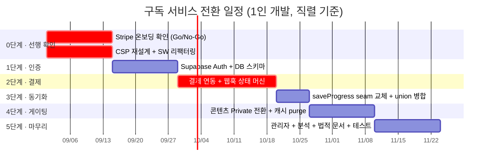
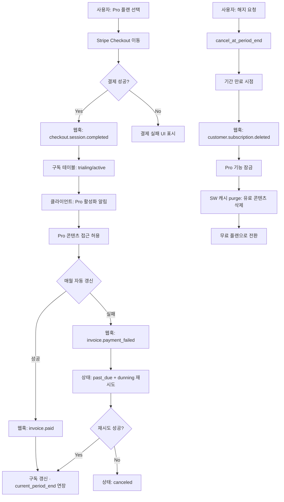
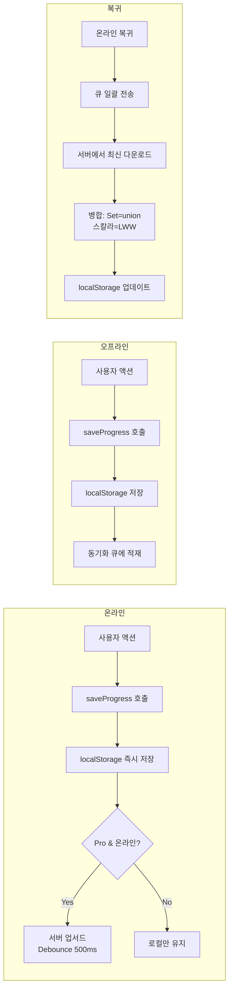

# 💳 월 구독 서비스 전환 로드맵 (Subscription Roadmap)

> **작성일**: 2026-08-27
> **개정일**: 2026-08-27 — 아키텍처(ARCHITECTURE.md) 정합성 리뷰 반영
> **목적**: 현재 무료 PWA 학습 플랫폼을 월 구독 기반 서비스로 전환하기 위한 필요 작업 정리

---

## 🔧 이번 개정에서 반영한 리뷰 항목

이 코드베이스에서 1인 개발자가 실제로 막히는 지점을 상위로 끌어올렸습니다.

1. **CSP 변경**을 독립 섹션(§4)으로 승격 — 현재 `script-src 'self'`가 Stripe.js/Supabase SDK를 원천 차단
2. **Service Worker × 인증/게이팅** 충돌을 구체화(§6) — 캐시 무효화(purge), 오프라인 vs 게이팅 상충 명시
3. **클라이언트 게이팅은 보안이 아니라 UX**임을 명확화(§5) — 진짜 경계는 서버 검증뿐
4. **동기화 병합 전략** 정정(§7) — Set은 합집합(union), 스칼라만 LWW
5. **사실 정정** — Vercel Hobby 한도(10초, 상업용 Pro 필수), Stripe 한국 가맹 온보딩 확인 필요
6. **바닐라 유지 가능** 명시 — Supabase Auth 채택 시 Next.js 마이그레이션 불필요
7. **기존 설계 강점**(§8) — `saveProgress` seam, stable ID, `ALLOWED_KEYS` 재사용으로 공수 절감

---

## 📋 1. 현재 상태 분석

### 아키텍처
- **Zero-Backend**: 순수 프론트엔드 정적 사이트 (Vercel 호스팅)
- **Vanilla First**: 프레임워크/빌드 도구 없이 순수 HTML/CSS/JS + ESM 모듈
- **데이터 저장**: `localStorage` only — 서버 DB 없음
- **인증**: 없음 (계정/로그인 불필요)
- **콘텐츠**: `content/*.md` 런타임 fetch + 시험/성분 빌드 타임 JS 번들
- **오프라인**: Service Worker 다단계 캐시 (navigation·`/src/`·CSS·`content/*.md` 전부 **Cache First**)
- **보안**: CSP `script-src 'self'` (인라인 스크립트 차단, 이벤트 위임 패턴 사용)
- **결제**: 없음

### 구독 전환 시 핵심 제약 (기술 난이도 순)
1. **CSP 재설계 필요**: 현재 `script-src 'self'`로는 Stripe.js·Supabase SDK 로드가 브라우저에서 차단됨 → 외부 출처 허용 정책을 의식적으로 결정해야 함 (§4)
2. **Service Worker 재작업 필요**: Cache First 전략이 토큰 기반 유료 콘텐츠 fetch와 충돌. 구독 해지 시 캐시에 남은 유료 콘텐츠 무효화 로직 필요 (§6)
3. **백엔드 필요**: 인증, 결제, 구독 상태 관리, 사용자 데이터 동기화
4. **콘텐츠 접근 제어**: 클라이언트 게이팅은 UX일 뿐, 실제 경계는 서버에서만 (§5)
5. **데이터 마이그레이션**: localStorage → 서버 DB (stable ID 덕분에 비교적 수월, §8)

### ⚠️ 반드시 먼저 결정할 것
- **무료 티어에 로그인을 강제할 것인가?** 현재 앱의 최대 강점은 "로그인 없음 + 오프라인"이다. 무료 티어까지 계정을 강제하면 이 강점이 사라지고 기존 사용자 이탈 위험이 커진다.
  - **권장**: 무료 = 지금 경험 그대로(로그인 없이 로컬만), Pro = 계정·동기화·게이팅을 얹는 구조. 마이그레이션 프롬프트도 Pro 가입 시에만 노출.
- **프레임워크를 유지할 것인가?** Supabase Auth를 채택하면 **Next.js 마이그레이션 없이 바닐라 그대로 유지 가능**하다. 서버는 Vercel Functions 또는 Supabase Edge Functions로 붙인다. "Vanilla First" 철학을 깰 필요 없음.

---

## 🏗️ 2. 백엔드 인프라 (Backend Infrastructure)

### 2.1 서버리스 API (Vercel Functions / Supabase Edge Functions)
- **인증 API**: 회원가입, 로그인, 이메일 인증, 비밀번호 재설정 (Supabase Auth가 대부분 제공)
- **구독 API**: 구독 상태 조회, 결제 웹훅 처리, 구독 갱신/해지
- **데이터 동기화 API**: 학습 진도, 오답 노트, 북마크 업서드/다운로드
- **관리자 API**: 사용자 관리, 구독 통계, 콘텐츠 관리
- **유료 콘텐츠 발급 API**: 인증된 사용자에게만 signed URL 또는 콘텐츠 본문 반환 (§5.2)

> **바닐라 유지 원칙**: 위 API는 모두 독립 서버리스 함수로 구현 가능하므로 Next.js가 필요 없다. 프론트엔드는 기존 ESM 구조를 유지한 채 `fetch`로 호출한다.

### 2.2 데이터베이스
- **사용자 테이블**: id, email, name, created_at, role (user/admin)
- **구독 테이블**: user_id, plan (free/pro), status, current_period_end, stripe_subscription_id
  - `status`는 Stripe 상태를 그대로 반영: `active` / `trialing` / `past_due` / `canceled` / `incomplete` / `unpaid` (§3.3 참고 — 3상태로 단순화하면 실패 결제 처리가 누락됨)
- **학습 진도 테이블**: user_id, subject_key, card_id, status (memorized/weak), quiz_results, updated_at
  - `card_id`는 콘텐츠 유도형 stable ID(sha256)라 기기·재빌드 간 안정적 (§8)
- **결제 내역 테이블**: user_id, amount, currency, stripe_payment_id, status, created_at

### 2.3 추천 스택
- **Supabase** (PostgreSQL + Auth + RLS) — Vercel과 통합 용이, 무료 티어 지원, **바닐라 JS SDK 지원으로 프레임워크 전환 불필요**
- RLS(Row Level Security)로 사용자별 데이터 격리 → 서버 코드 최소화

---

## 🔐 3. 인증 · 결제 · 구독 관리

### 3.1 인증 (Authentication)
- 이메일 + 비밀번호 기반 (Supabase Auth 기본 지원)
- 소셜 로그인: Google, Kakao (한국 사용자 주요)
- 이메일 인증 필수 (스팸 방지)
- **세션 관리**: JWT (HttpOnly 쿠키 권장), Refresh Token 자동 갱신
- **PWA 오프라인**: 토큰 캐싱 → 온라인 복귀 시 검증, 24시간 유예 기간

### 3.2 기존 사용자 마이그레이션
- 최초 로그인(=Pro 가입) 시 localStorage 데이터를 서버로 업로드
- "기존 학습 진도를 계정에 연결하시겠습니까?" 프롬프트
- 업로드 시 **`ALLOWED_KEYS` 화이트리스트 재사용**(§8) — 기존 백업 복원 로직과 동일 검증
- 중복 데이터 처리는 §7의 병합 전략(Set=합집합) 적용

### 3.3 결제 게이트웨이
- **Stripe**: 한국 카드 KRW 정기결제(SetupIntent + mandate 동의) **공식 지원됨** → 방향 타당
  - ⚠️ **확인 필요**: 사업자(꼬드리브글로발)가 **Stripe 가맹 온보딩**이 되는지 먼저 확인할 것. 한국 소재 사업자 머천트 온보딩은 과거 제한이 있었다.
  - 온보딩 불가 시 → **토스페이먼츠 / 포트원 빌링키 정기결제**로 전환 (국내 PG, 수수료 2~3%로 더 낮음, 카카오·네이버·토스페이 지원)
- 추천: Stripe 온보딩 가능 여부부터 확인 → 가능하면 Stripe, 불가하면 토스페이먼츠

### 3.4 구독 플랜 설계
| 항목 | 무료 (Free) | 프로 (Pro) |
|------|------------|------------|
| 계정/로그인 | **불필요 (로컬만)** | 필요 |
| 가격 | ₩0 | ₩9,900/월 |
| 플래시카드 | 제1과목만 | 전 4과목 |
| 퀴즈 | 일일 10문제 제한 | 무제한 |
| 모의고사 | 1회/일 | 무제한 |
| 오디오북 | ❌ | ✅ |
| 핵심 요약집 | ❌ | ✅ |
| 오답 노트 동기화 | 로컬만 | 클라우드 동기화 |
| 학습 통계 | 기본 | 상세 분석 |
| 기기 동기화 | ❌ | ✅ |

> **무료 티어 게이팅 주의**: 위 "제1과목만" 제한은 클라이언트에서만 거르면 우회된다. 무료 대상이 아닌 과목의 `content/*.md`는 **인증 없이는 서버에서 서빙되지 않아야** 한다 (§5).

### 3.5 결제 흐름 (Stripe 기준)
1. 사용자가 프로 플랜 선택 → Stripe Checkout 이동
2. 결제 완료 → 웹훅(`checkout.session.completed`)으로 서버리스 함수 호출
3. 구독 테이블 업데이트 → 클라이언트에 구독 활성화 알림
4. 매월 자동 갱신 → `invoice.paid` 웹훅으로 갱신 처리
5. **결제 실패 → `invoice.payment_failed` → `past_due` 상태 + dunning(재시도)** → 유예 후 실패 확정 시 무료 전환
6. 해지 → `customer.subscription.deleted` → 기간 만료 시점에 유료 기능 잠금 + **캐시 purge**(§6)

> **상태 처리 주의**: `active/canceled/expired` 3상태로 단순화하면 `past_due`·`incomplete`·재시도(dunning) 구간이 누락되어 "결제 실패했는데 계속 Pro" 또는 "결제 처리 중인데 잠김" 버그가 난다. Stripe 웹훅 상태를 그대로 미러링할 것.

### 3.6 무료 체험
- 7일 무료 체험 (Stripe Trial Period, `trialing` 상태)
- 체험 종료 1일 전 알림 (이메일 + 인앱)
- 카드 정보 선등록 필수 (체험 종료 후 자동 결제)

---

## 🛡️ 4. CSP 변경 (Content Security Policy) — **신규 · 최우선**

> 현재 아키텍처는 `script-src 'self'`로 인라인 스크립트를 차단하고 이벤트 위임 패턴(`data-click`/`data-input`)으로 우회한다. **이 CSP 그대로면 Stripe.js·Checkout·Supabase 클라이언트 SDK가 브라우저에서 로드 자체가 차단된다.** 결제/인증 구현 전에 반드시 CSP를 재설계해야 한다.

### 4.1 필요한 CSP 완화 (`vercel.json` 헤더)
| 지시자 | 추가 항목 | 사유 |
|--------|-----------|------|
| `script-src` | `https://js.stripe.com` | Stripe.js 로드 |
| `frame-src` | `https://js.stripe.com https://hooks.stripe.com` | Checkout / 3DS 인증 iframe |
| `connect-src` | Stripe API + `https://<project>.supabase.co` | 결제 API·Supabase 요청 |
| `img-src` | (필요 시) Stripe/소셜 로그인 프로필 이미지 출처 | |

### 4.2 이벤트 위임 패턴과의 정합성
- Stripe.js / Supabase SDK는 자체 콜백/이벤트를 쓰므로 인라인 핸들러가 아니어도 동작하지만, **결제·로그인 UI의 이벤트 바인딩은 기존 `resolveDelegatedHandler()` 위임 패턴에 맞춰** 작성한다.
- 신규 위임 핸들러도 `window.<n> = <n>` 브리지 노출 + `tests/unit/delegation-guard.test.js` 회귀 가드 대상에 포함시킬 것.

### 4.3 외부 출처 최소화 원칙 유지
- FontAwesome 자체 호스팅 전환 등으로 외부 출처를 애써 줄여온 방향과 상충하는 변경이므로, **결제/인증에 필요한 최소 출처만** 허용한다.
- 가능하면 Supabase/Stripe SDK를 자체 번들에 포함(자체 호스팅)하는 방안도 검토 → `script-src` 완화 범위 축소.

---

## 🎯 5. 콘텐츠 접근 제어 (Content Gating)

### 5.1 프론트엔드 게이팅은 "보안"이 아니라 "UX"다
- 바닐라 정적 앱이라 게이팅 로직이 배포된 JS에 그대로 노출되고, devtools로 `state`만 조작하면 우회된다.
- 따라서 프론트 게이팅(🔒 아이콘, 업그레이드 모달)은 **UX 유도용으로만** 규정한다. 실제 접근 통제로 간주하지 않는다.

### 5.2 서버 사이드 검증이 유일한 실제 경계
- 유료 콘텐츠 MD/번들은 **인증된 API 엔드포인트에서만 서빙**한다. 구독 상태를 서버에서 검증한 뒤 본문 또는 signed URL 발급.
- 현재 `content/*.md`가 Vercel CDN에 public으로 놓여 있는 구조 → 유료 콘텐츠는 **Private 경로/Storage로 이동** 필수. (public에 두면 URL 직접 다운로드로 게이팅 무력화)

### 5.3 현재 구조에서의 변경점
- 유료 `content/*.md` → Vercel Blob Storage 또는 Supabase Storage (인증 필요, Private)
- 무료 콘텐츠(제1과목 등)는 기존 public 경로 유지 → 오프라인·live-fetch 장점 보존
- 유료 데이터 번들 → 인증 fetch로 전환
- Service Worker 캐시 전략 수정 (§6에서 상세)

---

## 🔄 6. Service Worker × 인증/게이팅 — **재작업 필요**

> 로드맵 초안의 "캐시 전략 수정" 한 줄로는 부족하다. SW가 navigation·`/src/`·CSS·`content/*.md`를 **Cache First**로 서빙하는 구조와 인증/게이팅은 여러 지점에서 충돌한다.

### 6.1 토큰 기반 fetch와 Cache First의 충돌
- 유료 콘텐츠를 signed URL/토큰 fetch로 바꾸면 토큰 만료 때문에 Cache First가 깨진다.
- **분기 추가**: 유료 콘텐츠 라우팅은 Cache First에서 제외하고, 인증 헤더를 포함한 별도 전략(예: Network First + 단기 캐시)으로 처리한다.

### 6.2 오프라인 가능 ↔ 콘텐츠 게이팅은 근본적으로 상충
- **오프라인 학습을 허용한다는 것은 유료 콘텐츠가 기기 Cache Storage에 남는다는 뜻**이다. 웹 특성상 이를 완전히 막을 수 없다(DRM 불가).
- 정책 결정 필요: "Pro 콘텐츠를 어디까지 오프라인 허용할 것인가?"
  - **옵션 A (추천): 오프라인 허용**(가치↑) + 추출 리스크 감수 + 해지 시 캐시 purge(§6.3) + 지속적 콘텐츠 업데이트로 가치 유지 — 오프라인 학습이 본 앱의 차별화 포인트이므로
  - 옵션 B: 유료 콘텐츠는 온라인 전용(캐시 제외) → 오프라인 강점 일부 포기, 구현 단순

### 6.3 구독 해지/다운그레이드 시 캐시 무효화 (purge) — **필수**
- 구독이 만료·해지되면 로그아웃/다운그레이드 시점에 **Cache Storage에서 유료 콘텐츠를 명시적으로 삭제**해야 한다. 안 하면 해지 후에도 캐시된 유료 콘텐츠가 계속 열린다.
- 구현: `caches.open(...)` → 유료 콘텐츠 URL 패턴 매칭 → `cache.delete()`. 로그아웃/상태 변경 이벤트에 훅.

### 6.4 인증 토큰 처리
- Service Worker fetch 핸들러에서 유료 콘텐츠 요청에 인증 토큰 헤더 주입.
- 오프라인 폴백: 구독 상태 캐싱 + 온라인 복귀 시 재검증(24시간 유예).

---

## 🔁 7. 데이터 동기화 (Data Sync)

### 7.1 현재 구조
- 모든 학습 데이터가 `localStorage`에만 존재, 기기 간 동기화 불가, 손실 시 복구 불가

### 7.2 동기화 모델
- **온라인**: 변경 사항을 서버로 실시간 전송 (Debounce)
- **오프라인**: localStorage 임시 저장 → 온라인 복귀 시 큐 일괄 전송
- **동기화 대상**: 외운 카드, 약점 카드, 퀴즈 결과, 모의고사 결과, 북마크, 학습 통계

### 7.3 병합 전략 — **레코드 단위 LWW 금지**
초안의 "서버 타임스탬프 기준 Last-Write-Wins(전체)"는 위험하다. `memorizedCards`/`weakCards`는 `Set`이고 본질적으로 additive라, 오래된 기기가 "덜 외운 상태"로 덮어쓰면 진도가 유실된다.

| 데이터 유형 | 예시 | 병합 규칙 |
|-------------|------|-----------|
| **Set (additive)** | `memorizedCards`, `weakCards` | **합집합(union)** — 기기 간 합쳐짐 |
| **스칼라/레코드** | 모의고사 성적, 설정값 | 타임스탬프 LWW |
| **삭제 의도** | 카드 unmark | **개별 삭제 API 호출** (클라이언트가 `memorizedCards.delete(id)` 시 서버에 `DELETE /progress/:card_id` 전송). 단순 diff 동기화보다 명시적 삭제가 union 병합과 충돌하지 않음 |

### 7.4 구현 패턴
```
[사용자 액션] → localStorage 즉시 저장 → (온라인 시) 서버 업서드
[앱 시작]     → 서버 데이터 다운로드 → Set은 union, 스칼라는 LWW로 localStorage 병합
[오프라인→온라인] → 큐에 쌓인 변경사항 일괄 전송
```

### 7.5 orphan 처리
- 서버에도 orphan cleanup 적용: 삭제된 콘텐츠의 card_id가 union 병합으로 되살아나지 않도록, 현재 콘텐츠에 존재하는 ID만 유효 처리.

---

## 📱 8. 기존 설계가 유리하게 작용하는 지점 — **공수 절감**

전환이 어렵기만 한 건 아니다. 현재 아키텍처의 몇몇 설계가 구독 전환을 이미 돕는다.

1. **`state.js`의 `saveProgress` 추상화 seam이 이미 존재** (ARCHITECTURE.md 향후 확장 5항)
   - 그 한 지점만 API 호출로 교체하면 되므로, 데이터 동기화 구현이 초안 추정(1주)보다 오히려 저렴.
2. **content-derived stable ID (sha256)**
   - 서버 학습 진도 테이블의 `card_id`가 기기·재빌드 간 안정적 → 마이그레이션이 깔끔.
   - 단, orphan cleanup을 서버에도 적용해야 stale ID 부활 방지(§7.5).
3. **`ALLOWED_KEYS` 화이트리스트 재사용**
   - 기존 백업 복원의 화이트리스트 검증을 서버 업서드 검증에 그대로 재사용 가능 → 검증 로직 신규 작성 최소화.
4. **뷰 컨트롤러 모듈 분리 완료**
   - 로그인/구독/결제 뷰를 `src/views/`에 동일 패턴으로 추가하면 됨(auth.js, subscription.js 등).

---

## 🖥️ 9. 프론트엔드 변경 사항

### 9.1 새 페이지/컴포넌트
- **로그인/회원가입 뷰**: 이메일, 비밀번호, 소셜 로그인 (`src/views/auth.js`)
- **구독 관리 뷰**: 현재 플랜, 결제 내역, 업그레이드/해지 (`src/views/subscription.js`)
- **결제 뷰**: Stripe Checkout(또는 토스페이먼츠) 연동
- **프로필 뷰**: 사용자 정보, 학습 통계 요약
- **관리자 대시보드**: (별도) 사용자/구독/매출 관리

### 9.2 기존 UI 수정
- 헤더/모바일 탭 바에 로그인·프로필·"내 계정" 진입점 추가
- 잠긴 기능에 🔒 + 업그레이드 CTA (UX 유도용, §5.1)
- 학습 진도에 "동기화됨" 상태 표시

### 9.3 PWA 수정
- Service Worker: §6 전체 재작업 (토큰 fetch, 캐시 purge, 오프라인 폴백)
- Push Notification: 결제 알림, 학습 리마인더 (Pro)

---

## 📊 10. 분석 및 모니터링
- **사용자 분석**: Vercel Analytics / GA4 — DAU/MAU, 구독 전환율, 이탈률, 퍼널(방문→가입→체험→유료)
- **결제 분석**: MRR, Churn, 구독 유지 기간, 평균 결제 단가 (Stripe/PG 대시보드 + 커스텀)
- **에러 모니터링**: Sentry — 결제 실패, 인증 에러, 동기화 충돌, **CSP 위반 리포트**(`report-uri`) 추적

---

## ⚖️ 11. 법적 / 규정 준수
- **이용약관 / 개인정보처리방침 / 결제 약관** 정비 (자동 갱신 안내, 해지 방법, 환불 정책 명시)
- **개인정보보호법**: 수집 동의, 국외 이전 별도 동의(Supabase/Stripe 해외 서버), 파기 정책
- **전자상거래법**: 7일 내 청약철회 안내(구독 특례), 자동결제 사전 고지 의무, 해지 방법 명시
- **정기결제 다크패턴 규제**: 해지를 가입만큼 쉽게 — 최근 강화 흐름 반영

---

## 🛠️ 12. 기술 스택 추천 (MVP)

| 영역 | 기술 | 이유 / 정정 |
|------|------|------|
| 호스팅 | **Vercel Pro ($20/월)** | ⚠️ Hobby는 **개인·비상업용 전용** — 유료 구독을 받는 순간 Pro가 **필수(전제 조건)**. 함수 실행 한도는 **10초/호출**(초안의 "100ms CPU"는 오기, 웹훅 처리엔 충분) |
| DB + Auth | Supabase | PostgreSQL + Auth + RLS, 바닐라 JS SDK, 무료 티어 |
| 결제 | Stripe **또는** 토스페이먼츠 | Stripe 한국 카드 정기결제 지원되나 **가맹 온보딩 확인 필요**. 불가 시 국내 PG(수수료 낮음) |
| 분석 | Vercel Analytics | 추가 설정 최소 |
| 에러 추적 | Sentry | 프리 티어 충분, CSP 리포트 병행 |
| 이메일 | Resend / SendGrid | 결제/인증 이메일 발송 |

### 마이그레이션 경로 (개정)
1. **0단계 (신규)**: CSP 재설계 + SW 인증 대응 리팩터링 준비 (§4, §6)
2. **1단계**: Supabase Auth + DB 스키마 (인증만, 무료 서비스는 로그인 없이 유지)
3. **2단계**: 결제(Stripe/토스) + 구독 플랜 분리 + 웹훅 상태 미러링
4. **3단계**: 데이터 동기화 (`saveProgress` seam 교체, union 병합)
5. **4단계**: 콘텐츠 게이팅(서버 서빙) + SW 캐시 purge + UI 잠금
6. **5단계**: 관리자 + 분석 + 테스트

### 마이그레이션 일정 (Mermaid Gantt)



### 결제 웹훅 처리 절차 (Mermaid Flowchart)



### 데이터 동기화 절차 (Mermaid Flowchart)



---

## 📈 13. 예상 개발 기간 (개정)

> 초안의 5~8주는 낙관적이다. CSP/SW 재작업이 예산에 없었고, 첫 결제·웹훅·법적 문서를 감안하면 실질 공수는 더 크다.

| 단계 | 작업 | 예상 기간 |
|------|------|-----------|
| 0단계 | **CSP 재설계 + SW 인증/purge 리팩터링** | **1~2주** |
| 1단계 | Supabase 인증 + DB 스키마 | 1~2주 |
| 2단계 | 결제 + 웹훅(상태 미러링·dunning) | **2~3주** (첫 구현 시 상태 처리가 복잡) |
| 3단계 | 데이터 동기화 (seam 교체·union 병합) | 1주 (seam 존재로 절감) |
| 4단계 | 콘텐츠 게이팅(서버 서빙) + 캐시 purge + UI | 1~2주 |
| 5단계 | 관리자 + 분석 + 테스트 + 법적 문서 | 1~2주 |
| **총계** | | **7~12주** (1인, 단계 병렬 시) / **10~14주** (직렬 수행 시) |

---

## ⚠️ 14. 주요 리스크 (개정)

1. **기존 사용자 이탈**: 무료→유료 전환 반발
   - 완화책: 기존 사용자 3개월 무료 Pro + **무료 티어는 로그인 없이 지금 경험 유지**
2. **오프라인 경험 저하**: 인증 필요 → 오프라인 제한
   - 완화책: 토큰 캐싱 + 24시간 유예 + 무료 콘텐츠는 기존 public/Cache First 유지
3. **결제 수수료**: Stripe 3.5%(한국 카드) → 수익성 압박
   - 대안: 국내 PG(토스페이먼츠/포트원) 2~3%
4. **유료 콘텐츠 캐시 추출**: 오프라인 허용 시 Cache Storage에 콘텐츠 잔존 (웹 DRM 불가)
   - 완화책: 해지 시 캐시 purge(§6.3) + 온라인 전용 옵션(§6.2) 검토 + 지속적 콘텐츠 업데이트로 가치 제공
5. **Vercel 상업용 정책**: Hobby는 비상업 전용 → 유료 구독 개시 시 **Pro 필수**
   - 대응: MVP 원가에 Vercel Pro $20/월 반영
6. **Stripe 가맹 온보딩 불가 가능성**: 한국 사업자 온보딩 제한 이력
   - 대응: 착수 전 Stripe 온보딩 확인, 불가 시 토스페이먼츠 빌링키로 즉시 전환
7. **CSP 완화로 인한 공격면 증가**: 외부 스크립트 출처 추가
   - 완화책: 필요한 최소 출처만 허용, SDK 자체 호스팅 검토, CSP 위반 리포트 모니터링

---

## 📎 관련 문서
- [ARCHITECTURE.md](ARCHITECTURE.md) — 현재 아키텍처 설계 (CSP·SW·상태·stable ID·saveProgress seam 근거)
- [DEPLOY.md](DEPLOY.md) — 배포 가이드
- [AUDIO_HOSTING_GUIDE.md](AUDIO_HOSTING_GUIDE.md) — 오디오 호스팅 가이드
