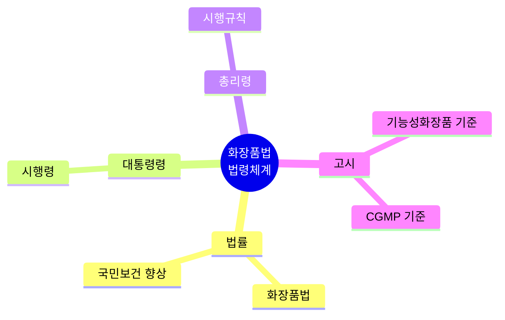
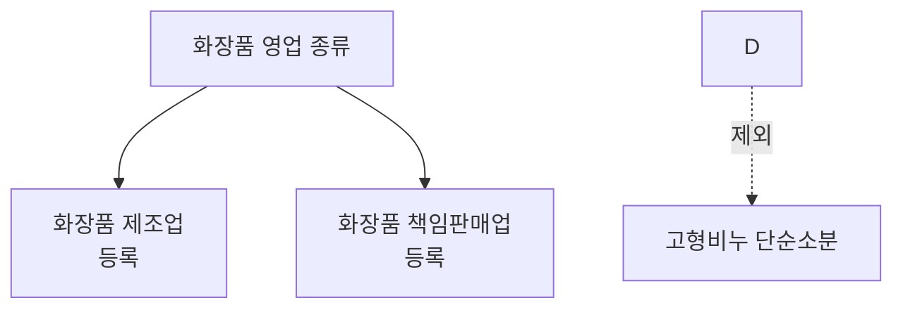
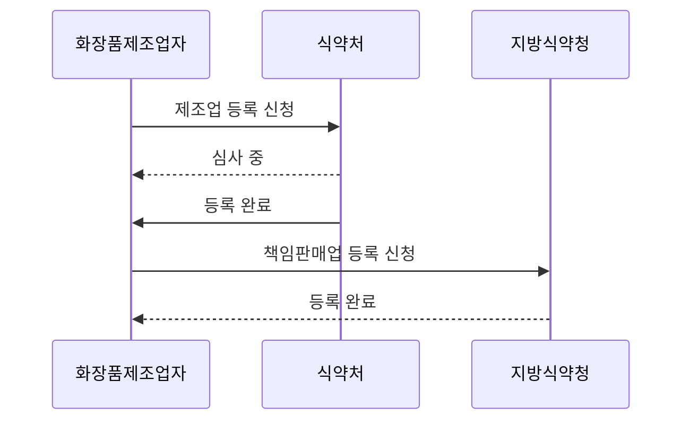
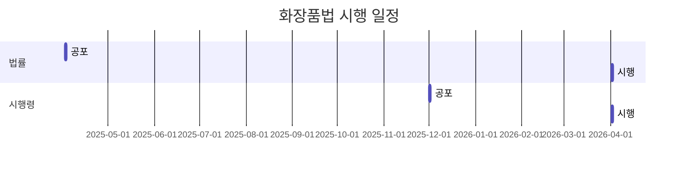
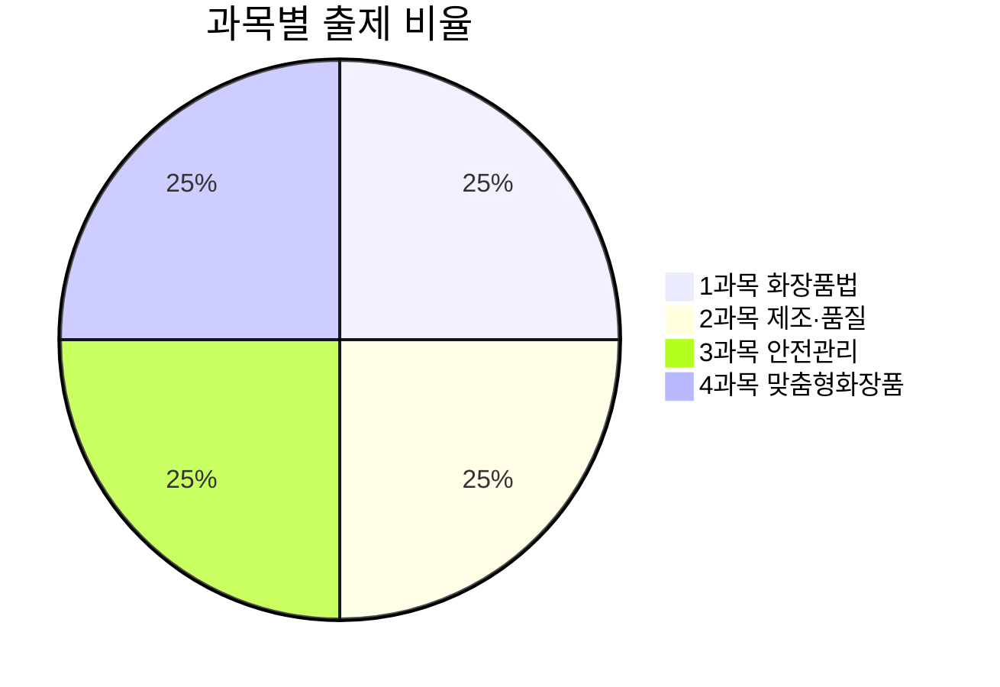
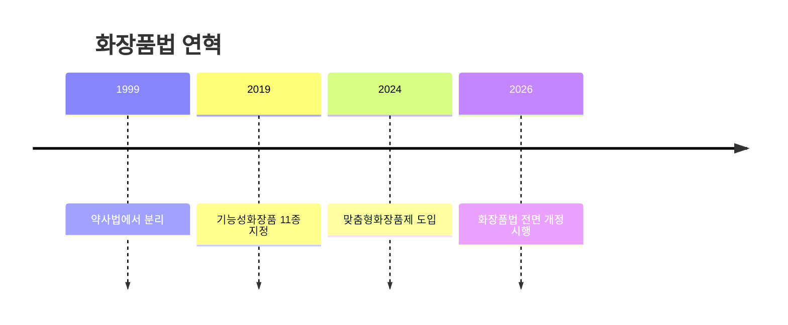
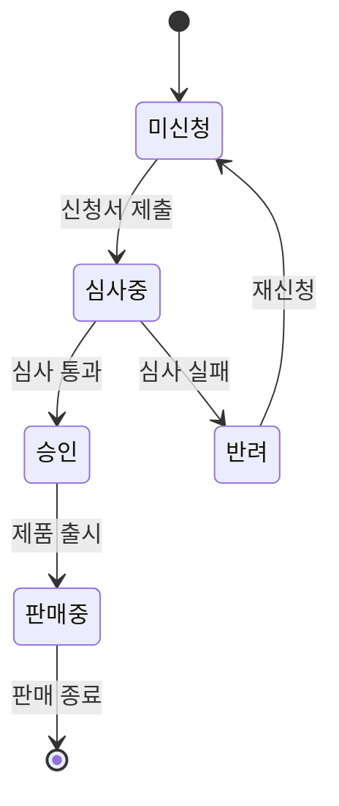
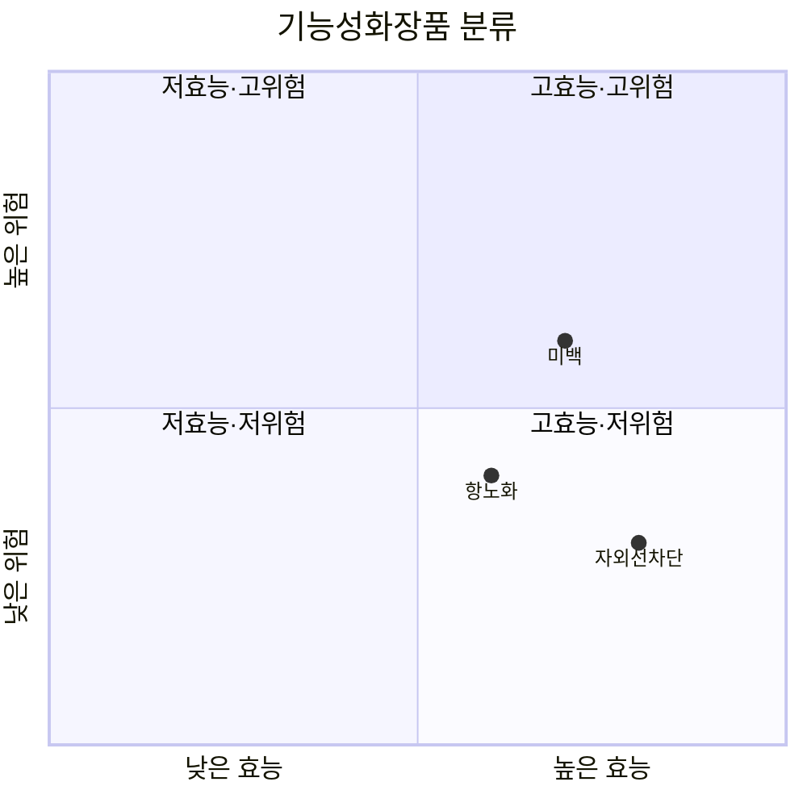

# 교재 Markdown 작성 지침

> 새 교재 또는 기존 교재의 Markdown 파일을 작성/수정할 때 따라야 할 규칙.
> 이 규칙을 지키면 **소스코드 수정 없이** `npm run build:data`만으로 앱에 반영된다.

---

## 1. 디렉토리 구조

```
content/
├── manifest.json          ← 모든 교재/문제은행의 경로를 여기서 관리
├── 교재/
│   ├── law/               ← 1과목 (화장품법의 이해)
│   │   └── 1과목_화장품법의이해_표준형.md
│   ├── manufacturing/     ← 2과목 (화장품 제조 및 품질관리)
│   │   └── 2과목_제조및품질관리_표준형.md
│   ├── safety/            ← 3과목 (유통화장품 안전관리)
│   │   └── 3과목_유통화장품안전관리_표준형.md
│   └── understanding/     ← 4과목 (맞춤형화장품의 이해)
│       └── 4과목_맞춤형화장품의이해_표준형.md
├── 문제은행/
│   ├── 과목1_문제은행_교재인용.md
│   ├── 과목2_문제은행_교재인용.md
│   ├── 과목3_문제은행_교재인용.md
│   └── 과목4_문제은행_교재인용.md
└── 참조자료/              ← 학습 보조 자료 (빌드에 직접 포함되지 않음)
```

---

## 2. manifest.json 구조

교재 파일 경로를 변경하거나 새 과목을 추가할 때만 이 파일을 수정한다.

```json
{
  "subjects": [
    {
      "key": "law",              // 고유 식별자 (영문)
      "order": 1,                // 과목 순서
      "name": "화장품법의 이해",   // 전체 이름
      "shortName": "화장품법",     // 약칭
      "dir": "교재/law",          // content/ 하위 디렉토리 경로
      "chapters": [
        {
          "key": "full",         // 챕터 식별자
          "title": "화장품법의 이해 (전체)",
          "file": "1과목_화장품법의이해_표준형.md"   // dir 내 파일명
        }
      ]
    }
  ],
  "exams": [
    {
      "key": "subject1",
      "subject": "law",          // 위 subject.key와 매칭
      "part": 1,
      "title": "화장품법의 이해 (100제)",
      "file": "과목1_문제은행_교재인용.md"   // content/문제은행/ 하위 파일명
    }
  ]
}
```

---

## 3. 교재 본문 Markdown 규칙

### 3.1 헤더 구조

| 헤더 | 용도 | 파서 동작 |
|---|---|---|
| `#` | 교재 제목 (**파일당 반드시 1개**) | `chapterTitle`로 추출 |
| `##` | 모든 섹션 (챕터/비챕터/참조/복습) | 마인드맵 노드, 카드 `category`, 교재 리더 섹션 분할 |
| `###` | 하위 섹션 (참조자료 조문, 본문 세부 항목) | 마인드맵 하위 노드, 카드 추출에 영향 없음 |
| `####` | 본문 내 세부 내용 | 콘텐츠의 일부 |

> **절대 규칙**: `#` 헤더는 파일당 1개만 허용된다. 영역 구분용으로 `#`을 남용하지 말 것.

### 3.2 교재 3영역 배치 원칙

교재 파일은 다음 3개 영역으로 구성되며, 순서를 바꾸지 않는다:

```
┌─ 영역 1: 프론트 매터 (학습 준비) ──────────────────────┐
│  ## 🧭 학습 아이콘                                     │
│  ## 🚀 시험 직전 1분 전체 지도                         │
│  ## 🎯 최우선 암기 축                                  │
│  ## 🔢 숫자 암기 미리보기                              │
│  ## 📋 목차                                            │
│  ## 🎯 과목 시각화 개요                                │
└────────────────────────────────────────────────────────┘
┌─ 영역 2: 본문 (챕터 콘텐츠) ──────────────────────────┐
│  ## 📚 학습 보조 자료 (교재 콘텐츠)                    │
│  ┌─ 챕터 반복 ─────────────────────────────────────┐  │
│  │ ## � 핵심 통합 정리            ← 챕터 출처/보조│  │
│  │ ## � Chapter NN. 제목          ← 챕터 항목     │  │
│  │ ## 1. 주제명                    ← 챕터 본문     │  │
│  │ ### (1) 세부 항목               ← 본문 세부     │  │
│  │ ## 2. 주제명                    ← 챕터 본문     │  │
│  │ ...                                             │  │
│  │ ## 📊 비교표                    ← 챕터 내 보조 │  │
│  │ ## 📖 핵심 용어 정리            ← 챕터 내 보조 │  │
│  │ ## ✅ 확인문제                  ← 챕터 내 보조 │  │
│  └─────────────────────────────────────────────────┘  │
└────────────────────────────────────────────────────────┘
┌─ 영역 3: 백 매터 (참조자료 + 최종 복습) ───────────────┐
│  ## 📚 참조 자료 (법령 원문 · 별표 인덱스)             │
│  ### ⚖️ 법령명                      ← 참조 하위      │
│  ### 제N조(조문)                    ← 참조 하위      │
│  ### 📋 별표·별지 인덱스            ← 참조 하위      │
│  ## ⚡ 시험 직전 체크리스트          ← 최종 복습 1    │
│  ## 🔗 과목 간 교차 참조             ← 최종 복습 2    │
│  ## 📝 기출문제                      ← 최종 복습 3    │
│  ## 🧠 30초 회상                     ← 최종 복습 4    │
│  ## 🔄 추천 회독법                   ← 최종 복습 5    │
└────────────────────────────────────────────────────────┘
```

#### 영역 1: 프론트 매터 (학습 준비)

`#` 챕터 타이틀 직후, 본문 시작 전까지 배치.

| 순서 | 헤더 | 아이콘 | 용도 |
|---|---|---|---|
| 1 | `##` | 🧭 | 학습 아이콘 안내 |
| 2 | `##` | 🚀 | 시험 직전 1분 전체 지도 |
| 3 | `##` | 🎯 | 최우선 암기 축 |
| 4 | `##` | 🔢 | 숫자 암기 미리보기 |
| 5 | `##` | 📋 | 목차 |
| 6 | `##` | 🎯 | 과목 시각화 개요 (마인드맵) |

> 모든 항목은 파서에서 카드 추출 제외 대상이다.

#### 영역 2: 본문 (챕터 콘텐츠)

**2-A: 챕터 출처/보조** — 각 챕터 앞에 배치 (출처 표시)

| 헤더 | 형식 | 예시 |
|---|---|---|
| `##` | `📖 통합 정리` | `## 📖 화장품법 통합 정리` |

> `📖` 섹션은 `📚 Chapter NN.` **앞**에 배치하여 해당 챕터의 출처를 표시한다.

**2-B: 챕터 항목** — 본문의 뼈대

| 헤더 | 형식 | 예시 |
|---|---|---|
| `##` | `📚 Chapter NN. 제목` | `## 📚 Chapter 01. 화장품법의 이해` |

> **챕터 헤더 규칙**:
> - `📚` 이모지는 **필수** (`## Chapter 01.` 형식 금지)
> - `(PART XX)` 등의 접미사 **사용 금지** (`## 📚 Chapter 01. 제품 안내 (PART 04)` → `## 📚 Chapter 01. 제품 안내`)

**2-C: 챕터 내 본문** — 학습 내용

| 헤더 | 형식 | 예시 |
|---|---|---|
| `##` | `N. 주제명` | `## 1. 화장품법의 목적과 법령 체계` |
| `###` | 세부 항목 | `### (1) 법령 체계` |
| `####` | 더 세부 내용 | `#### 참고: ...` |

**2-D: 챕터 내 비챕터 항목** — 각 챕터 본문 뒤에 배치

| 순서 | 헤더 | 아이콘 | 용도 |
|---|---|---|---|
| 1 | `##` | 📊 | 비교표 |
| 2 | `##` | 📖 | 핵심 용어 정리 |
| 3 | `##` | ✅ | 확인문제 |

#### 영역 3: 백 매터 (참조자료 + 최종 복습)

**3-A: 참조자료** — `##` 하나로 묶고, 내부는 `###`

| 헤더 | 예시 |
|---|---|
| `##` | `## 📚 참조 자료 (법령 원문 · 별표 인덱스)` |
| `###` | `### ⚖️ 화장품법 (제20901호, 시행 2026. 4. 2.)` |
| `###` | `### 제1조(목적)` |
| `###` | `### 📋 별표·별지 서식 종합 인덱스` |

> 참조자료를 `##`로 유지하면 마인드맵에 노드로 표시되고, 내부 `###` 조문들은 하위 노드로 표시된다.

**3-B: 최종 복습** — 파일 마지막에 순서대로 배치

| 순서 | 헤더 | 아이콘 | 용도 |
|---|---|---|---|
| 1 | `##` | ⚡ | 시험 직전 체크리스트 |
| 2 | `##` | 🔗 | 과목 간 교차 참조 |
| 3 | `##` | 📝 | 기출문제 |
| 4 | `##` | 🧠 | 30초 회상 |
| 5 | `##` | 🔄 | 추천 회독법 |

### 3.3 전체 구조 예시

```markdown
# 📕 1과목 화장품법의 이해

## 🧭 학습 아이콘
(학습 아이콘 안내)

## 🚀 시험 직전 1분 전체 지도
(전체 지도)

## 🎯 최우선 암기 축
(암기 축)

## 🔢 숫자 암기 미리보기
(숫자 암기)

## 📋 목차
(목차)

## 🎯 과목 시각화 개요
(마인드맵)

## 📚 학습 보조 자료 (교재 콘텐츠)

## 📖 화장품법 통합 정리
(통합 정리 + 출처 링크)

## 📚 Chapter 01. 화장품법의 이해

## 1. 화장품법의 목적과 법령 체계
(본문)

### (1) 법령 체계
(세부 내용)

## 📊 영업 3종 비교표
(비교표)

## 📖 핵심 용어 정리
(용어 정리)

## 📚 Chapter 02. 개인정보 보호법
...

## 📚 참조 자료 (법령 원문 · 별표 인덱스)

### ⚖️ 화장품법 (제20901호, 시행 2026. 4. 2.)
(법령 원문)

### 제1조(목적)
(조문)

### 📋 별표·별지 서식 종합 인덱스
(별표 인덱스)

## ⚡ 시험 직전 체크리스트
(체크리스트)

## 🔗 과목 간 교차 참조
(교차 참조)

## 📝 기출문제
(기출문제)

## 🧠 30초 회상
(30초 회상)

## 🔄 추천 회독법
(추천 회독법)
```

### 3.4 카드 추출 규칙 (중요)

빌드 파서는 **표(table)** 와 **리스트 항목**에서 자동으로 플래시카드를 추출한다.

#### 표에서 카드 추출

- **첫 번째 열** = 용어(term), **두 번째 열** = 정의(definition)
- 파이프(`|`)로 열을 구분
- 두 번째 행은 구분선(`|---|---|`)

```markdown
| 구분 | 입법 취지(목적) |
|---|---|
| 「화장품법」(법률) 🎯 기출 | 화장품의 제조·수입·판매 및 수출 등에 관한 사항을 규정함으로써 국민 보건 향상과 화장품 산업의 발전에 기여함을 목적으로 함 |
| 「화장품법 시행령」(대통령령) | 「화장품법」에서 위임된 사항과 그 시행에 필요한 사항을 규정하는 것을 목적으로 함 |
```

#### 리스트에서 카드 추출

`🔖기출` 또는 `📌중요` 마커가 있는 리스트 항목만 카드로 추출된다.

```markdown
- **화장품법** 🎯 기출: 약사법에서 분리(1999.9), 식약처 관할, 법→시행령→시행규칙→고시 4단 체계
- **영업 3종** 📌 중요: 제조업 등록 / 책임판매업 등록 / 맞춤형화장품판매업 신고
```

#### 자동 제외 규칙

다음 항목은 카드에서 자동 제외된다:
- 용어가 **3자 이하**이거나 **50자 초과**인 경우
- 정의가 **10자 이하**인 경우
- 범용 표현 (예: "정의", "목적", "기준", "방법", "관리" 등)
- 숫자만 있는 용어
- 정의가 `별표 N` 참조만 있는 경우
- 중요도 점수 40점 미만

### 3.5 퀴즈 자동 생성 규칙

`🔖기출` 또는 `📌중요` 마커가 있는 카드에서 자동 생성:

1. **볼드(`**`) 텍스트**가 있으면 → 빈칸 채우기 퀴즈 생성
2. 볼드가 없으면 **숫자+단위** 패턴이 있으면 → 빈칸 채우기 퀴즈 생성
3. 둘 다 없으면 → 용어 맞추기 퀴즈 생성 (정의 → 용어)

```markdown
| **기능성화장품** 🎯 기출 | 총리령으로 정하는 **11가지** 효능·효과 --- 심사 또는 보고서 제출 필수 |
```
→ 퀴즈: "총리령으로 정하는 [ 빈칸 ] 효능·효과" / 정답: "11가지"

### 3.6 학습 보조 요소 (권장)

각 `##` 섹션 시작 부분에 다음 요소들을 배치하면 학습 효과가 향상된다:

#### 학습 가이드
```markdown
> 📋 **학습 가이드**
> - 출제 빈도: ★★★★★ (1과목 전체 중 최다 출제 영역)
> - 예상 소요 시간: 60분
> - 핵심 키워드: 법령 체계, 화장품 정의, 영업 3종
```

#### 한 줄 핵심
```markdown
> ### 🎯 한 줄 핵심
>
> 화장품법은 약사법에서 분리(1999.9), 식약처 관할, 법→시행령→시행규칙→고시 4단 체계.
```

#### 출처 표기
```markdown
> 📌 **출처**: 화장품법 제1조| **참조 PDF**: [화장품법(법률)(제20901호)(20260402).pdf](../참조자료/법령원문/화장품법%28법률%29%28제20901호%29%2820260402%29.pdf)| **시행일**: 2026. 4. 2.| **최종 확인**: 2026. 8. 29.
```

> **URL 인코딩 규칙**: 경로 내 특수문자는 인코딩해야 한다.
> - `(` → `%28`, `)` → `%29`, 공백 → `%20`
> - 링크 텍스트( `[...]` 안 )는 인코딩하지 않고 원본 그대로 표기

#### ref_md 원문 링크
```markdown
> **원문 보기**: [화장품법(법률)(제20901호)(20260402).pdf](../참조자료/ref_md/화장품법(법률)(제20901호)(20260402)/화장품법(법률)(제20901호)(20260402).md)
```

> `ref_md` 링크는 앱의 HTML 뷰어에서 마크다운 원문을 렌더링한다. PDF 직접 링크보다 `ref_md` 링크를 우선 사용한다.

#### 비교표
```markdown
| 구분 | 제조업 | 책임판매업 | 맞춤형판매업 |
|---|---|---|---|
| 절차 | 등록 | 등록 | 신고 |
| 권한 | 식약처장 | 지방식약청장 | 시·군·구청장 |
```

#### 확인문제
```markdown
> 📝 **확인문제**
>
> Q. 화장품법상 영업의 종류 3가지를 쓰시오.
> (정답: 화장품제조업, 화장품책임판매업, 맞춤형화장품판매업)
```

### 3.7 Mermaid 다이어그램

교재 리더에서 Mermaid가 지원된다. 개념 시각화에 활용:

#### 3.7.1 Mindmap (마인드맵)

들여쓰기로 계층 구조를 표현한다. **각 레벨은 최소 1 space 증가**해야 한다:

```markdown

```

| 들여쓰기 | 레벨 | 예시 |
|-----------|------|------|
| 1 space | root | `root((화장품법<br/>법령체계))` |
| 2 spaces | 1단계 | `법률`, `대통령령`, `총리령`, `고시` |
| 3 spaces | 2단계 | `화장품법`, `시행령`, `시행규칙` |

> **주의**: 모든 노드를 동일한 들여쓰기로 작성하면 Mermaid 렌더링 시 "There can be only one root" 에러가 발생한다.

#### 3.7.2 Flowchart (플로우차트)

```markdown

```

#### 3.7.3 추가 다이어그램 타입

Mermaid.js는 mindmap/flowchart 외에도 다음 타입을 지원합니다. 교재 MD에 ```` ```mermaid ```` 코드블록으로 작성하면 자동 렌더링됩니다.

##### sequenceDiagram (순차도)

행정처분 절차, 신고→심사→승인 흐름 등 상호작용 시퀀스를 표현:

```markdown

```

##### gantt (간트 차트)

시험 준비 타임라인, 법령 시행일정 등 일정 시각화:

```markdown

```

##### pie (파이 차트)

출제 비율, 과목별 배점 등 비율 시각화:

```markdown

```

##### timeline (타임라인)

법령 연혁, 제도 변천 등 시간 흐름 시각화:

```markdown

```

##### stateDiagram-v2 (상태 다이어그램)

제품 상태 변화, 허가 절차 상태 등:

```markdown

```

##### gitGraph (Git 그래프)

법령 개정 이력, 제도 변천 등:

```markdown

```

##### quadrantChart (사분면 차트)

기능성화장품 분류 (효능 vs 위험도) 등 2축 매트릭스:

```markdown

```

#### 3.7.4 렌더링 스타일 분리

교재 리더는 다이어그램 타입을 자동 감지(`src/mermaid-utils.js`)하여 타입별로 다른 스타일을 적용한다:

| 타입 | 감지 조건 | CSS 클래스 | 스타일 |
|------|-----------|------------|-------|
| mindmap | `mindmap`으로 시작 | `mermaid-mindmap` | 텍스트 대비만 조정 (기본 Mermaid 스타일 유지) |
| flowchart | `flowchart` 또는 `graph`로 시작 | `mermaid-flowchart` | `stroke-width: 1px`, 노드 배경/테두리, 얇은 화살표 |
| 기타 | `sequenceDiagram`, `gantt`, `pie`, `timeline`, `stateDiagram`, `gitGraph`, `quadrantChart`, `sankey`, `erDiagram`, `classDiagram` | `mermaid-other` | Mermaid 기본 테마, 텍스트 대비만 보정 |

- flowchart에만 `lineWidth: 1` themeVariable 적용 → 연결선이 얇고 일관됨
- mindmap은 Mermaid 기본 렌더링 스타일 유지 → 노드 색상/모양이 자연스럽게 표시
- 기타 타입은 Mermaid 기본 테마를 그대로 사용 → 각 타입에 최적화된 렌더링

### 3.8 인라인 서식

| 문법 | 렌더링 | 비고 |
|---|---|---|
| `**볼드**` | **볼드** | 퀴즈 빈칸 추출에 사용됨 |
| `*이탤릭*` | *이탤릭* | |
| `` `코드` `` | `코드` | |
| `<br>` | 줄바꿈 | 표 셀 내 줄바꿈용 |
| `<sup>` | 위첨자 | 화학식 등 |
| `&nbsp;` | 공백 | |

### 3.9 건너뛰는 섹션

다음 `##` 섹션은 카드 추출에서 자동 제외된다:
- `🧭`으로 시작 (학습 아이콘 안내)
- `🚀`으로 시작 (시험 직전 지도)
- `🎯`으로 시작 (암기 축, 과목 시각화)
- `🔢`로 시작 (숫자 암기)
- `📋`로 시작 (목차, 별표 인덱스)
- `📊`로 시작 (비교표, 통계)
- `�`로 시작 (교차 참조)
- `�`로 시작 (통합 정리, 용어 정리)
- `�`로 시작 (학습 보조, 참조 자료)
- `⚡`로 시작 (체크리스트)
- `🧠`으로 시작 (30초 회상)
- `🔄`로 시작 (추천 회독법)
- `📝`로 시작 (기출문제, 확인문제)
- `✅`로 시작 (확인문제)
- `데이터 구조` 포함
- `주요 성분 데이터` 포함

---

## 4. 문제은행 Markdown 규칙

### 4.1 기본 구조

```markdown
# 제1과목: 화장품법의 이해 실전 예상 문제 (교재 근거 인용)

> **화장품조제관리사 필기시험 대비** (선다형 + 단답형)
> 문제에 집중할 수 있도록 정답과 교재 근거는 파일 끝에 모아 제공합니다.

총 100제 (선다형 63제 + 단답형 37제)

---

## 📝 [1부: 객관식 5지선다형 (1 ~ 63)]

### Q1. 화장품법 제1조에서 명시한 이 법의 궁귝적인 입법 목적으로 가장 옳은 것은?
① 화장품의 수출 증진과 국가 경제 발전 기여
② 화장품의 안전성 확보를 통한 수입 대체 효과 극대화
③ 국민 보건 향상과 화장품 산업의 발전 기여
④ 화장품 제조업자의 권익 보호 및 경쟁력 강화
⑤ 화장품 허위 및 과대광고의 전면 차단

---

### Q2. (다음 문제...)

---

## 🔑 정답 및 교재 근거

### 객관식 정답 (Q1 ~ Q63)

**Q1.**

> **정답: ③** (교재: L250)
>
> **📖 교재 근거 (L250):**
> | 「화장품법」(법률) 🎯 기출 | 화장품의 제조·수입·판매 및 수출 등에 관한 사항을 규정함으로써 국민 보건 향상과 화장품 산업의 발전에 기여함을 목적으로 함 |

**Q2.**

> **정답: ②** (교재: L948)
>
> **📖 교재 근거 (L948):**
> (근거 내용)
```

### 4.2 문제 헤더 형식

- **객관식**: `### Q1. 문제 내용...` (뒤에 `①②③④⑤` 보기)
- **단답형**: `### Q64. 문제 내용...` (보기 없음)
- **O/X**: `### Q71. 문제 내용... (O / X)`

문제 유형은 자동 감지된다:
- `가장 옳은 것`, `가장 옳지 않은 것`, `해당하지 않는 것` → 객관식(choice)
- `빈칸`, `알맞은` → 단답형(blank)
- `(O / X)` → OX 퀴즈

### 4.3 정답 형식

```
**Q{번호}.**

> **정답: {정답}** (교재: L{줄번호})
>
> **허용 정답:** {대체 정답들}    ← 선택 사항
>
> **📖 교재 근거 (L{줄번호}):**
> {교재 원문 또는 표}
```

- 객관식 정답: `③` 형태 (원번호)
- 단답형 정답: 실제 답 텍스트
- 허용 정답은 쉼표로 구분하여 나열

### 4.4 구분선

각 문제 사이에 `---` 구분선을 넣는다.

---

## 5. 이야기형 교재 (선택)

각 교재 파일에 대해 **이야기형(Story Mode)** 변형을 선택적으로 작성할 수 있다.
이야기형 파일은 `manifest.json`에 등록하지 않아도 된다 — 앱이 기본 파일명에서 자동으로 파생하여 로드한다.

### 5.1 파일명 규칙

기본 교재 파일명에서 `.md`를 `_이야기형.md`로 치환:

| 기본 파일 | 이야기형 파일 |
|---|---|
| `1과목_화장품법의이해_표준형.md` | `1과목_화장품법의이해_이야기형.md` |
| `2과목_제조및품질관리_표준형.md` | `2과목_제조및품질관리_이야기형.md` |

### 5.2 구조

이야기형 파일은 표준형과 동일한 `##` 섹션 구조를 유지하되, `## 📚 Chapter NN.` 헤더를 사용하지 않고 각 섹션 시작에 서사(이야기)를 추가한다:

```markdown
## 1. 화장품법의 입법 취지(목적)

### 📖 민수의 상황
민수가 "왜 화장품에 이렇게 많은 규칙이 필요한가요?"라고 묻자 담당자는 간단히 답했다.

> "화장품은 매일 사람의 몸에 사용됩니다. 따라서 소비자의 건강과 안전을 보호하면서 산업도 발전시켜야 합니다."

> 📌 **출처**: 화장품법 제1조| **참조 PDF**: [화장품법(법률)(제20901호)(20260402).pdf](../참조자료/법령원문/화장품법%28법률%29%28제20901호%29%2820260402%29.pdf)| **시행일**: 2026. 4. 2.

> **한 줄 요약**: 화장품법은 약사법에서 분리(1999.9), 식약처 관할, 법→시행령→시행규칙→고시 4단 체계.

(표준형과 동일한 본문 — 표, Mermaid 다이어그램 등)
```

### 5.3 작성 원칙

- **동일한 섹션 구조**: 표준형의 `##` 본문 헤더를 그대로 유지 (앱이 섹션 분할에 사용)
- **`## 📚 Chapter NN.` 헤더 미사용**: 이야기형은 챕터 헤더 없이 `## N. 주제명` 형식으로 직접 시작
- **서사는 `### 📖` 서브헤더 아래에 배치**: 이야기 내용이 카드/퀴즈 추출에 영향을 주지 않도록
- **출처/표/다이어그램은 동일하게 유지**: 학습 데이터 추출 로직이 동일하게 동작해야 함
- **파일이 없으면 자동 폴백**: 이야기형 파일이 없으면 앱이 자동으로 표준형 파일을 표시

---

## 6. 빌드 및 검증

교재/문제은행 Markdown 작성 후:

```bash
npm run build:data
```

이 명령은 다음을 자동 수행한다:
1. `manifest.json` 검증 (파일 존재 여부 확인)
2. 교재 Markdown 파싱 → 카드/퀴즈/챕터 데이터 생성
3. 문제은행 Markdown 파식 → 문제 데이터 생성
4. 파서 등가성 검사 (빌드 파서 ↔ 런타임 파서)
5. `data/registry.js` 재생성
6. `sw.js` 캐시 버전 자동 bump

빌드 시 `[마커 감시]` 경고가 나오면 `🔖기출` 마커가 있는데 퀴즈가 생성되지 않은 항목이 있다는 뜻이므로, 해당 항목의 볼드/숫자 패턴을 확인하라.

---

## 7. 체크리스트

- [ ] `manifest.json`의 `dir`/`file` 경로가 실제 파일 위치와 일치하는가?
- [ ] `#` 헤더가 파일당 **정확히 1개**인가? (영역 구분용 `#` 남용 금지)
- [ ] 3영역 배치 순서를 따르는가? (프론트 매터 → 본문 → 백 매터)
- [ ] 프론트 매터 순서: 🧭 → 🚀 → 🎯 → 🔢 → 📋 → 🎯 시각화?
- [ ] `📖` 섹션이 `📚 Chapter NN.` **앞**에 배치되었는가?
- [ ] 챕터 헤더에 `📚` 이모지가 있는가? (`## Chapter 01.` 금지)
- [ ] 챕터 헤더에 `(PART XX)` 접미사가 없는가?
- [ ] 참조자료가 `##`로 시작하고 내부 조문이 `###`인가?
- [ ] 최종 복습 순서: ⚡ → 🔗 → 📝 → 🧠 → 🔄?
- [ ] `##` 섹션 제목에 카드 추출을 원하지 않는 섹션은 제외 마커(`🧭`, `📊` 등)가 있는가?
- [ ] 출처 표기의 PDF 경로가 마크다운 링크 `[file.pdf](encoded_path)` 형식인가?
- [ ] PDF 경로의 `(`, `)`, 공백이 URL 인코딩(`%28`, `%29`, `%20`)되었는가?
- [ ] 표의 첫 번째 열이 용어(term), 두 번째 열이 정의(definition)인가?
- [ ] 중요 카드에 `🎯 기출` 또는 `📌 중요` 마커가 있는가?
- [ ] 퀴즈를 생성하려는 카드의 정의에 `**볼드**` 또는 숫자+단위 패턴이 있는가?
- [ ] 문제은행 정답 섹션이 `## 🔑 정답 및 교재 근거` 아래에 있는가?
- [ ] 이야기형 파일을 작성하는 경우, 파일명이 `{기본파일명}_이야기형.md`인가?
- [ ] 이야기형 파일에 `## 📚 Chapter NN.` 헤더가 없는가?
- [ ] mindmap 블록의 들여쓰기가 계층 구조를 반영하는가? (root 1 space, 각 레벨 +1 space)
- [ ] `npm run build:data`가 오류 없이 완료되는가?
