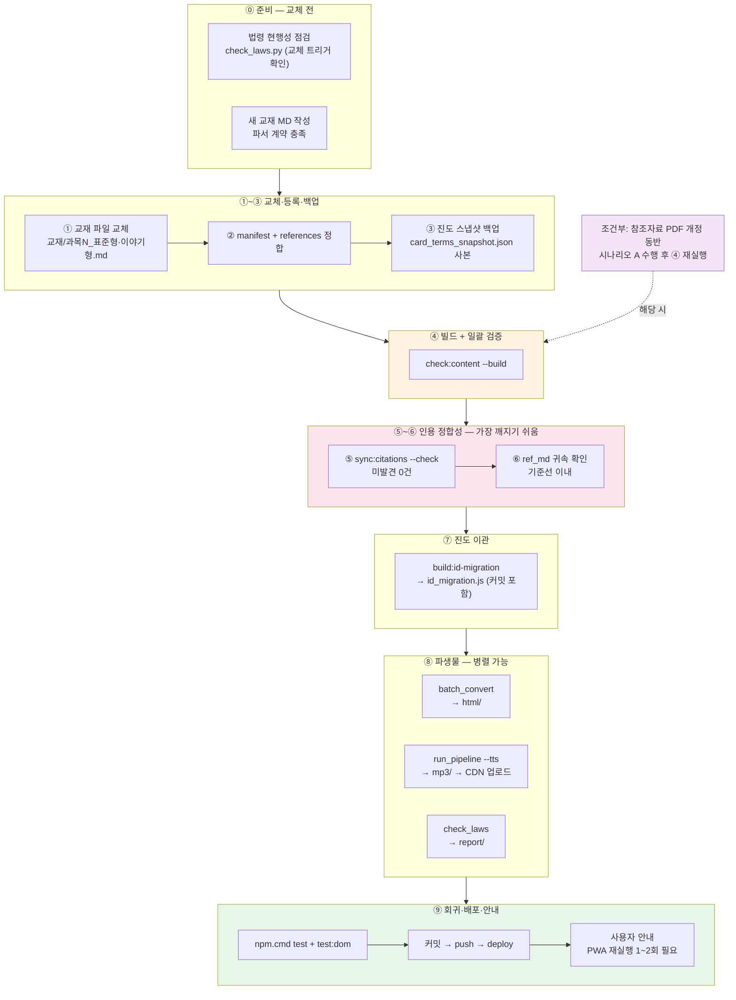

# 교재 교체 작업 순서도 (Runbook)

> **대상**: 과목 교재를 통째로 교체하거나 교재 전면 개정을 반영할 때의 **시간 순서 작업 절차**.
> 상세 근거는 `docs/dev/CONTENT_WORKFLOW.md` §3.1-1(8계층)과 `ref-pipeline/README.md` 시나리오 A/B를 따른다.

```powershell
# 작업 시작 전 — 대상 시험 지정 (cosmetic이 기본값, 다른 시험은 명시)
$env:EXAM_CONTENT_ROOT = "content/exams/cosmetic"   # 또는 다른 시험 경로
```

## 전체 흐름



## 순서별 상세

| # | 단계 | 명령/작업 | 통과 기준 (게이트) | 상세 |
|---|---|---|---|---|
| 0 | 사전 점검 | 0a `python ref-pipeline/check_laws.py` — 인용 법령 개정이 교체 원인인지 확인<br/>0b 새 교재 MD 작성 — `| 용어 \| 설명 |` 표, `🔖/📌/★` 마커, `## N.` 챕터, 참조 링크 `../참조자료/ref_md/과목N/…` | 법령 판정 확인 + 파서 계약 충족 | TEXTBOOK_AUTHORING_GUIDE |
| 1 | 파일 교체 | `{EXAM}/교재/{과목}/` 에 `_표준형.md`·`_이야기형.md` 배치 | 파일명 규칙 일치 | CONTENT_WORKFLOW §3.1 |
| 2 | 등록 정합 | `manifest.json`(subjects.dir·file/storyFile·exams·integratedExam) + `references.json`(subjectDirMap·refDirs·referenceFiles) | 선언↔파일 일치 | §3.1-1 ① |
| 3 | **백업** | `{dataRoot}/card_terms_snapshot.json` + `id_migration.js` 사본을 작업 브랜치 외 별도 위치에 보관 | 복원 가능한 사본 확보 | 롤백 절차 참조 |
| 4 | 빌드+검증 | `npm.cmd run check:content -- --build` (수 분 소요) | 전 계층 통과 | §3.1-1 ④ |
| 5 | 인용 동기화 | `node tools/sync_citation_lines.js --check` → 필요 시 실행 후 재--check | **미발견 0건** | §3.1-1 ⑤ |
| 6 | ref_md 귀속 | `node tools/check_ref_subjects.js` + `check_reflayout.js` | 불일치가 교체 전 기준선 이내 | §3.1-1 ⑥ |
| 7 | 진도 이관 | `npm.cmd run build:id-migration` → `id_migration.js`·스냅샷 **커밋 포함** | 이관 맵 생성; 삭제 용어 진도는 사용자 안내 | §3.1-1 ⑦ |
| 8 | 파생물 (병렬 가능) | 8a `python ref-pipeline/batch_convert.py` → `html/`<br/>8b `python ref-pipeline/audiobook/run_pipeline.py --subject {키} --tts` → `mp3/` → **CDN 업로드 + `AUDIO_BASE_URL` 확인** (MP3는 Vercel 배포 불가)<br/>8c `python ref-pipeline/check_laws.py` → `report/` | 변환 성공 + `build:audio-manifest` + CDN URL 유효 | ref-pipeline README 시나리오 B |
| 8' | 참조자료 (조건부 병행 트랙) | 법령 개정 동반 시: `convert:refs` → `verify:refs` → 수동 승격 → `check:reffresh --update` → **④부터 재수행** | verify 누락 0 | ref-pipeline README 시나리오 A |
| 9 | 회귀·배포·안내 | `npm.cmd test` + `npm.cmd run test:dom` → 커밋 → `npm.cmd run deploy` → 설치형 PWA 사용자에게 **완전 종료 후 1~2회 재실행** 안내 (sw 캐시 전파 지연) | 552+/358+ 통과, clean tree | AGENTS.md 배포 절차 |

## 순서의 이유 (의존성)

```
교재 교체가 라인 번호를 밀리게 함
    → ④ 빌드/검증으로 깨진 인용을 먼저 "탐지" (sync:citations가 build:data에 통합 — 빌드가 곧 1차 동기화)
    → ⑤ --check로 잔여 미발견을 "확인"
    → ⑥ 귀속은 갱신된 인용 기준으로만 평가 가능
    → ⑦ id_migration은 최종 교재 기준으로 한 번만 생성 (③ 백업이 없으면 이 단계 결과를 되돌릴 수 없음)
    → ⑧ 파생물(html/mp3/report)은 최종 교재가 확정된 후 생성해야 재작업 없음 — 3종은 서로 독립이라 병렬 실행 가능
    → ⑨ 배포 후에도 sw 캐시 때문에 설치형 사용자에게 즉시 반영되지 않음 — 안내까지가 완료
```

## 롤백 절차 (검증 실패·배포 후 문제 발견 시)

```powershell
# A. 배포 전 검증 단계에서 실패 → 작업 취소
git checkout -- content/exams/<id>/ data/exams/<id>/   # 콘텐츠·번들 복원
#    + ③에서 백업한 card_terms_snapshot.json / id_migration.js 사본 복원

# B. 배포 후 발견 → 커밋 되돌리기
git revert <교체 커밋>
npm.cmd run build:data                                 # 번들 재생성
npm.cmd run deploy                                     # 재배포
#    ※ 사용자 진도는 id_migration이 이관한 상태라 일부 손실 가능 — 사전 안내 권장
#    ※ mp3/는 CDN에 올라간 상태라 git revert 대상 아님 — CDN 측 교체 필요
```

## 부분 변경 시 생략 가능 단계

| 변경 범위 | 필요 단계 |
|---|---|
| 교재 일부 문장 수정 | ④ → ⑤ → ⑨ (⑧는 영향 있는 경우만) |
| 과목 1개 교재 교체 | 전 단계 (⑧b는 해당 과목만 `--subject`) |
| 교재 전면 교체 | 전 단계 + ⑧' 참조자료 재검증 권장 |
| 문제은행만 수정 | ④ (+ `build:drills`) → ⑨ |

## 소요시간 참고

- ④ `check:content --build` — 수 분 (전 계층 일괄 검증)
- ⑧a/b/c — 상호 독립, 병렬 터미널 실행 가능 (⑧b TTS는 챕터당 수 분 + API 레이트리밋)
- 이 시간들은 `LEARNING_PREMIUM_PLAN.md`의 **콘텐츠 제작시간 KPI** 측정 단위이기도 하다 — 두 번째 시험 추가 시 단계별 실측 기록 권장
