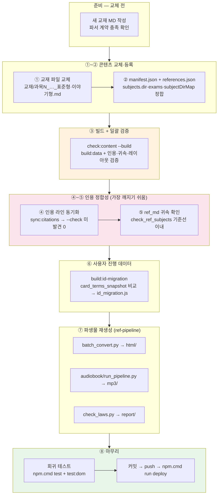

# 교재 교체 작업 순서도 (Runbook)

> **대상**: 과목 교재를 통째로 교체하거나 교재 전면 개정을 반영할 때의 **시간 순서 작업 절차**.
> 상세 근거는 `docs/dev/CONTENT_WORKFLOW.md` §3.1-1(8계층)과 `ref-pipeline/README.md` 시나리오 B를 따른다.
> 이 문서는 "무엇을 어느 순서로 실행하는가"만 담은 단일 페이지 런북.

## 전체 흐름



## 순서별 상세

| # | 단계 | 명령/작업 | 통과 기준 (게이트) | 상세 |
|---|---|---|---|---|
| 0 | 새 교재 준비 | 교재 MD 작성 — `| 용어 \| 설명 |` 2열 표, `🔖기출/📌중요/★필수` 마커, `## N.` 챕터 헤딩, 참조 링크 `../참조자료/ref_md/과목N/…` | 파서 계약 충족 | TEXTBOOK_AUTHORING_GUIDE |
| 1 | 파일 교체 | `{EXAM}/교재/{과목}/` 에 `과목N_…_표준형.md`·`_이야기형.md` 배치 | 파일명 규칙 일치 | CONTENT_WORKFLOW §3.1 |
| 2 | 등록 정합 | `manifest.json`(subjects.dir·file/storyFile·exams·integratedExam) + `references.json`(subjectDirMap·refDirs·referenceFiles) | 선언↔파일 일치 | §3.1-1 ① |
| 3 | 빌드+검증 | `npm.cmd run check:content -- --build` | 전 계층 통과 (인용·귀속·레이아웃·드릴·파서·임포트·자산·카드·테스트) | §3.1-1 ④ |
| 4 | 인용 동기화 | `node tools/sync_citation_lines.js --check` → 필요 시 실행 후 재--check | **미발견 0건** — 라인이 밀린 `(L####)` 인용 재탐색 완료 | §3.1-1 ⑤ |
| 5 | ref_md 귀속 | `node tools/check_ref_subjects.js` + `check_reflayout.js` | 불일치가 교체 전 기준선 이내 | §3.1-1 ⑥ |
| 6 | 진도 이관 | `npm.cmd run build:id-migration` → `id_migration.js`·스냅샷 **커밋 포함** | 이관 맵 생성; 삭제 용어 진도는 사용자 안내 | §3.1-1 ⑦ |
| 7 | 파생물 (ref-pipeline) | ⑦a `python ref-pipeline/batch_convert.py` → `html/`<br/>⑦b `python ref-pipeline/audiobook/run_pipeline.py --subject {키} --tts` → `mp3/` (사용 시)<br/>⑦c `python ref-pipeline/check_laws.py` → `report/` (`LAW_OC`) | 변환 성공 + `build:audio-manifest`로 매니페스트 갱신 | ref-pipeline README 시나리오 B |
| 8 | 참조자료 (조건부) | 법령 개정 동반 시에만: `convert:refs` → `verify:refs` → 수동 승격 → `check:reffresh --update` → ③부터 재수행 | verify 누락 0 | ref-pipeline README 시나리오 A |
| 9 | 회귀·배포 | `npm.cmd test` + `npm.cmd run test:dom` → 커밋 → `npm.cmd run deploy` | 552+/358+ 통과, clean tree | AGENTS.md 배포 절차 |

## 순서의 이유 (의존성)

```
교재 교체가 라인 번호를 밀리게 함
    → ③ 빌드/검증으로 깨진 인용을 먼저 "탐지"
    → ④ sync:citations로 "재탐색·갱신"
    → ⑤ 귀속은 갱신된 인용 기준으로만 평가 가능
    → ⑥ id_migration은 최종 교재 기준으로 한 번만 생성
    → ⑦ 파생물(html/mp3/report)은 최종 교재가 확정된 후 생성해야 재작업 없음
    → ⑧ 배포는 모든 산출물이 커밋된 뒤
```

- **`check:content --build`를 ③에서 실행하는 이유**: 인용 동기화(`sync:citations`)가 `build:data`에 통합되어 있어, 빌드가 곧 1차 동기화 시도다. ④의 `--check`는 그 결과의 잔여 미발견을 확인하는 절차.
- **파생물을 ⑦로 미루는 이유**: ④에서 인용 라인이 바뀌면 교재 MD가 또 한 번 수정될 수 있으므로, HTML/MP3는 교재가 확정된 뒤 만든다.
- **`id_migration`의 스냅샷은 커밋 대상**: 배포된 직전 빌드의 ID 집합이 저장돼 있어야 다음 교체 때 진도 이관이 동작한다.

## 부분 변경 시 생략 가능 단계

| 변경 범위 | 필요 단계 |
|---|---|
| 교재 일부 문장 수정 | ③ → ④ → ⑨ (⑦는 영향 있는 경우만) |
| 과목 1개 교재 교체 | 전 단계 (⑦b는 해당 과목만 `--subject`) |
| 교재 4과목 전면 교체 | 전 단계 + ⑧ 참조자료 재검증 권장 |
| 문제은행만 수정 | ③ (+ `build:drills`) → ⑨ |
