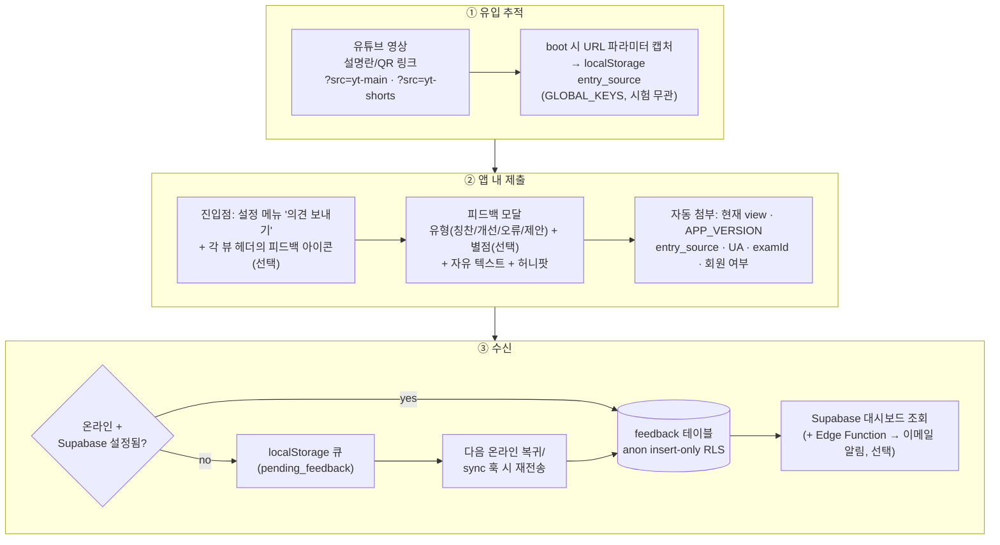

# 사용자 피드백 수신 설계 — YouTube 유입 대응

> **작성일**: 2026-09-26
> **목적**: 유튜브 홍보 영상을 보고 유입된 사용자의 의견·오류 신고·기능 제안을 앱 안에서 수집하는 기능 설계
> **관련 문서**: [SUPABASE_DESIGN.md](SUPABASE_DESIGN.md) (계정·동기화 인프라), [READER_FEEDBACK_DESIGN.md](READER_FEEDBACK_DESIGN.md) (수신된 피드백의 큐레이션·공유 — 본 문서는 **수신 쪽 절반**), [유튜브_홍보동영상_제작의뢰서](../../business/유튜브_홍보동영상_제작의뢰서.md)
> **상태**: **구현됨** (2026-09-26) — `src/feedback.js`, 설정 메뉴 "의견 보내기". `feedback` 테이블은 `tools/supabase/schema.sql`에 정의됐으나 실제 적용은 Supabase SQL Editor 수동 실행 필요

---

## 1. 요구사항 정의

| # | 요구 | 배경 |
|---|------|------|
| F1 | **비로그인 사용자도 제출 가능** | 유튜브 유입 초기 사용자는 계정 없이 씀 — 가입 요구는 피드백 포기로 이어짐 |
| F2 | **유입 채널 자동 태깅** | "유튜브를 보고 온" 사용자의 의견인지 구분할 수 있어야 영상 효과 측정 가능 |
| F3 | **제출 시점의 앱 상태 첨부** | 현재 화면·버전·기기 — 오류 신고 재현에 필수 |
| F4 | **오프라인 내성** | PWA 특성상 오프라인 제출은 큐잉 후 재전송 |
| F5 | **관리 부담 최소** | 1인 운영 — 별도 어드민 UI 없이 Supabase 대시보드(+ 이메일 알림)로 확인 |
| F6 | **스팸·어뷰징 방어** | 공개 insert 엔드포인트의 악용 방지 |

## 2. 전체 흐름



## 3. 유입 채널 추적 (`entry_source`)

- **링크 규격**: `https://personalized-skincare-study.vercel.app/?src=yt-main`
  - 메인 영상 `yt-main`, 쇼츠 `yt-shorts`, 범퍼 `yt-bumper`, 그 외 채널 `bl`·`ig` 등 임의 확장
  - QR 코드에도 동일 파라미터 URL 삽입
- **캡처 로직** (app.js boot 초기, ~20줄):
  ```js
  const src = new URLSearchParams(location.search).get('src');
  if (src && /^[a-z0-9-]{1,20}$/.test(src)) {
    storage.setJSON('entry_source', { src, ts: Date.now() });
  }
  ```
- **`GLOBAL_KEYS` 등록** — 시험 전환 시 유지되어야 하므로 비스코프 키
- **유효기간**: 첫 방문 기록은 영구 보존(최초 유입 채널), 제출 시점의 최근 채널은 별도 기록 가능 — MVP는 최초 1건만 보존
- **주의**: 파라미터는 캡처 후 URL에서 제거(`history.replaceState`)해 주소창 오염 방지

## 4. 피드백 UI

### 4-1. 진입점

| 위치 | 형태 | 비고 |
|------|------|------|
| 설정 메뉴(⚙️) | "의견 보내기" 버튼 — "변경 이력" 아래 | 1순위, 기존 메뉴 패턴 재사용 |
| 신기능 안내 | ⚙️ 버튼 빨간 점(패널 첫 오픈까지) + "의견 보내기" NEW 배지(첫 클릭까지) | `feedback_dot_seen`/`feedback_hint_seen` — 각 1회성, `initFeedbackHint()`가 부팅 시 부착 |
| 피드백 완료 후 | 토스트 + "불편한 화면" 컨텍스트 힌트 | — |
| (확장) 각 뷰 상단바 | 작은 💬 아이콘 | MVP 이후 — 화면 점유 vs 수집률 트레이드오프 |

### 4-2. 모달 구성 (`src/feedback.js` 신규 모듈)

```
┌─────────────────────────────┐
│ 💬 의견 보내기               │
│                             │
│ 유형  [칭찬][개선][오류][제안]  │  ← 칩 선택 (기본: 개선)
│ 평가  ★★★★★ (선택)          │  ← 터치 가능 별점, 미선택 허용
│                             │
│ ┌─────────────────────────┐ │
│ │ 어떤 점이 좋았거나        │ │
│ │ 불편했는지 알려주세요     │ │
│ └─────────────────────────┘ │
│                             │
│ 📎 첨부: 대시보드 · v369 · yt-main │  ← 자동 컨텍스트 표시 (읽기 전용)
│                             │
│        [ 보내기 ]           │
└─────────────────────────────┘
```

- 오버레이는 `whats-new-overlay`와 같은 **전용 ID + 공용 백드롭 스타일** 패턴
- 포커스 트랩·Esc 닫기·`is-hidden` 규칙 준수, `data-click` 위임
- 본문 하단에 "연락처·이름 등 개인정보는 넣지 말아 주세요" 안내

## 5. 데이터 스키마

```sql
create table public.feedback (
  id          uuid primary key default gen_random_uuid(),
  created_at  timestamptz not null default now(),
  user_id     uuid references auth.users,          -- 로그인 시만 (없으면 null = 익명)
  kind        text not null check (kind in ('praise','improve','bug','idea')),
  rating      smallint check (rating between 1 and 5),
  body        text not null check (char_length(body) between 4 and 2000),
  view        text,                                -- 제출 시점 뷰 id
  app_version text,
  entry_src   text,                                -- yt-main 등 유입 채널
  exam_id     text,
  user_agent  text,
  meta        jsonb                                -- 허니팝 통과 여부 등 부가
);

-- 익명·로그인 모두 insert만 허용, 조회는 불가 (service role만)
create policy "public insert" on public.feedback
  for insert to anon, authenticated with check (true);
-- select/update/delete 정책 없음 = 전면 차단 (대시보드는 service role로 조회)
```

- `tools/supabase/schema.sql`에 추가 — 기존 마이그레이션 방식 그대로
- **유저 측 개인정보 차단**: `body`에 이메일/전화번호 패턴 검출 시 경고 토스트(클라이언트 측 best-effort)

## 6. 어뷰징 방어

| 수단 | 구현 |
|------|------|
| 허니팝 | 숨김 입력 필드(`tabindex=-1`, `aria-hidden`) — 채워지면 서버에 `meta.honeypot=true`로 저장·대시보드에서 필터 |
| 클라이언트 쿨다운 | 마지막 제출로부터 60초 미만이면 "잠시 후" 토스트 (localStorage `feedback_last_ts`) |
| 길이·빈값 제한 | 서버 CHECK 제약 (4~2000자) |
| (선택) Edge Function | 시간당 IP별 건수 제한 — MVP 후 보고 수치 보고 도입 |

익명 insert라 완벽한 방어는 불가 — 목표는 "대시보드에서 필터 가능할 만큼 스팸 표식을 남기는 것" 수준으로 충분합니다.

## 7. 오프라인·실패 처리

- 제출 실패(오프라인·Supabase 미설정) 시 `pending_feedback` 배열에 `{kind, rating, body, view, app_version, entry_src, ts}` push (최대 20건)
- 재전송 타이밍: ① `online` 이벤트(app.js에서 `flushPendingFeedback` 호출), ② 다음 `submit` 시 선행 큐와 함께 일괄 전송 — sync.js 훅 편승은 로그인 전용 경로라 익명 큐에는 적용하지 않음
- Supabase 미설정 환경(로컬 개발)에서는 큐에만 쌓고 "오프라인으로 저장됐어요" 안내 — 앱 동작은 동일

## 8. 관리(조회) 측

### 8-1. 조회

- **Supabase 대시보드 Table Editor**로 `feedback` 조회 — `entry_src` 필터로 유튜브 유입 의견만 추출
- 자주 쓰는 조회 (SQL Editor에 저장 권장):

```sql
-- 최근 7일 의견
select created_at, kind, rating, body, view, entry_src
from public.feedback
where created_at > now() - interval '7 days'
order by created_at desc;

-- 유튜브 유입분만
select * from public.feedback where entry_src like 'yt-%' order by created_at desc;
```

- 수신된 유용한 피드백은 `READER_FEEDBACK_DESIGN.md`의 큐레이션 파이프라인으로 이어짐 (해당 문서의 "수집" 단계가 본 기능으로 대체)

### 8-2. 실시간 알림 — Database Webhook → Edge Function → Discord

구현됨: `tools/supabase/functions/feedback-notify/index.ts`. `feedback` 테이블 INSERT 시
즉시 Discord 채널에 요약(유형·별점·본문·뷰/버전/유입채널)을 전달한다.
앱 코드 변경·재배포 없이 아래 절차만으로 활성화된다.

#### ① Discord 측 준비

1. 알림을 받을 Discord 서버에 채널 생성 (예: `#app-feedback`) — 서버가 없으면 새로 생성
2. 채널 우클릭 → **채널 편집** → **연동(Integrations)** → **웹후크(Webhooks)** → **웹후크 만들기**
3. 이름을 `Passmula 피드백` 등으로 짓고 **웹후크 URL 복사**
   - 형태: `https://discord.com/api/webhooks/<id>/<token>` — 이 URL이 곧 발송 키이므로 외부 노출 금지

#### ② Supabase CLI 로그인·프로젝트 연결 (최초 1회)

```powershell
npm.cmd install -g supabase      # 또는: scoop install supabase
supabase login                   # 브라우저가 열리며 계정 인증
cd C:\Project\Personalized_Skincare
supabase link --project-ref hunpzznyiaddekuggupu   # supabase-config.js의 URL과 같은 프로젝트
```

#### ③ Edge Function 배포 + 시크릿 등록

```powershell
supabase functions deploy feedback-notify --project-ref hunpzznyiaddekuggupu
supabase secrets set `
  DISCORD_WEBHOOK_URL="https://discord.com/api/webhooks/...." `
  WEBHOOK_SECRET="<임의의 긴 문자열 — 예: 승인용 비밀번호 생성기로 만든 32자>"
```

- `WEBHOOK_SECRET`은 무단 호출 차단용 — 아무 값이나 가능, ④에서 같은 값을 헤더에 넣는다
- 시크릿은 Edge Function 환경변수에만 존재 — 클라이언트 번들에 키가 추가되지 않는다

#### ④ Database Webhook 생성

Supabase 대시보드 → **Database → Webhooks → Create a new hook**:

| 항목 | 값 |
|------|-----|
| Name | `feedback-discord` |
| Table | `public.feedback` |
| Events | `Insert` 만 체크 |
| Type of webhook | `HTTP Request` |
| Method | `POST` |
| URL | `https://hunpzznyiaddekuggupu.supabase.co/functions/v1/feedback-notify` |
| HTTP Headers | `x-webhook-secret: <③과 동일한 문자열>` |

#### ⑤ 동작 확인

1. 앱에서 테스트 의견 1건 제출 (또는 SQL Editor에서 `insert into public.feedback (kind, body) values ('praise','테스트');`)
2. Discord 채널에 `새 의견 — 칭찬` embed가 도착하면 성공
3. 안 오면: Supabase 대시보드 → **Edge Functions → feedback-notify → Logs**에서 오류 확인
   - `403 forbidden` → WEBHOOK_SECRET과 webhook 헤더 값 불일치
   - `502 discord error` → DISCORD_WEBHOOK_URL 오타·만료

#### 참고

- 알림 채널을 Slack/Telegram으로 바꾸려면 함수의 `fetch` 블록만 교체 (Slack: `{"text": ...}` JSON POST,
  Telegram: `https://api.telegram.org/bot<token>/sendMessage`)
- 관리자가 여럿이면 각자 Discord 서버에 접속만 하면 되므로 별도 계정 발급 불필요
- 알림이 시끄러워지면 Discord 채널을 음소거하거나 webhook만 삭제하면 즉시 중단 — 함수·테이블은 그대로

## 9. 구현 범위 견적

| 작업 | 파일 | 규모 |
|------|------|------|
| 피드백 모듈 (모달·제출·큐) | `src/feedback.js` 신규 | ~200줄 |
| 설정 메뉴 버튼 | `index.html` + `event-listeners.js` | ~15줄 |
| 유입 파라미터 캡처 | `app.js` boot | ~20줄 |
| 스키마 | `tools/supabase/schema.sql` | ~25줄 |
| 프리캐시 등록 | `sw.js` SHELL_ASSETS | 1줄 |
| 테스트 | `tests/unit/feedback.test.js` + `tests/dom/feedback.dom.test.js` | 큐잉·쿨다운·모달 |

## 10. 리스크·한계

- **유료화 신호 없음** — 피드백만으론 Pro 전환율 측정 불가. 유입 수 자체는 Vercel Analytics/UTM 통계로 별도 확인
- **익명이라 회신 불가** — 기본 설계는 수신 전용. 회신 경로 옵션은 §10-1 참조
- **Supabase 의존** — 백엔드 장애 시 큐잉으로 흡수, 앱 기능에는 영향 없음 (Local-First 유지)

### 10-1. 익명 제출의 회신 옵션 비교

MVP는 수신 전용이지만, 회신이 필요해지면 아래 중 선택합니다.

| 방식 | 구조 | 트레이드오프 | 판정 |
|------|------|------------|------|
| **선택적 이메일 필드** | 모달에 "회신 원하면 이메일 (선택)" + 스키마 `contact_email text nullable` | 유일하게 개인 회신 가능. 단, 개인정보 수집·보관·파기 방침(개인정보처리방침 명시) 필요 | **첫 확장으로 권장** — 답변을 원하는 사용자만 자발적으로 정보 제공 |
| **제출 티켓 코드** | 제출 시 `FB-XXXX` 코드 발급 → "내 의견 확인" 뷰에서 코드 입력 → 관리자 답변 조회 | 개인정보 무수집 양방향. 조회 UI + 관리자 답변 입력 경로 추가 공수 큼 | 건수가 많아지고 반복 문의가 생기면 검토 |
| **로그인 유도** | "답변 받으려면 로그인" 선택지 — 기존 Supabase Auth 재사용 | 유튜브 초기 유입자는 로그인하지 않아 커버리지 낮음 | 단독으론 부족, 이메일 필드와 병행 |

### 10-2. 익명이어도 산출 가능한 것

- 유형·별점 집계 ("yt 유입자 평균 ★3.2, 개선 요청 80%")
- 화면 컨텍스트 분석 (`view` 필드로 불만 집중 화면 파악)
- 버전 추적 (`app_version`으로 어느 배포의 불만인지 귀속)
- **인앱 공지로 간접 회신** — 반복 불만은 `release-notes`·공지로 "다음 버전에 반영" 전체 공지 (개인 회신은 아니지만 실질적 응답 채널)

## 11. 확장 후보 (MVP 이후)

- **선택적 이메일 회신 필드** (§10-1 첫 확장 권장) — 스키마 `contact_email` + 개인정보 안내 문구
- 뷰별 피드백 아이콘 + 컨텍스트 자동 첨부 고도화 (스크린샷 첨부는 의무적으로 수동)
- 만족도(NPS) 주기 서베이 — 피드백 모달과 같은 채널
- ~~대시보드 알림 Edge Function~~ — **구현됨** (§8-2, Discord). 주간 요약은 미구현
- 피드백 → GitHub Issue 자동 변환
