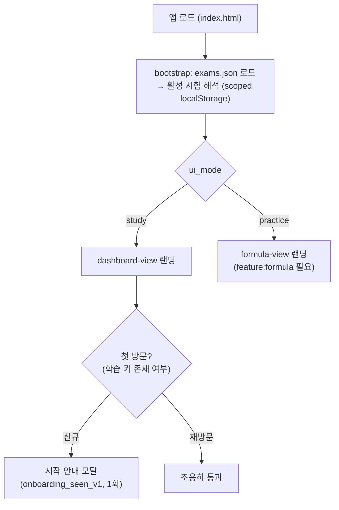
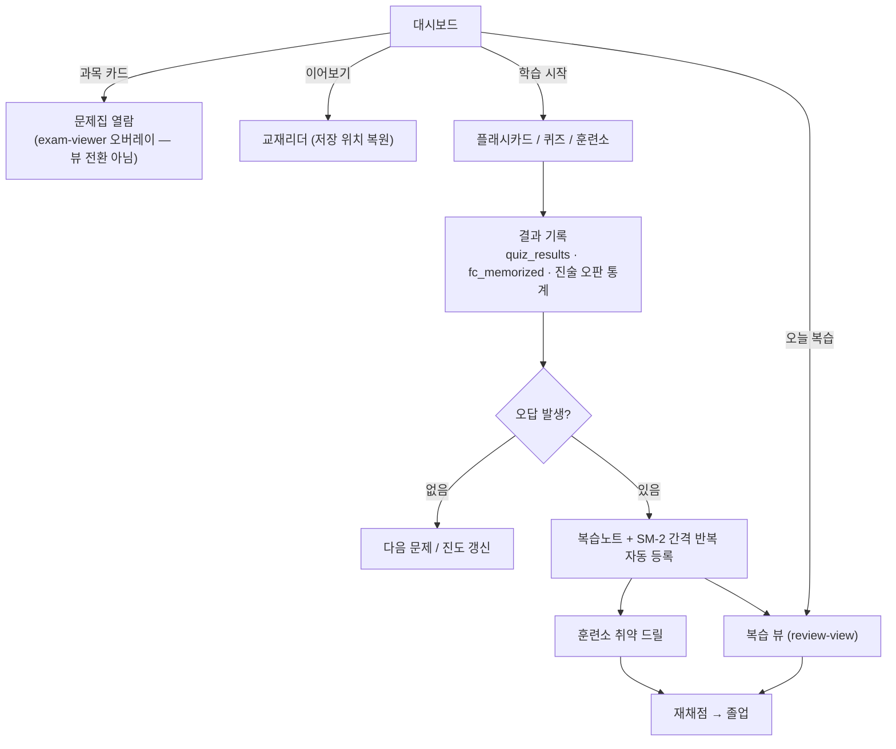
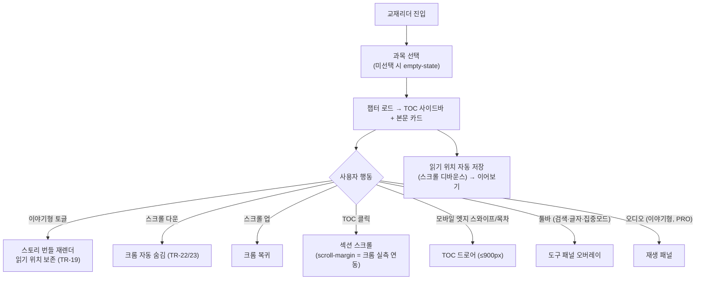
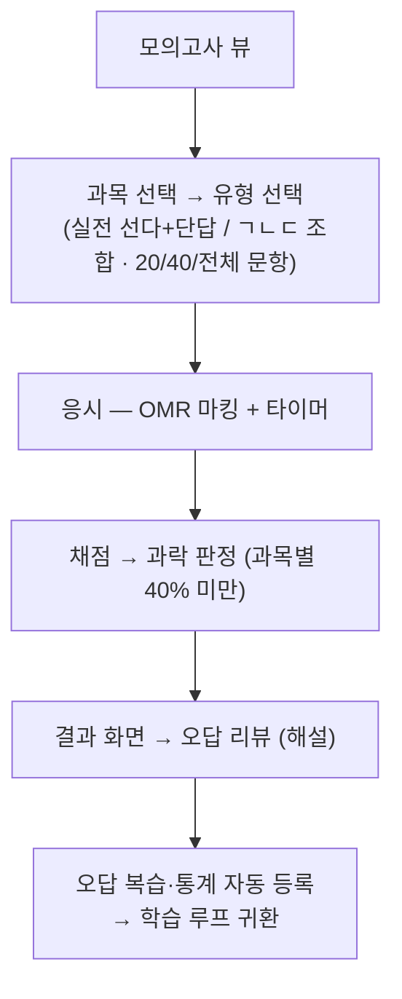
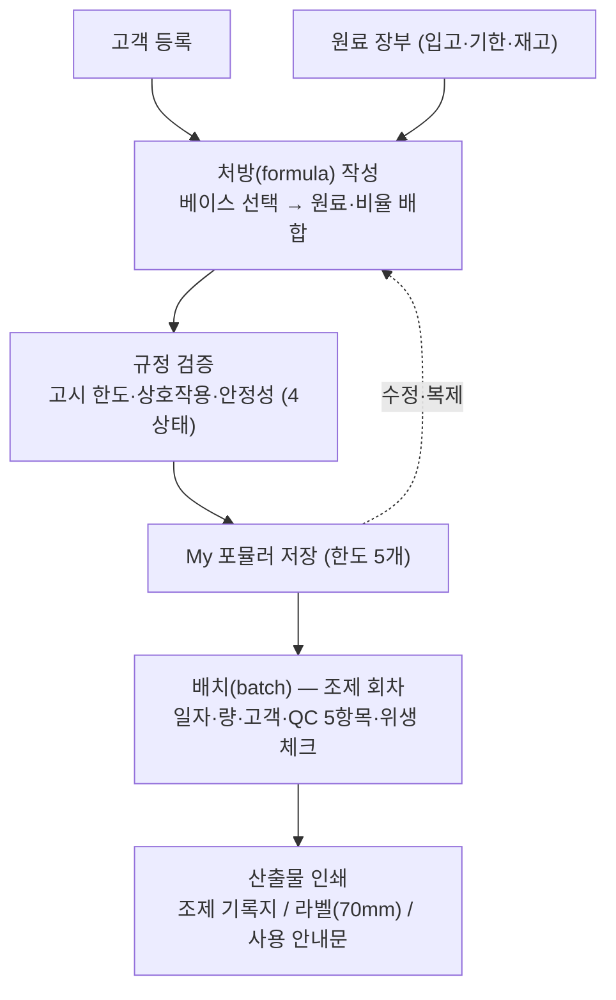
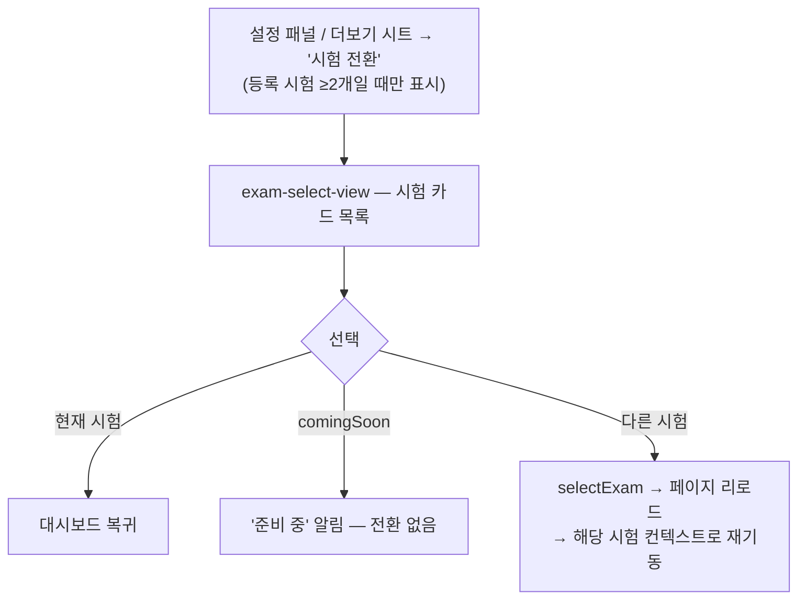
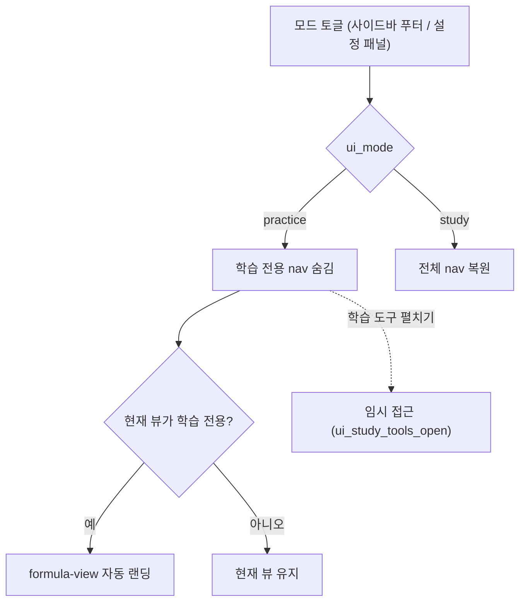
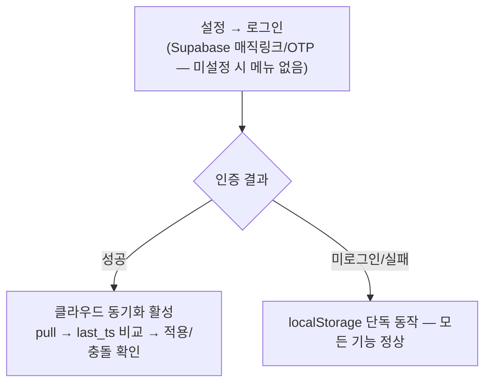

# 사용자 흐름 명세 (User Flow)

> **목적**: 화면 간 전환·상태 분기를 개발자와 AI 코딩 도구가 오해 없이 구현할 수 있도록, 핵심 사용자 여정을 흐름도 + 진입/종료 조건으로 정의한다. 화면 단위 요구사항은 [SPEC.md](../SPEC.md) §3.x, 화면 인벤토리는 [SCREEN_MAP.md](../reference/SCREEN_MAP.md) 참조 — 본 문서는 **"흐름"의 계약**이다.
> **작성 규칙**: 각 흐름은 ① 진입 조건 ② 분기 다이어그램 ③ 종료/전이 조건 ④ 상태 저장 지점(localStorage 키) 순으로 기술. 새 화면 간 전환을 추가할 때는 해당 흐름을 먼저 갱신한다.
> **최종 업데이트**: 2026-10-02
> **문서 ID**: DOC-DSN-11
> **관련 SPEC ID**: `UX-NAV-06~08`(팔레트·스크롤·해시 라우팅) · `UX-FB-05`(온보딩) · `UM-01~05`(모드 전환) · `TR-01~23`(리더) · `FO-01~23`(Formula OS) · `AU-01~08`(계정·동기화 §3.19)

---

## 1. 앱 기동 — 첫 방문 vs 재방문

| 항목 | 규약 |
|------|------|
| 초기 뷰 | 해시(`#/slug`) 딥링크 우선 → 없으면 모드별 랜딩 (UX-NAV-08) |
| 첫 방문 판정 | `quiz_results`/`fc_memorized`/`study_streak`/`sim_results_history` 중 하나라도 존재 → 재방문 (`src/onboarding.js`) |
| 온보딩 | 3단계 안내(문제집·모의고사·복습 루프) — 확인/ESC/백드롭 닫기, 설정 메뉴로 재열람 가능 |

## 2. 핵심 학습 루프

| 저장 지점 | 키 | 내용 |
|----------|-----|------|
| 퀴즈 결과 | `quiz_results` | 점수·오답 → 리뷰 목록 원천 |
| 카드 암기 | `fc_memorized` | 완료 배지·진도 |
| 오판 통계 | statement-tracker | 진술 원자(sid) 단위 — SM-2 졸업 판정 |
| 학습 활동 | `study_streak` 등 | 캘린더·스트릭 표시 |

**계약**: 모든 학습 완료 경로는 진도를 `localStorage`에 즉시 저장하고(오프라인 우선), 로그인 사용자는 클라우드 동기화로 이어진다(§3.19). "오답 → 복습 등록"은 자동이며 사용자 액션을 요구하지 않는다.

## 3. 교재 읽기 흐름

| 항목 | 규약 |
|------|------|
| 모드 전환 | 표준형↔이야기형 전환 시 현재 섹션 앵커+오프셋 복원 (TR-19) |
| 뷰 이탈 | 다른 뷰 이동 시 집중 모드 해제 + 오디오 정지 (`navigateToView`) |
| 레이아웃 불변식 | 뷰가 `.main-content` 잔여 높이를 정확히 채움 — 페이지 스크롤 범위 존재 금지 (TR-23) |

## 4. 모의고사 흐름

## 5. Formula OS 실무 흐름

상세 엔티티·생명주기는 [FORMULA_OS_WORKFLOW_DESIGN.md](FORMULA_OS_WORKFLOW_DESIGN.md) (DOC-DSN-02) 참조.

## 6. 시험 전환 흐름

**계약**: 진도·설정은 시험별 scoped localStorage로 독립 (`scopedKey`) — 시험 간 데이터 오염 없음. `ui_mode` 등 기기 설정은 시험과 무관하게 전역.

## 7. UI 모드 전환 (학습 ↔ 실무)

## 8. 계정·클라우드 동기화 (선택)

**계약**: 로그인은 선택 사항이며 기능 게이팅을 하지 않는다(§3.19). 오프라인 상태에서는 로컬 저장이 항상 1차다(§4.1~4.2).

## 9. 공통 상태 규약 (모든 흐름에 적용)

| 상태 | 규약 | 근거 |
|------|------|------|
| 로딩 | `showGlobalLoading()` 전체 오버레이 — 부분 스켈레톤 금지 | UX-FB-04 |
| 빈 상태 | `.empty-state` 패턴 (3rem 아이콘 + 안내 문구 + 다음 행동 유도) | SPEC §4.9.5 |
| 오류 | `showToast(msg,'error')` — 네이티브 alert/confirm 금지 | UX-FB-02 |
| 오프라인 | 전 기능 동작 — 실시간 조회(식약처 고시 등)만 배지로 표시 | §4.1~4.2 |
| 뷰 전환 | 스크롤 복원 / 액션 딥링크는 맨 위 (UX-NAV-07), 해시 동기화 (UX-NAV-08) | — |
