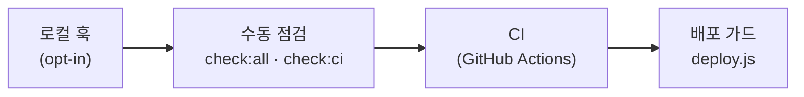

# 🧱 소프트웨어 공학 요소 정리 (Engineering Practices)

> **대상 프로젝트**: Passmula (Cosmetic Pass Master) — 맞춤형화장품 조제관리사 스마트 학습 + Formula OS 실무 플랫폼
> **목적**: 이 저장소에 적용된 소프트웨어 공학적 패턴·기법·검증 기반을 항목별로 정리 — "왜 이렇게 되어 있는가"를 이해하고 같은 원칙으로 확장하기 위한 참조
> **관련 문서**: [VERIFY_DEPLOY_PIPELINE.md](../runbooks/VERIFY_DEPLOY_PIPELINE.md) (게이트 실행 절차) · [ARCHITECTURE.md](../ARCHITECTURE.md) (구조 상세) · [TESTING.md](TESTING.md) (테스트 정책)
> **문서 ID**: DOC-REF-08
> **관련 SPEC ID**: `BP-01~08` (빌드 파이프라인) · `DA-01~09` (데이터 아키텍처)

---

## 1. 단일 소스 오브 트루스 (SSOT)

- `content/exams/<id>/*.md`가 유일한 원본이고 `data/`의 JS 번들은 전부 **생성물**이다. 원본을 편집하고 `build:data`를 실행하면 파생물이 결정적으로 재생성된다
- 같은 패턴이 반복 적용된다: `html/views/*.html + index.template.html → index.html`, `SPEC.md + @spec 주석 → TRACE_MATRIX.md`, `docs/user/*.md → data/docs_md/`
- 생성물 직접 편집은 규칙으로 금지(AGENTS.md)하고, 신선도 게이트가 기계적으로 강제한다 (§3)

## 2. 생성물 파이프라인과 신선도 게이트

"소스를 바꾸고 빌드를 잊는" 실수를 커밋 단계에서 차단하는 것이 이 저장소 검증의 핵심이다.

| 기법 | 구현 |
|---|---|
| 동일 출력 비교 | `check:html` — 파셜을 재조립해 개행 정규화 후 커밋본과 비교 |
| 입력 해시 | `check:trace` — SPEC·`@spec`·문서 헤더·파일 인벤토리의 해시를 산출물 헤더에 박아 비교 |
| 빌드-후-차분 | `check:datafresh` — 실제 빌드 체인을 돌리고 `git diff`로 생성물 범위 변경 감지 (생성기별 --check 불필요) |
| 파일명 스탬프 | 번들 파일명에 `contentHash` 삽입 (`ingredients_data.<hash>.js`) — 참조 무결성 + 캐시 버스팅 겸용 |
| 노이즈 필터 | `generatedAt`·`CACHE_VERSION` 등 비결정 라인은 드리프트 판정에서 제외 |

## 3. 결정성 빌드 (Deterministic Output)

- **개행 정규화**: `.gitattributes`의 `* text=auto eol=lf`로 작업트리까지 LF 고정. 비교·해시·임베드는 모두 `CRLF→LF` 정규화 후 수행 — Windows autocrlf 환경과 Linux CI가 동일 바이트를 산출
- **해시는 정규화 텍스트 기준**: raw 바이트를 해시하면 체크아웃 개행 상태에 해시가 종속되는 결함이 있었고, 정규화 후 해시로 수정된 이력이 있다 (CHANGES.md 2026-09-29)
- **스탬프 분리**: `CACHE_VERSION`·`generatedAt` 같은 비결정 필드는 "배포 스탬프"로 명시적으로 분리하고 신선도 판정에서 제외

## 4. 다층 검증 방어 (Defense in Depth)

같은 게이트를 4중으로 겹쳐 놓았다. 한 층이 우회되어도(훅 미설치, 로컬 점검 생략) CI와 배포 가드가 다시 검사한다. `check:hooks`는 훅 미설치 상태를 비차단 권고로 가시화한다.

## 5. 요구사양 추적성 (Traceability)

- `docs/dev/SPEC.md`의 요구사항 ID ↔ 소스의 `@spec` 주석 ↔ 테스트 ↔ 문서를 `TRACE_MATRIX.md`로 자동 생성·갱신
- `check:specrefs`는 스테일 참조(삭제된 ID 인용)를 차단하고, **테스트 갭 기준선(baseline)**을 0으로 설정해 신규 커버리지 공백이 생기면 즉시 실패
- `impact_tests.js`는 변경 파일 → 영향 요구사항 → 권장 테스트를 매핑해 변경의 파급 범위를 기계적으로 추정한다

## 6. 이중 구현 등가성 (Parser Parity)

교재 MD를 파싱하는 구현이 두 개다 — 빌드 시 플러그인(tools)과 런타임 파서(src). `check:parser`가 두 구현의 출력(cards·quizzes·chapters)을 동일 입력으로 비교해 **회귀와 구현 드리프트를 동시에** 잡는다. 한쪽을 바꾸고 다른 쪽을 잊으면 CI에서 실패한다.

## 7. 테스트 피라미드

| 계층 | 도구 | 역할 |
|---|---|---|
| Unit | `node:test` (738건) | 순수 로직 — 파서, SM-2, 스토어, 규칙 엔진 |
| DOM | Vitest + jsdom | 뷰 컨트롤러 UI 시나리오 (tests/dom/) |
| E2E | Playwright | 실브라우저 부트스트랩·SW·PWA·내비게이션 (CI) |
| Coverage | coverage_merge | 단위·DOM 커버리지 병합 + 게이트 (CI 전용) |

`--quick` 플래그는 "DOM 생략"이라는 명시적 단축 경로를 제공해 피라미드 하위층만 빠르게 반복할 수 있다.

## 8. 문서-코드 동기화 강제

- `check_doc_sync.js`: `src/`·`tools/`·`tests/`·설정 변경을 포함한 커밋에 `docs/`·AGENTS·README 갱신 동반을 요구 — 문서 부패(documentation rot)를 커밋 시점에 차단 (우회는 `[no-docs]`·`SKIP_DOCSYNC=1`로 명시적)
- `check:docs`: 문서 내 경로 참조 존재 검증 + 문서 ID(`DOC-XXX-NN`) 누락·중복 검증 — 문서 간 링크도 깨지면 실패
- 문서 인덱스(`docs/README.md`)와 아키텍처 트리가 새 문서의 등록을 강제하는 관례로 작동

## 9. 안전한 도구 설계

- **비파괴 검사**: `check_data_freshness`는 빌드가 생성물을 덮어쓰기 전 dirty 검사로 사용자 변경을 보호하고, 검사 후 항상 HEAD로 원복한다
- **check/build 이중 모드**: 생성기는 `--check`(검사만)와 쓰기 모드를 분리 — CI는 읽기 전용 검사로 실행
- **권고 vs 차단 분리**: 훅 미설치·SPEC 커버리지 공백 같은 정책 판단이 필요한 항목은 경고(exit 0), 기계적 불일치는 차단(exit 1)

## 10. 배포·버저닝

- `deploy.js` 단일 진입점: clean tree + `origin/main` 동기화 가드 → 품질 게이트 재실행 → `CACHE_VERSION`/`APP_VERSION`을 `v<날짜>-<커밋해시>`로 스탬프 → 커밋·푸시 → `vercel --prod`
- 커밋 해시가 곧 캐시 버전이므로 "어떤 배포가 어떤 코드인가"가 항상 대응한다
- 릴리스 노트는 커밋 subject 초안 + 수동 편집(`notes:draft`)의 반자동 파이프라인

## 11. 프론트엔드 설계 패턴

- **저장소 추상화**: `storage.js`가 localStorage/Supabase를 동일 API로 감싸 백엔드 교체 가능 — 계정 없이도 전 기능 동작(로컬 1차, 클라우드는 선택)
- **PWA 오프라인 우선**: Service Worker 프리캐시 자산 목록을 빌드가 생성(`DATA_ASSETS`·`MD_ASSETS`)하고 `verify:assets`가 존재성을 검증
- **지연 로딩**: Mermaid(3.3MB)·Supabase UMD 등 무거운 의존성은 해당 기능 사용 시 동적 로드
- **XSS 방어**: `sanitize.js`의 escapeHTML/safeTextWithBreaks, Mermaid `securityLevel: 'strict'`, CSP `script-src 'self'`
- **관심사 분리**: `app.js`에서 뷰·스토어·유틸을 기능별 ES 모듈로 분리, import/export 교차 검증(`check:imports`)으로 참조 정합성 유지

## 12. 점진적 품질 관리

- `eslint --max-warnings 0`: 기존 경고도 신규 유입을 허용하지 않아 잡음 누적을 방지
- **기준선(baseline) 패턴**: specrefs의 테스트 갭처럼 "현재 값을 기준선으로 박아두고 악화만 차단"하는 방식으로 레거시 개선을 점진적으로 수행
- CHANGES.md의 날짜별 이력은 각 변경의 **이유**를 기록해 나중에 "왜 이 코드인가"를 추적 가능하게 한다
