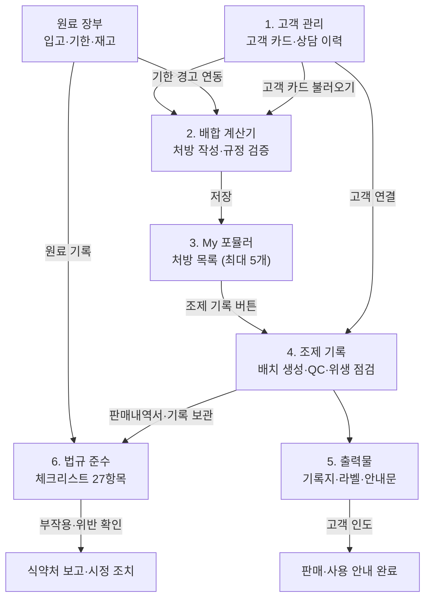

# Passmula — Formula OS 실무 매뉴얼

> **최종 업데이트**: 2026-09-22 · **버전**: v369 · 시험 학습 기능은 [학습 매뉴얼](doc:user_manual) 참조

Formula OS는 맞춤형화장품 조제관리사의 **실무 작업 공간**입니다. 고객 상담부터 처방 설계·조제 기록·원료 관리·법규 점검까지 조제 업무 전 과정을 한곳에서 수행합니다.

> ⚠️ **면책 고지**: 이 앱의 모든 검증·추천·안내문은 참고용 도구입니다. 법정 한도 검증은 규정 준수 확인일 뿐 제품의 안전성·안정성·품질을 보장하지 않으며, 실제 의무 판단은 법령 원문과 관할 지방식약청 안내를 따르세요.

### 🗂️ 화면 구성

*   **허브 카드 7개**: My 포뮬러 · 배합 계산기 · 성분 사전 · 고객 관리 · 조제 기록 · 원료 장부 · 법규 준수
    *   성분 사전은 학습 앱의 **성분 검색 사전**으로 이동합니다 — 원료 상세에서 '포뮬러에 추가'로 계산기에 바로 투입 가능합니다.
*   **실무 모드**: 합격 후 실무만 사용한다면 ⚙️ 설정 → **[모드: 학습 모드]** (또는 사이드바 최하단 토글)로 실무 모드 전환을 권장합니다 — 학습 메뉴가 숨겨지고 이 작업실이 앱의 홈 화면이 됩니다. 자세한 내용은 [학습 매뉴얼 §12.5](doc:user_manual) 참조.
*   **서브내비 칩**: 각 화면 상단의 칩으로 허브 복귀 없이 다른 섹션으로 바로 이동합니다 (My 포뮬러 / 배합 계산기 / 고객 관리 / 조제 기록 / 원료 장부 / 법규 준수)

### 🔄 업무 처리 흐름 (Workflow)

*   **처방(포뮬러)과 배치 분리**: 처방은 재사용 가능한 설계, 배치는 실제 조제 회차 기록 — 같은 처방으로 여러 번 조제하면 회차마다 배치가 쌓입니다.
*   **스냅샷 보존**: 배치에는 생성 시점의 처방명·전성분·검증 결과가 함께 저장되므로, 처방을 수정·삭제해도 과거 조제 기록의 근거가 유지됩니다.

---

## 1. ⚗️ 배합 계산기 (Blending Calculator)

처방(포뮬러)을 작성·검증하는 핵심 화면입니다. **위·아래 고정 바 + 중앙 작업 영역** 구조입니다.

*   **상단 고정 요약바**: 총 제조량(g/ml) 입력과 배합률 합계·검증 요약이 스크롤과 무관하게 항상 보입니다.
*   **하단 고정 액션바**: 포뮬러 이름 입력과 저장·인쇄·JSON 버튼이 항상 표시됩니다. '인쇄'는 현재 처방의 명세서(원료별 배합률·투입량·규정 검증·절차·안정성·전성분)를 A4로 출력합니다.
*   **실제 투입량 자동 계산**: 총 제조량과 원료별 배합률(%)을 입력하면 원료별 투입량과 합계가 즉시 계산됩니다.
*   **합계 100% 판정**: 배합률 합계가 100%이면 🟢 '100% 정상', 부족하면 🟠 'N% 부족', 초과하면 🔴 'N% 초과'.
*   **원료 행 카드**: 위쪽 줄에 원료명·검증 배지·삭제 버튼, 아래쪽 줄에 배합률·투입량·제조 단계를 입력합니다.
*   **제조 단계(Phase) 태그**: 수상부 / 유상부 / 실리콘부 / 기능성 / 후첨가 / 기타. '단계별 정렬'로 공정 순서 정렬.
*   **원료 자동완성**: 원료명 입력 시 원료 DB에서 자동완성. 성분 사전의 '포뮬러에 추가'로도 투입 가능.
*   **원료 기한 경고**: 원료 장부에 같은 이름의 원료가 있으면 행에 기한 배지(`재고 D-N` / `재고 기한 경과`)가 표시됩니다.

### 제조 정보 (접이식)

*   목표 pH·실측 pH(0~14), 제조 절차(최대 20단계), 메모를 기록합니다. 절차는 조제 기록지에 인쇄됩니다.
*   접힌 상태에서도 요약이 표시됩니다 (예: `pH 5.5/5.8 · 절차 4단계 · 메모`).

### 규정 검증 (Regulation Check)

*   원료 행마다 법정 배합 한도와 실시간 비교합니다.
    *   🟢 **한도 이내** · 🟠 **한도 초과** · 🔴 **금지 원료** · ⚪ **확인 필요**
*   ⚠️ '한도 이내'는 규정 준수 확인일 뿐 안전성 보장이 아닙니다. 조건부 한도는 원문 고시를 확인하세요.

### 제형 안정성 체크 (Stability Check)

*   배합비·배합방법이 안정성에 미치는 영향을 규칙 기반으로 점검합니다 — 상 비율(유화제 부재·비율), 원료 상호작용(카보머×양이온성 등), 열 민감 원료 가열 단계, pH 적정대.
*   🟠 **주의** / ⚪ **참고** 두 단계. 규칙에 없는 조합은 판정하지 않으며 모든 안내는 참고용입니다.

### 안정성 실험 확인

*   규칙 경고는 "가능성"일 뿐 — 실제 안정성은 **실험으로만 확정**됩니다. 수행한 실험(실온 경시·가속·가혹·동결-융해·원심분리·보존력)을 기록하세요.
*   결과 **양호**로 확인된 배합은 저장 시 화장품법 전성분 표시 규칙에 따라 **전성분 순서가 자동 생성**됩니다 (1% 초과 내림차순 → 1% 이하 → 색소 최하단).

### 고객 정보 (접이식 — 선택)

*   고객 카드에서 불러오기(`customerId` 참조) 또는 인라인 자유입력 — 둘 다 지원합니다.
*   입력 항목: 고객명·나이·성별·피부 유형·선택 제형·피부 고민(칩 복수 선택) + 안전 정보(알레르기 원료·임신/수유·사용 중 제품).
*   안전 정보는 추천 엔진의 필터·주의문에 활용됩니다. 의학적 판단을 대신하지 않습니다.

### 추천 베이스 · 원료 (Recommendation)

*   규칙 기반(고정 매핑) 엔진 — AI 생성이 아니며 농도는 제안하지 않습니다.
*   제형별 필수 역할(용제·보습제·유화제·보존제 등)과 후보 칩, 고민/피부 유형별 기능성 원료 제안.
*   칩 클릭 → 원료 행 추가 + 단계 자동 태깅. 알레르기 원료·임신/수유 플래그·연령 주의가 자동 반영됩니다.

### 맞춤 추천 규칙 (Custom Rules)

*   자주 쓰는 원료를 추천 후보에 직접 추가 — 대상(베이스 역할/피부 고민/피부 유형) + 원료명으로 등록.
*   JSON 보내기/가져오기로 기기 간 공유 (가져오기는 병합, 중복·한도 초과는 자동 제외).
*   사용 불가 원료·DB 미등록 이름은 추천에 표시되지 않습니다.

---

## 2. 📒 My 포뮬러 (처방 저장)

*   하단 액션바에 이름 입력 → '저장'으로 현재 배합·고객·제조 정보를 저장합니다 (최대 5개).
*   카드에 규정 검증·안정성·고객 요약 배지가 표시되며, 열기·복제·삭제·JSON 보내기·조제 기록 버튼을 제공합니다.
*   **규정 스냅샷**: 저장 시점의 한도 기준이 함께 보존되므로 원료 DB 갱신 후에도 검증 근거가 유지됩니다.
*   **고시 개정 감지**: 저장 후 원료 DB의 기준(유형·한도)이 바뀐 원료가 있으면 카드에 '기준 변경 N' 배지가 표시되고, 계산기에서 열면 상단에 재검증 배너가 나타납니다. 다시 저장하면 스냅샷이 현재 기준으로 갱신됩니다.

---

## 3. 👥 고객 관리 (Phase B)

고객을 카드 단위로 관리하고 상담 이력을 누적합니다 (최대 20명).

*   **고객 카드**: 이름·나이·성별·피부/두피 유형·고민·알레르기·임신 여부·사용 중 제품·목적·메모.
*   **상담 이력**: 고객 상세에서 날짜+내용을 **추가만** 가능(append-only) — 삭제·수정되지 않아 상담 기록이 보존됩니다.
*   **역참조**: 고객 상세에서 해당 고객의 처방·조제 기록을 바로 열 수 있습니다.
*   **처방 연동**: 계산기 고객 정보에서 카드 불러오기 / 현재 입력을 고객 카드로 저장. 처방에 `customerId`가 연결되면 배치 폼에서 자동 선택됩니다.
*   **삭제 시**: 연결된 처방은 인라인 고객 정보(스냅샷)만 남고 참조만 해제됩니다 — 기록은 보존됩니다.

### CSV 가져오기·보내기

기존에 Excel 등으로 관리하던 고객 명단을 CSV로 가져오거나, 목록을 CSV로 보낼 수 있습니다.

*   **CSV 가져오기**: 고객 관리 헤더의 `[CSV 가져오기]` → 파일 선택 → 건수 확인 후 가져옵니다. **같은 이름의 기존 고객은 건너뛰고**(덮어쓰지 않음) 최대 등록 수(20명)를 넘는 행은 제외됩니다.
*   **CSV 보내기**: 등록된 고객 전체를 CSV로 다운로드 — UTF-8 BOM 포함이라 Excel에서 바로 열립니다.
*   **양식**: `[양식]` 버튼으로 빈 CSV를 받아 헤더를 맞춥니다.

| CSV 헤더 | 필드 | 비고 |
| --- | --- | --- |
| 이름 / 고객명 / name | 고객명 | **필수** |
| 나이 / 연령 / age | 나이 | 숫자 |
| 성별 / gender | 성별 | 남성·여성 |
| 피부타입 / 피부유형 / skintype | 피부 유형 | 건성·지성·복합성·중성·민감성 |
| 두피타입 / 두피 / scalptype | 두피 유형 | 건성·지성·민감성·정상 |
| 고민 / 피부고민 / concerns | 피부 고민 | 여러 값은 `;`·`\|`·`/`로 구분 |
| 알레르기 / allergies | 알레르기 이력 | 여러 값은 `;`·`\|`·`/`로 구분 |
| 임신수유 / 임신 / pregnancy | 임신·수유 | '임신'·'수유' 포함 시 자동 매핑 |
| 사용제품 / products | 사용 중 제품 | |
| 목적 / purpose | 조제 목적 | |
| 메모 / 비고 / notes | 메모 | |

> 인코딩은 UTF-8·UTF-8 BOM·**CP949(EUC-KR)**을 자동 인식합니다. Excel에서 저장한 한글 CSV도 그대로 가져올 수 있습니다. 셀 안에 쉼표가 있으면 `"..."`로 감싸세요.

---

## 4. 📋 조제 기록 — 배치 (Phase A)

같은 처방으로 여러 번 조제한 **회차별 기록**입니다 (최대 50건).

*   **배치 생성**: My 포뮬러 카드의 '조제 기록' → 배치 폼. 배치번호는 `YYYYMMDD-NN`으로 자동 채번됩니다.
*   **기록 항목**: 조제 일시·총 제조량·고객(카드 선택 또는 인라인)·권장 사용기한·**고객 인도일**(판매내역서 근거)·메모.
*   **사용기한 자동 제안**: 처방을 선택하면 보존제 유무·수상 여부로 권장 기한이 자동 입력됩니다 (보존제 포함 180일 / 무보존제 수상 제형 14일 / 무보존제 무수 제형 90일). 참고용 제안이며 직접 수정할 수 있습니다.
*   **사용 원료 LOT**: 처방 원료가 원료 장부와 이름으로 자동 매칭되어 사용 LOT를 기록합니다. 복수 LOT이면 직접 선택할 수 있고 기한 임박 순이 기본입니다 — 부작용 보고·리콜 시 역추적에 사용됩니다.
*   **재고 부족 경고**: 총 제조량과 배합률로 원료별 소요량을 계산해 장부 잔량보다 부족하면 경고를 표시합니다.
*   **품질 확인(QC)**: 외관·색상·향·점도·이물 — 각각 정상/이상/미확인. **실측 pH**(0~14)를 회차별로 기록할 수 있습니다.
*   **QC 이상 조치**: 이상 판정 배치에 폐기·재조제·보류 조치를 기록합니다. 이상인데 조치가 없으면 목록에 '조치 미기록' 경고가 표시됩니다.
*   **위생 점검**: 도구 소독·작업대 정리·장갑 착용 체크.
*   **알레르기 교차검증**: 고객 카드를 선택하면 고객의 알레르기 이력 원료가 처방에 포함됐는지 자동 검사해 경고를 표시하고, 저장 전 확인을 요청합니다.
*   **불변 원칙**: 처방·배치번호·조제일시·검증 스냅샷은 저장 후 수정 불가. QC·실측 pH·위생·기한·인도일·조치·LOT·메모만 보정 가능합니다.
*   **스냅샷 보존**: 생성 시점의 처방명·전성분·검증 결과와 **검증에 사용된 원료 DB 버전**이 함께 저장되므로 처방이 나중에 수정·삭제되거나 고시가 개정돼도 기록 근거가 유지됩니다.
*   **목록 필터**: 처방·고객명·QC 상태·인도 여부로 목록을 필터링할 수 있습니다.
*   **CSV보내기**: 목록 헤더의 [CSV] 버튼으로 필터된 조제 기록을 CSV로 저장합니다 (기록 보존·엑셀 보고용).

| CSV 컬럼 | 내용 |
| --- | --- |
| 배치번호 | `YYYYMMDD-NN` 자동 채번 |
| 처방 / 고객 | 처방명·고객명 (스냅샷) |
| 조제일시 | `YYYY-MM-DD HH:mm` |
| 제조량 / 단위 / 제형 | 총 제조량, 단위(g·ml), 제형 |
| QC이상 / QC미확인 | 이상 판정 항목명(`;` 구분) / 미확인 항목 수 |
| 위생 | 완료/전체 (예: `3/3`) |
| 실측pH | 회차별 측정 pH |
| 사용기한 / 인도일 / 조치 | 권장 사용기한, 고객 인도일, QC 이상 조치 |
| 사용LOT | `원료명:LOT` 목록 (`;` 구분) |
| 원료DB버전 | 검증에 사용된 원료 DB 버전 |
| 메모 | 배치 메모 |

### 출력물 3종

*   **조제 기록지**: 처방 정보 + 배치 QC·실측 pH·위생 + 사용 LOT + 인도일 + 조제관리사·확인자 서명란 + 안전 고지 (A4 인쇄·PDF 저장).
*   **제품 라벨**: 제품명·전성분·조제일·사용기한·용량·주의사항 — 소형 라벨 레이아웃.
*   **사용 안내문**: 제형별 사용법·보관법 + 원료 주의·고객 조건(임신/알레르기) 기반 주의사항 자동 병기.

---

## 5. 📦 원료 장부 (Phase C)

원료의 입고·기한·재고를 관리합니다 (최대 30종).

*   **등록 항목**: 원료명·LOT 번호·입고일·사용기한·보관 조건·잔량·단위·메모.
*   **기한 상태**: 기한 경과(빨강) / 30일 이내 임박(주황) / 정상 — 카드 강조 + 상단 경고 배너.
*   **계산기 연동**: 배합 계산기에서 같은 이름의 원료를 쓰면 기한 배지가 자동 표시됩니다.
*   재고 자동 차감은 지원하지 않습니다 — 잔량은 수동으로 갱신합니다.

### CSV 가져오기·보내기

고객 관리와 동일한 방식으로 CSV 가져오기·보내기·양식 다운로드를 지원합니다.

*   **CSV 가져오기**: 원료 장부 헤더의 `[CSV 가져오기]`. **원료명+LOT이 같은 기존 항목은 건너뜁니다** — 이름이 같아도 LOT이 다르면 별도 항목으로 추가됩니다.
*   **CSV 보내기** / **양식**: 고객 관리와 동일.

| CSV 헤더 | 필드 | 비고 |
| --- | --- | --- |
| 원료명 / 원료 / name | 원료명 | **필수** — 계산기 연동은 이름 정확 매칭 |
| LOT / 로트 / 제조번호 | LOT 번호 | 중복 판정 키 |
| 입고일 / 입고 / receivedat | 입고일 | `YYYY-MM-DD`·`YYYY.M.D`·`YYYY/M/D` 인식 |
| 사용기한 / 유통기한 / expiryat | 사용기한 | 날짜 형식 동일 |
| 보관조건 / 보관 / storage | 보관 조건 | 실온·냉장·냉동·냉암소·기타 |
| 잔량 / 수량 / 재고 / qty | 잔량 | 숫자 |
| 단위 / unit | 단위 | g·mL 등 |
| 메모 / 비고 / notes | 메모 | |

---

## 6. ⚖️ 법규 준수 체크리스트 (Phase D)

맞춤형화장품판매업자·조제관리사의 법정 의무를 자가점검합니다.

*   **6개 카테고리 27항목**: 영업·자격(신고·조제관리사 배치·연간 교육·원료 보고) / 시설·위생 / 혼합·소분 안전관리 / 기록 보관 / 표시·안내 / 안전·보고.
*   **법령 링크**: 각 항목에서 화장품법·시행규칙 원문, CGMP, 안전기준·주의사항 규정, 별표 문서로 바로 이동합니다.
*   **앱 기능 연결**: 판매내역서 → 조제 기록, 상담 기록 → 고객 관리, 원료 기록 → 원료 장부 등 관련 섹션으로 바로 이동.
*   **체크 상태 저장**: 점검한 항목은 기기에 저장되고 상단 배지에 진행률이 표시됩니다. '초기화'로 리셋 가능.
*   ⚠️ 자가점검 참고 자료이며 법률 자문이 아닙니다.

---

## 7. 💾 데이터 관리

*   모든 Formula OS 데이터는 **이 기기의 로컬 저장소**에만 보관됩니다 (서버·계정 없음).
*   **⚙️ 설정 → 데이터 백업**에 포뮬러·고객·배치·원료·체크리스트가 자동 포함됩니다 — 기기 변경 전 반드시 백업하세요.
*   저장 한도: 포뮬러 5개 · 고객 20명 · 배치 50건 · 원료 30종.
*   포뮬러·맞춤 규칙은 JSON 파일로 개별보내기/가져오기가 가능합니다.
