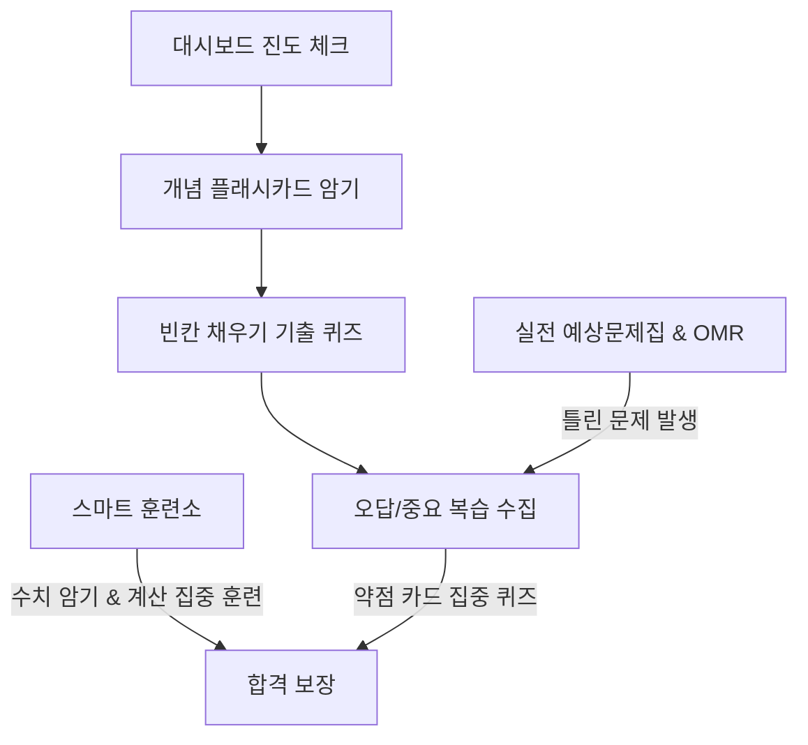

# 맞춤형화장품 조제관리사 스마트 학습 플랫폼 사용자 매뉴얼

본 스마트 학습 플랫폼은 맞춤형화장품 조제관리사 자격증 취득을 위해 법령 암기, 플래시카드, 계산식 연습, 실전 모의고사를 한곳에서 학습할 수 있도록 설계된 프리미엄 SPA(Single Page Application) 학습 포털입니다.

---

## 🧭 전체 학습 흐름 (Workflow)



---

## 1. 📊 학습 대시보드 (Dashboard)

학습의 첫 단추인 대시보드는 현재 나의 학습 진척도와 상태를 시각적으로 분석해 줍니다.

*   **총 학습 진척도**: 데이터베이스의 전체 암기 대상 카드 대비 "외운 카드"의 비중을 퍼센트(%)로 나타냅니다.
*   **퀴즈 정답률**: 지금까지 기출 및 핵심 퀴즈를 풀며 정답을 맞춘 비율을 나타냅니다.
*   **헷갈린 카드 개수**: 플래시카드에서 "헷갈림"으로 선택하거나 모의고사에서 틀려 복습이 필요한 핵심 오답의 잔여 개수입니다.
*   **과목별 학습 상태**: 1과목부터 4과목까지 카드 수, 퀴즈 개수, 각 과목의 상세 진척도와 바로가기 버튼이 내장되어 있습니다.
*   **진도 초기화 (`top-right`)**: 클릭 시 로컬 스토리지에 보관된 학습 진도 데이터를 안전하게 포맷하고 대시보드를 `0%` 상태로 되돌립니다.

---

## 2. 🎴 개념 플래시카드 (Flashcards)

*Active Recall(능동적 연상)* 학습법을 적용하여 뇌에 강력하게 핵심 개념을 주입합니다.

1.  **과목 필터링**: 사이드바 및 카드 화면 상단에서 1~4과목 중 암기하고자 하는 대상을 선택합니다.
2.  **키워드만 보기 모드**:
    *   활성화 시 본문이 숨겨지고 주요 빈칸 키워드만 표시되어 단답형 시험에 직관적으로 대비할 수 있습니다.
3.  **카드 뒤집기 & 자가 평가**:
    *   **카드 클릭**: 카드가 부드럽게 플립 애니메이션되며 뒷면의 정답과 상세 해설이 드러납니다.
    *   **자가 진단 버튼**:
        *   `🟢 다 외웠어요`: 해당 카드를 완벽 암기 상태로 등록하여 대시보드 진척도(%)를 올리고 다음 학습에서 필터링합니다.
        *   `🟡 아직 헷갈려요`: 해당 카드를 **오답/중요 복습 목록**으로 즉각 분류하여 재학습을 유도합니다.

---

## 3. ✍️ 기출 및 핵심 퀴즈 (Quiz)

실제 기출 단답형 빈칸 채우기 문항들을 10문제 단위로 모아 학습할 수 있습니다.

*   **실시간 답안 입력**: 빈칸에 해당하는 용어나 수치를 입력창에 넣고 제출합니다.
*   **채점 및 피드백**: 공백을 자동 제거하여 채점 신뢰성을 확보했으며, 해설과 정오답 처리가 매끄럽게 팝업됩니다.
*   **복습 자동 연동**: 틀린 퀴즈 정보 역시 오답/중요 복습 카드로 즉적 이관됩니다.

---

## 4. ⭐ 오답 / 중요 복습 (Review Note)

나의 취약점들만 모아 단권화 요약 노트를 보듯 학습하는 공간입니다.

*   **양방향 카드 보관소**: 플래시카드의 `헷갈림` 카드와 실전 모의고사에서 제출 후 `오답`으로 식별된 문항들이 복습 카드로 표시됩니다.
*   **과목별 복습 필터** `신규!`: 복습 상단의 `[전체] [1과목] [2과목] [3과목] [4과목]` 필터 버튼 그룹을 통해 과목별로 오답 목록을 실시간 필터링하여 일목요연하게 복습할 수 있습니다.
*   **필터 기반 맞춤형 시험** `신규!`: 특정 과목 필터를 선택한 채로 `헷갈린 카드 집중 퀴즈`나 `오답 모의고사`를 시작하면, 필터링된 해당 과목의 약점 문항들만으로 시험지가 자동 구성되어 집중 보강이 가능합니다.
*   **오답 인쇄 및 인쇄 필터**: 화면 우측 상단의 인쇄 버튼을 눌러 깔끔한 학습 오답 요약본을 출력할 수 있으며, 마찬가지로 필터링 상태가 인쇄물에도 그대로 연계 반영됩니다.

---

## 5. 📝 실전 예상문제집 & OMR 시뮬레이터 (Mock Exam)

실제 국가 공인 시험장의 환경(시간 압박, 마킹 실수, 문항 검토)을 브라우저에 그대로 시뮬레이션합니다.

*   **1~4과목 통합 실전 모의고사 (100제)** `신규!`: 실제 자격증 시험과 동일한 문항 출제 비율(1과목 10문항, 2과목 25문항, 3과목 25문항, 4과목 40문항)에 맞춰 데이터베이스의 전체 900여 문항 중 무작위로 100문항을 조합해 매번 새로운 실전 시험지를 동적으로 출제합니다. 과목별 정답 및 오답 결과는 대시보드 역량 진단 레이더 차트 및 과락 진단 로직과 완벽히 호환됩니다.
*   **과목별 집중 모의고사**: 각 과목별(1과목 100제, 2과목 300제, 3과목 200제, 4과목 300제) 완성도를 위해 분리 제공되는 모의고사 패키지입니다.

```
+--------------------------------------------------------+
|  [<- 나가기]    화장품법의 이해 100제     (남은시간 120:00) |
+------------------------------------------+-------------+
|                                          |  [OMR]      |
|  Q 12 / 100 (객관식)                      |  (1) [ ]    |
|                                          |  (2) [X]    |
|  다음 중 화장품의 정의로 올바르지...        |  (3) [ ]    |
|                                          |  (4) [ ]    |
|  ① 인체 청결, 미화 목적으로 사용           |  (5) [ ]    |
|  ② 인체에 작용이 경미함                   |             |
|                                          |  푼문제: 1  |
+------------------------------------------+-------------+
|  [이전]                 [다음]           | [답안제출]  |
+------------------------------------------+-------------+
```

*   **OMR 답안지 패널**: 우측 OMR 그리드의 문항 버블을 클릭하면 해당 번호로 시험지가 즉시 점프합니다. 마킹(체크)된 문항은 OMR 버블이 밝게 점등됩니다.
*   **실전 타이머**: 상단에 카운트다운 타이머가 실행되어 시간 내 풀이하는 긴장감을 유지합니다.
*   **모의고사 자동 저장 및 이어 풀기 (Auto-Save & Resume)** `신규!`: 시험 진행 중 답안을 마킹하거나 5초 주기의 타이머 틱이 발생할 때마다 진행 정보가 로컬 스토리지에 자동 백업됩니다. 브라우저 종료나 새로고침 후에도 대시보드 상단의 배너를 통해 풀던 시간과 상태 그대로 즉각 시험지로 복원되어 이어 풀 수 있습니다.
*   **종합 성적 및 과목별 과락 진단 보고서** `신규!`: 답안 제출 즉시 총점 외에도 **1~4과목별 상세 문항 수 및 득점률 프로그레스 바**가 제공됩니다. 이 중 40% 미만 점수를 취득한 과목이 있는 경우 `[과락]` 딱지와 경고문이 출력되며, 해당 과목 기출 퀴즈로 바로 이동해 연습할 수 있는 **맞춤 보완 학습 버튼**이 동적으로 자동 생성됩니다.

---

## 6. 🏋️ 스마트 훈련소 (Smart Trainer Center) `신규!`

맞춤형화장품 조제관리사 합격의 지름길인 **수치 단순 암기**와 **배합량 연산**만을 무한 반복하는 스마트 트레이닝 도구입니다.

### 🔢 핵심 수치 암기 마스터 (Limits Trainer)
*   **시뮬레이션 방식**: 보존제 한도, 자외선 차단 성분 한도, 안전기준 유해 물질 허용값(납, 비소, 수은, 카드뮴, 메탄올 등), 천연/유기농 충족 함량 등 법정 필수 수치 23종을 사지선다형으로 학습합니다.
*   **오답 선지 제너레이터**: 정답이 `0.04%`이면 오답으로 `0.02%`, `0.05%`, `0.1%` 등 오도하기 쉬운 보기들을 시스템이 동적으로 연산하여 보기 조합을 매번 다르게 구축합니다.
*   **원클릭 학습**: 선택하는 즉시 정/오답 색상 판정과 고시 기준 설명이 출력됩니다.

### 🧮 원료 배합 계산 연습기 (Blending Calculator Practice)
*   **시뮬레이션 방식**: 맞춤형화장품 조제 시 실제 필수적인 원료 첨가량 연산, 가상 제형 혼합 시 평균 농도 계산, 한도 내 최대 추가량 연산 등 주관식 기출 수학 문제를 출제합니다.
*   **무한 난수 모의 문제**: 실행할 때마다 기존 베이스 중량과 원료 농도가 무작위의 다른 숫자로 생성되어 외워서 푸는 것을 방지합니다.
*   **오차 허용 채점**: 반올림 과정에서 생기는 수소점 오차를 반영하여 정답 기준값의 $\pm 0.02$ 이내는 자동으로 정답 인정 처리합니다.
*   **단계별 풀이 공식 아코디언**: 풀고 난 후 아코디언 패널을 확장하면, 해당 문제에 대입된 숫자를 바탕으로 수식이 한 줄씩 깔끔하게 유도되어 전개되는 해설을 시각적으로 학습할 수 있습니다.
*   **✏️ 손글씨 계산 연습장 (Canvas Scratchpad)** `신규!`: 계산기 카드 아래에 위치한 드로잉 캔버스 보드를 열어 공식 필기나 숫자를 자유롭게 메모할 수 있습니다. `연필` 모드, 부분 수정을 돕는 `지우개` 모드 및 일괄 청소 `모두 지우기` 단추가 제공되며, 다음 문제를 누르면 칠판은 자동으로 깨끗이 비워집니다.
*   **🗂️ 최근 계산 5회 풀이 이력 로그** `신규!`: 정/오답 제출 즉시 과거 풀었던 계산 문제 정보(날짜, 유형, 문제 문구, 내가 제출한 값, 실제 정답)가 카드 형태로 누적 저장되어 약점을 정확하게 복기할 수 있습니다.

### 🧪 화장품 원료 안전성 챌린지 (Ingredients Safety Challenge) `신규!`
*   **원료 데이터베이스 연동**: 워크스페이스 내의 원료 정보(`approved_ingredients.md`, `restricted_ingredients.md`, `banned_ingredients.md`)를 자동으로 파싱하여 동적으로 문제를 생성합니다.
*   **4가지 핵심 학습 유형**:
    1.  **안전성 판별**: 특정 원료명(예: 글루타랄, 납 등)을 보고 사용 가능 / 사용 제한 / 사용 금지 원료를 매칭합니다.
    2.  **배합 한도 주관식**: 보존제 및 자외선 차단제의 법적 사용 한도를 단답형으로 기재합니다.
    3.  **조제 적합성 판정**: 조제관리사가 매장에서 개별 성분을 직접 계량하여 배합할 수 있는지 여부(조제 권한)를 판별합니다. (예: 별표 2 제한 원료는 직접 배합 불가 등)
    4.  **알레르기 성분 표시 의무**: 알레르기 유발 향료 성분 25종의 씻어내는 제품(0.01% 초과) 및 씻어내지 않는 제품(0.001% 초과) 의무 고지 여부를 수학적으로 연산하여 기재 여부를 판정합니다.

---

## 7. 🚀 추가 고도화 7대 편의 기능 (Premium Utilities) `신규!`

학습을 고도화하고 진행 상황을 유기적으로 통제하는 편의 기능들입니다.

### 📖 교재 본문 통합 검색 (Textbook Search)
*   **교재 본문 실시간 검색**: 1~4과목 전체 교재 본문을 키워드로 검색하여 해당하는 본문 구절과 맥락을 즉각적으로 확인합니다.
*   **다중 키워드 (AND) 검색**: 검색창에 여러 개의 단어를 공백으로 띄워 입력하면 해당 키워드를 모두 포함한 섹션만을 정확히 필터링합니다.
*   **텍스트 하이라이트 및 확장**: 검색어와 정확히 일치하는 단어는 눈에 띄게 강조 표시되며, 본문이 길 경우 '더 보기'를 통해 확장해서 읽을 수 있습니다.
*   **전체 단원 원본 이동**: 결과 카드 내부의 '전체 단원 보기'를 누르면, 해당 장이 수록된 정밀 HTML 원본 페이지가 새 탭에 바로 떠서 전후 맥락을 깊이 있게 파고들 수 있습니다.

### 🎧 교재 오디오 듣기 (Textbook Audio Player) `신규!`
*   **19개 단원 전체 오디오북 제공**: 1~4과목 전체 19개 단원의 교재 본문을 Google TTS 엔진으로 음성 합성한 오디오 MP3(총 약 11시간 분량)가 내장되어 있습니다. 출퇴근길이나 운전 중 등 눈으로 교재를 읽기 어려운 상황에서 귀로 학습할 수 있습니다.
*   **재생 방법**: 사이드바의 `교재 본문 읽기` 메뉴에서 과목과 단원을 선택하면, 단원 제목 우측의 **`🎧 오디오 듣기`** 버튼을 클릭합니다. 버튼 하단에 플레이어 패널이 펼쳐지며 자동으로 재생이 시작됩니다.
*   **풀 커스텀 재생 컨트롤**:
    *   `▶ / ⏸` **재생·일시정지 버튼**: 원형 버튼으로 현재 재생 상태를 아이콘으로 표시합니다.
    *   **시크바(Seek Bar)**: 재생 위치를 원하는 지점으로 드래그하여 즉시 탐색할 수 있으며, 재생 시간/전체 시간이 `mm:ss` 형식으로 표시됩니다.
    *   **재생 속도 조절**: `1x` 버튼을 클릭할 때마다 `0.75x → 1x → 1.25x → 1.5x → 2x` 순으로 순환하여 복습 시 빠른 청취가 가능합니다. 선택한 속도는 저장되어 다음 재생에도 유지됩니다.
    *   **스크롤 따라가기 토글**: `스크롤 따라가기` 버튼으로 오디오 재생 위치에 맞춰 텍스트가 자동으로 스크롤되는 기능을 켜고 끌 수 있습니다. 설정은 저장되어 다음 재생에도 유지됩니다.
    *   **상태 배지**: `로딩 중…`, `버퍼링…`, `재생 중` 등 현재 상태가 실시간으로 표시됩니다.
*   **오디오 싱크 스크롤 (Audio Sync Scroll)** `신규!`:
    *   **자동 섹션 추적**: 오디오 재생 위치에 맞춰 현재 읽고 있는 교재 섹션이 자동으로 화면 상단에 스크롤됩니다. 눈으로 따라가며 귀로 듣는 몰입형 학습이 가능합니다.
    *   **현재 섹션 하이라이트**: 재생 중인 섹션 카드에 시안(cyan)색 테두리와 그림자가 적용되어 위치를 한눈에 파악할 수 있습니다.
    *   **접힌 섹션 자동 펼침**: 접혀 있는 섹션도 재생 위치가 도달하면 자동으로 펼쳐집니다.
    *   **수동 전환**: `스크롤 따라가기` 버튼을 끄면 자동 스크롤이 비활성화되어 원하는 위치에서 자유롭게 읽을 수 있습니다.
*   **똑똑한 이어보기 (Auto Resume)**: 오디오 재생 위치가 5초 간격으로 자동 저장됩니다. 듣다가 중단한 단원을 나중에 다시 열어도 **"N분 N초부터 이어듣기"** 안내와 함께 중단 지점부터 자동 재개됩니다. (끝까지 들은 단원은 저장 위치가 자동 삭제되어 처음부터 재생됩니다.)
*   **자동 정지 및 안내 토스트**: 재생 도중 다른 단원·과목으로 전환하거나 다른 메뉴(화면)로 이동하면 오디오가 안전하게 정지되고, 화면 하단에 `재생이 중지되었습니다` 토스트 알림이 표시됩니다. 정지 시점의 위치는 저장되어 이어보기가 가능합니다.
*   **모바일 배터리·정책 대응**: 화면이 꺼지거나 다른 앱으로 전환(탭 비활성화)하면 자동으로 일시정지되어 배터리 낭비를 방지하며, 브라우저 자동재생 정책으로 재생이 차단된 경우에는 `재생 버튼을 눌러 시작하세요` 안내가 표시됩니다.
*   **오류 안내**: 네트워크 끊김, 파일 손상 등 재생 오류 발생 시 원인에 맞는 한글 안내 메시지(네트워크 오류 / 디코딩 오류 / 파일을 찾을 수 없음 등)가 표시됩니다.
*   **실행 환경 안내**: 오디오 탐색(Seek) 기능의 완전한 동작을 위해 HTTP Range 요청을 지원하는 로컬 서버 사용을 권장합니다. 프로젝트 루트에서 `node serve.js 8001` 실행 후 `http://localhost:8001/index.html`로 접속하면 모든 기능을 사용할 수 있습니다. (`index.html` 파일을 더블클릭하여 `file://`로 직접 여는 방식에서는 오디오 기능이 제한될 수 있습니다.)

### 🔍 화장품 성분 검색 사전 (Ingredient Dictionary)
*   **실시간 성분 검색**: 초성 검색(예: `ㄱㄹㅅㄹ`), 영문명 검색을 완벽 지원하며 성분 카테고리 필터링이 가능합니다.
*   **상세 카드 오버레이**: 카드를 클릭하여 성분 상세 베이스, 법적 최대 배합 한도, 시험 고득점 팁 등을 바로 펼쳐볼 수 있습니다.

### 📊 과목별 역량 진단 레이더 차트 (SVG Radar Chart)
*   **방사형 역량 평가**: 대시보드에서 4대 과목별 평균 이해도를 다각형의 형태(레이더 차트)로 동적 렌더링합니다. 
*   **취약점 즉시 확인**: 과락(40% 미만) 과목이 있거나 성적이 낮은 과목의 영역이 찌그러지며 부족한 부문을 직관적으로 알려줍니다.

### 📋 "틀린 문제 집중" 오답 모의고사 (Weakness Exam)
*   **오답 집약 시험**: 오답노트에 등록된 약점 카드와 퀴즈들 중 오답 비율을 산출하여 20문항의 모의고사 시험지를 즉시 조립합니다.
*   **오답 완전 정복**: 실전 OMR 및 실시간 타이머, 답안 제출 후의 오답풀이 기능이 동일하게 연계되어 마지막 순간까지 약점을 방어합니다.

### 🧩 일일 5분 데일리 챌린지 (Daily 5-Min Challenge) & Streak
*   **학습 루틴 불꽃(Streak)**: 매일 데일리 챌린지를 완수하면 학습 연속 일수(🔥 Streak)가 상승하여 주도적인 수험 태도를 유지하게 돕습니다.
*   **다채로운 챌린지 팩**: 하루 한 번 Flashcard 암기, 기출 퀴즈, 배합 계산, 안전 등급 판별 퀴즈가 유기적으로 믹스된 8문제를 풀며 몰입합니다.

### 💾 로컬 데이터 백업 및 복원 (Data Backup & Restore)
*   **학습 진행 영구 소장**: 내보내기(Export)를 통해 지금까지 공부한 진척도 전체를 하나의 JSON 파일로 백업할 수 있으며, 기기 변경이나 데이터 유실 시 가져오기(Import)를 통해 원클릭 복원이 가능합니다.

### ⚡ 대용량 문서 스크롤 렌더링 성능 최적화 (content-visibility: auto) `신규!`
*   **부드러운 상하 스크롤**: 수천 줄의 법적 배합 한도 및 긴 규정이 들어있는 대용량 학습용 문서를 불러와 렌더링할 때 브라우저 버벅임을 해결하기 위해 도입된 기능입니다.
*   **화면 밖 렌더링 생략**: 문서를 읽어올 때 제목(`h2`) 단락별로 독립된 구획(`study-section`)으로 자동 구조화하며, 화면 밖의 오프스크린(Off-screen) 콘텐츠의 렌더링 자원 소모를 차단하여 상하 조작 속도를 비약적으로 향상시켰습니다.
*   **인쇄/PDF 호환**: 인쇄 혹은 PDF 저장 기능 작동 시에는 자동으로 최적화를 일시 정지 (`content-visibility: visible !important`)하여 모든 내용이 유실 없이 인쇄물에 담기도록 완벽 지원합니다.

---

## 11. 📱 모바일 최적화 기능 (Mobile Optimization) `신규!`

스마트폰에서 접속 시 네이티브 앱과 유사한 사용 경험을 제공하기 위한 모바일 전용 기능들입니다.

### 📲 하단 탭 바 네비게이션 (Bottom Tab Bar)
*   **앱 스타일 하단 바**: 모바일(768px 이하)에서 접속하면 기존 사이드바가 자동으로 숨겨지고, 화면 하단에 고정된 탭 바가 표시됩니다.
*   **6개 빠른 탭**: 매뉴얼 / 교재 / 대시보드 / 카드 / 퀴즈 / 모의고사로 구성되어 엄지손가락으로 쉽게 탭할 수 있습니다.
*   **safe-area-inset 대응**: iPhone 하단 홈 인디케이터(홈 바) 영역을 자동으로 계산하여 탭 바가 가려지지 않도록 패딩을 확보합니다.
*   **아이콘 모드**: 375px 이하 소형 화면에서는 텍스트 라벨을 숨기고 아이콘만 표시하여 공간을 확보합니다.

### 🔄 뷰 전환 시 스크롤 위치 복원 (Scroll Restoration)
*   **스크롤 기억**: 대시보드에서 스크롤을 내린 후 다른 탭(예: 플래시카드)으로 이동했다가 돌아오면, 이전에 볼던 위치로 자동 복원됩니다.
*   **모든 탭 적용**: 사이드바 네비게이션, 모바일 하단 탭 바, 외부 `switchView()` 호출 모두에서 동작합니다.

### 📶 오프라인 감지 배너 (Offline Detection)
*   **실시간 네트워크 상태 표시**: 인터넷 연결이 끊어지면 화면 상단에 빨간색 배너가 나타나 "인터넷 연결이 끊어졌습니다"라고 안내합니다.
*   **자동 복구 알림**: 연결이 복구되면 배너가 자동으로 사라집니다.

### 🔙 모달 뒤로가기 버튼 대응 (Modal Back Handler)
*   **Android 뒤로가기 지원**: 모달(팝업)이 열린 상태에서 Android 뒤로가기 버튼을 누륩면 모달이 닫힙니다. (기존: 뒤로가기 시 페이지 이탈)

### ⏳ 로딩 상태 표시 (Loading State)
*   **스피너 애니메이션**: 데이터 로딩 중 화면이 멈춘 것처럼 보이지 않도록 로딩 스피너와 메시지를 표시합니다.

### 🎯 터치 영역 확대 (Touch Target)
*   **44px 최소 터치 영역**: 모든 버튼과 입력 필드가 Apple Human Interface Guidelines의 최소 터치 영역(44×44px)을 충족합니다.
*   **iOS 줌 방지**: 입력 필드의 `font-size`를 16px로 설정하여 iOS에서 입력 시 자동 확대(줌)되는 현상을 방지합니다.

### 📐 반응형 그리드 레이아웃
*   **통계 카드 2열**: 모바일에서 대시보드 통계 카드가 2열 그리드로 표시되며, 카드 낮이가 유연하게 조정됩니다.
*   **플래시카드 동적 높이**: `aspect-ratio`와 `max-height`를 사용하여 화면 크기에 맞게 카드 비율이 유지됩니다.
