# 맞춤형화장품 조제관리사 자격증 스마트 학습 플랫폼 — 사업기획서

> **버전:** v3.6 (2026.09) — 개인화 학습 엔진(§5.4) 구현 완료 반영, Learning Pro 계획·멀티시험 평가·외부 리뷰 문서 추가, 콘텐츠 독립성 강화 (v3.5: §17 채점표·검증 레벨·검증 순서·1인 운영 지표) (v3.4: Hard Gate + 8개 기준 평가, v3.3: 확장 전략 순위화·책임판매업체 인터뷰 추가, v3.2: 수치 정합성 교정·로드맵 재정렬, v3.1: Formula OS를 핵심 제품으로 재정의, v3.0: 사업 검증 중심 재구성, v2.0: 실제 구현 상태 기반 개정)
> **문서 성격:** 내부 사업 기획 및 개발 방향 정렬
> **프로젝트명:** Cosmetic Pass Master (cosmetic-pass-master)
> **배포 URL:** https://personalized-skincare-study.vercel.app

---

## 0. 문서의 목적과 독자

본 문서는 **맞춤형화장품 조제관리사 자격증 시험 대비 + 실무 작업실(Formula OS) 플랫폼**의 사업 타당성, 제품 정의, 수익 모델, 검증 로드맵을 정리한다.

**현재 프로젝트는 이미 MVP를 넘어선 상태**로, 4과목 교재·1,000문항 문제은행·1,376개 성분 DB·PWA 오프라인·Supabase 계정/동기화·Formula OS 실무 모듈까지 구현 완료되어 있다. 본 문서는 구현된 자산을 기반으로 **사용자 확보와 수익화 검증**을 위한 사업 계획을 정리한다 — 남은 과제는 개발이 아니라 "누가 왜 돈을 내는가"의 검증이다.

> ⚠️ **면책** — 본 문서의 법령·자격제도·시장 수치 서술은 사업 방향 설정을 위한 정리이며 법률 자문이 아니다. 실제 사업화 전 관련 법령 및 자격제도 운영기관의 최신 기준을 확인한다.

### v3.6 주요 변경

| 영역 | 변경 내용 |
|---|---|
| 개인화 학습 엔진 (§5.4, §7) | 진단 평가·D-day 역산·오늘의 합격 전략·오답 원인 태깅·패턴 분석 **구현 완료**로 상태 갱신 — "미구현"에서 "구현"으로 전환 |
| 통합 검색 (§5.1, §7) | Ctrl+K 통합 검색 팔레트 구현 — 화면·교재·카드·퀴즈·성분·문제집 단일 검색 + 교재 본문검색 브리지 |
| 차별화 (§6) | 문제↔교재 라인 인용 루프를 최고 차별화 자산으로 추가 (외부 리뷰·평가 문서의 공통 결론 반영) |
| 콘텐츠 독립성 (§7) | 합격 규칙·과목 구성을 manifest 선언으로 이동 — 새 시험 = 콘텐츠 + manifest만으로 Pro 기능 동작, 교재 교체 내성 확보 |
| 합격 예측 (§5.4, §8.4) | "예상 점수 추정 + 실제 결과 자가 보고" 부분 구현 — 보정된 합격 확률은 데이터 축적 후로 한정 |
| 테스트 (§7) | 489+332 → **520 단위 + 341 DOM**으로 갱신 |
| 관련 문서 | [LEARNING_PREMIUM_PLAN](dev/LEARNING_PREMIUM_PLAN.md)·[PRO_MULTI_EXAM_EVALUATION](dev/PRO_MULTI_EXAM_EVALUATION.md)·[EXTERNAL_REVIEW_LEARNING_PRO](dev/EXTERNAL_REVIEW_LEARNING_PRO.md) 추가 — 멀티시험 확장 KPI(콘텐츠 제작시간) 정의 |

### v3.5 주요 변경

| 영역 | 변경 내용 |
|---|---|
| 채점표 (§17.2) | 각 기준에 0~5점 평가척도 + `점수÷5×배점` 환산식 — 주관 판단 방지, 점수는 "가설 점수"로 표기 |
| Hard Gate (§17.3) | Gate 1을 "구매 고객 확인" → "구매 의향을 검증할 고객군 확인"으로 완화 + 구매 검증 사다리(잠재 고객→문제→해결방법→지불 의향→LOI/유료 파일럿→구매) |
| 검증 체계 (§12.2, §12.4) | 검증 강도 Level 1~5(말→행동→시험 사용→돈→반복 결제), 검증 순서 ①~⑩ + "①~⑦ 확인 전 ⑧ 이후 개발 금지" 원칙, 즉시 실행 3가지 |
| 1인 운영 지표 (§11.5, §17.7) | Revenue per Owner Hour + 유지비 대비 매출 보조지표 |
| 확장 운영 (§17.6) | "한 번에 하나의 사업 가설만 검증" 원칙 — 확장 분산 위험 방지 |
| 가설 표현 정정 | "유일한 결합 서비스"→"직접 경쟁 제한적", "그대로 이식 가능"→"재사용 예상 — 프로토타입으로 검증", 지불 동기 강도→가설 점수 표기 |
| 가격 (§8) | 9,900원 고정 → 가격을 결제 검증의 실험 변수로 (그룹별 실험, 가격×전환율 비교) |
| 수출 규제 (§17.4 ②) | 단계적 규제 범위 확장 — 국내→표시광고→EU 1개→미국→중국→다국가 |
| 인접 자격증 (§17.4 ③) | 포털화 방지 기준 — "기존 KB·Formula OS 수익화에 도움이 되는가"로 제한 |

### v3.4 주요 변경

| 영역 | 변경 내용 |
|---|---|
| 확장 판정 (§17.1~17.3) | 4개 기준을 8개로 확장(자산 재사용 세분화·실질 매출 풀 산식·손실 기반 지불 동기 강도 1~5·반복 업무성·데이터 해자·규제 유지비 ★등급·1인 운영 5항목·법적 리스크), Hard Gate 5개 + 게이트→100점 평가→인터뷰 검증 절차 추가 |
| 후보 표현 (§17.4) | "사업 확장 순위"를 "현재 가설상 우선 검증 후보"로 재표현 — 점수가 아닌 인터뷰로 판정 |

### v3.3 주요 변경

| 영역 | 변경 내용 |
|---|---|
| 확장 전략 (§17) | 후보를 "자산 재사용 × 시장 크기 × 지불 동기 × 1인 운영" 기준으로 순위화 — ① 표시·광고 컴플라이언스(책임판매업 ~28,000곳), ② 수출 성분 규제 체크, ③ 인접 자격증, 자사 제품 결합·피할 방향 정리 |
| 검증 계획 (§11.4, §12.2) | Step 0에 책임판매업체(인디 브랜드) 인터뷰 5곳 추가 — 가설 ④ 부정 시에도 엔진 자산을 살리는 대안 경로 확보 |

### v3.2 주요 변경

| 영역 | 변경 내용 |
|---|---|
| 시장 해석 (§3.3, §16.4) | 학습 시장 상한 표현 교정(수억 원 → 연 1,000만 원대), 전 매출축 합산 상한 명시, 사업 정의 선택지 추가 |
| 고객 (§1.2, §2.2) | 자격자 30명당 업소 1곳 → 개인 조제자(B) 세그먼트 축소, Formula OS 실구매자 = 판매업소로 재정의 |
| 제도 개요 (§2.3) | 실제 시험 문항 수와 자체 문제은행 규모 분리 |
| 상품 (§8) | Formula OS Pro 행 추가, 학습 Premium과의 중복 제거, 기존 무료 기능(클라우드 동기화) 유료 전환 제외 |
| 로드맵 (§11.4, §12, §15) | 판매업소 인터뷰를 Step 0으로 전진, 개인화 학습을 Formula OS 검증 뒤로 이동, 시험 일정 연동, Step 5 KPI 하향 |
| 아키텍처 리스크 (§5.3, §13, §14.5) | 로컬 전용 저장과 B2B 요구(다중 사용자·백업)의 충돌을 별도 과제로 분리 |
| 사후 정정 | §2.3 시험 문항 공식 확인(license.korcham.net 출제기준)·합격 기준 추가, §16.4 합계 산식 정정 |

---

## 1. Executive Summary

> **"맞춤형화장품 조제관리사 자격증 준비부터 합격 후 조제 실무까지 — 학습과 실무가 하나로 이어지는 오프라인 우선 PWA 플랫폼."**

| 항목 | 내용 |
|---|---|
| 핵심 제품 | **Formula OS** — 조제관리사 실무 작업실 (포뮬러·규정검증·조제기록·고객/원료 관리·출력) |
| 고객 획득 채널 | 시험 학습 플랫폼 (4과목 교재·1,000문항·성분 DB·PWA) — 무료 제공으로 응시자 유입 |
| 매출 확대 채널 | B2B — 판매업소 실무 라이선스(1차 타깃, 영업 중 225개사 직접 접촉)·학원·기업 교육 |
| 상태 | **운영 중** (무료, 전 기능 구현 완료) — 결제 미구현 |
| 시장 규모 | **소규모 니치** — 시험 학습(연 응시 ~3,500명)·판매업소(225개사) 모두 작음. 전 매출축 낙관 합산도 연 수천만 원대 (§16.4) |
| 수익 모델 | Free(학습+실무 기본) → Formula OS Pro(실무 한도 해제, 첫 결제 상품) → B2B 실무 라이선스 → 학습 Premium(개인화 완성 후) |
| 핵심 리스크 | 4개 미검증 가설 — 지불의사·합격 후 실무 전환·판매업소 지불·기존 업무 대비 편리성 |

> **사업 정의 (압축):** "시험이 끝나면 버려지는 자격증 앱이 아니라, 합격 후 실제 조제 업무에서 계속 사용하는 Formula OS로 연결한다." — 시험 플랫폼은 고객 획득 엔진, Formula OS가 지속 사용·수익화 제품이다.
>
> **핵심 논리 (한 문장):** "이미 구축한 화장품 성분·규정 Knowledge Base와 규정 검증 엔진을 이용해, 반복적이고 규제 비용이 발생하는 업무를 SaaS화한다 — 조제관리사 플랫폼은 그 첫 번째 실험장이다." (확장 판정 기준: §17)

### 1.1 사업 논리 — 3단 구조

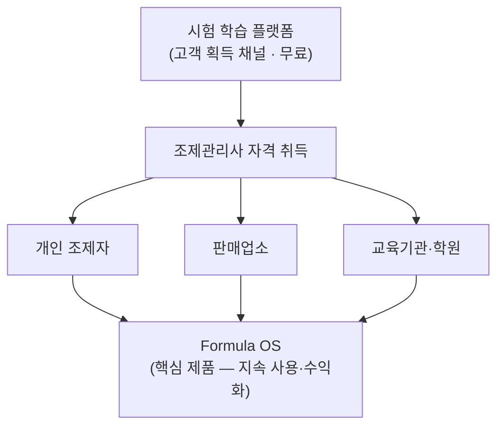

### 1.2 고객 전환 경로 (Flywheel)

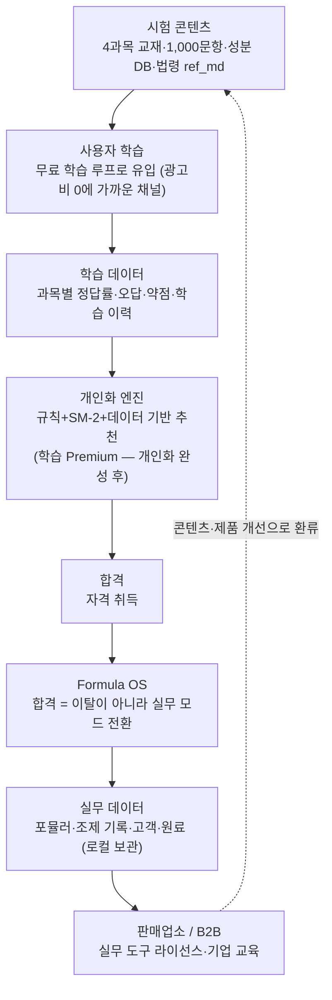

> ⚠️ **정직한 전제 — 4개 미검증 가설**: ① 시험 준비자가 유료로 전환한다 ② 합격자가 Formula OS를 계속 사용한다 ③ 판매업소가 Formula OS에 지불한다 ④ **Formula OS가 기존 수기·엑셀·서류 방식보다 실제로 편리하다**. 현재 넷 모두 **미검증** — ④가 선행되어야 ②③이 의미를 가진다.

> ⚠️ **플라이휠의 약한 고리 (v3.2)** — 자격자 약 30명당 판매업소 1곳(§3.1)으로, 합격자 대부분은 조제 실무에 종사하지 않는다. 학습 앱 → Formula OS 전환은 소수에 그칠 가능성이 높으며, Formula OS의 실구매자(판매업소)는 학습 앱을 거치지 않고 **직접 접촉**하는 경로가 더 빠르다. 플라이휠은 보조 경로, 판매업소 직접 접촉은 주 경로로 본다.

---

## 2. 문제와 고객

### 2.1 해결하는 문제

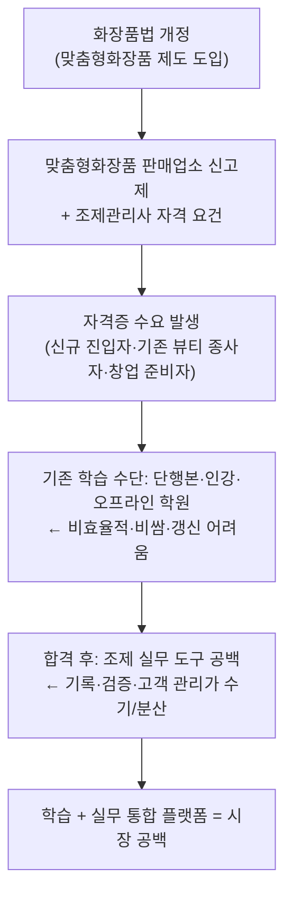

### 2.2 고객 세분화

| 세그먼트 | 목표 | 필요 기능 | 수익화 경로 |
|---|---|---|---|
| **A. 시험 준비자** | "빨리 합격하고 싶다" | 문제은행·모의고사·암기·약점 분석·D-day 관리 | B2C Premium |
| **B. 자격 취득자** | "실무에서 조제를 해보고 싶다" | Formula OS — 포뮬러·배합 계산·규정 검증·라벨·조제 기록 | 실무 Pro (한도 해제) |
| **C. 판매업소** | "법정 기록을 빠짐없이 남기고 점검에 바로 대응하고 싶다" (가설 — Step 0 인터뷰로 확인) | 판매내역·조제 기록·원료 관리·고객 관리·다중 사용자·관리자 대시보드·기록 백업 | B2B 실무 라이선스 |
| **D. 화장품 기업·교육기관** | "직원 교육을 관리하고 싶다" | 기업용 교육·진도 관리·평가·콘텐츠 관리 | B2B 사내교육·학원 솔루션 |

> **세그먼트 재평가 (v3.2):** 자격자 30명당 업소 1곳이라는 실측을 감안하면 B(실제 조제하는 개인)는 대부분 C(판매업소) 소속이다 — **Formula OS의 실구매자는 C**이며, 개인 Pro(B)는 부차 상품이다. A의 다수(회사원 38~39%)는 이력·직무용 자격 취득으로 추정되어 실무 전환 대상이 아니다. A→B 전환은 측정 대상이지 전제가 아니다.

### 2.3 맞춤형화장품 조제관리사 제도 개요

| 항목 | 내용 |
|---|---|
| 근거 법령 | 화장품법 제3조의2, 시행규칙 제8조의2 등 |
| 자격 성격 | 맞춤형화장품 판매업소에서 조제(혼합·소분)를 수행하기 위해 필요한 자격 |
| 시험 주체 | **대한상공회의소 자격평가사업단** (2024년 하반기 이관, license.korcham.net) |
| 시험 과목 | **4과목** (화장품법의 이해, 화장품 제조 및 품질관리, 유통화장품 안전관리, 맞춤형화장품의 이해) |
| 시험 문항 수 | 총 100문항 (선다형 80·단답형 20), 과목별 10/25/25/40 — license.korcham.net 출제기준 확인 |
| 시험시간·합격 기준 | 120분, 총점 1,000점 중 60%(600점) 이상 + 과목별 만점 40% 이상 (문항별 배점 비공개) |
| 시행 주기 | 연 2회 — 사용자 유입·지표가 회차 단위로 몰림 (§10.2, §15) |
| 본 플랫폼 문제은행 | 과목1 100제, 과목2 250제, 과목3 250제, 과목4 400제 (총 1,000제 — 시험 과목 비율 10:25:25:40 반영) |
| 응시 대상 | 화장품 브랜드 직원, 뷰티숍 종사자, 창업 준비자, 프리랜서 뷰티 전문가 |

---

## 3. 시장 규모 (실측 기반)

### 3.1 공식 통계

| 지표 | 수치 | 출처·비고 |
|---|---|---|
| 누적 응시자 | **37,391명** (2020~2025, 11회) | 식약처/운영본부 발표 인용 언론 보도 |
| 누적 자격 취득자 | **약 6,800~7,500명** | 11회 누적 합격 7,495명(코스모닝) / 자격 취득자 6,796명(2026.3 기준 보도) |
| 평균 합격률 | **18.5~20%** | 회차별 7.2%(최저)~26.1%(최고) |
| 최근 회차 응시자 | 9회 1,566명(합격률 13.4%) / 10회 1,957명(25.0%) | 2025년, 연 2회 시행 |
| 응시 추세 | **감소** — 8회까지 2,000명+ → 2025년 회당 1,500~2,000명 | 자격 실효성 논의가 언론에 보도될 수준 |
| 실제 영업 판매업소 | **225개사** (2026.3) | 자격자 약 30명당 업체 1개 — 창업 전환율 낮음 |
| 응시자 프로필 | 20대 43~46%, 회사원 38~39%, 서울 집중 | 운영본부 공지 기반 |

> ⚠️ 위 수치는 언론 보도 경유 간접 인용이다. 사업 확정 전 대한상공회의소 자격평가사업단·식약처 공식 통계로 재확인한다.

**데이터 출처·신뢰도 구분**

| 데이터 | 출처 | 신뢰도 |
|---|---|---|
| 응시자·합격자 수 | 대한상공회의소 자격평가사업단 (언론 보도 경유) | 1차 — 공식 재확인 필요 |
| 자격 취득자·판매업소 수 | 식약처 (언론 보도 경유) | 1차 — 공식 재확인 필요 |
| 학습 시장 규모 | 자체 계산 (응시자 × 지출 가정) | 2차 |
| 지불의사·가격 민감도 | 없음 | **검증 필요 (Step 0~1)** |
| Formula OS 실무 시장 | 자체 추정 | **검증 필요 — 현재 가설** |

### 3.2 TAM / SAM / SOM

시장 규모 산정(가격×고객수)과 실제 매출 시나리오를 분리한다. 학습 지출 5~30만원 가정은 인강·교재비 기준의 추정이며 검증 대상이다.

> ⚠️ **응시자 수 불일치 (2026-09-25)**: 아래 "연 ~3,500명"은 기획서 가정 — 식약처 발표(코스인, 2025)는 "최근 3년 **회당** 응시 2,500명대·합격 500명대·합격률 24%대". 회당 기준이면 연 환산(시험 횟수)에 따라 실제 연 응시자가 달라지므로 TAM·매출 추정 전체가 변동한다 — 시험 회차·연 환산을 확인 후 본 절 수치 갱신 필요 (`맞춤형화장품판매업소_조사_2026-09.md` §3).

**시험 학습 축**

```text
TAM — 연 ~3,500명 응시 × 학습 지출 5~30만원 ≈ 연 1.8~10.5억원
SAM — 온라인·모바일 학습 전환분 (응시자 중 디지털 학습 선호층)
SOM — 3년 내 확보 가능분 = 시험 학습 유료 전환 실측치 기반 (Step 0~1에서 측정)
```

**Formula OS 실무 축 — 별도 퍼널 산출 (현재 전부 가설)**

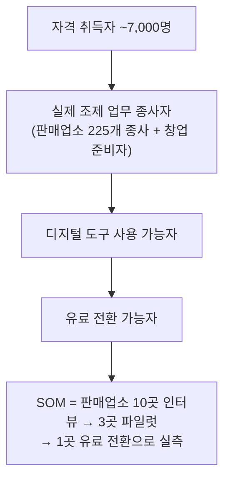

### 3.3 시장 해석 — 작은 시장의 전략적 의미

- **시험 학습 시장만으로는 연 매출 1,000만 원대가 현실적 상한**이다 (응시 3,500명 × 전환 10% × 월 1만원 × 3~4개월 ≈ 연 1,000~1,400만원). TAM(1.8~10.5억)은 응시자 전체의 학습 지출이며 본 플랫폼이 가져갈 수 있는 몫과는 다르다.
- 따라서 이 사업의 성장 논리는 시험 학습 시장 점유가 아니라: ① **Formula OS로 조제관리사 실무 도구 시장을 새로 정의**하고, ② **판매업소·기업 B2B**로 확장하며, ③ 인접 자격·교육 시장(화장품 책임판매업 ~28,000곳 생태계)으로 확대하는 것이다.
- 반대 해석: 경쟁자가 없는 이유 중 하나가 시장 크기일 수 있음 — **대기업이 진입하지 않는 틈새에서 수익성 있는 소규모 사업(니치 리더)**으로의 포지셔닝이 현실적 목표다.
- **Formula OS 축도 작다** — 판매업소 225개사 전부가 월 5만원을 내도 연 1.35억원이며, 현실적 전환(5~10%)이면 연 400~1,350만원이다. 전 매출축을 낙관치로 합산해도 연 수천만 원대(§16.4).
- **인접 확장의 한계** — 책임판매업(~28,000곳)은 조제가 아닌 제조위탁·표시광고·품질관리 업무가 중심이라 Formula OS 수요와 다르다. 다만 같은 표시광고 업무가 별도 제품(표시·광고 컴플라이언스 도구)의 시장일 수 있다 — §17.4의 우선 검증 후보 ①으로 정리하고, 수요 검증은 Step 0 인터뷰로 병행한다.

> **사업 정의 선택 (v3.2 — 결정 필요)**
> ① **수익성 있는 니치 사이드 사업** — 인프라 ~$0, 1인 운영, 연 수천만 원 규모를 목표로 하고 투입 시간 상한을 둔다.
> ② **성장 사업** — 위 규모를 넘는 별도 성장 축(인접 시장·타 자격증·자사 다른 사업과의 결합 등)을 정의하고 검증 계획을 추가한다.
> 현재 수치는 ①을 지지한다.

---

## 4. 경쟁 환경

### 4.1 직접 경쟁

**맞춤형화장품 조제관리사 시험 준비와 실무 도구를 하나의 서비스로 결합한 직접 경쟁 서비스는 확인되지 않는다.** 단, "경쟁자가 없다"가 아니라 "직접 경쟁이 제한적"이다 — 간접 경쟁군은 아래와 같이 넓다.

### 4.2 간접 경쟁군

| 경쟁군 | 형태 | 한계 / 대비 |
|---|---|---|
| 기출문제집 (출판사) | 단행본 | 법령 개정 시 즉시 구식, 개인화 불가 |
| 인강·학원 (오프라인) | 강의 | 비싸다(30만원+), 시간·장소 제약, 업데이트 느림 |
| 일반 자격증 앱 (해커스 등) | 모바일 퀴즈 | 화장품 전문 성분·조제 실무 미대응 |
| 유튜브·무료 콘텐츠 | 강의·정리 영상 | 체계적 학습 루프·개인화 없음 — 현재 manifest에 4개 채널을 추천 링크로 수용 중 |
| 성분 정보 서비스 (화해 등) | 성분 DB | 소비자용 — 조제관리사 업무(고시 한도·조제 기록) 미대응 |
| 화장품 제조 ERP/MES (이젬코 CEP·XISOM·ianaiERP 등) | 제조업·ODM 대상 통합 시스템 | 대상이 제조업 — **소규모 판매업소용 경량 조제관리 도구는 확인되지 않음** |
| 수기·엑셀·서류 | 판매업소 현행 방식 (추정) | **실질 대체재 — 사용 실태 조사 필요** (Step 3 인터뷰) |

| 본 플랫폼 | 차별점 |
|---|---|
| **학습+실무 통합** | PWA 오프라인 + 1,000문항 + 성분 DB + 법령 갱신 파이프라인 + **Formula OS 실무 작업실** |

> **차별화:** 화장품 성분·법령 전용 Knowledge Base (자체 구축 1,376개 성분 + 법령·고시 ref_md 75종) + 오프라인 PWA + 이야기형 교재 + Mermaid 시각화 + **실무 작업실(Formula OS)** — 합격 후 실무까지 이어지는 결합 서비스로, 직접 경쟁은 제한적인 것으로 확인됨 (§4.1).
>
> Formula OS 실무 측면의 경쟁 지도·잠재 진입자 시나리오·차별화 축은 `FORMULA_OS_경쟁전략.md` 참조.

---

## 5. 제품

### 5.1 학습 모드 (구현 완료)

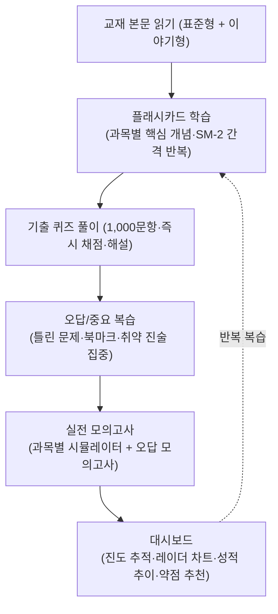

> 위는 **학습 루프 — 구현 완료** 상태다.

```text
[추가 구현 기능]

성분 검색 사전 (1,376개 성분, 배합한도·고시 기준)
스마트 훈련소 (취약 영역 집중, 법령 수치 암기)
오디오북 (TTS 음성 강의 MP3)
참조자료 뷰어 (인앱 검색·하이라이트·저장, ref_md 75종)
교재 본문 검색 (실시간 키워드)
통합 검색 팔레트 (Ctrl+K — 화면·교재·카드·퀴즈·성분·문제집 단일 검색 + 본문검색 연결)
스크래치패드 (Canvas 손글씨 연습장)
데일리 챌린지 (일일 학습 카드)
뽀모도로 타이머
```

### 5.2 과목별 콘텐츠 구성 (실제 manifest.json 기준)

| 과목 | 과목명 | 문항 수 | 교재 파일 | 콘텐츠 |
|---|---|---|---|---|
| 1 | 화장품법의 이해 | 100제 | `1과목_화장품법의이해_표준형.md` + `_이야기형.md` | 화장품법, 개인정보 보호법 |
| 2 | 화장품 제조 및 품질관리 | 250제 | `2과목_제조및품질관리_표준형.md` + `_이야기형.md` | 원료, 기능·품질, 사용제한 원료, CGMP, 위해사례 |
| 3 | 유통화장품 안전관리 | 250제 | `3과목_유통화장품안전관리_표준형.md` + `_이야기형.md` | 작업장·작업자 위생, 설비 관리, 내용물·원료 관리, 포장재 |
| 4 | 맞춤형화장품의 이해 | 400제 | `4과목_맞춤형화장품의이해_표준형.md` + `_이야기형.md` | 개요, 피부·모발 구조, 관능평가, 상담·안내, 혼합·소분, 충진·포장 |

> 각 과목은 **표준형**(법령 원문 중심)과 **이야기형**(스토리텔링 기반) 두 가지 버전으로 제공된다. 이는 경쟁사가 제공하지 않는 차별화 요소다.

### 5.3 실무 모드 — Formula OS (구현 완료, 사업 핵심 자산)

합격 후 실무에서도 계속 사용하는 **조제관리사 업무 도구**. `ui_mode` 전환으로 학습 네비게이션을 접고 실무 작업실을 랜딩 화면으로 사용한다.

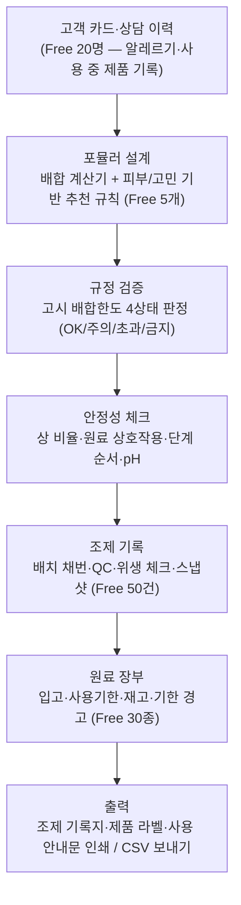

> 위는 **실무 업무 루프 — 구현 완료** 상태다.

| 모듈 | 기능 | Free 한도 |
|---|---|---|
| `formula-store` / `formula-rules` | 포뮬러 CRUD·추천 (베이스·피부 매핑, 안전 필터) | 5개 |
| `formula-check` | 고시 한도 규정 검증 (원료 인덱스, 4상태 판정) | — |
| `formula-stability` | 제형 안정성 (상 비율·상호작용·단계·pH) | — |
| `customer-store` | 고객 카드·상담 이력 (append-only) | 20명 |
| `batch-store` | 조제 기록 채번·QC·위생·스냅샷 | 50건 |
| `material-ledger` | 원료 입고·사용기한·재고·기한 경고 | 30종 |
| `usage-guide` / `formula-print` | 사용 안내문 생성·조제 기록지·라벨 인쇄 | — |
| `formula-compliance` | 법규 준수 체크리스트 + 법령 MD 링크 | — |
| `csv-utils` | CSV 파서·EUC-KR 디코딩·BOM 직렬화 | — |

**Formula OS가 대체하는 기존 업무** (기능 나열이 아닌 업무 절감 관점)

| 기존 업무 | 현재 방식 (추정) | Formula OS |
|---|---|---|
| 고객 상담 | 종이·메모 | 고객 카드·상담 이력 |
| 배합 계산 | 수기·엑셀 | 자동 계산 + 추천 규칙 |
| 원료 확인 | 별도 자료 검색 | 성분 DB (1,376개) |
| 배합한도 확인 | 법령·고시 직접 검색 | 규정 검증 4상태 판정 |
| 조제 기록 | 수기 문서 | 배치 채번·QC·위생 기록 |
| 원료 재고·기한 | 엑셀·수기 | 원료 장부 + 기한 경고 |
| 라벨·안내문 | 수작업 | 자동 출력·인쇄 |
| 과거 처방 확인 | 문서 검색 | 포뮬러 검색·재사용 |
| 판매내역·점검 대응 | 수기 장부 (추정) | 조제 기록 기반 판매내역 출력 (미구현 — 검토) — **지불 이유 후보 1순위**, Step 0 인터뷰로 확인 (⚠️ 판매내역서 기재 항목·보관 의무는 시행규칙으로 재확인) |

> **이 업무를 한 도구에서 처리하는 것이 Formula OS의 핵심 가치다.** 단, "실제로 수기/엑셀보다 편리한가"는 미검증 가설 ④ — 판매업소 실태 조사로 검증한다.

> **수익화 포인트**: Free 저장 한도(5/20/50/30)가 이미 정책 상수로 구현되어 있어, Pro 전환 시 **한도 해제만으로 실무 Pro 가치가 성립**한다. 민감 데이터(고객 카드·상담 이력)는 클라우드 동기화에서 제외하는 설계가 이미 적용됨.
> ⚠️ **한도의 성격 (v3.2)**: 고객 20명·배치 50건은 실제 업소라면 수 주 내 도달하지만 학습자는 거의 도달하지 않는다 — 한도 도달률은 사실상 **업소 사용자 지표**다.
> ⚠️ **저장 구조 과제 (v3.2)**: 현재 고객·조제 기록은 localStorage 전용이다. 브라우저 데이터 삭제·기기 교체 시 **법정 기록 유실** 가능성이 있어 업소 도입의 최대 장애가 될 수 있다. Pro의 "기록 백업"과 B2B의 다중 사용자·관리자 대시보드를 제공하려면 민감정보 서버 저장(암호화·처리위탁·국외이전 동의)이 필요하며, 이는 결제+게이팅과 별개의 작업이다 (§15 Step 2).
> **사업적 의미**: 시험 합격 = 이탈이 아니라 **실무 모드로의 전환** — 자격증 취득 후에도 도구를 계속 사용하므로 LTV가 학습 기간에 종속되지 않는다. B2B(판매업소 사내교육·실무 도구 라이선스) 확장의 기반이 된다.

### 5.4 개인화 학습 엔진 (구현 — 수익화 핵심)

> "AI"가 아니라 **Knowledge Base + 학습 데이터 + 규칙/알고리즘 엔진**으로 구성한다 — 생성형 AI 의존 없이 구현 가능하며 과장 표현 리스크도 없다.
> **사용자용 한 문장 정의**: *틀린 문제를 그냥 다시 풀게 하지 않고, 왜 틀렸는지 찾아서 교재 → 개념 → 유사문제 → 재시험까지 연결해 주는 개인 맞춤 합격 학습 시스템*

| 기능 | 설명 | 구현 상태 |
|---|---|---|
| **진단 평가** | 전 과목 균등 샘플링(~20문) → 과목별 약점 프로파일 + 집중 퀴즈 링크 | ✅ 구현 (`src/views/quiz.js` diagnostic 모드) |
| **맞춤 학습 계획** | 시험일 D-day 역산 → 일별 권장 카드 수 + 캘린더 D-day 칩 | ✅ 구현 (`study-tracker.js` D-day + 목표 모달 시험일 입력) |
| **오늘의 합격 전략** | SM-2 대기→과락→정답률 최저→헷갈린 카드→미학습 우선순위 + 이유 표시 + 즉시 실행 | ✅ 구현 (`src/recommendations.js`, 대시보드 연동) |
| **오답→재학습 루프** | 퀴즈 오답 자동 약점 수집(`weak_quiz_`) + 원인 태깅(암기부족/개념오해/계산실수) + 교재 근거 인라인 + 재학습 링크 | ✅ 구현 |
| **오답 패턴 분석** | 최근 7일 원인 분포·취약 과목·권장 학습법 | ✅ 구현 (`computeWrongCauseSummary`) |
| **간격 반복(Spaced Repetition)** | 플래시카드·핵심 조문 반복 주기 최적화 (SM-2 알고리즘) | ✅ 구현 (`src/spaced-repetition.js`) |
| **통합 검색** | Ctrl+K 팔레트 — 화면·교재·카드·퀴즈·성분·문제집 + 본문검색 브리지 | ✅ 구현 (`src/command-palette.js`) |
| **합격 예측 점수** | 최근 5회 평균 ±1σ 점수 대 + 추세(선형회귀) → "예상 점수" 표기 | 🟡 부분 구현 — `estimateExpectedScore` + `actual_exam_result` 자가 보고 수집. 보정된 합격 "확률"은 실측 데이터 축적 후 2단계 |

개인화 엔진의 개념 구조:

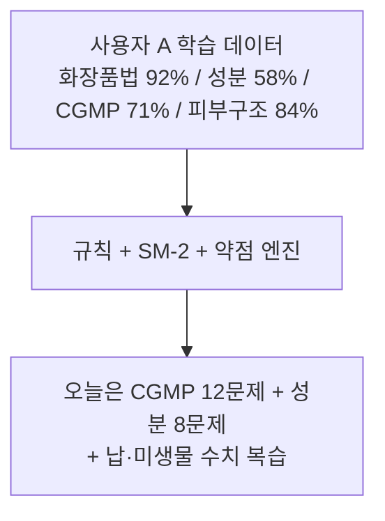

### 5.5 부가 기능 (미구현)

- **조제 시뮬레이터**: 조제 순서·배합 비율 케이스 풀이 (게임화 요소)
- **법령 변경 알림**: 시험 범위 법령 개정 시 푸시 알림 + 변경 요약
- **학습 커뮤니티**: 과목별 스터디 그룹, Q&A 게시판
- **전문가 멘토링**: 합격자·현직 조제관리사 멘토 매칭 (유료)

---

## 6. 차별화와 사업 논리

| 차별화 자산 | 내용 | 모방 난이도 |
|---|---|---|
| **학습+실무 통합** | 시험 준비→합격→실무가 한 앱에서 연결 | 높음 — 경쟁사는 학습 또는 실무 한쪽만 |
| **문제↔교재 인용 루프** | 오답→교재 `(L###)` 라인 인용·📌 출처 근거→관련 카드→유사문제→재시험 | 높음 — 콘텐츠 라인 매핑 파이프라인 필요 (외부 리뷰·평가 공통 1순위 차별점) |
| Knowledge Base | 1,376 성분 + ref_md 75종 + 4과목 교재 + 1,000문항 | 중간 — 콘텐츠 축적 시간 |
| 오프라인 PWA | 설치형, 완전 오프라인 학습·실무 | 낮음~중간 |
| 이야기형 교재 | 스토리텔링 기반 학습 | 중간 |
| Free 한도 설계 | 실무 한도(5/20/50/30) 이미 코드상 구현 | — (수익화 준비 완료) |

> Formula OS는 단순 기능이 아니라 **"합격 후 이탈"이라는 자격증 플랫폼의 구조적 약점을 해결하는 리텐션 장치**이며, B2B 확장의 다리다.

---

## 7. 현재 구현 자산

본 프로젝트는 **이미 핵심 기능이 구현 완료된 상태**로, 별도의 MVP 개발 없이 즉시 사용자 확보가 가능하다.

| 자산 | 구현 상태 | 규모 |
|---|---|---|
| 교재 콘텐츠 | ✅ 구현 완료 | 4과목 × 표준형+이야기형 = 8개 MD, 4000+ 라인 |
| 문제은행 | ✅ 구현 완료 | 1,000문항 (100+250+250+400) 교재 인용 |
| 성분 DB | ✅ 구현 완료 | 1,376개 성분 (배합한도·고시 기준 포함) |
| 참조자료 | ✅ 구현 완료 | 법령원문·고시·별표 ref_md 75종 (PDF + MD) |
| 플래시카드 | ✅ 구현 완료 | 과목별 핵심 개념 암기 카드 + SM-2 간격 반복 |
| 모의고사 | ✅ 구현 완료 | 과목별 실전 모의고사 시뮬레이터 + 오답 모의고사 |
| 오디오북 | ✅ 구현 완료 | TTS 음성 강의 MP3 파이프라인 |
| PWA 오프라인 | ✅ 구현 완료 | Service Worker 캐시, 오프라인 학습 |
| 대시보드 | ✅ 구현 완료 | 학습 진도, 레이더 차트, 성적 추이, 오늘의 합격 전략 추천, D-day |
| 사용자 계정 | ✅ 구현 완료 | Supabase Auth (이메일·매직링크) + 클라우드 동기화 — 미설정 시 로컬 전용으로 정상 동작 |
| 실무 작업실 (Formula OS) | ✅ 구현 완료 | 학습/실무 UI 모드 전환 + 포뮬러 설계·규정 검증·고객/배치/원료 관리·인쇄 출력 (§5.3 참조) |
| 통합 검색 | ✅ 구현 완료 | Ctrl+K 팔레트 — 6개 소스 단일 검색 + 본문검색 브리지, 오프라인 동작 |
| 테스트 | ✅ 구현 완료 | 520 단위 테스트 + 341 DOM 테스트 + CI |
| 결제 시스템 | ❌ 미구현 | 구독 로드맵 존재 (SUBSCRIPTION_ROADMAP.md) |
| 개인화 학습 | ✅ 구현 완료 | §5.4 전 기능 — 오답 루프·합격 전략·진단 평가·D-day·패턴 분석 (합격 예측만 부분) |
| 멀티시험 구조 | ✅ 구현 완료 | manifest+registry 선언 기반 — 시험 규칙·과목·문항배율 콘텐츠 선언으로 Pro 기능 자동 동작 |

### 7.1 자체 구축 자산 (5가지)

1. **시험 Knowledge Base** — 4과목 교재 (표준형+이야기형 8개 MD), 1,000문항 문제은행, 법령·고시·참조자료 ref_md 75종
2. **성분 DB** — 1,376개 화장품 성분 (배합한도·고시 기준 포함, 빌드 타임 JS 번들)
3. **학습 플랫폼 인프라** — PWA, Service Worker 오프라인 캐시, 모듈러 빌드 파이프라인, 520 단위 + 341 DOM 테스트 + CI
4. **콘텐츠 제작 파이프라인** — 표준형/이야기형 교재 작성, TTS 오디오북 생성, Mermaid 다이어그램 + 매핑 표
5. **실무 작업실 (Formula OS)** — 포뮬러 설계·규정 검증·배치/고객/원료 관리·인쇄 출력 (9개 업무 영역, §5.3) — 학습과 실무를 잇는 리텐션 자산

### 7.2 현재 아키텍처

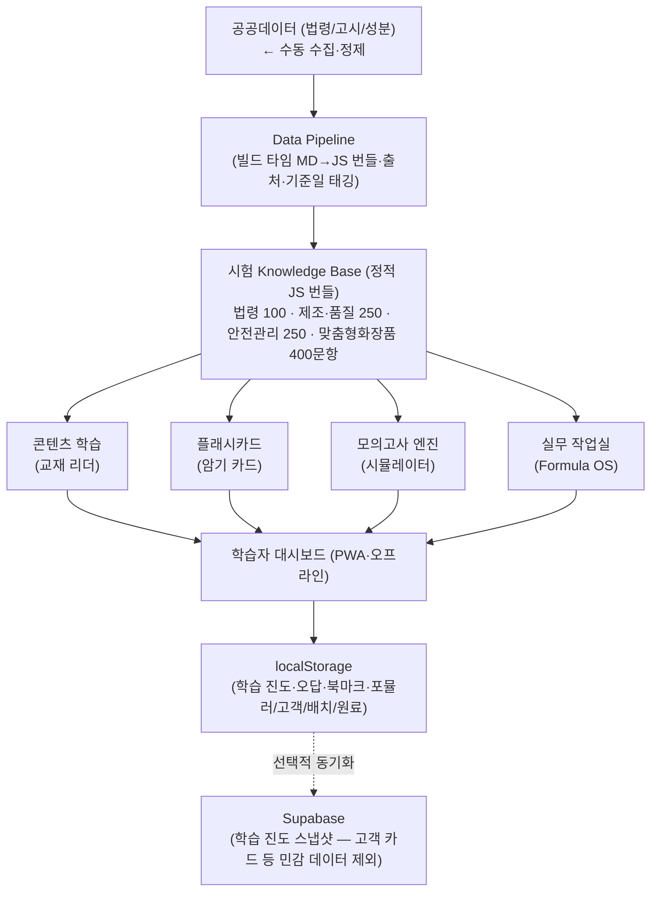

---

## 8. 비즈니스 모델

### 8.1 수익 구조 원칙

핵심 원칙: **Free = 공부할 수 있다 / Premium = 나에게 맞게 공부시켜준다 + 실무를 무제한으로 쓴다.**

현재 무료 티어가 기능 면에서 매우 강하다 — 유료 전환의 이유는 콘텐츠 차단이 아니라 **개인화(진단·계획·자동 추천)와 실무 한도 해제**로 설계한다.

> ⚠️ **첫 결제 상품은 Formula OS Pro가 유력** — 개인화 기능(진단·맞춤 계획·오답 루프)은 2026-09 구현 완료됐으나 학습 Premium의 유료 근거는 아직 **미검증**이다(기능 존재 ≠ 지불 의사). Formula OS는 Free 한도 도달 → "한도 해제" 결제라는 자연스러운 유료 전환점이 이미 있다. **Formula OS Pro(한도 해제) 지불의사를 먼저 검증하고, 개인화 사용 지표(추천 실행률·재학습 전환)가 확인된 뒤 학습 Premium을 붙이는 순서**가 현실적이다.

```text
Formula OS Pro (검토: 월 9,900원)
├─ 포뮬러·고객·배치·원료 무제한
├─ 조제 기록·라벨 출력·규정 검증
└─ 기록 백업 (서버 저장 구조 도입 후 — §5.3)
```

```text
무료 (Free) — 현재 구현 상태
├─ 전 과목 교재 읽기 (표준형+이야기형)
├─ 플래시카드 (전 과목)
├─ 기출 퀴즈 (1000문항)
├─ 모의고사
├─ 오답/복습
├─ 성분 검색 사전
├─ 오디오북
├─ 스마트 훈련소
├─ 실무 작업실 Formula OS (한도: 포뮬러 5·고객 20·배치 50·원료 30)
└─ PWA 오프라인
    ↓ (구독 전환 후)
유료 (학습 Premium 월 구독 — 개인화 완성 후 출시)
├─ 무료 기능 전체 + α
├─ 진단 평가 + 약점 프로파일 (개인화 엔진)
├─ D-day 맞춤 학습 계획 · 오늘의 문제 자동 선정
├─ 오답 패턴 분석 · 개인별 반복 학습
├─ 합격 예측 점수 (결과 데이터 축적 후)
└─ 학습 계획 관리
    ↓
유료 (종합반 — 시험 회차별 패키지)
├─ Premium 월 구독 포함
├─ 멘토링 1:1 (월 2회)
├─ 기출문제 풀이 집
└─ 합격 시 환급 이벤트
```

| 상품 | 가격(검토) | 비고 |
|---|---|---|
| Free | 무료 | 현재 구현 상태 (전 기능 무료, 학습 진도 클라우드 동기화 포함) |
| **Formula OS Pro** | 월 9,900원 | 실무 한도 해제 + 기록 백업 — **첫 결제 상품** |
| 학습 Premium 월 구독 | 월 9,900원 | 개인화 학습 (진단·맞춤 계획·오답 패턴) — 개인화 완성 후 출시 |
| Pro + Premium 번들 | 검토 | 동시 구독 할인 — 단일 Pro로 통합할지는 Step 1 결과로 결정 |
| 종합반 (회차 패키지) | 99,000원~149,000원 | 시험 D-day까지, 멘토링 포함 |
| 멘토링 추가 | 회당 19,900원 | 1:1 전문가 |

> ※ 가격은 플레이스홀더이며 **제품 검증 이후가 아니라 결제 검증 자체의 실험 변수**로 본다 — 그룹별 가격 실험(예: A 4,900원 / B 9,900원 / C 19,900원 / B2B 월 3~5만원)을 검토하고, 단순 전환율이 아니라 **가격 × 전환율**로 비교한다 (예: 9,900원×10% < 19,900원×5%이면 후자의 매출이 더 크다).
> ※ 구독 전환 시 무료 티어 축소 검토 (SUBSCRIPTION_ROADMAP.md §3.4 참고):
> - 무료: 제1과목 플래시카드, 일일 10문제, 모의고사 1회/일
> - Pro: 전 과목 무제한, 오디오북 (클라우드 동기화는 이미 무료 제공 중이므로 유료 전환 대상에서 제외 — 회수 시 반발 리스크)
> - 실무 모드는 한도가 이미 코드상 구현됨 (포뮬러 5·고객 20·배치 50·원료 30) — Pro에서 무제한 해제
> - 기존 사용자 그랜드파더링(기존 설치자는 현행 무료 범위 유지) 방식이 이탈 리스크 완화에 유리
> - ⚠️ 학습 무료 티어를 과도하게 축소하면 유입 채널(무료 학습→전환)이 약화된다 — 축소 폭은 가격 검증과 함께 결정.

### 8.2 B2B

| 상품 | 대상 | 가격(검토) |
|---|---|---|
| 학원용 라이선스 | 조제관리사 학원 | 월 29만원~ (학생수 기준) |
| 기업 사내교육 | 화장품 브랜드·판매업소 | 월 49만원~ (직원수 기준) |
| 실무 도구 라이선스 | 맞춤형화장품 판매업소 (225개사) | 월 3~5만원 검토 (한도 무제한 + 다중 사용자·관리자 대시보드·서버 백업 — 서버 저장 구조 선행) |
| 콘텐츠 위탁 제작 | 브랜드 맞춤 교육 콘텐츠 | 건당 협의 |

### 8.3 추가 수익

- 전문가 멘토 매칭 수수료
- 합격자 취업 연계 (화장품 브랜드·판매업소 매칭) 수수료
- 콘텐츠 단행본/e북 출간
- API 판매 (학습 데이터·콘텐츠를 타 플랫폼에 제공)

### 8.4 수익화 전환 범위 (구현 상태 기준)

| 이미 구현됨 | 수익화 전환 필요 (Pro) | 후순위 |
|---|---|---|
| 교재 본문 읽기 (4과목) | 결제 시스템 (Stripe/토스) | 조제 시뮬레이터 |
| 플래시카드 + 간격 반복(SM-2) | 콘텐츠 게이팅 (유료/무료 분리) | 학습 커뮤니티 |
| 기출 퀴즈 (1000문항) | 진단 평가 + 약점 프로파일 ✅구현 — 게이팅 대상 | 멘토링 매칭 |
| 오답/복습 + 오답 모의고사 | 합격 예측 점수 🟡부분 구현 (예상 점수 + 결과 수집) | B2B 학원 솔루션 |
| 모의고사 시뮬레이터 | | |
| 성분 검색 사전 (1,376개) | | |
| 대시보드 (차트·약점 추천) | | |
| 오디오북 | | |
| PWA 오프라인 | | |
| 스마트 훈련소 | | |
| 사용자 계정 (Supabase Auth) | | |
| 클라우드 동기화 (`sync.js`) | | |
| 실무 작업실 Formula OS (§5.3) | 실무 한도 해제 (포뮬러·배치·고객·원료 무제한) | |

> ※ Step 1(구독 전환)의 실질 범위는 **결제 + 콘텐츠 게이팅 + 프로 entitlement 판정**으로 축소됨 — 인증·동기화 인프라와 실무 Free 한도는 이미 구현되어 있어 기존 7~12주 추정을 **3~6주로 재산정**한다(추정 — 착수 시 재확인). 단, B2B용 실무 데이터 서버 저장은 별도 과제다(§15 Step 2).

---

## 9. 고객 획득 전략

> 현재 `content/exams/cosmetic/manifest.json`에 추천 유튜브 채널 4개와 공식 기관 링크 2개가 이미 구현되어 있다.

**초기 채널은 3개로 압축한다** — 채널을 넓히기보다 CAC를 먼저 측정한다:

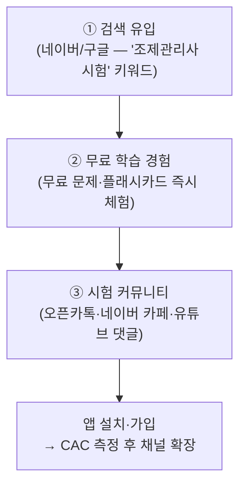

> 아래 채널 목록은 확장 옵션 — 실측 CAC가 나오기 전까지 집행하지 않는다.

### 9.1 유튜브 (현재 manifest.json에 4채널 등록됨)

| 항목 | 내용 |
|---|---|
| 등록 채널 | 지한쌤(법령백과), 해커스(김경표), 에듀윌(이은주/유선희), 화박사(전혜승) |
| 타깃 | 자격증 준비자 + 맞춤형화장품 창업 관심층 |
| 포맷 | ① "조제관리사 시험 1분 요약" 쇼츠 ② "성분 핵심 정리" 시리즈 ③ "법령 바로 알기" ④ 합격자 인터뷰 |
| CTA | "무료 진단 평가 받기" → 랜딩 유입 |
| 협업 | 뷰티 유튜버, 현직 조제관리사, 학원 강사 게스트 |

### 9.2 네이버

| 항목 | 내용 |
|---|---|
| 블로그 | "조제관리사 시험 준비 가이드", "과목별 공부법", "최신 법령 개정 정리" |
| 카페 | "조제관리사 합격 스터디" 오픈 카페 → 사용자 사례 공유, 입소문 |
| 검색광고 | "조제관리사 시험", "맞춤형화장품 자격증", "조제관리사 기출" 등 키워드 |

### 9.3 인스타그램·틱톡

| 항목 | 내용 |
|---|---|
| 포맷 | "오늘의 성분 1분", "법령 핵심 조문 30초", "합격 꿀팁" |
| 원칙 | 교육 + 엔터테인먼트 결합, 근거 기반 메시지 유지 |

### 9.4 기타 채널

| 채널 | 전략 | 시기 |
|---|---|---|
| **오픈카톡·디시** | 자격증 준비자 커뮤니티 자발적 공유 | 현재~Step 1 |
| **당근마켓** | 뷰티 종사자 지역 커뮤니티 → "무료 학습" | Step 1 |
| **브런치/벨로그** | 시험 제도 분석, 법령 해설 심층 칼럼 | 지속 |
| **링크드인** | B2B — 화장품 브랜드 교육 담당자 타깃 | Step 4 |

### 9.5 채널 진입 타이밍

| 단계 | 채널 활동 |
|---|---|
| 현재 | 오픈카톡·디시 수동 공유, 앱 내 추천 링크 노출 |
| Step 1 | 유튜브 쇼츠·네이버 블로그 시작 |
| Step 2 | 네이버 검색광고 소액 집행, 카페 정식 운영 |
| Step 3 | 합격자 인터뷰 콘텐츠, 크리에이터 협업 |
| Step 4~5 | B2B 채널(링크드인), 학원 제휴, 브랜드 사내교육 |

---

## 10. Unit Economics

> **현재 상태: 측정 체계 미구축** — 아래 지표는 정의와 목표 범위이며, **목표값과 실측값을 분리**해 관리한다. 실측값은 Step 0(분석 도구 도입) 이후 채워진다.

### 10.1 핵심 지표 정의

| 지표 | 정의 | 측정 방법 (계획) |
|---|---|---|
| CAC | 유료 고객 1명 확보 비용 | 채널별 마케팅비 ÷ 신규 유료 전환 수 |
| ARPU | 유료 사용자 1인당 월 매출 | 월 매출 ÷ 유료 구독자 수 |
| Churn | 월 구독 해지율 | 당월 해지자 ÷ 기초 구독자 |
| LTV | 고객 1명당 예상 누적 매출 | ARPU × 평균 구독 개월 (Churn 역수) |
| Conversion | 무료 → 유료 전환율 | 유료 전환 ÷ 활성 무료 사용자 (분모 정의 필요: 방문자/설치자/MAU 중 택1) |
| Retention | 7/30/90일 재방문율 | 코호트 기준 재방문 비율 |
| Payback | CAC 회수 기간 | CAC ÷ ARPU |

### 10.2 자격증 플랫폼 특수 지표

일반 SaaS와 달리 **시험 종료 후 이탈**이 구조적 리스크다 — Formula OS가 이를 해결하는지가 사업 모델 검증의 핵심이다.

| 지표 | 의미 |
|---|---|
| 시험 전 30일 → 시험일 → 시험 후 30일 잔존율 | 자격증 앱의 수명 주기 실측 |
| **합격자 중 Formula OS 사용률** | 학습→실무 전환 고리의 작동 여부 |
| Formula OS 30일 유지율 | 실무 도구의 지속 가치 |
| 실무 Pro 전환율 | B2C 실무 수익화 검증 |
| 시험 회차별 코호트 | 연 2회 시험 기준으로 유입·잔존·전환을 회차 단위로 비교 — 월 단위 지표는 시험 주기에 왜곡됨 |

### 10.3 비용 구조

| 항목 | 현재 | 구독 전환 후 |
|---|---|---|
| 호스팅 | Vercel Hobby $0 | Vercel Pro $20/월 (상업용 필수) |
| 백엔드 | Supabase 무료 티어 $0 | 규모에 따라 유료 전환 |
| 인프라 합계 | **$0/월** | **약 3만원/월 + 결제 수수료** |

> 초기 인프라 비용이 거의 0이므로 손익분기는 마케팅비(CAC)와 콘텐츠 유지 비용이 좌우한다.

---

## 11. KPI

### 11.1 활성화 퍼널 (초기 핵심)

MAU 같은 총량 지표보다 **퍼널 단계별 전환율**이 초기 검증에 유효하다.

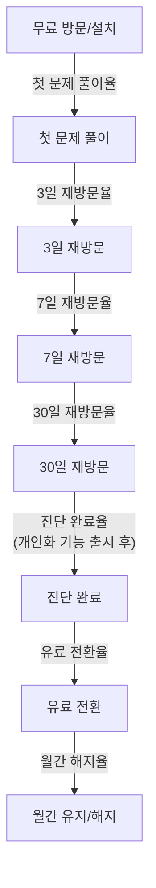

### 11.2 합격 후 전환 (Formula OS)

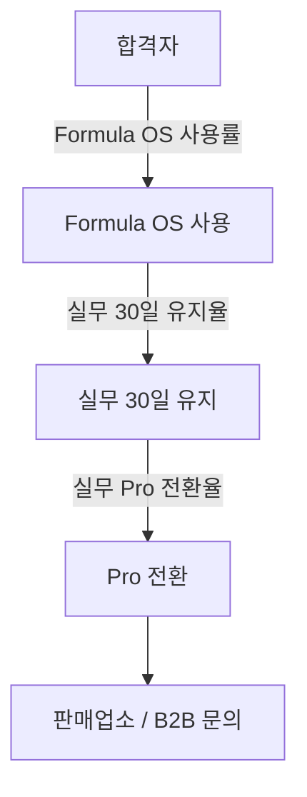

### 11.3 Formula OS 사용량 (실제 수익화 퍼널)

기능 존재 ≠ 지불 — **사용량과 한도 도달률**이 유료 전환의 선행 지표다.

| 지표 | 의미 |
|---|---|
| 포뮬러 생성 / 사용자 / 월 | 실제 사용량 |
| 고객 등록 / 사용자 / 월 | 고객 관리 의존도 |
| 조제 기록 / 사용자 / 월 | 실무 사용량 |
| 원료 등록 / 사용자 | 장부 사용량 |
| 라벨 출력 / 사용자 / 월 | 업무 연결성 |
| **Free 한도 도달률** | **유료 전환 가능성의 직접 신호** |

예시 퍼널 (목표 구조 — 수치는 실측 후 확정):

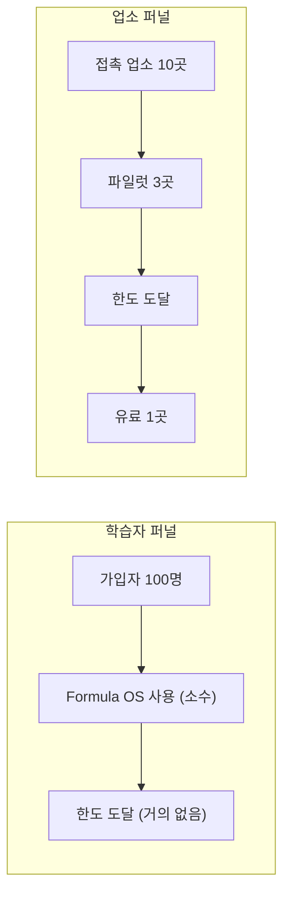

> 한도 도달률은 학습자·업소를 분리해 측정한다 — 섞으면 전환 신호가 희석된다.

### 11.4 Step별 Go/No-Go

| 단계 | 핵심 KPI (Go/No-Go) |
|---|---|
| Step 0 | 지표 기준선(첫 문제 풀이율·7일 재방문율) + **판매업소 인터뷰 10곳 + 책임판매업체 인터뷰 5곳 완료** → 가설 ④ 1차 판정 + §17.4 후보 ① 수요 판정 |
| Step 1 | 첫 유료 전환 ≥ 1건 (Formula OS Pro 우선), 전환율 기준선 |
| Step 2 | 판매업소 파일럿 3곳 → 유료 1곳; 합격자 Formula OS 사용률 측정; 서버 저장 구조 도입 결정 |
| Step 3 | (학습 Premium) 진단 완료율 ≥ 60%, 30일 재방문율 ≥ 30% |
| Step 4 | B2B 계약 1건 이상 |
| Step 5 | 회차당 활성 학습자 ≥ 해당 회차 응시자의 10%, 유료 전환율 ≥ 3~5% |

### 11.5 사업 지속 판정 지표 (1인 운영)

"사업을 계속할지 말지"를 결정하는 지표 — 상세 산식·예시는 §17.7.

| 지표 | 산식 | 용도 |
|---|---|---|
| **Revenue per Owner Hour** | 월 매출 ÷ 총 투입 시간 | 어떤 사업 축이 1인 운영에 적합한가 — 시장 규모보다 이 값이 결정 |
| **유지비 대비 매출** | 연 매출 − 데이터 유지비 − CS − 서버 − 법률 검토 | 규제 서비스의 실질 영업가치 — 매출/유지비 비율이 높을수록 유리 |

---

## 12. 검증 계획

### 12.1 핵심 가설 (4개 — 모두 미검증)

> **① 시험 준비자가 유료로 전환하는가**
> **② 합격자가 Formula OS를 계속 사용하는가**
> **③ 판매업소가 실무 도구에 지불하는가**
> **④ Formula OS가 기존 수기·엑셀·서류 방식보다 실제로 편리한가** ← 최우선 (④가 선행되어야 ②③이 의미를 가짐)

현재 플랫폼이 무료로 공개 운영 중이나 **실제 사용자 지표(방문자·MAU)는 확인되지 않았다** — 네 가설 모두 미검증 상태이며, 기능 추가보다 데이터 확보가 우선이다.

### 12.2 검증 실험 설계

| 순서 | 실험 | 검증 대상 | 성공 기준 |
|---|---|---|---|
| 1 | 분석 도구 도입 + 무료 유입 (시험 일정 연동) | 활성화 퍼널 기준선 | 첫 문제 풀이율·7일 재방문율 측정값 확보 |
| 1' | **판매업소 인터뷰 10곳** (코드 불필요, 1과 병행) | 가설 ④③ | 현행 기록 방식·**소요 시간(정량화)**·불편·지불 이유(법정 기록·점검 대응 등) 파악 |
| 1'' | **책임판매업체(인디 브랜드) 인터뷰 5곳** (코드 불필요, 1'과 병행) | §17.4 후보 ① 수요 | 전성분·주의사항 표시의 현행 확인 방식·검토 주체·처분 경험 파악 — 후보 ① 지불의사 판정 |
| 2 | Formula OS Pro 결제 테스트 | 가설 ②③ | 한도 도달자 중 결제 전환 1건+ |
| 3 | 판매업소 파일럿 3곳 → 유료 1곳 | 가설 ③④ | 실제 업무 대체 확인 + 첫 B2B 매출 |
| 4 | 학습 Premium (개인화 완성 후) | 가설 ① | 무료→유료 전환율 실측 |

**검증 강도 레벨** — 인터뷰는 "말"일 뿐 실제 구매와 거리가 있다. 검증 기준을 레벨로 관리한다:

| Level | 형태 | 예시 |
|---|---|---|
| 1 — 말 | 의향 표명 | "필요합니다" |
| 2 — 행동 | 현행 방식 실재 | "현재 엑셀/수기/기존 서비스로 이렇게 하고 있습니다" |
| 3 — 시험 사용 | 파일럿 | "실제 업무에 사용하겠습니다" |
| 4 — 돈 | 결제 | "월 ○만원을 내겠습니다" |
| 5 — 반복 결제 | 지속 | "3개월 이상 계속 사용하겠습니다" |

인터뷰(Level 1~2)는 가설 발굴용이고, Go 판정은 Level 3 이상에서 한다 — **핵심 검증 기준은 인터뷰 → 사용 → 결제 → 반복결제**다.

### 12.3 원칙: "이미 구현된 학습 루프 위에 결제를 얹는 최소 전환"

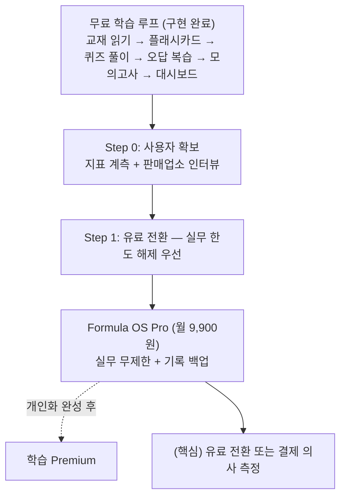

### 12.4 검증 순서 — 개발 순서가 아니라 검증 순서

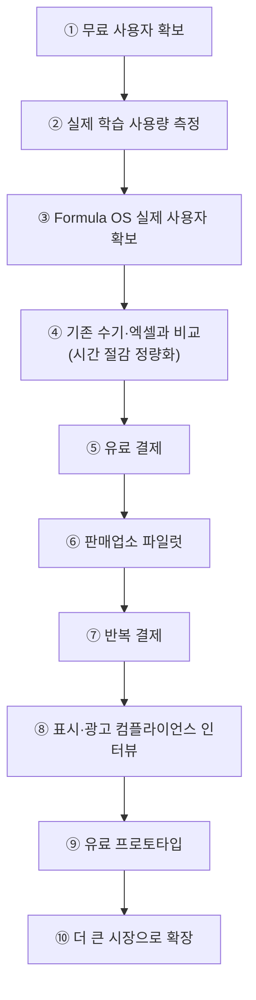

> ⚠️ **①~⑦이 확인되기 전에 ⑧ 이후의 "개발"을 크게 진행하지 않는다.** 단, ⑧의 책임판매업체 인터뷰는 코드가 필요 없어 Step 0과 병행한다(§12.2 1'') — 제한은 검증이 아니라 개발 투입에 적용된다.

**즉시 실행 3가지** (다음 전략 판정의 입력): ① Formula OS 실제 사용자 3곳 확보 ② 실제 유료 결제 1건 ③ 책임판매업체 5곳 인터뷰 — 이 세 결과로 "계속 / Formula OS 확대 / 컴플라이언스 전환"을 판정한다.

---

## 13. 기술 구조 (사업 관점 요약)

> 상세는 `docs/dev/ARCHITECTURE.md`, `docs/dev/SPEC.md`, `docs/dev/SUBSCRIPTION_ROADMAP.md` 참조.

**이 기술 구조가 사업적으로 유리한 이유**

| 설계 | 사업적 효과 |
|---|---|
| Local-First + 선택적 Supabase 동기화 | 인프라 비용 ~$0/월, 오프라인 완전 동작 — 수익화 전에도 운영비 부담 없음 |
| PWA (설치형·오프라인) | 앱스토어 수수료·심사 없이 배포, 조제 현장(네트워크 불안정)에서도 사용 |
| Vanilla ES Modules + 정적 호스팅 | 유지보수 부담 최소, 프레임워크 마이그레이션 불필요 |
| Content-Agnostic 멀티시험 구조 | 신규 시험·콘텐츠 추가 시 코드 변경 없이 확장 |
| 489 unit + 332 DOM 테스트·CI | 콘텐츠/로직 회귀 자동 방어 (병합 커버리지 79.7%) |

**구독 전환 시 추가되는 것** (미구현 항목만)

| 영역 | 전환 내용 |
|---|---|
| 결제 | Stripe 또는 토스페이먼츠 (한국 카드 정기결제, 가맹 온보딩 확인 필요) |
| 호스팅 | Vercel Hobby → **Pro $20/월** (유료 구독 개시 시 상업용 필수) |
| 콘텐츠 게이팅 | 유료 콘텐츠 Private 전환 + entitlement 판정 |
| 분석 | Vercel Analytics / GA4 — Step 0 KPI 계측용 |
| 실무 데이터 저장 | (B2B 시) 민감정보 서버 저장 — 암호화·접근 권한·처리위탁 계약·국외이전 동의 |

> 인증(Supabase Auth)·클라우드 동기화·실무 Free 한도는 **이미 구현됨** — 개인 Pro 전환 비용은 결제+게이팅에 집중된다. B2B는 실무 데이터 서버 저장이 추가로 필요하다.

---

## 14. 법적·개인정보·안전

### 14.1 자격증 시험과 본 서비스의 관계

- 본 플랫폼은 **학습 보조 서비스**이며, 자격증 시험 주체(대한상공회의소 자격평가사업단)와 무관하다.
- "합격 보장" 표현 금지 → "학습 효율 향상", "약점 분석"으로 표현.
- 기출문제는 **시험 주체의 공식 출처**를 확인하여 저작권·사용 기준을 준수한다.
- 현재 문제은행은 **교재 인용 문제**로 자체 제작되었으며, 공식 기출문제가 아니다.

### 14.2 콘텐츠 저작권

| 콘텐츠 | 출처 | 저작권 처리 |
|---|---|---|
| 법령 조문 | 공공데이터(법령정보센터) | 공공저작물 자유이용 가능 |
| 성분 정보 | 식약처 공공데이터 + 자체 정제 | 출처 표기, 가공 콘텐츠 자체 저작권 |
| 교재 본문 | 자체 제작 (표준형 + 이야기형) | 자체 저작권 |
| 문제은행 | 교재 인용 자체 제작 (1000문항) | 자체 저작권 |
| 참조자료 | 법령·고시·별표 ref_md 75종 | 공공데이터 기반, 출처 표기 |
| 오디오북 | TTS 기반 자체 생성 | 자체 저작권 (음성) |
| 강의 콘텐츠 | 자체 제작 / 전문가 위탁 (향후) | 계약에 따라 독점·비독점 설정 |

### 14.3 개인정보 보호

- **현재 상태**: 선택적 Supabase 계정 구현됨 — 비로그인 시 모든 학습 데이터는 `localStorage`에만 저장 (서버 전송 없음), 로그인 시 학습 진도 스냅샷만 동기화 (고객 카드·상담 이력 등 민감 데이터는 동기화 제외 설계)
- **수익화 전환 시**: 결제 정보·구독 상태 등 추가 개인정보 수집 → 최소 수집, 동의, 암호화
- 얼굴 사진 수집 없음 → 개인정보 리스크 최소
- **구독 전환 시 주의**: Supabase/Stripe 해외 서버 사용 시 국외 이전 별도 동의 필요 (SUBSCRIPTION_ROADMAP.md §11 참고)

### 14.4 Formula OS 안전 원칙

> **Formula OS는 조제관리사의 업무를 지원하는 계산·기록·검증 도구이며, 법적 판단이나 의학적 진단을 대체하지 않는다.**

| 원칙 | 구현 |
|---|---|
| 최종 판단은 사용자 | 규정 검증·안정성 체크 결과는 "참고 판정" — 최종 적합성 확인은 조제관리사 책임 |
| 기준일 명시 | 법령 기준일·원료 데이터 기준일·고시 출처를 검증 결과와 함께 기록 (`checkSnapshot` 보존) |
| 사용자 확인 절차 | 안정성 실험 확인 필드(방법·결과·기록일시) — 미확인 시 전성분 표 미생성 등 보수적 동작 |
| 민감 데이터 격리 | 고객 알레르기·상담 이력은 로컬 저장, 클라우드 동기화 제외 |
| 데이터 갱신 | 고시·법령 개정 시 원료 인덱스·판정 기준 업데이트 파이프라인 필요 (정기 점검 일정) |

검증 결과 화면에는 기준일·근거·면책을 함께 표시한다 (UX와 리스크 관리를 동시에 해결):

```text
[규정 검증 결과]
✓ 현재 데이터 기준 적합
기준일: 2026-XX-XX
근거: ○○고시 제○조

※ 본 결과는 참고용 자동 검증이며
  최종 적합성 판단 및 조제 책임은 사용자에게 있습니다.
```

### 14.5 리스크 및 대응

| 리스크 | 영향 | 대응 |
|---|---|---|
| 자격제도 변경·폐지 | 사업 기반 붕괴 | 제도 동향 모니터링, B2B·실무 교육으로 다각화 |
| **응시자 수 감소 (실측 확인됨)** | 학습 매출 상한 하락 | Formula OS 실무 도구·판매업소 B2B 중심으로 매출 축 이동, 인접 시장 확장 |
| 기출문제 저작권 | 콘텐츠 삭제·소송 | 현재 교재 인용 자체 제작, 공식 기출문제 확인 후 활용 |
| 콘텐츠 품질 부족 | 합격률 저하→신뢰 붕괴 | 전문가 감수, 합격자 피드백 루프, 파서 등가성 검증 |
| 경쟁사 진입 (대형 교육기관) | 시장 잠식 | 성분 DB·오프라인 PWA·이야기형 교재·Formula OS 등 자산 우위 방어 |
| 법령 개정 지연 반영 | 콘텐츠·판정 기준 구식화 | 빌드 파이프라인으로 재빌드, 기준일 명시 |
| 무료→유료 전환 반발 | 기존 사용자 이탈 | 기존 사용자 3개월 무료 Pro/그랜드파더링, 무료 티어는 로그인 없이 유지 |
| CSP 완화로 인한 공격면 증가 | 보안 리스크 | 결제/인증 최소 출처만 허용, SDK 자체 호스팅 검토 |
| Vercel 상업용 정책 | Hobby는 비상업 전용 | 유료 구독 개시 시 Vercel Pro 필수 ($20/월) |
| Stripe 가맹 온보딩 불가 | 결제 시스템 차질 | 착수 전 확인, 불가 시 토스페이먼츠 즉시 전환 |
| 오프라인 vs 콘텐츠 게이팅 상충 | 유료 콘텐츠 캐시 잔존 | 해지 시 캐시 purge, 지속적 업데이트로 가치 유지 |
| 실무 고객 개인정보 (알레르기·피부 상태 등 민감정보) | 개인정보보호법 적용 확대 | 클라우드 동기화 제외 설계(이미 적용)·기기 로컬 저장 안내·B2B 전환 시 위탁 계약 검토 |
| Formula OS 판정 오적용 | 조제 품질 사고 연루 가능 | §14.4 안전 원칙 — 참고 판정 명시·기준일 기록·최종 확인 사용자 책임 |
| **실무 기록 로컬 유실** | 브라우저 데이터 삭제·기기 교체 시 법정 기록 손실 → 업소 신뢰 붕괴 | 파일럿 단계부터 정기 CSV 내보내기 안내, Step 2에서 서버 저장 구조 결정 |
| B2B 서버 저장 전환 | 민감정보 처리 범위 확대 (개인정보보호법·위탁·국외이전) | 착수 전 법률 검토, 최소 수집·암호화, 국내 리전 우선 검토 |
| 1인 운영 시간 제약 | 타 사업과 시간 경합 → 검증 지연 | 투입 시간 상한 설정, Go/No-Go 미충족 시 축소·보류 |

---

## 15. 로드맵

> 원칙: **사용자 확보·판매업소 수요 검증 → 결제 전환(Formula OS Pro) → Formula OS 파일럿·저장 구조 → 개인화 학습 → B2B 확장** 순.
> **시험 일정 연동**: 시험은 연 2회이며 사용자가 시험 직전에 몰린다 — Step 0 측정 기간은 다음 회차 시험 전 4~8주에 맞춘다 (시험 직후 측정은 재방문율을 왜곡).
> **투입 시간 상한**: 1인 운영이므로 주당 투입 시간 상한을 정하고(값은 별도 결정), 각 Step 예상 소요는 이 상한 기준으로 재산정한다.
> 현재 무료 플랫폼이 운영 중이나 사용자 지표 미확보 — **Step 0(사용자 확보·지표 계측)을 최우선**으로 둔다.

| 단계 | 목표 | 예상 소요 | 핵심 KPI (Go/No-Go) | 산출물 |
|---|---|---|---|---|
| **Step 0** | 사용자 확보·수요 검증 | 4~8주 (시험 전 구간) | 첫 문제 풀이율·7일 재방문율 기준선 + **판매업소 인터뷰 10곳 + 책임판매업체 인터뷰 5곳** | 분석 도구(Vercel Analytics/GA4) 즉시 도입, 채널 유입, 인터뷰 기록 |
| **Step 1** | 결제 테스트 | 3~6주 (재산정 추정) | 첫 유료 전환 ≥ 1건 — **Formula OS Pro(한도 해제) 우선** | 결제(Stripe/토스), 게이팅, entitlement 판정 |
| **Step 2** | Formula OS 파일럿·저장 구조 | 8~12주 | **파일럿 3곳 → 유료 1곳**; 합격자 Formula OS 사용률 측정; 서버 저장 도입 결정 | 파일럿 운영, 판매내역·점검 대응 출력, (결정 시) 민감정보 서버 저장·다중 사용자 |
| **Step 3** | 개인화 학습 (학습 Premium) | 4~8주 | 진단 완료율 ≥ 60%, 30일 재방문율 ≥ 30% | 진단 평가, 약점 프로파일, 맞춤 학습 계획 |
| **Step 4** | B2B 확장 | 12~16주 | 학원·판매업소 B2B 계약 1건 이상 | 학원용 대시보드, 단체 라이선스, 실무 도구 라이선스 |
| **Step 5** | 생태계 확장 | 지속 | 회차당 활성 학습자 ≥ 응시자의 10%, 유료 전환율 ≥ 3~5% | 커뮤니티, API, 크리에이터 콘텐츠 |

> ⚠️ 각 Step은 이전 Step의 Go/No-Go 기준 충족 시에만 진행.
> Step 1은 **결제 테스트 자체**가 목적 — Formula OS Pro를 첫 유료 상품으로 한다(§8.1). 학습 Premium은 개인화가 완성되는 Step 3 이후 출시한다.
> 판매업소 인터뷰는 코드가 필요 없으므로 Step 0에서 수행한다 — 가설 ④의 1차 판정이 Step 1 결제 상품과 Step 2 파일럿 설계를 결정한다. 인터뷰 결과 가설 ④가 부정되면 Formula OS 중심 전략 자체를 재검토한다 — 이 경우 §17.4 후보 ① 컴플라이언스 도구가 엔진 자산을 살리는 대안 경로이므로 책임판매업체 인터뷰 5곳을 같은 기간에 병행한다 (§12.2 1'').
> Step 5 KPI는 연 응시 ~3,500명 규모에 맞춰 v3.2에서 하향했다 (기존: MAU ≥ 1,000, 유료 전환율 ≥ 10%).

### 15.1 콘텐츠 전략

| 과목 | 현재 상태 | 제작 방식 | 추가 소요 |
|---|---|---|---|
| 화장품법의 이해 | ✅ 완성 (표준형+이야기형) | 공공데이터 기반 자체 정리 + 법령원문 | 법령 개정 시 업데이트 |
| 화장품 제조 및 품질관리 | ✅ 완성 (표준형+이야기형) | 공공데이터 + 성분 DB + 전문가 감수 | 원료 고시 변경 시 업데이트 |
| 유통화장품 안전관리 | ✅ 완성 (표준형+이야기형) | 식약처 가이드라인 기반 | 위생기준 변경 시 업데이트 |
| 맞춤형화장품의 이해 | ✅ 완성 (표준형+이야기형) | 교재·논문 정리 + 전문가 감수 | 제도 변경 시 업데이트 |

**품질 관리**
- 모든 콘텐츠는 **출처·기준일·감수자**를 명시
- 법령 개정 시 수동 감지 → 콘텐츠 업데이트 (빌드 파이프라인으로 재빌드)
- 합격자 피드백 루프: 시험 응시 후 난이도·출제 경향 피드백 수집 → 콘텐츠 보정
- 파서 등가성 검증 (`check_parser_parity.js`)으로 빌드/런타임 간 콘텐츠 일치 보장

**문제은행**: 교재 인용 자체 제작 1,000문항 (과목1 100제, 과목2 250제, 과목3 250제, 과목4 400제)
1. 공식 기출문제 공개 여부 확인 → 공개 시 활용
2. 비공개 시 → 출제 경향 분석 기반 자체 모의고사 제작
3. 전문가 위탁 → 현직 조제관리사·학원 강사에게 모의고사 작성 의뢰

---

## 16. 재무 계획 (시나리오)

> 실측 시장 데이터 기반 가정 — 검증 전 추정치이며 Step 0~1 실측 후 갱신한다.
> **이 사업은 B2C 교육사업이 아니라 B2C(획득) → Formula SaaS(개인) → B2B SaaS(판매업소·기업) 전환 사업이다** — 매출표도 그 구조로 나눈다.

### 16.1 매출원별 3개년 모델 (가정치 — 검증 전)

| 매출원 | Year 1 | Year 2 | Year 3 |
|---|---|---|---|
| 학습 Premium (월 9,900원) | — (개인화 개발) | 출시·전환 테스트 | 응시자 중 전환 3~5% |
| 종합반 (회차 패키지) | — | 소수 판매 | 정규 상품화 |
| Formula OS 개인 Pro | 한도 해제 테스트 | 실무 사용자 소수 전환 | 소수 (부차 상품) |
| 판매업소 B2B (실무 라이선스) | 파일럿 3곳 | 유료 업소 5~10곳 | 확대 |
| 학원·기업 교육 B2B | — | 계약 1건 | 계약 2~3건 |

> 수치보다 **매출원 구성비**가 핵심: Year 1부터 Formula OS(판매업소) 검증이 중심이며, 학습 Premium은 Year 2부터 붙는다.

### 16.2 학습 B2C 연 매출 참고치 (기존 시나리오)

| 시나리오 | 전제 | 추정 연 매출 |
|---|---|---|
| 보수 | 연 응시 3,500명 중 유료 전환 3% × 월 9,900원 × 평균 3개월 | 약 310만원 |
| 기준 | 전환 5% × 평균 4개월 | 약 690만원 |
| 낙관 | 전환 10% × 평균 4개월 + 종합반 20건 | 약 1,400만 + 200~300만원 |

> 학습 B2C만으로는 **소규모 니치 사업** 수준 — 손익분기는 인프라 ~3만원/월 + 마케팅비로 낮지만, Formula OS 실무·B2B를 더해도 합산 상한은 연 수천만 원대다 (§16.4).

### 16.3 실무·B2B 매출 상한 참고

| 축 | 규모 가정 | 참고 |
|---|---|---|
| 판매업소 실무 도구 | 225개사 중 5~10% × 월 3~5만원 | 연 400~1,350만원 — 시장 형성 초기 |
| 자격자 실무층 | 누적 ~7,000명 중 실무 종사 소수 | 창업 전환율 낮음(자격자 30명당 업체 1개) |
| B2B 교육 | 학원·기업 건당 월 29~49만원 | 계약 1건이 학습 B2C 수년분에 해당 |

### 16.4 전 매출축 합산 상한 (Year 3 낙관 기준 참고)

| 매출축 | 낙관 가정 | 연 매출 |
|---|---|---|
| 학습 B2C | 전환 10% × 4개월 + 종합반 | 약 1,600만원 |
| 판매업소 실무 라이선스 | 225개사 중 10% × 월 5만원 | 약 1,350만원 |
| 학원·기업 B2B | 3건 × 월 29~49만원 | 약 1,000~1,800만원 |
| **합계** | | **약 4,000~4,800만원** |

> 모든 축을 낙관치로 합쳐도 연 수천만 원대 — §3.3 사업 정의 선택(니치 사이드 사업 vs 성장 사업)의 근거다. 인프라 비용이 ~$0이므로 ①에서는 흑자 운영이 가능하나, 실제 비용은 1인 창업자의 투입 시간이다.

### 16.5 비용

- 현재: **$0/월** (Vercel Hobby + Supabase 무료)
- 구독 전환 후: Vercel Pro $20/월 + 결제 수수료 + (선택) 분석·에러 추적 도구

---

## 17. 확장 전략

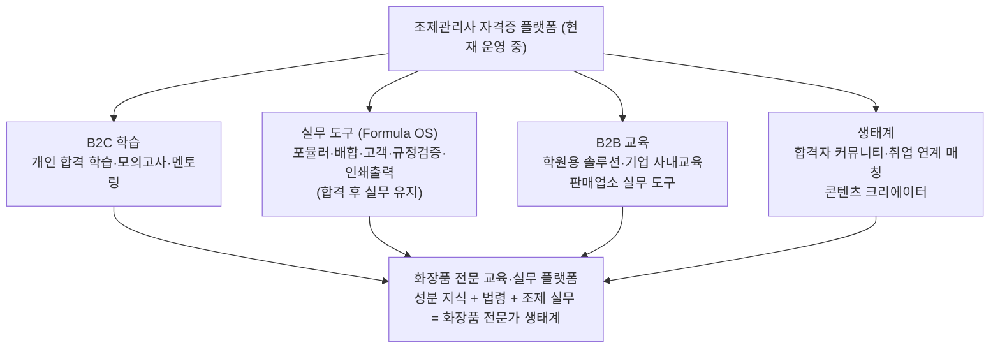

### 17.1 확장 판정 철학 — 핵심 질문 1개

이 사업의 진짜 자산은 시험 콘텐츠가 아니라 **성분 DB(1,376종) + 법령·고시 ref_md(75종) + 규정 검증 엔진(`formula-check`)**이다. 기존 기준(자산 재사용·시장 크기·지불 동기·1인 운영)은 후보 선별용으로는 좋지만 Go/No-Go 판정에는 부족하다 — "고객 수가 크다"만으로는 매출이 보장되지 않는다 (고객 28,000곳 × 월 1만원 시장 < 고객 2,000곳 × 월 10만원 시장일 수 있다).

확장 판단의 핵심 질문을 하나로 압축하면:

> **"현재 가진 성분·규정 엔진을 재사용해서, 고객이 반복적으로 겪고 있고, 실수하면 실제 비용이 발생하며, 매월 돈을 지불할 이유가 있는 업무를 찾을 수 있는가?"**

이 질문을 통과한 시장만 개발 대상으로 보낸다 — 본 문서 전체의 철학("남은 과제는 개발이 아니라 누가 왜 돈을 내는가의 검증")과 동일하다.

### 17.2 평가 기준 (8개, 배점 100)

| # | 기준 | 배점 | 판정 내용 |
|---|---|---|---|
| ① | **기존 자산 재사용률** | 20 | 단순 높/중/저가 아니라 세분화: 성분 DB · 규칙 엔진 · UI · 인증/결제 · 콘텐츠 구조별 재사용 비율 |
| ② | **실질 시장 규모** | 15 | TAM이 아니라 **예상 매출 풀**: 잠재 고객 수 × 연 객단가 × 실제 구매 가능 비율 (예: 10,000곳 × 60만원 × 10% = 6억) |
| ③ | **지불 동기** | 20 | "문제가 발생하면 돈을 내는가" — 손실 기반 강도 (아래 표) |
| ④ | **반복 업무성** | 15 | 한 번의 문제 해결 도구인가, 반복 업무를 대체하는 도구인가 |
| ⑤ | **데이터·규제 해자** | 10 | 사용할수록 데이터가 쌓이는가 + 규제 데이터 유지 비용 (아래 표) |
| ⑥ | **1인 운영 가능성** | 10 | 개발·데이터 유지·영업·CS·법적 책임 5개 항목 |
| ⑦ | **개발 난이도** | 5 | 기존 엔진으로 만들 수 있는가 |
| ⑧ | **법적·운영 리스크** | 5 | 잘못된 판정에 따른 책임 부담 |

**채점 규칙** — 각 기준을 **0~5점**으로 평가한 뒤 `기준 점수 ÷ 5 × 배점`으로 환산한다. 척도가 없으면 점수가 다시 주관으로 돌아간다:

| 점수 | 의미 | ① 재사용률 예시 |
|---|---|---|
| 0 | 해당 없음/불가 | 거의 재사용 불가 |
| 1 | 매우 낮음 | 20% 미만 |
| 2 | 낮음 | 20~40% |
| 3 | 보통 | 40~60% |
| 4 | 높음 | 60~80% |
| 5 | 매우 높음 | 80% 이상 |

> ⚠️ 모든 점수는 사실이 아니라 **가설 점수**다 — 표기 시 "가설 점수: n/5 — 검증 수단" 형태로 쓰고, 인터뷰·프로토타입으로 실측해 갱신한다.

**③ 지불 동기 강도** — 구매 동기를 1~5로 분류한다:

| 구매 동기 | 강도 | 해당 예 |
|---|---|---|
| 있으면 편리 | 1 | |
| 시간 절약 | 2 | |
| 비용 절감 | 3 | |
| 업무상 필수에 가까움 | 4 | |
| 규제·금전 손실 회피 | 5 | 표시·광고 컴플라이언스(행정처분), 수출 규제(거래 차단) |

**⑤ 규제 데이터 유지 난이도** — 시장이 커 보여도 유지비가 1인 운영 범위를 넘으면 탈락이다:

| 난이도 | 수준 |
|---|---|
| ★ | 국내 법령 |
| ★★ | 국내 고시 + 성분 DB |
| ★★★ | 국내 여러 규정 |
| ★★★★ | EU·미국 등 해외 규정 |
| ★★★★★ | 다국가 실시간 규제 모니터링 |

**⑥ 1인 운영 5항목**: ① 개발 — 기존 엔진으로 가능한가 ② 데이터 — 혼자 최신 상태를 유지할 수 있는가 ③ 영업 — 온라인으로 고객 확보 가능한가 ④ CS — 사용자가 스스로 해결 가능한가 ⑤ 법적 리스크 — 오판정 책임 부담 수준

### 17.3 판정 절차 — Hard Gate → 100점 평가

점수 평가 전에 Hard Gate를 먼저 통과해야 한다. **하나라도 해당하면 점수와 관계없이 보류**:

1. **실제 구매 의향을 검증할 수 있는 고객군이 확인되지 않음** — 신제품이라 처음엔 구매자가 없는 것이 정상이므로, "구매 고객"이 아니라 "구매 의향을 물어볼 고객군"의 존재가 기준이다
2. 규제 데이터 유지가 1인 운영 범위를 초과
3. 법적 책임이 제품 가치보다 큼
4. 기존 자산 재사용률이 너무 낮음
5. 반복 사용이 없음

Gate 1의 검증은 단계적으로 한다 — 인터뷰(말)만으로는 실제 구매와 거리가 있다:

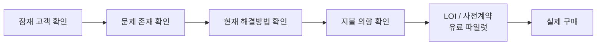

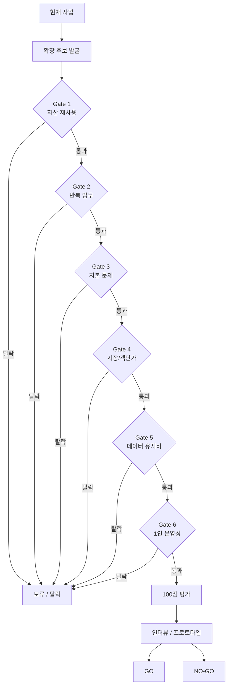

이 절차는 "시장이 커 보이니까 확장"을 방지한다 — 게이트를 통과해도 최종 판정은 점수가 아니라 **인터뷰·프로토타입 검증**으로 한다.

### 17.4 후보별 검증 우선순위

아래 순서는 "사업 확장 순위"가 아니라 **현재 가설상 우선 검증 후보**다 — 점수가 아닌 인터뷰로 실제 판정한다.

| 후보 | 핵심 가치 | 가장 먼저 검증할 것 |
|---|---|---|
| **① 표시·광고 컴플라이언스** | 규제 손실 회피 (지불 동기 가설 점수 5/5) | 실제 돈을 내는가 |
| **② 수출 규제 체크** | 높은 업무 가치·객단가 | 데이터 유지 비용 |
| **③ 인접 자격증** | 저비용 유입 확대 | 유료 전환 가능성 |
| **④ 자사 제품 결합** | 객단가 상승 | 영업·현장지원 부담 |

#### 후보 ① — 책임판매업자용 표시·광고 컴플라이언스 도구

§3.3에서 "별도 수요 검증 필요"로 남겨둔 책임판매업(~28,000곳)을 Formula OS가 아닌 **별도 제품**으로 공략한다.

- **업무 겹침**: 책임판매업체의 반복 업무는 조제가 아니라 전성분 표시(명칭·순서), 사용상 주의사항 문구, 기능성·의약품 오인 광고 표현 점검 — 성분 DB와 고시 기반 판정 로직의 **높은 재사용이 예상되나, 실제 재사용률은 프로토타입으로 검증한다** (전성분 표시·주의사항·기능성 표현·광고 표현·원료 규제·제품 유형·국가별 규정의 규칙 구조가 서로 다를 수 있음).
- **지불 동기**: 행정처분·판매정지라는 명확한 손실 회피(가설 점수 5/5 — 실제 지불의사는 인터뷰·유료 파일럿으로 검증) — 학습자보다 지불의사가 높고 브랜드 수가 많아 225곳 시장의 수십 배.
- **반복성**: 제품 등록 → 성분 검토 → 광고 검토 → 수정 → 재검토 → 신제품 출시 → 다시 검토 — 반복 업무 대체형.
- **운영 적합성**: "입력 → 규칙 검증 → 리포트" 구조라 CS 부담이 적고, §14.4의 "참고 판정·기준일 명시·최종 책임은 사용자" 원칙을 그대로 적용 가능.
- **순서 주의**: 광고 문구 점검은 업계 자율심의 체계·AI 문구 검토 서비스와 겹칠 수 있다 — **전성분·주의사항 표시 검증을 먼저** 하고 광고 표현은 후순위로 붙인다.

#### 후보 ② — 수출 성분 규제 체크 (①의 상위 요금제)

같은 성분 DB에 EU·미국(MoCRA)·중국 등 주요 수출국의 금지·한도 기준을 병기해 "이 포뮬러는 어느 나라에 수출 가능한가"를 판정한다. 지불 동기는 거래 차단 회피(가설 점수 5/5)로 객단가가 가장 높은 영역이다. 단, 규제 데이터 유지 난이도가 ★★★★ 이상이라 Hard Gate ②에 걸릴 수 있다 — 처음부터 별도 사업으로 만들지 않고 **규제 데이터 범위를 단계적으로 확장**한다:

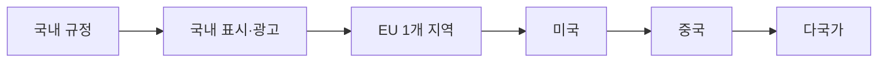

①의 Pro 기능으로 EU 1곳만 먼저 붙이고, 유지비가 감당 가능한지를 검증한 뒤 다음 국가로 넓힌다.

#### 후보 ③ — 인접 자격증 (유입 채널)

멀티시험 구조(`content/exams/<id>/`·`data/exams/<id>/` 대칭)로 한계비용이 가장 낮다 — 신규 시험은 앱 코드 변경 없이 콘텐츠만으로 추가된다. 피부미용사 필기는 피부·모발 구조·화장품학이 4과목과 겹치고 응시 규모가 크다. 단, 시장 크기만으로 확장하면 안 된다 — 기출 앱·CBT 사이트가 많은 레드오션이고 지불 동기가 약하므로(가설 점수 1~2/5) 수익원이 아니라 **무료 유입 채널 확장** 용도로 본다 — "합격 후 실무 도구"로 이어지는 구조도 약하다. 자격증을 계속 추가하면 자격증 포털 사업으로 변질되므로, 추가 기준은 **"기존 Knowledge Base와 Formula OS의 수익화에 도움이 되는가"**로 제한한다.

#### 후보 ④ — 자사 제품 결합 (검토 대상)

§3.3 "② 성장 사업"의 "자사 다른 사업과의 결합"에 해당. SkyPrescription(오프라인 매장용 처방·성분 분석)과 Formula OS는 둘 다 판매업소를 향하므로, 따로 팔기보다 **"상담 → 처방 → 조제 기록"을 잇는 매장 패키지**로 묶으면 225곳 시장에서도 객단가를 올릴 수 있다. SkinLens까지 붙이면 피부관리실·뷰티숍으로 넓어지지만, 매장 영업·현장 지원이 필요해 1인 운영성(⑥)에서 가장 불리하다.

### 17.5 피하는 방향

- **법정 연간 교육 사업** — 책임판매관리사·조제관리사의 법정 교육은 지정 교육기관만 가능해 진입이 막혀 있다 (보조 학습 콘텐츠는 가능).
- **도메인 무관 대형 자격증** (공인중개사 등) — 성분·법령 자산이 무용지물이고 대형 교육사와 정면 경쟁이라 1인 사업에 맞지 않는다.

### 17.6 확장 운영 원칙 — 한 번에 하나의 사업 가설만 검증

이 문서의 확장 가능성 목록(Formula OS·B2B·표시광고·수출·인접 자격증·자사 결합·교육·커뮤니티·API)은 전부 가능해 보이는 것 자체가 1인 개발 사업의 구조적 위험이다. 운영 원칙:

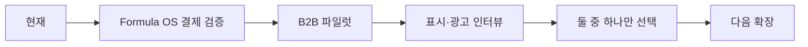

**한 번에 하나의 사업 가설만 검증**한다 — 병렬로 여러 확장을 진행하면 어느 것도 판정하지 못한다.

### 17.7 보조 지표 — 1인 운영을 숫자로 검증

**① Revenue per Owner Hour** — §17.2 기준 ⑥(1인 운영성)을 실측하는 핵심 지표:

```text
시간당 매출 = 월 매출 ÷ 사업 운영에 투입한 총 시간
```

| 사업 (예시) | 월 매출 | 투입 시간 | 시간당 매출 |
|---|---|---|---|
| 학습 Premium | 100만원 | 30시간 | 3.3만원 |
| Formula OS | 200만원 | 20시간 | 10만원 |
| B2B | 300만원 | 60시간 | 5만원 |
| 컴플라이언스 | 300만원 | 15시간 | 20만원 |

시장 규모보다 **어떤 사업이 1인 운영에 적합한지**를 이 지표가 결정한다.

**② 유지비 대비 매출** — 규제 서비스의 실질 가치:

```text
실질 영업가치 = 연 매출 − 데이터 유지비 − CS 비용 − 서버 비용 − 법률 검토 비용
```

수출 규제처럼 매출은 커 보여도 유지비가 높으면 1인 사업으로는 매력도가 떨어진다 — `매출/유지비 비율`을 보조지표로 둔다.

### 17.8 실행 — 수요 검증 인터뷰 추가

Step 0의 판매업소 인터뷰 10곳과 같은 기간에 **책임판매업체(인디 브랜드) 인터뷰 5곳**을 추가한다 (§12.2). 코드가 필요 없고, "전성분·주의사항 표시를 지금 어떻게 확인하는가 / 누가 검토하는가 / 실수로 처분받은 경험이 있는가" 세 질문만으로 후보 ①의 지불의사를 판정할 수 있다. 가설 ④(Formula OS 편리성)가 부정되어도 이 방향이 엔진 자산을 살리는 대안 경로다.

---

## 18. 요약 — 핵심 전략 3가지

1. **Formula OS가 핵심 제품, 시험 플랫폼은 고객 획득 채널** — 무료 학습으로 응시자를 모으고, 합격 후 실무 작업실로 전환해 지속 사용·수익화. 첫 결제 상품은 **Formula OS Pro(한도 해제)**. 실구매자는 판매업소이며 학습 앱 경유 전환은 보조 경로 — 검증 순서는 인터뷰 10곳 → 파일럿 3곳 → 유료 1곳.
2. **Step 0 = 지표 계측 + 판매업소 인터뷰 10곳 + 책임판매업체 인터뷰 5곳** — 분석 도구는 즉시 도입하고 측정 기간은 시험 일정에 맞춘다. 가설 ④ 판정과 §17.4 후보 ① 컴플라이언스 도구의 지불의사 판정이 이후 모든 순서를 결정한다.
3. **규모에 대한 정직한 정의와 확장 게이트** — 전 매출축 합산 상한은 연 수천만 원대(§16.4). 확장은 순위가 아니라 Hard Gate → 8개 기준 평가 → 인터뷰 검증 절차로 판정한다(§17). 현재 가설상 우선 검증 후보는 표시·광고 컴플라이언스(책임판매업 ~28,000곳, 별도 제품)이고, 수출 규제 체크는 그 Pro 기능으로 붙인다. **한 번에 하나의 사업 가설만 검증**한다(§17.6).

> **즉시 실행 3가지** (다음 전략 판정의 입력): ① Formula OS 실제 사용자 3곳 확보 ② 실제 유료 결제 1건 ③ 책임판매업체 5곳 인터뷰 — 이 세 결과로 "계속 / Formula OS 확대 / 컴플라이언스 전환"을 판정한다 (§12.4).

> **비전 문장:** "시험이 끝나면 버려지는 자격증 앱이 아니라, 합격 후 실제 조제 업무에서 계속 사용하는 Formula OS로 연결한다 — 나아가 화장품 전문가 생태계의 실무 허브."

---

## 19. 관련 문서

| 문서 | 경로 | 내용 |
|---|---|---|
| 구독 전환 로드맵 | `docs/dev/SUBSCRIPTION_ROADMAP.md` | CSP, SW, 결제, 동기화 등 상세 기술 로드맵 |
| 아키텍처 설계 | `docs/dev/ARCHITECTURE.md` | 현재 아키텍처 및 설계 표준 |
| 요구사양 명세서 | `docs/dev/SPEC.md` | 구현 완료된 기능의 요구사양 명세 |
| 배포 가이드 | `docs/dev/DEPLOYMENT_GUIDE.md` | Vercel 배포 및 오디오 호스팅 가이드 |
| 실무모드 설계 | `docs/dev/FORMULA_OS_DESIGN.md`, `FORMULA_OS_WORKFLOW_DESIGN.md` | Formula OS 아키텍처·업무 플로우 |
| 실무모드 매뉴얼 | `docs/user/formula_manual.md` | 실무 작업실 사용 설명서 |
| 교재 작성 지침 | `docs/dev/TEXTBOOK_AUTHORING_GUIDE.md` | 교재 Markdown 작성 표준 |
| 테스트 가이드 | `docs/dev/TESTING.md` | 테스트 가이드 및 실행 방법 |
