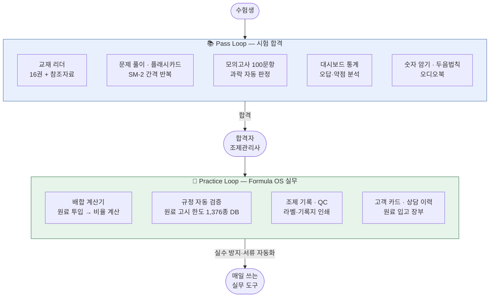
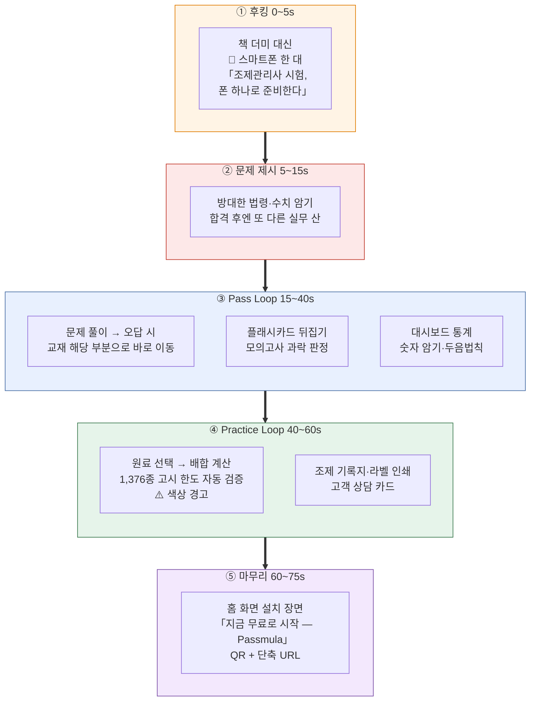

# 유튜브 홍보동영상 제작 의뢰서

> ## 🔗 서비스 바로가기 — **https://personalized-skincare-study.vercel.app**
>
> 스마트폰 브라우저에서 위 주소를 열면 실제 앱을 바로 체험할 수 있습니다.
> 회원가입이나 설치 없이 모든 화면을 둘러볼 수 있고, 홈 화면에 추가하면 앱처럼 동작합니다.
>
> - **Android (Chrome)**: 주소 접속 → 우측 상단 ⋮ → "홈 화면에 추가" 또는 "앱 설치"
> - **iOS (Safari)**: 주소 접속 → 하단 공유 버튼 → "홈 화면에 추가"
> - **PC**: 크롬 주소창 우측 설치 아이콘으로 데스크톱 앱 확인 가능
>
> 촬영 대상 화면 목록은 §11을 참조하세요.

| 항목 | 내용 |
|------|------|
| 서비스명 | **Passmula** (실무 기능명: **Formula OS**) |
| 문서 성격 | 영상 제작사/프리랜서 대상 제작 의뢰 브리프 |
| 작성일 | 2026-09-26 |
| 버전 | v2 |

---

## 1. 의뢰 개요

| 항목 | 내용 |
|------|------|
| 의뢰인 | (작성 필요 — 사업자명, 담당자, 연락처, 이메일) |
| 서비스명 | Passmula — 맞춤형화장품 조제관리사 학습 + 실무 플랫폼 |
| 서비스 URL | https://personalized-skincare-study.vercel.app (영상 CTA용 단축 도메인 별도 안내 예정) |
| 제작 목적 | 서비스 인지도 확보 및 신규 사용자 유입 (유튜브 채널 게시 + 유료 광고 소재) |
| 희망 납품일 | (작성 필요) |
| 예산 범위 | (작성 필요) |

## 2. 서비스 소개

Passmula는 **맞춤형화장품 조제관리사 국가시험**을 준비하는 수험생과,
합격 후 맞춤형화장품조제판매업소(이하 조제판매업소)에서 일하는 **조제관리사 실무자**를
함께 지원하는 모바일 웹 앱(PWA)입니다.

**두 개의 루프가 하나의 플랫폼을 이룹니다.**

**핵심 메시지**

1. **합격부터 실무까지 한 앱으로** — 시험 준비가 끝나면 같은 앱이 조제 실무 도구로 이어집니다.
2. **설치 없이 바로 사용** — 브라우저 주소만으로 접속, 홈 화면 추가 시 앱처럼 동작(오프라인 지원).
3. **무료로 시작** — 계정 없이 바로 사용 가능, 로그인하면 여러 기기에서 동기화.

> ⚠️ **표현 가이드 (자막·나레이션 공통)**
> - "유일한", "최초", "1위", "합격 보장" 등 최상급·보장 표현은 사용하지 않습니다.
> - "전 기능 무료" 대신 "무료로 시작"으로 표기합니다.
> - 수치는 **§13 인가 수치 일람**에 적힌 값만 사용하고, 임의 수치를 추가하지 않습니다.

## 3. 타깃 시청자

| 구분 | 특성 | 어필 포인트 |
|------|------|------------|
| 수험생 (1차 타깃) | 조제관리사 시험 준비생, 20~40대, 모바일 학습 선호 | 무거운 교재 대신 폰으로 어디서나 — 문제 풀이·암기·모의고사 올인원 |
| 실무자 (2차 타깃) | 조제판매업소 근무 조제관리사 (전국 약 231곳 — 자체 조사 2026-09 기준) | 배합 계산·원료 규정·조제 기록을 폰 하나로 — 실수 방지 + 서류 자동화 |
| 업계 종사자 | 맞춤형화장품 창업·취업 희망자 | 자격 취득부터 실무 준비까지 한 플랫폼 |

## 4. 제작 사양

| 항목 | 사양 |
|------|------|
| 메인 영상 | **60~75초**, 1920×1080 (16:9) |
| 숏폼 컷다운 | **15~30초**, 1080×1920 (9:16) — 유튜브 쇼츠/인스타 릴스 겸용, **별도 구성**(§5-2) |
| 형태 | 스마트폰 화면 녹화 기반 제품 시연 + 모션그래픽 |
| 언어 | 한국어, **자막 필수** (무음 시청 대응) |
| 음성 | 아래 옵션별 견적 요청 (의뢰인이 견적 비교 후 선택) |
| BGM | 밝고 신뢰감 있는 톤, **유료 광고 집행 포함·기간 무제한** 사용 가능한 라이선스 |
| 납품 포맷 | MP4 (H.264) |

**음성 옵션 (견적 시 각각 표기 요청)**

| 옵션 | 내용 |
|------|------|
| A | 자막 + BGM만 (나레이션 없음) |
| B | AI 보이스 나레이션 |
| C | 전문 성우 나레이션 |

## 5. 영상 구성 가이드

> 제작사가 더 나은 구성을 제안하면 우선합니다. 아래는 반드시 전달해야 할 메시지입니다.

### 5-1. 메인 영상 (60~75초)

1. **후킹 (0~5초)**: "조제관리사 시험, 폰 하나로 준비한다" — 책 더미 대신 스마트폰 화면
2. **문제 제시 (5~15초)**: 방대한 법령·수치 암기의 부담, 합격 후엔 또 다른 실무 부담
3. **Pass Loop (15~40초)**: 실제 화면 녹화로 시연
   - 문제 풀이 → 오답 시 교재 해당 부분으로 바로 이동
   - 플래시카드 넘기기, 모의고사 과락 판정, 대시보드 학습 통계
   - 숫자 암기·두음법칙 등 암기 특화 도구
4. **Practice Loop (40~60초)**: Formula OS 시연
   - 원료 선택 → 배합 계산 → 고시 한도 1,376종 기준 자동 검증(색상 경고)
   - 조제 기록지·라벨 인쇄, 고객 상담 카드
5. **마무리 (60~75초)**: 홈 화면 설치 장면 + CTA
   - "지금 무료로 시작 — Passmula" + **QR 코드(메인) + 단축 URL(보조)**

### 5-2. 숏폼 컷다운 (15~30초)

메인 영상을 단순히 줄이지 말고, **수험생 대상 Pass Loop 단독**으로 구성합니다.

| 구간 | 내용 |
|------|------|
| 0~3초 | 후킹 — "조제관리사 시험, 폰 하나로" |
| 3~22초 | 문제 풀이 → 오답 → 교재 이동, 플래시카드, 모의고사 과락 판정을 빠르게 전환 |
| 22~30초 | "무료로 시작 — Passmula" + QR |

## 6. 반드시 포함할 화면

> §11 전체 촬영 목록 중 **최소 노출 필수 항목**입니다.

- 문제 풀이 (오답 시 교재 이동 포함)
- 플래시카드
- 모의고사 결과 (과락 판정)
- 대시보드 학습 통계
- 배합 계산기
- 규정 검증 경고 (색상 경고)
- 조제 기록지 출력물

**촬영 시 유의사항**

- **"기출"이라는 단어를 자막에 쓰지 않습니다.** 앱 내 문제는 "시험 대비 문제"로 표현합니다.
- **교재 리더 화면은 본문이 판독되지 않도록** 빠르게 스크롤하거나 흐림 처리합니다.
- 고객 카드·상담 이력은 **의뢰인이 제공하는 가상 데이터만** 사용합니다.
- 화면 테마는 **라이트 모드로 통일**합니다.
- 촬영용 기기는 **Android를 권장**합니다 (iOS는 홈 화면 추가 후 오디오 등 일부 기능이 브라우저와 다르게 동작할 수 있음).
- 상태바는 정리된 상태로 촬영합니다 (시간 고정, 알림 아이콘 없음, 배터리 가득).

## 7. 톤 & 매너

- **신뢰감 + 실용성** — 자격·법규 도메인 특성상 과장이나 유머보다 정확한 정보 전달
- **속도감 있는 시연** — 긴 설명 없이 화면 전환으로 기능을 밀도 있게 노출
- 브랜드 컬러: 첨부 팔레트 사용 (HEX 값: 작성 필요)
- 로고: "Passmula" 브랜드 텍스트 및 앱 아이콘 에셋 첨부

## 8. 의뢰인 제공 자료

- [ ] 서비스 URL, 가상 데이터가 세팅된 데모 환경
- [ ] 기능 시연 시나리오 (§5 기반 상세 클릭 순서)
- [ ] 브랜드 에셋 (앱 아이콘, 로고, 컬러 팔레트 HEX)
- [ ] 영상 CTA용 단축 URL 및 QR 코드
- [ ] 레퍼런스 영상 링크 2~3건 (작성 필요)

## 9. 납품물 및 검수

**납품물**

| 항목 | 내용 |
|------|------|
| 메인 영상 | 자막 포함 버전 1편 + **자막 없는 클린 버전** 1편 |
| 숏폼 | 자막 포함 버전 1편 + 클린 버전 1편 |
| 자막 파일 | SRT (메인·숏폼 각각) |
| 썸네일 | 유튜브용 1~2종 (1280×720) |
| 선택 | 6초 범퍼 광고용 컷, 컷별 소스·프로젝트 파일 (견적 별도 표기) |

**검수 절차**

| 단계 | 산출물 | 수정 |
|------|--------|------|
| 1. 콘티 확정 | 콘티/스토리보드 | 1회 |
| 2. 1차 편집 | 러프컷 | 1회 |
| 3. 최종 | 완성본 | 1회 (경미한 자막·타이밍 수정) |

규정 횟수를 초과하는 수정의 비용 기준은 견적서에 함께 적어 주세요.

**권리 관계**

- 완성 영상의 저작재산권은 의뢰인에게 양도합니다 (또는 매체·기간·지역 제한 없는 이용허락).
- 제작사의 포트폴리오 게재 허용 여부는 협의합니다.
- 사용한 폰트·음원·스톡 소스는 **상업적 사용 및 유료 광고 집행이 가능한 라이선스** 증빙을 제출해 주세요.

## 10. 일정 (협의 후 확정)

| 단계 | 기간 | 산출물 |
|------|------|--------|
| 콘티·구성 협의 | _주차 | 콘티/스토리보드 |
| 1차 편집 | _주차 | 러프컷 |
| 최종 검수·납품 | _주차 | 완성본 + 컷다운 + 부속 납품물 |

## 11. 참고 — 서비스 주요 화면 목록 (촬영 대상)

| 화면 | 진입 경로 | 포인트 |
|------|-----------|--------|
| 홈/대시보드 | 앱 첫 화면 | 학습 통계·히트맵·오늘의 추천 |
| 문제 풀이 | 퀴즈 메뉴 | 과목별 문제, 오답 시 교재 링크 |
| 플래시카드 | 카드 메뉴 | 3D 카드 뒤집기, SM-2 복습 |
| 모의고사 | 시뮬레이터 | 100문항·120분·과락 판정 결과 |
| 교재 리더 | 교재 메뉴 | 16권 교재 + 참조자료 + 오디오 (본문 판독 불가하게 촬영) |
| 배합 계산기 | Formula 메뉴 | 원료 투입 → 비율 자동 계산 |
| 규정 검증 | Formula 메뉴 | 고시 한도 초과 시 색상 경고 |
| 조제 기록 | 배치 메뉴 | 배치 기록·QC·인쇄 기록지 |
| 설정 | 우상단 ⚙️ | 테마·데이터 백업·버전 |

---

## 12. 견적 요청 시 포함해 주실 내용

1. 음성 옵션 A/B/C별 총액
2. 선택 납품물(범퍼 광고 컷, 프로젝트 파일) 별도 금액
3. 추가 수정 1회당 비용
4. 예상 제작 기간
5. 유사 작업 포트폴리오 2~3건

---

## 13. 부록 — 영상에 사용 가능한 인가 수치 일람

자막·나레이션·그래픽에 넣는 모든 수치는 이 표의 값만 사용합니다.
다른 수치가 필요하면 의뢰인 확인 후 추가합니다.

| 수치 | 의미 | 사용 예 |
|------|------|---------|
| **16권** | 앱 내 교재 (표준형 8 + 이야기형 8) | "교재 16권이 폰 안에" |
| **1,376종** | 원료 DB 규모 (고시 한도 검증 기준) | "원료 1,376종 규정 자동 검증" |
| **100문항 / 120분** | 모의고사 구성 (실제 시험과 동일) | "실전처럼 100문항·120분" |
| **4과목** | 시험 과목 수 | "4과목 올인원" |
| **약 231곳** | 전국 조제판매업소 수 (자체 조사 2026-09) | 실무자 타깃 언급 시 |
| **무료** | 시작 비용 (계정 없이 사용 가능) | "지금 무료로 시작" |

> 참고: SM-2, PWA, 서비스워커 등 기술 용어는 자막·나레이션에 쓰지 않습니다.
> 화면에 보이는 대로 "알아서 복습 타이밍을 잡아준다"처럼 풀어서 표현합니다.
