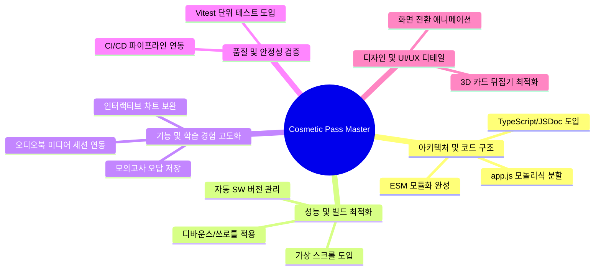

# 💄 Cosmetic Pass Master 보완 및 개선점 정리 보고서

본 보고서는 **맞춤형화장품 조제관리사 스마트 학습 플랫폼(Cosmetic Pass Master)**의 현재 코드베이스와 문서 분석을 바탕으로, 시스템 안정성, 성능 최적화, 기능 확장성 및 UI/UX 완성도를 극대화하기 위한 보완 및 개선 사항을 정리한 것입니다.

---

## 📋 요약 로드맵



---

## 1. 🏛️ 아키텍처 및 코드 구조 개선

### 1-1. `src/app.js` 모놀리식 파일 분할
- **현황**: 메인 엔트리 역할을 하는 [`src/app.js`](file:///c:/Project/Personalized_Skincare/src/app.js)가 약 5,170줄에 달하는 대형 파일로 구성되어 있습니다. 라우팅, 9개 뷰(View)의 렌더링 로직, 이벤트 핸들러가 모두 모여 있어 장기적인 유지보수와 디버깅이 어렵습니다.
- **개선안**: 각 뷰별 컨트롤러를 분리하여 `src/views/` 디렉터리에 모듈화합니다.
  - `src/views/dashboard.js` (대시보드 통계 및 챌린지)
  - `src/views/flashcard.js` (플래시카드 학습)
  - `src/views/quiz.js` (기출 및 일일 퀴즈)
  - `src/views/trainer.js` (스마트 훈련소 및 계산기)
  - `src/views/dictionary.js` (성분 검색 및 상세 보기)
  - `src/app.js`는 공통 라우팅 및 상태 변경 감지, 이벤트 위임 브릿지만 담당하도록 축소시킵니다.

### 1-2. ES Modules (ESM) 아키텍처 완성
- **현황**: `src/` 폴더 내 코드는 ESM 모듈 시스템을 도입하여 `import/export`를 사용하고 있으나, 빌드 산출물 번들(`data/registry.js`, `data/audio_manifest.js` 등)과 외부 Mermaid 라이브러리 등은 여전히 클래식 전역 스크립트로 로드되어 전역 `window` 객체에 바인딩하고 있습니다.
- **개선안**:
  - `data/registry.js` 및 오디오 매니페스트 등을 정적 ESM 모듈 형태로 빌드하도록 개선합니다.
  - 빌드 시스템(`tools/build/`)을 정돈하여 배포판 자산 전체가 표준 ESM 흐름을 타도록 완성합니다.

### 1-3. 타입 안정성 (JSDoc 또는 TypeScript) 도입
- **현황**: 전역 상태(`state`) 및 복잡한 과목 메타데이터 구조가 자바스크립트 객체로 관리되어, 속성 추가/변경 시 런타임 오류가 발생하기 쉽습니다.
- **개선안**: JSDoc 주석을 추가해 `@type` 정의를 입혀 에디터 자동완성 및 코드 진단 성능을 극대화하거나, 점진적으로 TypeScript(`.ts`)를 도입하여 안전한 대형 리팩토링 기반을 닦습니다.

---

## 2. ⚡ 성능 및 빌드 최적화

### 2-1. 성분 사전 및 교재 본문 검색 최적화
- **현황**: 성분 검색 사전(`dictionary-view`)이나 교재 본문 검색(`textbook-view`)에서 실시간 타이핑을 통해 결과를 렌더링할 때, 타이핑할 때마다 DOM 리렌더링 및 이스케이프 처리가 일어나 모바일 기기에서 타이핑 랙(Input Lag)이 발생할 수 있습니다.
- **개선안**:
  - **디바운스(Debounce)**: 타이핑 입력 시 200~300ms의 대기 시간(Debounce)을 두어 검색 실행 횟수를 줄입니다.
  - **가상 스크롤(Virtual Scrolling)**: 성분 사전 등 검색 결과 목록이 100개 이상일 경우 화면에 보이는 요소만 렌더링하는 가상 스크롤(Windowing) 기법을 구현하여 DOM 노드 수를 절감합니다.

### 2-2. 자동화된 서비스 워커 버전 관리
- **현황**: [`sw.js`](file:///c:/Project/Personalized_Skincare/sw.js)의 캐시 버전을 관리하는 `CACHE_VERSION` 상수를 수동으로 직접 갱신하고 있습니다. 업데이트 시 이를 잊으면 클라이언트에 구버전 캐시가 유지되는 문제가 생길 수 있습니다.
- **개선안**: 빌드 파이프라인(`tools/build/index.js`)에서 빌드 타임의 타임스탬프 또는 Git 해시를 기반으로 `sw.js` 내의 `CACHE_VERSION`을 자동 치환(Replacement)해 생성하도록 자동화합니다.

---

## 3. 🎯 기능 및 학습 경험 고도화 (UX/Feature)

### 3-1. 모의고사(Exam) 오답 복습 연동
- **현황**: 모의고사 뷰어([`src/exam-viewer.js`](file:///c:/Project/Personalized_Skincare/src/exam-viewer.js))는 인앱 전체화면 오버레이를 통해 실전처럼 문제를 풀고 인쇄할 수 있으나, 틀린 문제나 모르는 문제를 '오답/중요 복습' 탭에 보관하는 학습 추적 연동이 다소 약합니다.
- **개선안**: 모의고사 채점 후 틀린 문제를 즉시 북마크하여 `state.weakCards` 또는 신규 `state.incorrectExams`에 바인딩하고, 복습 메뉴에서 모의고사 오답만 따로 모아 필터링하여 풀 수 있도록 기능을 보강합니다.

### 3-2. 오디오북 플레이어 백그라운드 제어 연동 (Media Session API)
- **현황**: 19개 단원 오디오북 재생 시 모바일 화면이 꺼지거나 백그라운드 환경으로 전환되었을 때, 락스크린(잠금화면) 및 알림바에서 제어(재생/정지/단원 건너뛰기)가 불가능한 경우가 있습니다.
- **개선안**: 브라우저의 `navigator.mediaSession` API를 활용하여 오디오북 챕터 메타데이터(제목, 앨범아트, 아티스트 정보 등)를 시스템에 전달하고, 백그라운드 재생 제어를 활성화합니다.

### 3-3. 성적 시각화 대시보드 고도화 (Interactive Charts)
- **현황**: SVG 기반 차트(`src/charts.js`)가 자체 구현되어 성능이 우수하나, 정적인 이미지 형태로만 표현됩니다.
- **개선안**: 레이더 차트의 꼭짓점이나 꺾은선 그래프의 각 데이터 포인트에 터치/마우스 호버(Hover) 시, 툴팁으로 정확한 백분율 성적 및 최근 평균점수를 노출해 주는 인터랙티브 툴팁 기능을 추가합니다.

---

## 4. 🧪 테스트 및 코드 안정성 확보

### 4-1. 단위 테스트(Unit Test) 시스템 도입
- **현황**: 복잡한 비즈니스 로직(예: 퀴즈 ID 해시 규칙, MD 파서 변환 규칙, 계산기 수식 문제 생성기 등)의 안전성을 검증할 수 있는 자동화 테스트 코드가 누락되어 있습니다.
- **개선안**:
  - 가벼운 테스트 러너인 **Vitest** 또는 **Jest**를 설치하고, 로직 전용 파일인 `trainer-calc.js`, `sanitize.js`, `textbook-parser.js`에 대한 단위 테스트 스위트를 빌드 파이프라인에 추가합니다.
  - 예시: `npm run test` 실행 시 파서 정합성 자동 검증.

### 4-2. CI/CD 빌드 유효성 자동화 검증
- **현황**: PR(Pull Request) 등록이나 Vercel 배포 시, 개발자가 로컬에서 돌려보는 스모크 테스트 위주로 이루어집니다.
- **개선안**: GitHub Actions 등을 연동하여 푸시(Push) 발생 시 `npm run build:data` 빌드 확인 및 린트 검사(`ESLint`), 단위 테스트가 자동으로 작동하고 실패 시 배포를 중단하는 가드레일을 설치합니다.

---

## 5. 🎨 디자인 완성도 및 마이크로 인터랙션 (UI/UX)

### 5-1. 뷰(View) 전환 시 모션 그래픽 적용
- **현황**: 메뉴 전환 시 `.active` 클래스 토글을 통해 즉각적으로 화면이 전환되는데, 다소 밋밋하게 느껴질 수 있습니다.
- **개선안**: CSS 트랜지션 및 키프레임을 사용하여 뷰 전환 시 은은한 페이드인(Fade-in) 및 위쪽으로 살짝 올라오는 슬라이드(Slide-up) 모션을 적용하여 앱의 프리미엄 감성을 높입니다.
  ```css
  .view-section {
      display: none;
      opacity: 0;
      transform: translateY(8px);
      transition: opacity 0.25s ease, transform 0.25s ease;
  }
  .view-section.active {
      display: block;
      opacity: 1;
      transform: translateY(0);
  }
  ```

### 5-2. 3D 플래시카드 뒤집기 애니메이션 강화
- **현황**: 플래시카드를 뒤집을 때 단순한 회전 트랜지션이 적용되어 있으나, 일부 모바일 브라우저나 저가형 단말기에서 깨짐 현상이 있거나 깊이감(Perspective)이 다소 약합니다.
- **개선안**: CSS `perspective` 속성을 부모 컨테이너에 적용하고 `backface-visibility: hidden` 및 GPU 가속(`transform: translate3d`)을 보강하여, 마치 실제 입체 카드를 돌리는 듯한 매끄러운 3D 효과를 구현합니다.

### 5-3. 라이트 모드 디자인 최적화 (Color Contrast & HSL)
- **현황**: 기본 테마가 세련된 다크 테마 위주로 튜닝되어 있어, 라이트 모드(`light-theme`) 적용 시 일부 과목별 배지 색상의 대비비율(Contrast Ratio)이 웹 콘텐츠 접근성 가이드(WCAG) 기준에 미치지 못해 텍스트가 흐릿하게 보일 수 있습니다.
- **개선안**: HSL 색상 모델을 활용하여 라이트 모드 시 가독성이 높은 중간 톤 색상으로 자동 보정되도록 스타일 디자인 토큰을 조정합니다.
