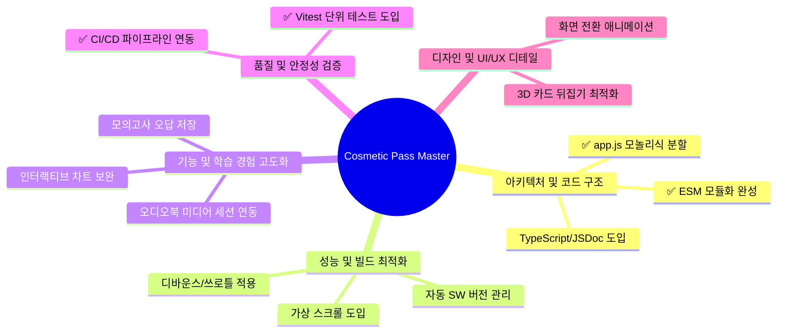

# 💄 Cosmetic Pass Master 보완 및 개선점 정리 보고서

본 보고서는 **맞춤형화장품 조제관리사 스마트 학습 플랫픔(Cosmetic Pass Master)**의 현재 코드베이스와 문서 분석을 바탕으로, 시스템 안정성, 성능 최적화, 기능 확장성 및 UI/UX 완성도를 극대화하기 위한 보완 및 개선 사항을 정리한 것입니다.

> **2026-08-25 업데이트**: 1-1(app.js 분할), 1-2(ESM 완성), 4-1(단위 테스트), 4-2(CI/CD) 항목이 완료되었습니다. 완료된 항목은 ✅ 표시로 갱신합니다.
>
> **2026-08-26 업데이트**: 모바일 네비게이션 버그 수정, PWA 설치 버튼 수정(beforeinstallprompt 조기 캡처 + SW 조기 등록), 인앱 브라우저(WebView) 감지 및 Chrome 안내 기능이 완료되었습니다.

---

## 📋 요약 로드맵



---

## 1. 🏛️ 아키텍처 및 코드 구조 개선

### 1-1. ✅ `src/app.js` 모놀리식 파일 분할 (완료: 2026-08-25)
- **현황**: ~~메인 엔트리 역할을 하는 `src/app.js`가 약 5,170줄에 달하는 대형 파일~~ → **1,154줄로 축소 완료**.
- **완료 내역**: 각 뷰별 컨트롤러를 `src/views/` 디렉터리에 모듈화 완료.
  - `src/views/dashboard.js` (대시보드 통계 및 챌린지)
  - `src/views/flashcard.js` (플래시카드 학습)
  - `src/views/quiz.js` (기출 및 일일 퀴즈)
  - `src/views/trainer.js` (스마트 훈련소 및 계산기)
  - `src/views/dictionary.js` (성분 검색 및 상세 보기)
  - `src/views/backup.js` (데이터 백업/복원)
  - `src/views/textbook-search.js` (교재 본문 검색)
  - `src/views/textbook-reader.js` (교재 리더 + 오디오 재생)
  - `src/views/exam-simulator.js` (실전 모의고사 시뮬레이터)
  - `src/ui-utils.js` (공통 로딩 UI 유틸)
  - `src/app.js`는 공통 라우팅 및 상태 변경 감지, 이벤트 위임 브릿지만 담당하도록 축소.

### 1-2. ✅ ES Modules (ESM) 아키텍처 완성 (완료: 2026-08-25)
- **현황**: `src/` 폴더 내 모든 코드가 ESM 모듈 시스템을 사용하여 `import/export`로 명시적 의존성 그래프를 구축했습니다. `data/registry.js`도 ESM import로 참조합니다.
- **완료 내역**: 모든 `src/*.js` 및 `src/views/*.js`가 ESM `import`/`export` 사용. `window` 전역 노출은 이벤트 위임 호환성 유지용으로만 최소화하여 남김.

### 1-3. 타입 안정성 (JSDoc 또는 TypeScript) 도입
- **현황**: 전역 상태(`state`) 및 복잡한 과목 메타데이터 구조가 자바스크립트 객체로 관리되어, 속성 추가/변경 시 런타임 오류가 발생하기 쉽습니다.
- **개선안**: JSDoc 주석을 추가해 `@type` 정의를 입혀 에디터 자동완성 및 코드 진단 성능을 극대화하거나, 점진적으로 TypeScript(`.ts`)를 도입하여 안전한 대형 리팩토링 기반을 닦습니다.

---

## 2. ⚡ 성능 및 빌드 최적화

### 2-1. 성분 사전 및 교재 본문 검색 최적화
- **현황**: 성분 검색 사전(`dictionary-view`)이나 교재 본문 검색(`textbook-view`)에서 실시간 타이핑을 통해 결과를 렌더링할 때, 타이핑할 때마다 DOM 리렌더링 및 이스케이프 처리가 일어나 모바일 기기에서 타이핑 랙(Input Lag)이 발생할 수 있습니다.
- **개선안**:
  - **디바운스(Debounce)**: 타이핑 입력 시 200~300ms의 대기 시간(Debounce)을 두어 검색 실행 횟수를 줄입니다.
  - **가상 스크롤(Virtual Scrolling)**: 성분 사전 등 검색 결과 목록이 100개 이상일 경우 화면에 보이는 요소만 렌더링하는 가상 스크롤(Windowing) 기법을 구현하여 DOM 노드 수를 절감합니다.

### 2-2. 자동화된 서비스 워커 버전 관리
- **현황**: [`sw.js`](file:///c:/Project/Personalized_Skincare/sw.js)의 캐시 버전을 관리하는 `CACHE_VERSION` 상수를 수동으로 직접 갱신하고 있습니다. 업데이트 시 이를 잊으면 클라이언트에 구버전 캐시가 유지되는 문제가 생길 수 있습니다.
- **개선안**: 빌드 파이프라인(`tools/build/index.js`)에서 빌드 타임의 타임스탬프 또는 Git 해시를 기반으로 `sw.js` 내의 `CACHE_VERSION`을 자동 치환(Replacement)해 생성하도록 자동화합니다.

---

## 3. 🎯 기능 및 학습 경험 고도화 (UX/Feature)

### 3-1. ✅ 모의고사(Exam) 오답 복습 연동 (완료: 2026-08-26)
- **현황**: ~~모의고사 뷰어는 인앱 전체화면 오버레이를 통해 실전처럼 문제를 풀고 인쇄할 수 있으나, 틀린 문제를 '오답/중요 복습' 탭에 보관하는 학습 추적 연동이 다소 약합니다.~~ → **오답 복습 연동 완료**.
- **완료 내역**:
  - `submitExam()`에서 틀린 문제 자동 수집: `simState.wrongQuestions` + `state.weakCards.add('weak_sim_' + q.id)`
  - `showSimAnswerReview()`: 오답 해설 리뷰 (문제/내 답/정답/해설 표시)
  - `startWeakExam()`: 오답 모의고사 생성 (weakCards + 오답 퀴즈 → 최대 20문항)
  - `weak_sim_*` ID 매핑 보완: `window.EXAM_DATA`에서 원본 문제를 찾아 복습 문제로 조립 (기존에는 STUDY_DATA에서 찾지 못해 누락되던 문제 해결)
  - 과목별 필터링: `state.reviewFilter`로 과목별 오답 필터링

### 3-2. ✅ 오디오북 플레이어 백그라운드 제어 연동 (Media Session API) (완료: 2026-08-26)
- **현황**: ~~19개 단원 오디오북 재생 시 모바일 화면이 꺼지거나 백그라운드 환경으로 전환되었을 때, 락스크린(잠금화면) 및 알림바에서 제어가 불가능한 경우가 있습니다.~~ → **Media Session API 연동 완료**.
- **완료 내역**:
  - `textbook-reader.js`에 `setupMediaSession()` / `clearMediaSession()` 함수 추가
  - `navigator.mediaSession.metadata`: 단원 제목, 과목명, 앨범 아트(icon-192/512) 설정
  - `setActionHandler`: play, pause, seekto, previoustrack(이전 단원), nexttrack(다음 단원) 핸들러 등록
  - `playbackState`: 재생/일시정지 상태 동기화
  - Android Chrome에서 잠금화면/알림바 미디어 컨트롤 활성화

### 3-3. ✅ 성적 시각화 대시보드 고도화 (Interactive Charts) (완료: 2026-08-26)
- **현황**: ~~SVG 기반 차트가 자체 구현되어 성능이 우수하나, 정적인 이미지 형태로만 표현됩니다.~~ → **인터랙티브 툴팁 추가 완료**.
- **완료 내역**:
  - `charts.js`에 공통 툴팁 유틸리티(`getChartTooltip`, `showChartTooltip`, `hideChartTooltip`, `bindTooltip`) 추가
  - **라인 차트**: 데이터 포인트 hover/touch 시 날짜, 점수, 이전 대비 증감(▲/▼), 최근 평균 표시
  - **레이더 차트**: 꼭짓점 hover/touch 시 과목명, 점수, 합격 상태(과락/미달/안정권), 응시 횟수, 전체 평균 표시
  - 모바일 터치 지원: `touchstart`/`touchend` 이벤트로 터치 시 툴팁 표시 (2초 후 자동 숨김)
  - 화면 경계 자동 보정으로 툴팁이 화면 밖으로 넘어가지 않음

---

## 4. 🧪 테스트 및 코드 안정성 확보

### 4-1. ✅ 단위 테스트(Unit Test) 시스템 도입 (완료: 2026-08-25)
- **현황**: ~~복잡한 비즈니스 로직에 대한 자동화 테스트 코드가 누락~~ → **96개 테스트 구축 완료**.
- **완료 내역**:
  - Node.js 내장 테스트 러너로 86개 단위 테스트 구축 (`sha256`, `sanitize`, `state`, `textbook-parser`, `trainer-calc`, `utils`, `id-factory`)
  - **Vitest + jsdom**으로 10개 DOM 테스트 구축 (`backup.js` 모듈)
  - `npm test` (unit), `npm run test:dom` (DOM), `npm run test:all` (전체) 스크립트 운영
  - 파서 정합성 검증: `node tools/check_parser_parity.js`

### 4-2. ✅ CI/CD 빌드 유효성 자동화 검증 (완료: 2026-08-25)
- **현황**: ~~PR 등록이나 배포 시 개발자가 로컬에서 돌려보는 스모크 테스트 위주~~ → **GitHub Actions CI 구축 완료**.
- **완료 내역**: `.github/workflows/ci.yml` — push 시 자동으로 `npm test`(86 unit tests) + `node tools/check_parser_parity.js`(파서 정합성 검증) 실행. 실패 시 PR 상태에 반영.

---

## 5. 🎨 디자인 완성도 및 마이크로 인터랙션 (UI/UX)

### 5-1. 뷰(View) 전환 시 모션 그래픽 적용
- **현황**: 메뉴 전환 시 `.active` 클래스 토글을 통해 즉각적으로 화면이 전환되는데, 다소 밋밋하게 느껴질 수 있습니다.
- **개선안**: CSS 트랜지션 및 키프레임을 사용하여 뷰 전환 시 은은한 페이드인(Fade-in) 및 위쪽으로 살짝 올라오는 슬라이드(Slide-up) 모션을 적용하여 앱의 프리미엄 감성을 높입니다.
  ```css
  .view-section {
      display: none;
      opacity: 0;
      transform: translateY(8px);
      transition: opacity 0.25s ease, transform 0.25s ease;
  }
  .view-section.active {
      display: block;
      opacity: 1;
      transform: translateY(0);
  }
  ```

### 5-2. 3D 플래시카드 뒤집기 애니메이션 강화
- **현황**: 플래시카드를 뒤집을 때 단순한 회전 트랜지션이 적용되어 있으나, 일부 모바일 브라우저나 저가형 단말기에서 깨짐 현상이 있거나 깊이감(Perspective)이 다소 약합니다.
- **개선안**: CSS `perspective` 속성을 부모 컨테이너에 적용하고 `backface-visibility: hidden` 및 GPU 가속(`transform: translate3d`)을 보강하여, 마치 실제 입체 카드를 돌리는 듯한 매끄러운 3D 효과를 구현합니다.

### 5-3. 라이트 모드 디자인 최적화 (Color Contrast & HSL)
- **현황**: 기본 테마가 세련된 다크 테마 위주로 튜닝되어 있어, 라이트 모드(`light-theme`) 적용 시 일부 과목별 배지 색상의 대비비율(Contrast Ratio)이 웹 콘텐츠 접근성 가이드(WCAG) 기준에 미치지 못해 텍스트가 흐릿하게 보일 수 있습니다.
- **개선안**: HSL 색상 모델을 활용하여 라이트 모드 시 가독성이 높은 중간 톤 색상으로 자동 보정되도록 스타일 디자인 토큰을 조정합니다.
