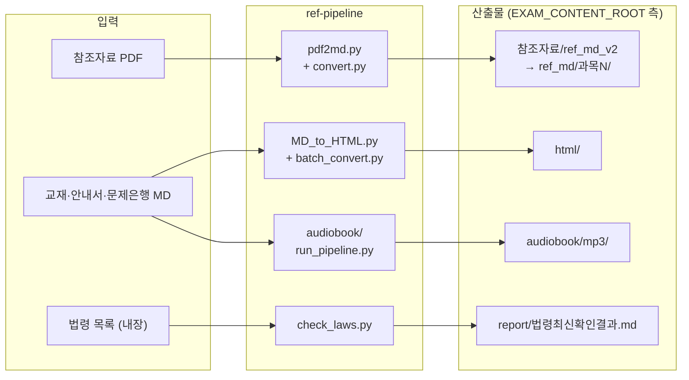
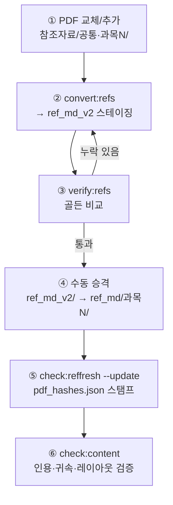
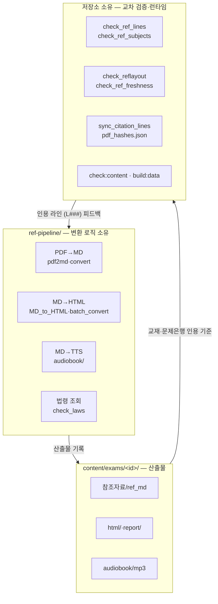

# ref-pipeline — 교재·참조자료 생성/변환 도구함

> **목적**: 교재·참조자료 콘텐츠의 **생성과 변환**. 앱 빌드와 분리된 독립 실행 단위이며,
> **교재가 바뀔 때마다 재사용**된다. 변환 엔진·래퍼·GUI·의존성을 한 폴더에 모아
> 저장소 구조와 무관하게 독립 실행 가능하다.



---

## 1. 도구 목록

| 파일 | 용도 | 언제 쓰나 |
|---|---|---|
| `pdf2md.py` | PDF→MD 변환 엔진 (공백 복원·표 구조화·무선 표 재구성·마진 잡행 제거) | 참조자료 PDF를 MD로 바꿀 때의 엔진. 직접 단일 파일 변환도 가능 |
| `convert.py` | 스테이징 워크플로 래퍼 — `pdf_root → ref_md_v2 → ref_md` | **참조자료 PDF 교체/추가 시** (시나리오 A) |
| `pdf2md_gui.py` | pdf2md의 PySide6 GUI 프런트엔드 | CLI 대신 화면으로 변환할 때 |
| `MD_to_HTML.py` | MD→독립 HTML 변환기 — 모바일 `file://` 대응·Mermaid 프리렌더·콜아웃 규칙, `--gui` 지원 | 개별 MD를 공유용 HTML로 만들 때 |
| `callout_rules.json` | MD_to_HTML 콜아웃 패턴 규칙 (스크립트 옆 자동 인식) | 자동 |
| `batch_convert.py` | 시험 교재·안내서·문제은행 MD → `html/` 일괄 변환 | **교재 MD 교체 후 HTML 재생성 시** (시나리오 B) |
| `check_laws.py` | 국가법령정보센터 OPEN API로 시험 대상 법령 현행성 확인 → `report/` | **법령 개정 점검 시** (시나리오 C, `LAW_OC` 키 필요) |
| `audiobook/` | 교재 MD → 청취용 원고 → TTS MP3 파이프라인 | **교재 교체 후 오디오북 재생성 시** (시나리오 B, `audiobook/README.md` 상세) |
| `requirements.txt` | Python 의존성 | 설치 시 |

## 2. 사전 준비

```powershell
# 필수 의존성 (pdfplumber, markdown)
pip install -r ref-pipeline/requirements.txt

# 선택 의존성
pip install PySide6          # GUI 모드 사용 시
pip install -r ref-pipeline/audiobook/requirements.txt   # 오디오북 TTS 시 (elevenlabs)
winget install ffmpeg        # MP3 병합 품질 향상 (없으면 바이너리 연결로 폴백)
```

### 환경변수 / API 키

| 변수 | 용도 | 필요 시점 |
|---|---|---|
| `EXAM_CONTENT_ROOT` | 대상 시험 콘텐츠 루트 (기본: `content/exams/cosmetic`) | 다른 시험 대상으로 실행할 때 |
| `EXAM_ID` | `EXAM_CONTENT_ROOT` 미설정 시 exams.json에서 루트 해석 | 시험 지정 대안 |
| `LAW_OC` | 국가법령정보센터 OPEN API 인증키 | `check_laws.py` 자동 조회 시 |
| `ELEVENLABS_API_KEY` | ElevenLabs TTS | 오디오북 `--tts` 실행 시 |

**경로 우선순위**: CLI 인자 > `EXAM_CONTENT_ROOT` > `EXAM_ID` > `content/exams.json` default

### 공통 계약: 산출물 기록 위치

도구는 `ref-pipeline/`에 있지만 **산출물은 콘텐츠 측(`EXAM_CONTENT_ROOT`)에 기록**된다:

| 산출물 | 기록 위치 | 생성 도구 |
|---|---|---|
| 참조 MD (스테이징) | `{EXAM}/참조자료/ref_md_v2/` | `convert.py` |
| 참조 MD (프로덕션) | `{EXAM}/참조자료/ref_md/과목N/{문서}/` | 승격 절차 (수동) |
| 공유용 HTML | `{EXAM}/html/` | `batch_convert.py`, `MD_to_HTML.py` |
| 법령 검증 리포트 | `{EXAM}/report/법령최신확인결과.md` | `check_laws.py` |
| 오디오북 원고/청크/MP3 | `{EXAM}/audiobook/{scripts,chunks,mp3}/` | `audiobook/run_pipeline.py` |

---

## 3. 시나리오별 절차 (교재 변경 시 재사용)

### 시나리오 A — 참조자료 PDF 교체/추가 → ref_md 재변환



법령 개정으로 참조자료 PDF가 바뀌거나 새 문서를 추가할 때:

```powershell
# ① PDF 파일 교체: {EXAM}/참조자료/<공통|과목N>/ 에 새 PDF 배치

# ② 스테이징 변환 (전체 또는 파일명 필터)
npm.cmd run convert:refs                # 전체 → ref_md_v2/
npm.cmd run convert:refs -- 화장품법     # 필터 — 부분 재변환

# ③ 골든 비교 — 기존 ref_md와 내용 누락 검증 (누락 시 exit 1)
npm.cmd run verify:refs

# ④ 수동 승격: ref_md_v2/{문서}/ → ref_md/과목N/{문서}/ 로 폴더 이동
#    ※ 과목 폴더가 귀속의 진실 — 어느 과목 인용인지에 맞게 배치

# ⑤ PDF 해시 스탬프 + 정합성 검증
npm.cmd run check:reffresh -- --update  # pdf_hashes.json 갱신
npm.cmd run check:content               # 인용·귀속·레이아웃 일괄 검증
```

> ⚠️ **`#L####` 라인 인용이 라인 번호에 의존** — ref_md는 항상 시각적 줄 그대로(`segment=False`) 변환한다. 래퍼에 고정되어 있으니 별도 옵션 불필요.
>
> ⚠️ **라인 번호가 밀리면 교재·문제은행의 `(L###)` 인용이 어긋난다** — 승격 후 반드시 `check:reflines` 포함 `check:content` 실행.

저장소 밖 데이터로 독립 실행할 때:

```powershell
python ref-pipeline/convert.py --pdf-root "D:\PDFs" --staging "D:\out\ref_md_v2"
python ref-pipeline/convert.py --verify --staging "D:\out\ref_md_v2" --prod "D:\out\ref_md"
```

단일 PDF 직접 변환 (엔진 CLI):

```powershell
python ref-pipeline/pdf2md.py "file.pdf" -o out.md --doctor
python ref-pipeline/pdf2md.py --pdf-root "D:\PDFs" -o out_dir --flat
```

### 시나리오 B — 교재 MD 교체/개정 → 파생물 재생성

교재 원고(`{EXAM}/교재/<과목>/*.md`)를 교체하거나 개정 반영할 때 파생 산출물을 재생성한다:

```powershell
# ① 교재 MD 파일 교체 (교재/과목N_…_표준형.md 등)

# ② 공유·인쇄용 HTML 재생성 → {EXAM}/html/
python ref-pipeline/batch_convert.py                   # 전체 일괄
python ref-pipeline/batch_convert.py --only 교재        # 교재 그룹만
python ref-pipeline/batch_convert.py --no-prerender --no-embed  # 가벼운 PC용

# ③ 오디오북 재생성 (해당 과목만 가능)
python ref-pipeline/audiobook/run_pipeline.py --list                     # 대상 확인
python ref-pipeline/audiobook/run_pipeline.py --subject manufacturing --polish-only  # 원고 정제
python ref-pipeline/audiobook/run_pipeline.py --subject manufacturing --tts          # MP3 생성
#    → {EXAM}/audiobook/{scripts,chunks,mp3}/ 갱신, 이어서:
npm.cmd run build:data        # data/audio_manifest.js 등 번들 재생성

# ④ 저장소 검증 — 교재 변경은 (L###) 인용·카드·문제은행에 영향
npm.cmd run check:content -- --build
```

오디오북 상세(청킹·원고 정제 규칙·TTS 엔진 선택·재시도)는 `audiobook/README.md` 참조.

### 시나리오 C — 법령 개정 여부 점검 → 현행성 리포트

시험 대상 법령(화장품법 등 8종)이 개정됐는지 주기적으로 점검할 때:

```powershell
$env:LAW_OC = "law.go.kr_로그인_이메일_앞부분"     # https://open.law.go.kr 에서 무료 신청
python ref-pipeline/check_laws.py
python ref-pipeline/check_laws.py your_oc_id      # 인자로 전달해도 됨
```

- 출력: 콘솔 요약 + `{EXAM}/report/법령최신확인결과.md`
- **원칙**: 조회 실패 시 값을 지어내지 않음 — `확인실패`는 "개정됨"이 아니라 "정보 없음"
- `업데이트 필요` 판정이 나오면 → 시나리오 A(참조자료 갱신) + 교재 인용 개정 검토로 이어짐

### 시나리오 D — 개별 파일 변환

```powershell
# MD 1개 → 독립 HTML (공유용, 모바일 file:// 대응)
python ref-pipeline/MD_to_HTML.py --cli --in doc.md --out doc.html
python ref-pipeline/MD_to_HTML.py --cli --in "교재/**/*.md"   # glob 일괄
python ref-pipeline/MD_to_HTML.py --gui                       # GUI 모드

# ⚠️ --cli 미지정 시 GUI로 진입한다 (스크립트만 실행하면 GUI)
```

---

## 4. 교재 전면 교체 체크리스트

교재를 통째로 바꾸는 경우, 파이프라인과 저장소 검증을 순서대로:

- [ ] 교재 MD 교체: `{EXAM}/교재/<과목>/` (표준형·이야기형 파일명 규칙 유지)
- [ ] `python ref-pipeline/batch_convert.py` — HTML 재생성
- [ ] `python ref-pipeline/audiobook/run_pipeline.py --tts` — 오디오북 재생성 (필요 시)
- [ ] 참조자료 PDF도 바뀌었다면 시나리오 A 수행
- [ ] `python ref-pipeline/check_laws.py` — 인용 법령 현행성 재확인
- [ ] `npm.cmd run check:content -- --build` — 번들 재생성 + 인용·귀속·레이아웃·드릴 정합성 일괄 검증
- [ ] `npm.cmd test` + `npm.cmd run test:dom` — 회귀 테스트

## 5. 저장소와의 경계



- **이 폴더 소유**: 변환 로직 전부 (PDF→MD, MD→HTML, MD→TTS, 법령 조회)
- **저장소 소유 (`tools/check_ref_*.js` 등)**: 교재 `(L###)`·📌출처·과목 귀속·`참조자료/pdf_hashes.json` 신선도 검증 — 교재·문제은행↔ref_md 교차 참조라 저장소에서만 의미 있음
- 이 폴더는 별도 저장소로 승격해도 무방한 설계 (입출력이 CLI 인자/`EXAM_CONTENT_ROOT`로 명시적)

## 6. 트러블슈팅

| 증상 | 확인 |
|---|---|
| `ModuleNotFoundError: markdown/pdfplumber` | `pip install -r ref-pipeline/requirements.txt` |
| MD_to_HTML 실행해도 아무 출력 없음 | `--cli` 누락 — 미지정 시 GUI 진입 (PySide6 없으면 오류) |
| `check_laws.py` 전부 `확인실패` | `LAW_OC` 미설정 또는 API 오류 — 수동 확인처(law.go.kr) 이용 |
| 오디오북 `--list`가 비어 있음 | `EXAM_CONTENT_ROOT` 경로와 `manifest.json`의 `subjects[].dir` 확인 |
| 변환 후 `(L###)` 인용 깨짐 | 라인 번호가 밀린 것 — `check:reflines`로 확인 후 인용 동기화(`sync:citations`) |
